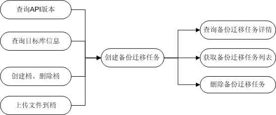

# 场景总览

DRS的OpenAPI提供创建迁移任务、查询迁移任务详细信息、获取迁移任务列表、删除迁移任务等基本操作，以及查询系统支持的API版本、查询目标库信息、创建桶、删除桶、上传文件到桶等操作。其主要的调用场景见下图：

**图 1**  备份迁移使用场景  

1.  准备工作：
    1.  获取迁移目标库RDS id。
    2.  准备Microsoft SQL Server备份文件，或者RDS全量备份文件名称。
    3.  获取OBS Browser, 参考[启动OBS Browser](https://support.huaweicloud.com/clientogw-obs/zh-cn_topic_0045829056.html)。
    4.  创建访问密钥（AK 和 SK）, 参考[创建访问密钥](https://support.huaweicloud.com/clientogw-obs/zh-cn_topic_0045829057.html)。
    5.  登录OBS Browser客户端, 参考[登录客户端](https://support.huaweicloud.com/clientogw-obs/zh-cn_topic_0045829058.html)。

2.  迁移流程——将自备的Microsoft SQL Server备份文件恢复到RDS实例：
    1.  通过OBS Browser创建OBS桶, 参考[创建桶](https://support.huaweicloud.com/clientogw-obs/zh-cn_topic_0045829125.html)。
    2.  通过OBS Browser将已准备好的备份文件上传传到OBS桶，参考[上传文件或文件夹](https://support.huaweicloud.com/clientogw-obs/zh-cn_topic_0045828972.html)。
    3.  填入备份迁移任务接口RDS实例id、上传文件信息等相关信息，调用提交。
    4.  查询任务详情或任务列表接口，观察任务状态， 等待任务成功。
    5.  调用删除任务接口，删除迁移任务。

3.  迁移流程——将RDS备份文件恢复到RDS实例：
    1.  填入备份迁移任务接口RDS备份文件信息、RDS实例id相关信息，调用提交。
    2.  查询任务详情或任务列表接口，观察任务状态， 等待任务成功。
    3.  调用删除任务接口，删除迁移任务。

