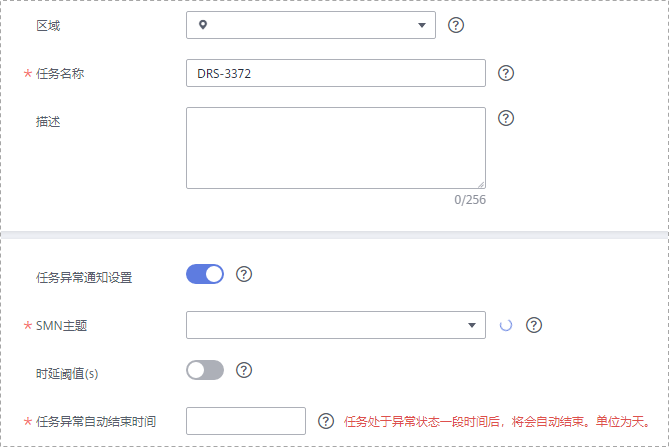

# DDM数据库到Kafka同步实例

本小节以DDM-\>Kafka的出云实时同步为示例，介绍如何使用数据复制服务配置实时同步任务。

## 前提条件

-   已登录数据复制服务控制台。
-   账户余额大于等于0元。
-   参见[实时同步](https://support.huaweicloud.com/productdesc-drs/drs_01_0302.html)。
-   参见[使用须知](https://support.huaweicloud.com/qs-drs/drs_06_0003.html)。

## 操作步骤

1.  在“实时同步管理”页面，单击“创建同步任务”。
2.  在“同步实例”页面，填选区域、任务名称、任务异常通知信息、SMN主题、时延阈值、任务异常自动结束时间、描述、同步实例信息，单击“下一步”。

    **图 1**  同步任务信息  
    

    **表 1**  任务和描述

    
    <table><thead align="left"><tr id="drs_06_0005_row55731924204420"><th class="cellrowborder" valign="top" width="18.43%" id="mcps1.2.3.1.1">
<strong id="drs_06_0005_b1611223511352">参数</strong>

    </th>
    <th class="cellrowborder" valign="top" width="81.57%" id="mcps1.2.3.1.2">
<strong id="drs_06_0005_b3002268111352">描述</strong>

    </th>
    </tr>
    </thead>
    <tbody><tr id="drs_06_0005_row1459143619148"><td class="cellrowborder" valign="top" width="18.43%" headers="mcps1.2.3.1.1 ">
区域

    </td>
    <td class="cellrowborder" valign="top" width="81.57%" headers="mcps1.2.3.1.2 ">
当前所在区域，可进行切换。

    </td>
    </tr>
    <tr id="drs_06_0005_row807311204420"><td class="cellrowborder" valign="top" width="18.43%" headers="mcps1.2.3.1.1 ">
任务名称

    </td>
    <td class="cellrowborder" valign="top" width="81.57%" headers="mcps1.2.3.1.2 ">
任务名称在4-50位之间，必须以字母开头，不区分大小写，可以包含字母、数字、中划线或下划线，不能包含其他的特殊字符。

    </td>
    </tr>
    <tr id="drs_06_0005_row18223175312283"><td class="cellrowborder" valign="top" width="18.43%" headers="mcps1.2.3.1.1 ">
描述

    </td>
    <td class="cellrowborder" valign="top" width="81.57%" headers="mcps1.2.3.1.2 ">
描述不能超过256位，且不能包含! = &lt; &gt; &amp; ' " \ 特殊字符。

    </td>
    </tr>
    <tr id="drs_06_0005_row1080215433911"><td class="cellrowborder" valign="top" width="18.43%" headers="mcps1.2.3.1.1 ">
任务异常通知设置

    </td>
    <td class="cellrowborder" valign="top" width="81.57%" headers="mcps1.2.3.1.2 ">
该项为可选参数，开启之后，选择对应的SMN主题，。当同步任务状态异常时，系统将发送通知。

    </td>
    </tr>
    <tr id="drs_06_0005_row1238083594114"><td class="cellrowborder" valign="top" width="18.43%" headers="mcps1.2.3.1.1 ">
SMN主题

    </td>
    <td class="cellrowborder" valign="top" width="81.57%" headers="mcps1.2.3.1.2 ">
“任务异常通知设置”项开启后可见，需提前在SMN上申请主题并添加订阅。

    
SMN主题申请和订阅可参考<a href="https://support.huaweicloud.com/qs-smn/smn_ug_0004.html" target="_blank" rel="noopener noreferrer">《消息通知服务用户指南》</a>。

    </td>
    </tr>
    <tr id="drs_06_0005_row49611652175115"><td class="cellrowborder" valign="top" width="18.43%" headers="mcps1.2.3.1.1 ">
时延阈值

    </td>
    <td class="cellrowborder" valign="top" width="81.57%" headers="mcps1.2.3.1.2 ">
在增量同步阶段，源数据库和目标数据库之间的同步有时会存在一个时间差，称为时延，单位为秒。

    
时延阈值设置是指时延超过一定的值后（时延阈值范围为1—3600s），DRS可以发送告警通知给指定收件人。告警通知将在时延稳定超过设定的阈值6min后发送，避免出现由于时延波动反复发送告警通知的情况。

    
 说明： 
<ul id="drs_06_0005_ul163805916512"><li>首次进入增量同步阶段，会有较多数据等待同步，存在较大的时延，属于正常情况，不在此功能的监控范围之内。</li><li>设置时延阈值之前，需要设置任务异常通知。</li></ul>
    

    </td>
    </tr>
    <tr id="drs_06_0005_row157731032102814"><td class="cellrowborder" valign="top" width="18.43%" headers="mcps1.2.3.1.1 ">
任务异常自动结束时间（天）

    </td>
    <td class="cellrowborder" valign="top" width="81.57%" headers="mcps1.2.3.1.2 ">
设置任务异常自动结束天数，输入值必须在14-100之间。

    
 说明： 

异常状态下的任务仍然会计费，而长时间异常的任务无法续传和恢复。设置任务异常自动结束天数后，异常且超时的任务将会自动结束，以免产生不必要的费用。

    

    </td>
    </tr>
    </tbody>
    </table>

    **图 2**  DDM到Kafka同步实例信息  
    

    **表 2**  同步实例信息

    
    <table><thead align="left"><tr id="row39932329204436"><th class="cellrowborder" valign="top" width="23.87%" id="mcps1.2.3.1.1">
<strong id="b2587841611355">参数</strong>

    </th>
    <th class="cellrowborder" valign="top" width="76.13%" id="mcps1.2.3.1.2">
<strong id="b1577696211355">描述</strong>

    </th>
    </tr>
    </thead>
    <tbody><tr id="row05147381129"><td class="cellrowborder" valign="top" width="23.87%" headers="mcps1.2.3.1.1 ">
数据流动方向

    </td>
    <td class="cellrowborder" valign="top" width="76.13%" headers="mcps1.2.3.1.2 ">
选择“出云”。

    </td>
    </tr>
    <tr id="row0414184610580"><td class="cellrowborder" valign="top" width="23.87%" headers="mcps1.2.3.1.1 ">
源数据库引擎

    </td>
    <td class="cellrowborder" valign="top" width="76.13%" headers="mcps1.2.3.1.2 ">
选择“DDM”。

    </td>
    </tr>
    <tr id="row42411630204436"><td class="cellrowborder" valign="top" width="23.87%" headers="mcps1.2.3.1.1 ">
目标数据库引擎

    </td>
    <td class="cellrowborder" valign="top" width="76.13%" headers="mcps1.2.3.1.2 ">
选择“Kafka”。

    </td>
    </tr>
    <tr id="row62907306204436"><td class="cellrowborder" valign="top" width="23.87%" headers="mcps1.2.3.1.1 ">
网络类型

    </td>
    <td class="cellrowborder" valign="top" width="76.13%" headers="mcps1.2.3.1.2 ">
此处以“公网网络”为示例。目前支持可选公网网络、VPC网络和VPN、专线网络。

    </td>
    </tr>
    <tr id="row658644204515"><td class="cellrowborder" valign="top" width="23.87%" headers="mcps1.2.3.1.1 ">
源数据库实例

    </td>
    <td class="cellrowborder" valign="top" width="76.13%" headers="mcps1.2.3.1.2 ">
可用的DDM实例。

    </td>
    </tr>
    <tr id="row15177111612817"><td class="cellrowborder" valign="top" width="23.87%" headers="mcps1.2.3.1.1 ">
同步实例所在子网

    </td>
    <td class="cellrowborder" valign="top" width="76.13%" headers="mcps1.2.3.1.2 ">
请选择同步实例所在的子网。也可以单击“查看子网”，跳转至“网络控制台”查看实例所在子网帮助选择。

    
默认值为当前所选数据库实例所在子网，请选择有可用IP地址的子网。为确保同步实例创建成功，仅显示已经开启DHCP的子网。

    </td>
    </tr>
    <tr id="row1169913195320"><td class="cellrowborder" valign="top" width="23.87%" headers="mcps1.2.3.1.1 ">
同步类型

    </td>
    <td class="cellrowborder" valign="top" width="76.13%" headers="mcps1.2.3.1.2 ">
增量。

    
增量同步通过解析日志等技术，将源端产生的增量实时同步至目标端。

    
无需中断业务，实现同步过程中源业务和数据库继续对外提供访问。

    </td>
    </tr>
    <tr id="row1112613477361"><td class="cellrowborder" valign="top" width="23.87%" headers="mcps1.2.3.1.1 ">
企业项目

    </td>
    <td class="cellrowborder" valign="top" width="76.13%" headers="mcps1.2.3.1.2 ">
对于已成功关联企业项目的用户，仅需在“企业项目”下拉框中选择目标项目。

    
如果需要自定义企业项目，请前往项目管理服务进行创建。关于如何创建项目，详见《项目管理用户指南》。

    </td>
    </tr>
    <tr id="row11681455143620"><td class="cellrowborder" valign="top" width="23.87%" headers="mcps1.2.3.1.1 ">
标签

    </td>
    <td class="cellrowborder" valign="top" width="76.13%" headers="mcps1.2.3.1.2 ">
可选配置，对同步任务的标识。使用标签可方便管理您的实时同步任务。每个任务最多支持10个标签配额。

    
任务创建成功后，您可以单击实例名称，在“标签”页签下查看对应标签。关于标签的详细操作，请参见<a href="https://support.huaweicloud.com/usermanual-drs/drs_synchronization_tag.html" target="_blank" rel="noopener noreferrer">标签管理</a>。

    </td>
    </tr>
    </tbody>
    </table>

3.  在“源库及目标库”页面，同步实例创建成功后，填选源库信息和目标库信息，建议您单击“源库和目标库“处的“测试连接“，分别测试并确定与源库和目标库连通后，单击“下一步“。

    **图 3**  DDM出云源库信息  
    

    **表 3**  源库信息

    
    <table><thead align="left"><tr id="zh-cn_topic_0135097933_row15746151015912"><th class="cellrowborder" valign="top" width="23%" id="mcps1.2.3.1.1">
<strong id="zh-cn_topic_0135097933_b074631019593">参数</strong>

    </th>
    <th class="cellrowborder" valign="top" width="77%" id="mcps1.2.3.1.2">
<strong id="zh-cn_topic_0135097933_b1774613108597">描述</strong>

    </th>
    </tr>
    </thead>
    <tbody><tr id="zh-cn_topic_0135097933_row0746151020595"><td class="cellrowborder" valign="top" width="23%" headers="mcps1.2.3.1.1 ">
数据库实例名称

    </td>
    <td class="cellrowborder" valign="top" width="77%" headers="mcps1.2.3.1.2 ">
默认为创建迁移任务时选择的关系型数据库实例，不可进行修改。

    </td>
    </tr>
    <tr id="zh-cn_topic_0135097933_row107461010135910"><td class="cellrowborder" valign="top" width="23%" headers="mcps1.2.3.1.1 ">
数据库用户名

    </td>
    <td class="cellrowborder" valign="top" width="77%" headers="mcps1.2.3.1.2 ">
源数据库的用户名。

    </td>
    </tr>
    <tr id="row14154134183419"><td class="cellrowborder" valign="top" width="23%" headers="mcps1.2.3.1.1 ">
数据库密码

    </td>
    <td class="cellrowborder" valign="top" width="77%" headers="mcps1.2.3.1.2 ">
源数据库的用户名所对应的密码。

    </td>
    </tr>
    </tbody>
    </table>

    > **说明：** 
    >**源数据库IP地址、端口、用户名和密码将在同步过程中被加密暂存到数据库和同步实例主机上，待该任务删除后会永久清除。**

    **图 4**  Kafka目标库信息  
    

    **表 4**  源库信息

    
    <table><thead align="left"><tr id="row1370444614233"><th class="cellrowborder" valign="top" width="23.29%" id="mcps1.2.3.1.1">
<strong id="b1470410468238">参数</strong>

    </th>
    <th class="cellrowborder" valign="top" width="76.71%" id="mcps1.2.3.1.2">
<strong id="b670424615238">描述</strong>

    </th>
    </tr>
    </thead>
    <tbody><tr id="row27051946102314"><td class="cellrowborder" valign="top" width="23.29%" headers="mcps1.2.3.1.1 ">
IP地址或域名

    </td>
    <td class="cellrowborder" valign="top" width="76.71%" headers="mcps1.2.3.1.2 ">
目标数据库的IP地址或域名。

    </td>
    </tr>
    </tbody>
    </table>

    > **说明：** 
    >**目标数据库的用户名和密码将在同步过程中被加密暂存到数据库和同步实例主机上，待该任务删除后会永久清除。**

4.  在“设置同步“页面，选择同步策略、数据格式和同步对象，单击“下一步“。

    **图 5**  DDM到Kafka同步模式  
    

    **表 5**  同步对象

    
    <table><thead align="left"><tr id="row165921632141911"><th class="cellrowborder" valign="top" width="16%" id="mcps1.2.3.1.1">
<strong id="b1783318515228">参数</strong>

    </th>
    <th class="cellrowborder" valign="top" width="84%" id="mcps1.2.3.1.2">
<strong id="b10555114922418">描述</strong>

    </th>
    </tr>
    </thead>
    <tbody><tr id="row61064915127"><td class="cellrowborder" valign="top" width="16%" headers="mcps1.2.3.1.1 ">
同步Topic策略

    </td>
    <td class="cellrowborder" valign="top" width="84%" headers="mcps1.2.3.1.2 ">
同步Topic策略，可选择“集中投递到一个Topic”或者“自动生成Topic名字”。

    </td>
    </tr>
    <tr id="row61271125113917"><td class="cellrowborder" valign="top" width="16%" headers="mcps1.2.3.1.1 ">
Topic

    </td>
    <td class="cellrowborder" valign="top" width="84%" headers="mcps1.2.3.1.2 ">
选择目标端需要同步到的Topic，同步Topic策略选择“集中投递到一个Topic”时可见。

    </td>
    </tr>
    <tr id="row14912505165"><td class="cellrowborder" valign="top" width="16%" headers="mcps1.2.3.1.1 ">
Topic名字格式

    </td>
    <td class="cellrowborder" valign="top" width="84%" headers="mcps1.2.3.1.2 ">
Topic名字格式，同步Topic策略选择“自动生成Topic名字”时可见。

    
Topic名字格式支持database和tablename两个变量，其他字符都当做常量。分别用$database$代替数据库名，$tablename$代替表名。

    
例如：配置成$database$-$tablename$时，如果数据库名称为db1，表名为tab1，则Topic名字为db1-tab1。如果是DDL语句，$tablename$为空，则Topic名字为db1.

    </td>
    </tr>
    <tr id="row16571125965410"><td class="cellrowborder" valign="top" width="16%" headers="mcps1.2.3.1.1 ">
同步到kafka partition策略

    </td>
    <td class="cellrowborder" valign="top" width="84%" headers="mcps1.2.3.1.2 ">
同步到kafka partition策略。

    <ul id="ul1175313402567"><li>按库名+表名的hash值投递到不同Partition：适用于单表的查询场景，表内保序，表与表之间不保序，可以提高单表读写性能，推荐使用此选项。</li><li>全部投递到Partition 0：适用于有事务要求的场景，事务保序，可以保证完全按照事务顺序消费，写入性能比较差，如果没有强事务要求，不推荐使用此选项。投递到Partition 0必须是自动创建Topic，选择已有Topic不支持该选项。</li><li>按表的主键值hash值投递到不同的Partion：适用于一个表一个Topic的场景。</li></ul>
    </td>
    </tr>
    <tr id="row18351020113612"><td class="cellrowborder" valign="top" width="16%" headers="mcps1.2.3.1.1 ">
投送到kafka的数据格式

    </td>
    <td class="cellrowborder" valign="top" width="84%" headers="mcps1.2.3.1.2 ">
选择投送到kafka的数据格式。

    <ul id="ul574420499552"><li>Avro：可以显示Avro二进制编码，高效获取数据。</li><li>JSON：为Json消息格式，方便解释格式，但需要占用更多的空间。</li><li>JSON-C：一种能够兼容多个批量，流式计算框架的数据格式。</li></ul>
    
详细格式可参考<a href="Kafka消息格式.md">Kafka消息格式</a>。

    </td>
    </tr>
    <tr id="row559273214193"><td class="cellrowborder" valign="top" width="16%" headers="mcps1.2.3.1.1 ">
同步对象

    </td>
    <td class="cellrowborder" valign="top" width="84%" headers="mcps1.2.3.1.2 ">
同步对象支持表级同步和库级同步，您可以根据业务场景选择对应的数据进行同步。

    
选择对象的时候支持搜索，以便您快速选择需要的数据库对象。

    </td>
    </tr>
    </tbody>
    </table>

5.  在“预检查“页面，进行同步任务预校验，校验是否可进行实时同步。
    -   查看检查结果，如有不通过的检查项，需要修复不通过项后，单击“重新校验”按钮重新进行任务预校验。

        预检查不通过项处理建议请参见《数据复制服务用户指南》中的“[预检查不通过项修复方法](https://support.huaweicloud.com/usermanual-drs/drs_precheck.html)”。

    -   预检查完成后，且所有检查项结果均通过时，单击“下一步“。

        **图 6**  DDM到Kafka预检查  
        

        > **说明：** 
        >所有检查项结果均通过时，若存在待确认项，需要阅读并确认详情后才可以继续执行下一步操作。

6.  在“任务确认“页面，设置同步任务的启动时间，并确认同步任务信息无误后，勾选协议，单击“启动任务“，提交同步任务。

    > **说明：** 
    >-   同步任务的启动时间可以根据业务需求，设置为“立即启动”或“稍后启动”。
    >-   预计同步任务启动后，会对源数据库和目标数据库的性能产生影响，建议选择业务低峰期，合理设置同步任务的启动时间。

7.  同步任务提交后，您可在“实时同步管理“页面，查看并管理自己的任务。
    -   您可查看任务提交后的状态，状态请参见[任务状态](https://support.huaweicloud.com/qs-drs/drs_06_0004.html)。
    -   在任务列表的右上角，单击刷新列表，可查看到最新的任务状态。

