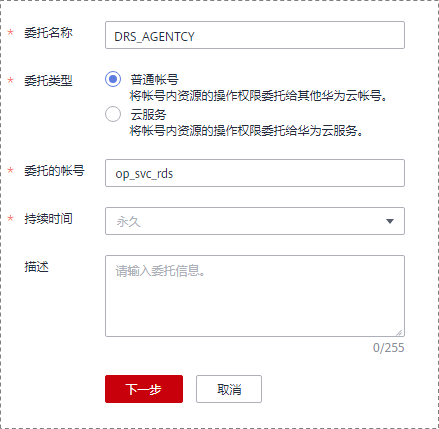

# DRS创建任务后执行自动功能失败

当用户创建DRS任务使用的是子账号，执行定时启动任务、全量完成自动结束、自动续传失败任务等自动功能时，需要使用“账户委托”，否则会导致执行失败。

## 解决方案

-   方法一：使用主账号重新创建一次任务，主账号默认有Security Administrator权限，可在创建任务后将委托创建出来。
-   方法二：使用主账号在子账号所在的用户组添加Sercuity administrator权限后，重新创建任务。添加权限的具体操作请参见：[创建用户并授权使用DRS](https://support.huaweicloud.com/usermanual-iam/iam_03_0001.html)。
-   方法三：手动添加“账户委托”，添加步骤如下：
    1.  登录华为云，在右上角单击“控制台”。
    2.  在控制台页面，鼠标移动至右上方的帐号名，在下拉列表中选择“统一身份认证”。
    3.  在统一身份认证页面，单击左侧导航窗格中“委托”，进入“委托”页面。
    4.  在“委托”页面，单击右上方的“+创建委托”进行委托创。
    5.  填写委托名称为“DRS\_AGENTCY” ，委托类型为 “普通账号”， 委托的账号为 “op\_svc\_rds”，持续时间为“永久”，完成后单击“下一步”。

        **图 1**  创建委托  
        

    6.  选择“区域级项目”，给DRS\_AGENTCY授权，委托权限需配置全局的 Tenant Administrator，完成后单击右下角的“确定”。

        **图 2**  基于区域授权  
        

    7.  权限生效时间提醒，您选中的OBS权限由于系统设计的原因，授权后需等待15-30分钟才可生效，权限生效后重新创建即可。

