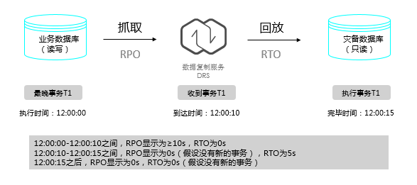

# DRS灾备的RPO、RTO是什么

-   RPO（Recovery Point Objective）指当前业务数据库一个事务的提交时间，与该事务送达DRS的时间差（该事务通常也是DRS收到的最新的一个事务）。是主实例与DRS实例数据差的一种度量方式，RPO=0时，意味着业务数据库的最新数据已经全部到达DRS实例。
-   RTO（Recovery Time Objective）指当前DRS实例上事务，传输至灾备实例且执行成功的时间差（该事务通常也是DRS收到的最新的一个事务）。RTO是处在传输中数据量的一种度量方式，RTO=0时，意味着DRS实例上的事务已经全部在灾备数据库上执行完毕。

    **图 1**  RPO和RTO  
    

