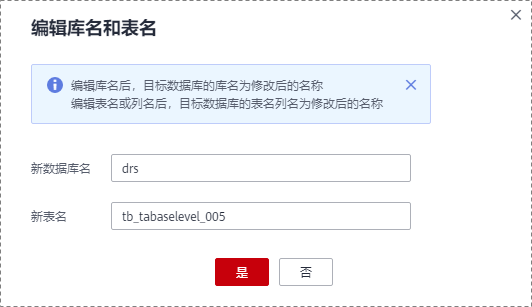

# MySQL数据库到GaussDB\(DWS\)同步实例（多对一场景）

本小节以RDS for MySQL-\>GaussDB\(DWS\)多对一场景的实时同步为示例，介绍如何使用数据复制服务配置实时同步任务。

## 前提条件

-   已登录数据复制服务控制台。
-   账户余额大于等于0元。
-   参见[实时同步](https://support.huaweicloud.com/productdesc-drs/drs_01_0302.html)。
-   参见[使用须知](https://support.huaweicloud.com/qs-drs/drs_06_0003.html)。

## 操作步骤

1.  在“实时同步管理”页面，单击“创建同步任务”。
2.  在“同步实例”页面，填选区域、任务名称、任务异常通知信息、SMN主题、时延阈值、任务异常自动结束时间、描述、同步实例信息，单击“下一步”。

    **图 1**  同步任务信息  
    

    **表 1**  任务和描述

    
    <table><thead align="left"><tr id="drs_06_0005_row55731924204420"><th class="cellrowborder" valign="top" width="18.43%" id="mcps1.2.3.1.1">
<strong id="drs_06_0005_b1611223511352">参数</strong>

    </th>
    <th class="cellrowborder" valign="top" width="81.57%" id="mcps1.2.3.1.2">
<strong id="drs_06_0005_b3002268111352">描述</strong>

    </th>
    </tr>
    </thead>
    <tbody><tr id="drs_06_0005_row1459143619148"><td class="cellrowborder" valign="top" width="18.43%" headers="mcps1.2.3.1.1 ">
区域

    </td>
    <td class="cellrowborder" valign="top" width="81.57%" headers="mcps1.2.3.1.2 ">
当前所在区域，可进行切换。

    </td>
    </tr>
    <tr id="drs_06_0005_row807311204420"><td class="cellrowborder" valign="top" width="18.43%" headers="mcps1.2.3.1.1 ">
任务名称

    </td>
    <td class="cellrowborder" valign="top" width="81.57%" headers="mcps1.2.3.1.2 ">
任务名称在4-50位之间，必须以字母开头，不区分大小写，可以包含字母、数字、中划线或下划线，不能包含其他的特殊字符。

    </td>
    </tr>
    <tr id="drs_06_0005_row18223175312283"><td class="cellrowborder" valign="top" width="18.43%" headers="mcps1.2.3.1.1 ">
描述

    </td>
    <td class="cellrowborder" valign="top" width="81.57%" headers="mcps1.2.3.1.2 ">
描述不能超过256位，且不能包含! = &lt; &gt; &amp; ' " \ 特殊字符。

    </td>
    </tr>
    <tr id="drs_06_0005_row1080215433911"><td class="cellrowborder" valign="top" width="18.43%" headers="mcps1.2.3.1.1 ">
任务异常通知设置

    </td>
    <td class="cellrowborder" valign="top" width="81.57%" headers="mcps1.2.3.1.2 ">
该项为可选参数，开启之后，选择对应的SMN主题，。当同步任务状态异常时，系统将发送通知。

    </td>
    </tr>
    <tr id="drs_06_0005_row1238083594114"><td class="cellrowborder" valign="top" width="18.43%" headers="mcps1.2.3.1.1 ">
SMN主题

    </td>
    <td class="cellrowborder" valign="top" width="81.57%" headers="mcps1.2.3.1.2 ">
“任务异常通知设置”项开启后可见，需提前在SMN上申请主题并添加订阅。

    
SMN主题申请和订阅可参考<a href="https://support.huaweicloud.com/qs-smn/smn_ug_0004.html" target="_blank" rel="noopener noreferrer">《消息通知服务用户指南》</a>。

    </td>
    </tr>
    <tr id="drs_06_0005_row49611652175115"><td class="cellrowborder" valign="top" width="18.43%" headers="mcps1.2.3.1.1 ">
时延阈值

    </td>
    <td class="cellrowborder" valign="top" width="81.57%" headers="mcps1.2.3.1.2 ">
在增量同步阶段，源数据库和目标数据库之间的同步有时会存在一个时间差，称为时延，单位为秒。

    
时延阈值设置是指时延超过一定的值后（时延阈值范围为1—3600s），DRS可以发送告警通知给指定收件人。告警通知将在时延稳定超过设定的阈值6min后发送，避免出现由于时延波动反复发送告警通知的情况。

    
 说明： 
<ul id="drs_06_0005_ul163805916512"><li>首次进入增量同步阶段，会有较多数据等待同步，存在较大的时延，属于正常情况，不在此功能的监控范围之内。</li><li>设置时延阈值之前，需要设置任务异常通知。</li></ul>
    

    </td>
    </tr>
    <tr id="drs_06_0005_row157731032102814"><td class="cellrowborder" valign="top" width="18.43%" headers="mcps1.2.3.1.1 ">
任务异常自动结束时间（天）

    </td>
    <td class="cellrowborder" valign="top" width="81.57%" headers="mcps1.2.3.1.2 ">
设置任务异常自动结束天数，输入值必须在14-100之间。

    
 说明： 

异常状态下的任务仍然会计费，而长时间异常的任务无法续传和恢复。设置任务异常自动结束天数后，异常且超时的任务将会自动结束，以免产生不必要的费用。

    

    </td>
    </tr>
    </tbody>
    </table>

    **图 2**  MySQL到GaussDB\(DWS\)同步实例信息\(VPC网络\)  
    同步实例信息(VPC网络).png "MySQL到GaussDB(DWS)同步实例信息(VPC网络)")

    **表 2**  同步实例信息

    
    <table><thead align="left"><tr id="row39932329204436"><th class="cellrowborder" valign="top" width="23.87%" id="mcps1.2.3.1.1">
<strong id="b2587841611355">参数</strong>

    </th>
    <th class="cellrowborder" valign="top" width="76.13%" id="mcps1.2.3.1.2">
<strong id="b1577696211355">描述</strong>

    </th>
    </tr>
    </thead>
    <tbody><tr id="row05147381129"><td class="cellrowborder" valign="top" width="23.87%" headers="mcps1.2.3.1.1 ">
数据流动方向

    </td>
    <td class="cellrowborder" valign="top" width="76.13%" headers="mcps1.2.3.1.2 ">
选择“入云”。

    </td>
    </tr>
    <tr id="row0414184610580"><td class="cellrowborder" valign="top" width="23.87%" headers="mcps1.2.3.1.1 ">
源数据库引擎

    </td>
    <td class="cellrowborder" valign="top" width="76.13%" headers="mcps1.2.3.1.2 ">
选择“MySQL”。

    </td>
    </tr>
    <tr id="row42411630204436"><td class="cellrowborder" valign="top" width="23.87%" headers="mcps1.2.3.1.1 ">
目标数据库引擎

    </td>
    <td class="cellrowborder" valign="top" width="76.13%" headers="mcps1.2.3.1.2 ">
选择“GaussDB(DWS)”。

    </td>
    </tr>
    <tr id="row62907306204436"><td class="cellrowborder" valign="top" width="23.87%" headers="mcps1.2.3.1.1 ">
网络类型

    </td>
    <td class="cellrowborder" valign="top" width="76.13%" headers="mcps1.2.3.1.2 ">
此处以“VPC网络”为示例。目前支持可选公网网络和VPC网络。

    </td>
    </tr>
    <tr id="row658644204515"><td class="cellrowborder" valign="top" width="23.87%" headers="mcps1.2.3.1.1 ">
目标数据库实例

    </td>
    <td class="cellrowborder" valign="top" width="76.13%" headers="mcps1.2.3.1.2 ">
可用的GaussDB(DWS)实例。

    </td>
    </tr>
    <tr id="row15177111612817"><td class="cellrowborder" valign="top" width="23.87%" headers="mcps1.2.3.1.1 ">
同步实例所在子网

    </td>
    <td class="cellrowborder" valign="top" width="76.13%" headers="mcps1.2.3.1.2 ">
请选择同步实例所在的子网。也可以单击“查看子网”，跳转至“网络控制台”查看实例所在子网帮助选择。

    
默认值为当前所选数据库实例所在子网，请选择有可用IP地址的子网。为确保同步实例创建成功，仅显示已经开启DHCP的子网。

    </td>
    </tr>
    <tr id="row1169913195320"><td class="cellrowborder" valign="top" width="23.87%" headers="mcps1.2.3.1.1 ">
同步类型

    </td>
    <td class="cellrowborder" valign="top" width="76.13%" headers="mcps1.2.3.1.2 ">
全量+增量

    
该模式为数据持续性实时同步，通过全量过程完成目标端数据库的初始化后，增量同步阶段通过解析日志等技术，将源端和目标端数据保持数据持续一致。

    
 说明： 

选择“全量+增量”同步模式，增量同步可以在全量同步完成的基础上实现数据的持续同步，无需中断业务，实现同步过程中源业务和数据库继续对外提供访问。

    

    </td>
    </tr>
    <tr id="row1112613477361"><td class="cellrowborder" valign="top" width="23.87%" headers="mcps1.2.3.1.1 ">
企业项目

    </td>
    <td class="cellrowborder" valign="top" width="76.13%" headers="mcps1.2.3.1.2 ">
对于已成功关联企业项目的用户，仅需在“企业项目”下拉框中选择目标项目。

    
如果需要自定义企业项目，请前往项目管理服务进行创建。关于如何创建项目，详见《项目管理用户指南》。

    </td>
    </tr>
    <tr id="row11681455143620"><td class="cellrowborder" valign="top" width="23.87%" headers="mcps1.2.3.1.1 ">
标签

    </td>
    <td class="cellrowborder" valign="top" width="76.13%" headers="mcps1.2.3.1.2 ">
可选配置，对同步任务的标识。使用标签可方便管理您的实时同步任务。每个任务最多支持10个标签配额。

    
任务创建成功后，您可以单击实例名称，在“标签”页签下查看对应标签。关于标签的详细操作，请参见<a href="https://support.huaweicloud.com/usermanual-drs/drs_synchronization_tag.html" target="_blank" rel="noopener noreferrer">标签管理</a>。

    </td>
    </tr>
    </tbody>
    </table>

3.  在“源库及目标库”页面，同步实例创建成功后，填选源库信息和目标库信息，建议您单击“源库和目标库“处的“测试连接“，分别测试并确定与源库和目标库连通后，勾选协议，单击“下一步“。

    **图 3**  MySQL源库信息\(VPC网络\)  
    .png "MySQL源库信息(VPC网络)")

    **表 3**  源库信息

    
    <table><thead align="left"><tr id="row64572461706"><th class="cellrowborder" valign="top" width="23.27%" id="mcps1.2.3.1.1">
<strong id="b154574464019">参数</strong>

    </th>
    <th class="cellrowborder" valign="top" width="76.73%" id="mcps1.2.3.1.2">
<strong id="b2045744616014">描述</strong>

    </th>
    </tr>
    </thead>
    <tbody><tr id="row119266691013"><td class="cellrowborder" valign="top" width="23.27%" headers="mcps1.2.3.1.1 ">
源库类型

    </td>
    <td class="cellrowborder" valign="top" width="76.73%" headers="mcps1.2.3.1.2 ">
源数据库类型，可选“ECS自建库”和“RDS实例”，此处以“RDS实例”为示例。

    </td>
    </tr>
    <tr id="row194573467019"><td class="cellrowborder" valign="top" width="23.27%" headers="mcps1.2.3.1.1 ">
数据库实例名称

    </td>
    <td class="cellrowborder" valign="top" width="76.73%" headers="mcps1.2.3.1.2 ">
选择待同步的RDS实例。

    </td>
    </tr>
    <tr id="zh-cn_topic_0135097933_row9653102325913"><td class="cellrowborder" valign="top" width="23.27%" headers="mcps1.2.3.1.1 ">
数据库用户名

    </td>
    <td class="cellrowborder" valign="top" width="76.73%" headers="mcps1.2.3.1.2 ">
源数据库的用户名。

    </td>
    </tr>
    <tr id="zh-cn_topic_0135097933_row065352315596"><td class="cellrowborder" valign="top" width="23.27%" headers="mcps1.2.3.1.1 ">
数据库密码

    </td>
    <td class="cellrowborder" valign="top" width="76.73%" headers="mcps1.2.3.1.2 ">
源数据库的用户名所对应的密码。

    </td>
    </tr>
    </tbody>
    </table>

    > **说明：** 
    >**源数据库的数据库用户名和密码，会被系统加密暂存，直至删除该任务后自动清除。**

    **图 4**  GaussDB\(DWS\)目标库信息  
    目标库信息.png "GaussDB(DWS)目标库信息")

    **表 4**  目标库信息

    
    <table><thead align="left"><tr id="zh-cn_topic_0135097933_row15746151015912"><th class="cellrowborder" valign="top" width="23%" id="mcps1.2.3.1.1">
<strong id="zh-cn_topic_0135097933_b074631019593">参数</strong>

    </th>
    <th class="cellrowborder" valign="top" width="77%" id="mcps1.2.3.1.2">
<strong id="zh-cn_topic_0135097933_b1774613108597">描述</strong>

    </th>
    </tr>
    </thead>
    <tbody><tr id="zh-cn_topic_0135097933_row0746151020595"><td class="cellrowborder" valign="top" width="23%" headers="mcps1.2.3.1.1 ">
数据库实例名称

    </td>
    <td class="cellrowborder" valign="top" width="77%" headers="mcps1.2.3.1.2 ">
默认为创建同步任务时选择的关系型数据库实例，不可进行修改。

    </td>
    </tr>
    <tr id="zh-cn_topic_0135097933_row2746310155916"><td class="cellrowborder" valign="top" width="23%" headers="mcps1.2.3.1.1 ">
数据库用户名

    </td>
    <td class="cellrowborder" valign="top" width="77%" headers="mcps1.2.3.1.2 ">
目标数据库对应的数据库用户名。

    </td>
    </tr>
    <tr id="zh-cn_topic_0135097933_row107461010135910"><td class="cellrowborder" valign="top" width="23%" headers="mcps1.2.3.1.1 ">
数据库密码

    </td>
    <td class="cellrowborder" valign="top" width="77%" headers="mcps1.2.3.1.2 ">
数据库用户名和密码将被系统加密暂存，直至该任务删除后清除。

    </td>
    </tr>
    </tbody>
    </table>

4.  在“设置同步“页面，选择同步对象类型和同步对象。单击“下一步“。

    **图 5**  MySQL到GaussDB\(DWS\) 同步模式  
    -同步模式.png "MySQL到GaussDB(DWS)-同步模式")

    **表 5**  同步模式和对象

    
    <table><thead align="left"><tr id="row8551543131515"><th class="cellrowborder" valign="top" width="18.58%" id="mcps1.2.3.1.1">
<strong id="b16551134381519">参数</strong>

    </th>
    <th class="cellrowborder" valign="top" width="81.42%" id="mcps1.2.3.1.2">
<strong id="b13551174321519">描述</strong>

    </th>
    </tr>
    </thead>
    <tbody><tr id="row1759750171316"><td class="cellrowborder" valign="top" width="18.58%" headers="mcps1.2.3.1.1 ">
流速模式

    </td>
    <td class="cellrowborder" valign="top" width="81.42%" headers="mcps1.2.3.1.2 ">
流速模式支持限速和不限速，默认为不限速。

    <ul id="ul142651151123918"><li>限速
自定义的最大同步速度，全量同步过程中的同步速度将不会超过该速度。

    
当流速模式选择了“限速”时，你需要通过流速设置来定时控制同步速度。流速设置通常包括限速时间段和流速大小的设置。默认的限速时间段为全天限流，您也可以根据业务需求自定义时段限流。自定义的时段限流支持最多设置3个定时任务，每个定时任务之间不能存在交叉的时间段，未设定在限速时间段的时间默认为不限速。

    
流速的大小需要根据业务场景来设置，不能超过9999MB/s。

    
<b>图1 </b>MySQL到GaussDB(DWS) 设置流速模式 

    </li><li>不限速
对同步速度不进行限制，通常会最大化使用源数据库的出口带宽。该流速模式同时会对源数据库造成读消耗，消耗取决于源数据库的出口带宽。比如源数据库的出口带宽为100MB/s，假设高速模式使用了80%带宽，则同步对源数据库将造成80MB/s的读操作IO消耗。
 说明： 
<ul id="ul4267135143911"><li>限速模式只对全量阶段生效，增量阶段不生效。</li><li>您也可以在创建任务后修改流速模式。具体方法请参见<a href="https://support.huaweicloud.com/usermanual-drs/drs_10_0401.html" target="_blank" rel="noopener noreferrer">修改流速模式</a>。</li></ul>
    

    

    </li></ul>
    </td>
    </tr>
    <tr id="row19367182916553"><td class="cellrowborder" valign="top" width="18.58%" headers="mcps1.2.3.1.1 ">
同步对象类型

    </td>
    <td class="cellrowborder" valign="top" width="81.42%" headers="mcps1.2.3.1.2 ">
可选同步表结构、同步数据、同步索引，根据实际需求进行选择要同步内容。

    <ul id="ul9359134216234"><li>同步数据为必选项。</li><li>选择同步表结构的时候目标库不能有同名的表。</li><li>不选同步表结构的时候目标库必须有相应的表，且要保证表结构与所选表结构相同。</li></ul>
    </td>
    </tr>
    <tr id="row24118316505"><td class="cellrowborder" valign="top" width="18.58%" headers="mcps1.2.3.1.1 ">
增量阶段冲突策略

    </td>
    <td class="cellrowborder" valign="top" width="81.42%" headers="mcps1.2.3.1.2 ">
该冲突策略特指增量同步中的冲突处理策略，全量阶段的冲突默认忽略。

    </td>
    </tr>
    <tr id="row16476034203"><td class="cellrowborder" valign="top" width="18.58%" headers="mcps1.2.3.1.1 ">
同步对象

    </td>
    <td class="cellrowborder" valign="top" width="81.42%" headers="mcps1.2.3.1.2 ">
可选表级同步、库级同步、导入对象文件，您可以根据业务场景选择对应的数据进行同步。

    <ul id="ul24981905240"><li>选择数据的时候支持搜索，以便您快速选择需要的数据库对象。</li><li>可以使用对象名映射功能进行源数据库和目标数据库中的同步对象映射，具体操作可参考<a href="对象名映射.md">对象名映射</a>。</li><li>如果有切换源数据库的操作，请在选择同步对象前单击右上角的，以确保待选择的对象为最新源数据库对象。</li></ul>
    <ul id="ul15632207202419"><li>选择“导入对象文件”，具体操作如下：<ol id="ol17531615252"><li>单击“下载模板”。</li><li>在下载的Excel模板中，填写需要导入的对象信息。</li><li>单击“添加文件”，在对话框中选择编辑完成的模板。</li><li>单击“上传文件”。</li></ol>
    
 说明： 
<ul id="ul127396547493"><li>文件导入仅支持导入Windows Microsoft Excel 97-2003版本（*.xls），2007及以上版本（*.xlsx）的文件，下载的压缩包提供上述两个版本模板。</li><li>文件名支持的有效字符：大小写字母，数字，“-”，“_”,“(”，“)”</li><li>模板中的对象信息需按照SchemaName.TableName的格式进行填写，不支持“&lt;”，“&gt;”，"."和“"”，且不支持以空格开头或结尾的对象。</li><li>文件导入成功后，必须保留本次上传的文件，以便需要再编辑该任务的数据库对象范围时，可直接基于此文件修改，然后再次上传。</li><li>用文件导入功能所创建的任务，任务启动之后再编辑时，不支持切换到“表级同步”和“库级同步”功能。</li><li>配置中的任务，可使用“表级同步”，“库级同步”或“文件导入”三种方式，每次切换新的方式后，当前选择或者导入的数据库对象被清空，需重新选择或导入。</li><li>任务再编辑导入对象时，将自动弹出增加和删除的对象。</li><li>上传文件后校验失败，可单击“查看失败详情”下载错误信息。</li></ul>
    

    </li></ul>
    </td>
    </tr>
    </tbody>
    </table>

    在选择同步对象阶段可通过设置映射关系，实现多张表对GaussDB\(DWS\)一张表的同步。

    1.  在同步对象右侧已选对象框中，选择需要进行映射的表，单击“编辑“按钮。
    2.  在“编辑库名和表名“的弹出框中，填写新的数据库名和新表名，单击“是“，修改后的名称即为保存在目标数据库中的库名。

        **图 7**  编辑库名和表名  
        

    3.  文件导入对象也支持多张表对GaussDB\(DWS\)一张表的映射，由于消息体限制最多导入10000个表（表名长度过长或者规则过长也会影响导入数量）。

        > **注意：** 
        >-   使用多对一操作时，需要使用数据加工的附加列操作来避免数据冲突。
        >-   源库和目标库多对一的表的结构要一致。

5.  在“数据加工“页面，选择需要加工的表对象，填写需要添加的列名、类型、操作类型信息，检查无误后，单击“下一步“。

    **图 8**  MySQL到GaussDB\(DWS\) 数据加工  
    -数据加工.png "MySQL到GaussDB(DWS)-数据加工")

    > **注意：** 
    >-   不允许对唯一主键列进行数据加工。
    >-   “以serverName@database@table为列填充列”该操作会使用@符号拼接serverName、源库的库名和表名填充新加的列，并且该列会与源端表的主键形成复合主键。

6.  在“预检查“页面，进行同步任务预校验，校验是否可进行实时同步。
    -   查看检查结果，如有不通过的检查项，需要修复不通过项后，单击“重新校验”按钮重新进行任务预校验。

        预检查不通过项处理建议请参见《数据复制服务用户指南》中的“[预检查不通过项修复方法](https://support.huaweicloud.com/usermanual-drs/drs_precheck.html)”。

    -   预检查完成后，且所有检查项结果均通过时，单击“下一步“。

        **图 9**  同步预检查  
        

        > **说明：** 
        >所有检查项结果均通过时，若存在请确认项，需要阅读并确认详情后才可以继续执行下一步操作。

7.  在“任务确认“页面，设置同步任务的启动时间，并确认同步任务信息无误后，勾选协议，单击“启动任务“，提交同步任务。

    > **说明：** 
    >-   同步任务的启动时间可以根据业务需求，设置为“立即启动”或“稍后启动”。
    >-   预计同步任务启动后，会对源数据库和目标数据库的性能产生影响，建议选择业务低峰期，合理设置同步任务的启动时间。

8.  同步任务提交后，您可在“实时同步管理“页面，查看并管理自己的任务。
    -   您可查看任务提交后的状态，状态请参见[任务状态](https://support.huaweicloud.com/qs-drs/drs_06_0004.html)。
    -   在任务列表的右上角，单击刷新列表，可查看到最新的任务状态。

