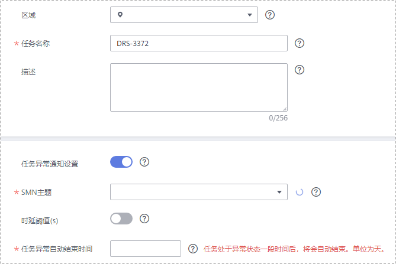
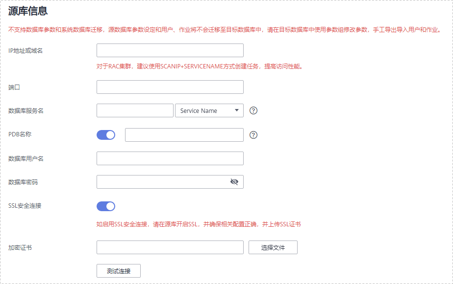

# Oracle数据库到GaussDB\(for openGauss\)分布式版同步实例

本小节以Oracle-\>GaussDB\(for openGauss\)分布式版实时同步为示例，介绍如何使用数据复制服务配置实时同步任务。

## 前提条件

-   已登录数据复制服务控制台。
-   账户余额大于等于0元。
-   参见[实时同步](https://support.huaweicloud.com/productdesc-drs/drs_01_0302.html)。
-   参见[使用须知](https://support.huaweicloud.com/qs-drs/drs_06_0003.html)。

## 操作步骤

1.  在“实时同步管理”页面，单击“创建同步任务”。
2.  在“同步实例”页面，填选区域、任务名称、任务异常通知信息、SMN主题、时延阈值、任务异常自动结束时间、描述、同步实例信息，单击“下一步”。

    **图 1**  同步任务信息  
    

    **表 1**  任务和描述

    
    <table><thead align="left"><tr id="drs_06_0005_row55731924204420"><th class="cellrowborder" valign="top" width="18.43%" id="mcps1.2.3.1.1">
<strong id="drs_06_0005_b1611223511352">参数</strong>

    </th>
    <th class="cellrowborder" valign="top" width="81.57%" id="mcps1.2.3.1.2">
<strong id="drs_06_0005_b3002268111352">描述</strong>

    </th>
    </tr>
    </thead>
    <tbody><tr id="drs_06_0005_row1459143619148"><td class="cellrowborder" valign="top" width="18.43%" headers="mcps1.2.3.1.1 ">
区域

    </td>
    <td class="cellrowborder" valign="top" width="81.57%" headers="mcps1.2.3.1.2 ">
当前所在区域，可进行切换。

    </td>
    </tr>
    <tr id="drs_06_0005_row807311204420"><td class="cellrowborder" valign="top" width="18.43%" headers="mcps1.2.3.1.1 ">
任务名称

    </td>
    <td class="cellrowborder" valign="top" width="81.57%" headers="mcps1.2.3.1.2 ">
任务名称在4-50位之间，必须以字母开头，不区分大小写，可以包含字母、数字、中划线或下划线，不能包含其他的特殊字符。

    </td>
    </tr>
    <tr id="drs_06_0005_row18223175312283"><td class="cellrowborder" valign="top" width="18.43%" headers="mcps1.2.3.1.1 ">
描述

    </td>
    <td class="cellrowborder" valign="top" width="81.57%" headers="mcps1.2.3.1.2 ">
描述不能超过256位，且不能包含! = &lt; &gt; &amp; ' " \ 特殊字符。

    </td>
    </tr>
    <tr id="drs_06_0005_row1080215433911"><td class="cellrowborder" valign="top" width="18.43%" headers="mcps1.2.3.1.1 ">
任务异常通知设置

    </td>
    <td class="cellrowborder" valign="top" width="81.57%" headers="mcps1.2.3.1.2 ">
该项为可选参数，开启之后，选择对应的SMN主题，。当同步任务状态异常时，系统将发送通知。

    </td>
    </tr>
    <tr id="drs_06_0005_row1238083594114"><td class="cellrowborder" valign="top" width="18.43%" headers="mcps1.2.3.1.1 ">
SMN主题

    </td>
    <td class="cellrowborder" valign="top" width="81.57%" headers="mcps1.2.3.1.2 ">
“任务异常通知设置”项开启后可见，需提前在SMN上申请主题并添加订阅。

    
SMN主题申请和订阅可参考<a href="https://support.huaweicloud.com/qs-smn/smn_ug_0004.html" target="_blank" rel="noopener noreferrer">《消息通知服务用户指南》</a>。

    </td>
    </tr>
    <tr id="drs_06_0005_row49611652175115"><td class="cellrowborder" valign="top" width="18.43%" headers="mcps1.2.3.1.1 ">
时延阈值

    </td>
    <td class="cellrowborder" valign="top" width="81.57%" headers="mcps1.2.3.1.2 ">
在增量同步阶段，源数据库和目标数据库之间的同步有时会存在一个时间差，称为时延，单位为秒。

    
时延阈值设置是指时延超过一定的值后（时延阈值范围为1—3600s），DRS可以发送告警通知给指定收件人。告警通知将在时延稳定超过设定的阈值6min后发送，避免出现由于时延波动反复发送告警通知的情况。

    
 说明： 
<ul id="drs_06_0005_ul163805916512"><li>首次进入增量同步阶段，会有较多数据等待同步，存在较大的时延，属于正常情况，不在此功能的监控范围之内。</li><li>设置时延阈值之前，需要设置任务异常通知。</li></ul>
    

    </td>
    </tr>
    <tr id="drs_06_0005_row157731032102814"><td class="cellrowborder" valign="top" width="18.43%" headers="mcps1.2.3.1.1 ">
任务异常自动结束时间（天）

    </td>
    <td class="cellrowborder" valign="top" width="81.57%" headers="mcps1.2.3.1.2 ">
设置任务异常自动结束天数，输入值必须在14-100之间。

    
 说明： 

异常状态下的任务仍然会计费，而长时间异常的任务无法续传和恢复。设置任务异常自动结束天数后，异常且超时的任务将会自动结束，以免产生不必要的费用。

    

    </td>
    </tr>
    </tbody>
    </table>

    **图 2**  Oracle到GaussDB\(for openGauss\)分布式版同步实例信息  
    分布式版同步实例信息.png "Oracle到GaussDB(for-openGauss)分布式版同步实例信息")

    **表 2**  同步实例信息

    
    <table><thead align="left"><tr id="zh-cn_topic_0288472243_zh-cn_topic_0288918853_row39932329204436"><th class="cellrowborder" valign="top" width="23.87%" id="mcps1.2.3.1.1">
<strong id="zh-cn_topic_0288472243_zh-cn_topic_0288918853_b2587841611355">参数</strong>

    </th>
    <th class="cellrowborder" valign="top" width="76.13%" id="mcps1.2.3.1.2">
<strong id="zh-cn_topic_0288472243_zh-cn_topic_0288918853_b1577696211355">描述</strong>

    </th>
    </tr>
    </thead>
    <tbody><tr id="zh-cn_topic_0288472243_zh-cn_topic_0288918853_row05147381129"><td class="cellrowborder" valign="top" width="23.87%" headers="mcps1.2.3.1.1 ">
数据流动场景

    </td>
    <td class="cellrowborder" valign="top" width="76.13%" headers="mcps1.2.3.1.2 ">
选择“入云”。

    </td>
    </tr>
    <tr id="zh-cn_topic_0288472243_zh-cn_topic_0288918853_row0414184610580"><td class="cellrowborder" valign="top" width="23.87%" headers="mcps1.2.3.1.1 ">
源数据库引擎

    </td>
    <td class="cellrowborder" valign="top" width="76.13%" headers="mcps1.2.3.1.2 ">
选择“Oracle”。

    </td>
    </tr>
    <tr id="zh-cn_topic_0288472243_zh-cn_topic_0288918853_row42411630204436"><td class="cellrowborder" valign="top" width="23.87%" headers="mcps1.2.3.1.1 ">
目标数据库引擎

    </td>
    <td class="cellrowborder" valign="top" width="76.13%" headers="mcps1.2.3.1.2 ">
选择“GaussDB(for openGauss)分布式版”。

    </td>
    </tr>
    <tr id="zh-cn_topic_0288472243_zh-cn_topic_0288918853_row62907306204436"><td class="cellrowborder" valign="top" width="23.87%" headers="mcps1.2.3.1.1 ">
网络类型

    </td>
    <td class="cellrowborder" valign="top" width="76.13%" headers="mcps1.2.3.1.2 ">
此处以公网网络为示例。目前支持可选公网网络和VPN、专线网络。

    </td>
    </tr>
    <tr id="zh-cn_topic_0288472243_zh-cn_topic_0288918853_row658644204515"><td class="cellrowborder" valign="top" width="23.87%" headers="mcps1.2.3.1.1 ">
目标数据库实例

    </td>
    <td class="cellrowborder" valign="top" width="76.13%" headers="mcps1.2.3.1.2 ">
用户所创建的GaussDB(for openGauss)分布式版实例。

    </td>
    </tr>
    <tr id="zh-cn_topic_0288472243_zh-cn_topic_0288918853_row183713012714"><td class="cellrowborder" valign="top" width="23.87%" headers="mcps1.2.3.1.1 ">
同步实例所在子网

    </td>
    <td class="cellrowborder" valign="top" width="76.13%" headers="mcps1.2.3.1.2 ">
请选择同步实例所在的子网。也可以单击“查看子网”，跳转至“网络控制台”查看实例所在子网帮助选择。

    
默认值为当前所选数据库实例所在子网，请选择有可用IP地址的子网。为确保同步实例创建成功，仅显示已经开启DHCP的子网。

    </td>
    </tr>
    <tr id="zh-cn_topic_0288472243_zh-cn_topic_0288918853_row1169913195320"><td class="cellrowborder" valign="top" width="23.87%" headers="mcps1.2.3.1.1 ">
同步类型

    </td>
    <td class="cellrowborder" valign="top" width="76.13%" headers="mcps1.2.3.1.2 ">
全量，增量， 两种选择类型。

    </td>
    </tr>
    <tr id="row168851556716"><td class="cellrowborder" valign="top" width="23.87%" headers="mcps1.2.3.1.1 ">
标签

    </td>
    <td class="cellrowborder" valign="top" width="76.13%" headers="mcps1.2.3.1.2 ">
可选配置，对同步任务的标识。使用标签可方便管理您的实时同步任务。每个任务最多支持10个标签配额。

    
任务创建成功后，您可以单击实例名称，在“标签”页签下查看对应标签。关于标签的详细操作，请参见<a href="https://support.huaweicloud.com/usermanual-drs/drs_synchronization_tag.html" target="_blank" rel="noopener noreferrer">标签管理</a>。

    </td>
    </tr>
    </tbody>
    </table>

3.  在“源库及目标库”页面，填选源库信息和目标库信息，单击“源库和目标库“处的“测试连接“，分别测试并确定与源库和目标库连通后，单击“下一步“。

    **图 3**  Oracle 源库信息  
    

    **表 3**  源库信息

    
    <table><thead align="left"><tr id="zh-cn_topic_0288918853_zh-cn_topic_0135097933_row12653123195919"><th class="cellrowborder" valign="top" width="23.27%" id="mcps1.2.3.1.1">
<strong id="zh-cn_topic_0288918853_zh-cn_topic_0135097933_b20653923155913">参数</strong>

    </th>
    <th class="cellrowborder" valign="top" width="76.73%" id="mcps1.2.3.1.2">
<strong id="zh-cn_topic_0288918853_zh-cn_topic_0135097933_b186531223105910">描述</strong>

    </th>
    </tr>
    </thead>
    <tbody><tr id="zh-cn_topic_0288918853_zh-cn_topic_0135097933_row1265352355912"><td class="cellrowborder" valign="top" width="23.27%" headers="mcps1.2.3.1.1 ">
IP地址或域名

    </td>
    <td class="cellrowborder" valign="top" width="76.73%" headers="mcps1.2.3.1.2 ">
源数据库的IP地址或域名。

    
 说明： 

对于RAC集群，建议使用scanip接入，提高访问性能。

    

    </td>
    </tr>
    <tr id="zh-cn_topic_0288918853_zh-cn_topic_0135097933_row765313235597"><td class="cellrowborder" valign="top" width="23.27%" headers="mcps1.2.3.1.1 ">
端口

    </td>
    <td class="cellrowborder" valign="top" width="76.73%" headers="mcps1.2.3.1.2 ">
源数据库服务端口，可输入范围为1~65535间的整数。

    </td>
    </tr>
    <tr id="row119010914238"><td class="cellrowborder" valign="top" width="23.27%" headers="mcps1.2.3.1.1 ">
数据库服务名

    </td>
    <td class="cellrowborder" valign="top" width="76.73%" headers="mcps1.2.3.1.2 ">
数据库服务名（Service Name/SID），客户端可以通过其连接到Oracle，具体查询方法请参照界面提示。

    </td>
    </tr>
    <tr id="row166292042111219"><td class="cellrowborder" valign="top" width="23.27%" headers="mcps1.2.3.1.1 ">
PDB名称

    </td>
    <td class="cellrowborder" valign="top" width="76.73%" headers="mcps1.2.3.1.2 ">
PDB同步仅在Oracle12c及以后的版本支持，该功能为选填项，当需要迁移PDB中的表时开启。

    
PDB功能开启后，只能迁移该PDB中的表，并且需要提供CDB的service name/sid及用户名和密码，不需要PDB的用户名和密码。

    </td>
    </tr>
    <tr id="zh-cn_topic_0288918853_zh-cn_topic_0135097933_row065352315596"><td class="cellrowborder" valign="top" width="23.27%" headers="mcps1.2.3.1.1 ">
数据库用户名

    </td>
    <td class="cellrowborder" valign="top" width="76.73%" headers="mcps1.2.3.1.2 ">
源数据库的用户名。

    </td>
    </tr>
    <tr id="zh-cn_topic_0288918853_row1317210417203"><td class="cellrowborder" valign="top" width="23.27%" headers="mcps1.2.3.1.1 ">
数据库密码

    </td>
    <td class="cellrowborder" valign="top" width="76.73%" headers="mcps1.2.3.1.2 ">
源数据库的用户名所对应的密码。

    </td>
    </tr>
    <tr id="zh-cn_topic_0288918853_zh-cn_topic_0135097933_row26531923125912"><td class="cellrowborder" valign="top" width="23.27%" headers="mcps1.2.3.1.1 ">
SSL安全连接

    </td>
    <td class="cellrowborder" valign="top" width="76.73%" headers="mcps1.2.3.1.2 ">
通过该功能，用户可以选择是否开启对迁移链路的加密。如果开启该功能，需要用户上传SSL CA根证书。

    
 说明： 
<ul id="ul58571348175514"><li>最大支持上传500KB的证书文件。</li><li>如果不使用SSL证书，请自行承担数据安全风险。</li></ul>
    

    </td>
    </tr>
    </tbody>
    </table>

    **图 4**  GaussDB\(for openGauss\)分布式版目标库信息  
    分布式版目标库信息.png "GaussDB(for-openGauss)分布式版目标库信息")

    **表 4**  目标库信息

    
    <table><thead align="left"><tr id="zh-cn_topic_0288472243_zh-cn_topic_0288918853_zh-cn_topic_0135097933_row15746151015912"><th class="cellrowborder" valign="top" width="23%" id="mcps1.2.3.1.1">
<strong id="zh-cn_topic_0288472243_zh-cn_topic_0288918853_zh-cn_topic_0135097933_b074631019593">参数</strong>

    </th>
    <th class="cellrowborder" valign="top" width="77%" id="mcps1.2.3.1.2">
<strong id="zh-cn_topic_0288472243_zh-cn_topic_0288918853_zh-cn_topic_0135097933_b1774613108597">描述</strong>

    </th>
    </tr>
    </thead>
    <tbody><tr id="zh-cn_topic_0288472243_zh-cn_topic_0288918853_zh-cn_topic_0135097933_row0746151020595"><td class="cellrowborder" valign="top" width="23%" headers="mcps1.2.3.1.1 ">
数据库实例名称

    </td>
    <td class="cellrowborder" valign="top" width="77%" headers="mcps1.2.3.1.2 ">
默认为创建同步任务时选择的关系型数据库实例，不可进行修改。

    </td>
    </tr>
    <tr id="zh-cn_topic_0288472243_zh-cn_topic_0288918853_zh-cn_topic_0135097933_row2746310155916"><td class="cellrowborder" valign="top" width="23%" headers="mcps1.2.3.1.1 ">
数据库用户名

    </td>
    <td class="cellrowborder" valign="top" width="77%" headers="mcps1.2.3.1.2 ">
目标数据库的用户名。

    </td>
    </tr>
    <tr id="zh-cn_topic_0288472243_zh-cn_topic_0288918853_zh-cn_topic_0135097933_row107461010135910"><td class="cellrowborder" valign="top" width="23%" headers="mcps1.2.3.1.1 ">
数据库密码

    </td>
    <td class="cellrowborder" valign="top" width="77%" headers="mcps1.2.3.1.2 ">
目标数据库的用户名所对应的密码。数据库用户名和密码将被系统加密暂存，直至该任务删除后清除。

    </td>
    </tr>
    </tbody>
    </table>

4.  在“设置同步“页面，选择同步对象，此处必须手动输入目标数据库名称，完成后单击“下一步“。

    **图 5**  Oracle到GaussDB\(for openGauss\)分布式版同步模式  
    分布式版同步模式.png "Oracle到GaussDB(for-openGauss)分布式版同步模式")

    **表 5**  同步对象

    
    <table><thead align="left"><tr id="zh-cn_topic_0288472243_row165921632141911"><th class="cellrowborder" valign="top" width="16%" id="mcps1.2.3.1.1">
<strong id="zh-cn_topic_0288472243_b1783318515228">参数</strong>

    </th>
    <th class="cellrowborder" valign="top" width="84%" id="mcps1.2.3.1.2">
<strong id="zh-cn_topic_0288472243_b10555114922418">描述</strong>

    </th>
    </tr>
    </thead>
    <tbody><tr id="zh-cn_topic_0288472243_row559273214193"><td class="cellrowborder" valign="top" width="16%" headers="mcps1.2.3.1.1 ">
同步对象

    </td>
    <td class="cellrowborder" valign="top" width="84%" headers="mcps1.2.3.1.2 ">
表级同步和导入对象文件，您可以根据业务场景选择对应的数据进行同步。

    <ul id="ul260144315584"><li>在同步对象右侧已选对象框中，可以使用对象名映射功能进行源数据库和目标数据库中的同步对象映射，具体操作可参考<a href="对象名映射.md">对象名映射</a>。</li></ul>
    <ul id="zh-cn_topic_0288472243_ul172931323184413"><li>选择导入对象文件，具体步骤和说明可参考<a href="导入同步对象.md">导入同步对象</a>。</li></ul>
    </td>
    </tr>
    </tbody>
    </table>

5.  在“高级设置“”页，可查看之前**[步骤2](#zh-cn_topic_0288472243_zh-cn_topic_0288918853_li125644351372)**选择“全量”同步或“增量”同步的运行参数，当前运行参数为默认值，暂时不支持修改，单击“下一步“。

    **图 6**  Oracle到GaussDB\(for openGauss\)分布式版全量同步  
    分布式版全量同步.png "Oracle到GaussDB(for-openGauss)分布式版全量同步")

    **表 6**  全量同步参数说明

    
    <table><thead align="left"><tr id="zh-cn_topic_0288472243_zh-cn_topic_0288918853_row13287518153911"><th class="cellrowborder" valign="top" width="19.621962196219624%" id="mcps1.2.4.1.1">
参数名

    </th>
    <th class="cellrowborder" valign="top" width="58.32583258325832%" id="mcps1.2.4.1.2">
功能描述

    </th>
    <th class="cellrowborder" valign="top" width="22.05220522052205%" id="mcps1.2.4.1.3">
默认值

    </th>
    </tr>
    </thead>
    <tbody><tr id="zh-cn_topic_0288472243_zh-cn_topic_0288918853_row52871018143910"><td class="cellrowborder" valign="top" width="19.621962196219624%" headers="mcps1.2.4.1.1 ">
同步类型

    </td>
    <td class="cellrowborder" valign="top" width="58.32583258325832%" headers="mcps1.2.4.1.2 ">
可选同步表结构、同步数据、同步索引，根据实际需求进行选择要同步内容。其中同步数据为必选项。

    </td>
    <td class="cellrowborder" valign="top" width="22.05220522052205%" headers="mcps1.2.4.1.3 ">
三项全选。

    </td>
    </tr>
    <tr id="zh-cn_topic_0288472243_zh-cn_topic_0288918853_row10287618193914"><td class="cellrowborder" valign="top" width="19.621962196219624%" headers="mcps1.2.4.1.1 ">
流模式

    </td>
    <td class="cellrowborder" valign="top" width="58.32583258325832%" headers="mcps1.2.4.1.2 ">
该模式下，数据写入目标库是按分片进行提交，一个分片提交一次。否则数据会按照写入目标库数据量进行提交，每写入16M数据提交一次。

    </td>
    <td class="cellrowborder" valign="top" width="22.05220522052205%" headers="mcps1.2.4.1.3 ">
选中。

    </td>
    </tr>
    <tr id="zh-cn_topic_0288472243_zh-cn_topic_0288918853_row162871918173915"><td class="cellrowborder" valign="top" width="19.621962196219624%" headers="mcps1.2.4.1.1 ">
导出并发数

    </td>
    <td class="cellrowborder" valign="top" width="58.32583258325832%" headers="mcps1.2.4.1.2 ">
控制启动多少个线程从Oracle导出数据。

    </td>
    <td class="cellrowborder" valign="top" width="22.05220522052205%" headers="mcps1.2.4.1.3 ">
8

    </td>
    </tr>
    <tr id="zh-cn_topic_0288472243_zh-cn_topic_0288918853_row528811863910"><td class="cellrowborder" valign="top" width="19.621962196219624%" headers="mcps1.2.4.1.1 ">
导入并发数

    </td>
    <td class="cellrowborder" valign="top" width="58.32583258325832%" headers="mcps1.2.4.1.2 ">
控制启动多少个线程并发向GaussDB(for openGauss)写入数据。

    </td>
    <td class="cellrowborder" valign="top" width="22.05220522052205%" headers="mcps1.2.4.1.3 ">
8

    </td>
    </tr>
    <tr id="zh-cn_topic_0288472243_zh-cn_topic_0288918853_row4288818123912"><td class="cellrowborder" valign="top" width="19.621962196219624%" headers="mcps1.2.4.1.1 ">
导入模式

    </td>
    <td class="cellrowborder" valign="top" width="58.32583258325832%" headers="mcps1.2.4.1.2 "><ul id="zh-cn_topic_0288472243_zh-cn_topic_0288918853_ul13288131819399"><li>COPY模式：
通过GaussDB(for openGauss)的copy接口写入数据,效率较高。

    </li><li>INSERT模式：
通过拼接insert语句的方式写入数据，效率相对较低。但是该方式可以忽略主键冲突数据。

    </li></ul>
    </td>
    <td class="cellrowborder" valign="top" width="22.05220522052205%" headers="mcps1.2.4.1.3 ">
copy模式。

    </td>
    </tr>
    <tr id="zh-cn_topic_0288472243_zh-cn_topic_0288918853_row92881818173910"><td class="cellrowborder" valign="top" width="19.621962196219624%" headers="mcps1.2.4.1.1 ">
分片记录数

    </td>
    <td class="cellrowborder" valign="top" width="58.32583258325832%" headers="mcps1.2.4.1.2 ">
对表进行分片导出，来提供实时同步的效率。

    <ul id="zh-cn_topic_0288472243_zh-cn_topic_0288918853_ul72891218123912"><li>值为0
对所有表不分片，每张表作为一个整体进行同步。

    </li><li>值为其他数值
按照指定数值对表进行分片（根据主键列），当表的记录数小于该值时，不分片。

    </li><li>如果表为分区表，则每个分区作为一个分片进行同步，不再按照记录数据分片。</li><li>如果表为无主键和唯一索引表，则不分片，该参数值无意义。</li><li>如果表分析不及时，即ALL_TABLES视图的NUM_ROWS值为空，也不进行分片。</li></ul>
    </td>
    <td class="cellrowborder" valign="top" width="22.05220522052205%" headers="mcps1.2.4.1.3 ">
520000

    </td>
    </tr>
    <tr id="zh-cn_topic_0288472243_row16799126101217"><td class="cellrowborder" valign="top" width="19.621962196219624%" headers="mcps1.2.4.1.1 ">
同步位点

    </td>
    <td class="cellrowborder" valign="top" width="58.32583258325832%" headers="mcps1.2.4.1.2 ">
建议设置为当前的SCN，如果设置为将来的SCN或者已删除归档日志所在的SCN范围，将会导致任务失败。

    </td>
    <td class="cellrowborder" valign="top" width="22.05220522052205%" headers="mcps1.2.4.1.3 ">
默认是启动时的SCN。

    </td>
    </tr>
    </tbody>
    </table>

    **图 7**  Oracle到GaussDB\(for openGauss\)分布式版增量同步  
    分布式版增量同步.png "Oracle到GaussDB(for-openGauss)分布式版增量同步")

    **表 7**  增量同步参数说明

    
    <table><thead align="left"><tr id="zh-cn_topic_0288472243_row9292135111912"><th class="cellrowborder" valign="top" width="19.621962196219624%" id="mcps1.2.4.1.1">
参数名

    </th>
    <th class="cellrowborder" valign="top" width="53.45534553455346%" id="mcps1.2.4.1.2">
功能描述

    </th>
    <th class="cellrowborder" valign="top" width="26.92269226922692%" id="mcps1.2.4.1.3">
默认值

    </th>
    </tr>
    </thead>
    <tbody><tr id="zh-cn_topic_0288472243_row7292751171920"><td class="cellrowborder" valign="top" width="19.621962196219624%" headers="mcps1.2.4.1.1 ">
日志抓取并发数

    </td>
    <td class="cellrowborder" valign="top" width="53.45534553455346%" headers="mcps1.2.4.1.2 ">
读取Oracle日志的并发线程数，可配范围1-16。

    </td>
    <td class="cellrowborder" valign="top" width="26.92269226922692%" headers="mcps1.2.4.1.3 ">
1

    </td>
    </tr>
    <tr id="zh-cn_topic_0288472243_row6293185171911"><td class="cellrowborder" valign="top" width="19.621962196219624%" headers="mcps1.2.4.1.1 ">
抓取启动位点

    </td>
    <td class="cellrowborder" valign="top" width="53.45534553455346%" headers="mcps1.2.4.1.2 ">
指定抓取启动的scn点，这个scn号要根据实际的需求进行设计，它由两部分组成，分别是抓取的起始scn号，和有效数据的scn号，具体的解释需要参考Oracle的scn相关概念。

    </td>
    <td class="cellrowborder" valign="top" width="26.92269226922692%" headers="mcps1.2.4.1.3 ">
空，抓取默认采用数据库的当前scn作为启动点。

    </td>
    </tr>
    <tr id="zh-cn_topic_0288472243_row529315116195"><td class="cellrowborder" valign="top" width="19.621962196219624%" headers="mcps1.2.4.1.1 ">
回放任务并发数

    </td>
    <td class="cellrowborder" valign="top" width="53.45534553455346%" headers="mcps1.2.4.1.2 ">
向GaussDB(for openGauss)写入数据的并发线程数，可配范围1-64。

    </td>
    <td class="cellrowborder" valign="top" width="26.92269226922692%" headers="mcps1.2.4.1.3 ">
64

    </td>
    </tr>
    <tr id="zh-cn_topic_0288472243_row172939514190"><td class="cellrowborder" valign="top" width="19.621962196219624%" headers="mcps1.2.4.1.1 ">
回放启动策略

    </td>
    <td class="cellrowborder" valign="top" width="53.45534553455346%" headers="mcps1.2.4.1.2 "><ul id="zh-cn_topic_0288472243_ul929385110197"><li>自动
启动任务后，回放组件会自动启动。

    </li><li>手动
启动任务后，回放组件不启动，需要手动进行单独启动。

    </li></ul>
    </td>
    <td class="cellrowborder" valign="top" width="26.92269226922692%" headers="mcps1.2.4.1.3 ">
自动。

    </td>
    </tr>
    <tr id="zh-cn_topic_0288472243_row82941751111914"><td class="cellrowborder" valign="top" width="19.621962196219624%" headers="mcps1.2.4.1.1 ">
冲突策略

    </td>
    <td class="cellrowborder" valign="top" width="53.45534553455346%" headers="mcps1.2.4.1.2 "><ul id="zh-cn_topic_0288472243_ul8294145161912"><li>覆盖
当数据回放报错时，会用DRS抓取到的数据覆盖掉目标库的数据。

    </li><li>报错
当数据回放报错时，会直接返回错误，界面报同步异常。

    </li><li>忽略
当数据回放报错时，会跳过报错的记录，继续运行。

    </li></ul>
    </td>
    <td class="cellrowborder" valign="top" width="26.92269226922692%" headers="mcps1.2.4.1.3 ">
覆盖。

    </td>
    </tr>
    <tr id="zh-cn_topic_0288472243_row122945511197"><td class="cellrowborder" valign="top" width="19.621962196219624%" headers="mcps1.2.4.1.1 ">
回放启动位点

    </td>
    <td class="cellrowborder" valign="top" width="53.45534553455346%" headers="mcps1.2.4.1.2 ">
指定回放启动的scn点。

    </td>
    <td class="cellrowborder" valign="top" width="26.92269226922692%" headers="mcps1.2.4.1.3 ">
空，若不指定，默认和抓取启动位点相同。

    </td>
    </tr>
    </tbody>
    </table>

6.  在“数据加工”页面，选择需要加工的列，进行列加工。

    -   如果不需要数据加工，单击“下一步”。
    -   如果需要加工列，参考[数据加工](数据加工.md)中的列加工，设置相关规则。

    **图 8**  Oracle到GaussDB\(for openGauss\)分布式版数据加工  
    分布式版数据加工.png "Oracle到GaussDB(for-openGauss)分布式版数据加工")

7.  在“预检查“页面，进行同步任务预校验，校验是否可进行实时同步。
    -   查看检查结果，如有不通过的检查项，需要修复不通过项后，单击“重新校验”按钮重新进行任务预校验。

        预检查不通过项处理建议请参见《数据复制服务用户指南》中的“[预检查不通过项修复方法](https://support.huaweicloud.com/usermanual-drs/drs_precheck.html)”。

    -   预检查完成后，且所有检查项结果均通过时，单击“下一步“。

        **图 9**  Oracle到GaussDB\(for openGauss\)分布式版预检查  
        分布式版预检查.png "Oracle到GaussDB(for-openGauss)分布式版预检查")

        > **说明：** 
        >所有检查项结果均通过时，若存在请确认项，需要阅读并确认详情后才可以继续执行下一步操作。

8.  在“任务确认“页面，设置同步任务的启动时间，并确认同步任务信息无误后，勾选协议，单击“启动任务“，提交同步任务。

    > **说明：** 
    >-   同步任务的启动时间可以根据业务需求，设置为“立即启动”或“稍后启动”。
    >-   预计同步任务启动后，会对源数据库和目标数据库的性能产生影响，建议选择业务低峰期，合理设置同步任务的启动时间。

## 对比同步项

对比实时同步项可以清晰反馈出源数据库和目标数据库的数据是否存在差异。为了尽可能减少业务的影响和业务中断时间，实时同步场景提供了数据级对比功能，帮助您确定合适的业务割接时机。

> **说明：** 
>GaussDB\(for openGauss\)分布式版不支持直接更新分布键，所以DRS同步时不支持该场景，否则会导致数据丢失对比不一致。

-   数据级对比：支持对表的行数和内容进行对比，其中内容对比不支持计算资源的选择。
-   增量任务：支持手动创建内容对比和行对比。结束时会自动取消增量校验状态、全量校验状态、运行状态的内容对比和行对比。结束后，已完成的行对比或者取消的内容对比均支持查看对比详细数据。

    **表 8**  增量任务内容对比

    
    <table><thead align="left"><tr id="zh-cn_topic_0288472243_zh-cn_topic_0288918853_row14854172612"><th class="cellrowborder" valign="top" width="50%" id="mcps1.2.3.1.1">
状态

    </th>
    <th class="cellrowborder" valign="top" width="50%" id="mcps1.2.3.1.2">
说明

    </th>
    </tr>
    </thead>
    <tbody><tr id="zh-cn_topic_0288472243_zh-cn_topic_0288918853_row848517178614"><td class="cellrowborder" valign="top" width="50%" headers="mcps1.2.3.1.1 ">
运行中

    </td>
    <td class="cellrowborder" valign="top" width="50%" headers="mcps1.2.3.1.2 ">
不支持查看对比详细数据

    </td>
    </tr>
    <tr id="zh-cn_topic_0288472243_zh-cn_topic_0288918853_row948641717611"><td class="cellrowborder" valign="top" width="50%" headers="mcps1.2.3.1.1 ">
增量校验中

    </td>
    <td class="cellrowborder" valign="top" width="50%" headers="mcps1.2.3.1.2 ">
支持查看对比详细数据

    </td>
    </tr>
    <tr id="zh-cn_topic_0288472243_zh-cn_topic_0288918853_row1148681710614"><td class="cellrowborder" valign="top" width="50%" headers="mcps1.2.3.1.1 ">
取消

    </td>
    <td class="cellrowborder" valign="top" width="50%" headers="mcps1.2.3.1.2 ">
支持查看对比详细数据

    </td>
    </tr>
    </tbody>
    </table>

    **表 9**  增量任务行对比

    
    <table><thead align="left"><tr id="zh-cn_topic_0288472243_zh-cn_topic_0288918853_row1690320531090"><th class="cellrowborder" valign="top" width="50%" id="mcps1.2.3.1.1">
状态

    </th>
    <th class="cellrowborder" valign="top" width="50%" id="mcps1.2.3.1.2">
说明

    </th>
    </tr>
    </thead>
    <tbody><tr id="zh-cn_topic_0288472243_zh-cn_topic_0288918853_row189031053296"><td class="cellrowborder" valign="top" width="50%" headers="mcps1.2.3.1.1 ">
运行中

    </td>
    <td class="cellrowborder" valign="top" width="50%" headers="mcps1.2.3.1.2 ">
不支持查看对比详细数据

    </td>
    </tr>
    <tr id="zh-cn_topic_0288472243_zh-cn_topic_0288918853_row11903253699"><td class="cellrowborder" valign="top" width="50%" headers="mcps1.2.3.1.1 ">
完成

    </td>
    <td class="cellrowborder" valign="top" width="50%" headers="mcps1.2.3.1.2 ">
支持查看对比详细数据

    </td>
    </tr>
    </tbody>
    </table>

-   全量任务：完成后支持手动创建内容对比和行对比。任务结束后，支持查看内容对比和行对比详细数据。

    **表 10**  全量任务内容对比

    
    <table><thead align="left"><tr id="zh-cn_topic_0288472243_row592932453410"><th class="cellrowborder" valign="top" width="50%" id="mcps1.2.3.1.1">
状态

    </th>
    <th class="cellrowborder" valign="top" width="50%" id="mcps1.2.3.1.2">
说明

    </th>
    </tr>
    </thead>
    <tbody><tr id="zh-cn_topic_0288472243_row59291924143419"><td class="cellrowborder" valign="top" width="50%" headers="mcps1.2.3.1.1 ">
运行中

    </td>
    <td class="cellrowborder" valign="top" width="50%" headers="mcps1.2.3.1.2 ">
不支持查看对比详细数据

    </td>
    </tr>
    <tr id="zh-cn_topic_0288472243_row292932413419"><td class="cellrowborder" valign="top" width="50%" headers="mcps1.2.3.1.1 ">
全量校验中

    </td>
    <td class="cellrowborder" valign="top" width="50%" headers="mcps1.2.3.1.2 ">
不支持查看对比详细数据

    </td>
    </tr>
    <tr id="zh-cn_topic_0288472243_row1893012453414"><td class="cellrowborder" valign="top" width="50%" headers="mcps1.2.3.1.1 ">
完成

    </td>
    <td class="cellrowborder" valign="top" width="50%" headers="mcps1.2.3.1.2 ">
支持查看对比详细数据

    </td>
    </tr>
    </tbody>
    </table>

    **表 11**  全量任务行对比

    
    <table><thead align="left"><tr id="zh-cn_topic_0288472243_row1829134043410"><th class="cellrowborder" valign="top" width="50%" id="mcps1.2.3.1.1">
状态

    </th>
    <th class="cellrowborder" valign="top" width="50%" id="mcps1.2.3.1.2">
说明

    </th>
    </tr>
    </thead>
    <tbody><tr id="zh-cn_topic_0288472243_row208292407343"><td class="cellrowborder" valign="top" width="50%" headers="mcps1.2.3.1.1 ">
运行中

    </td>
    <td class="cellrowborder" valign="top" width="50%" headers="mcps1.2.3.1.2 ">
不支持查看对比详细数据

    </td>
    </tr>
    <tr id="zh-cn_topic_0288472243_row158291440143415"><td class="cellrowborder" valign="top" width="50%" headers="mcps1.2.3.1.1 ">
完成

    </td>
    <td class="cellrowborder" valign="top" width="50%" headers="mcps1.2.3.1.2 ">
支持查看对比详细数据

    </td>
    </tr>
    </tbody>
    </table>

-   Oracle-\>GaussDB\(for openGauss\)数据内容同步对比中，针对不同的数据类型，有特殊的处理，详细请参考数据复制服务DRS产品介绍“数据类型映射关系”章节中的内容。
-   注意，以下情况不支持内容对比：
    -   当源库和目标库不一致数据大于10000条。
    -   当源库和目标库中，表列数不一样。
    -   当源库和目标库中，表列名不一样。
    -   当源库和目标库中，表主键名不一样。
    -   无主键的表。
    -   源库和目的库同种字段精度不一致。

