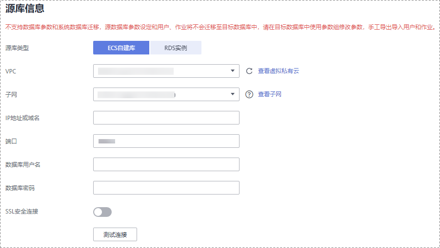
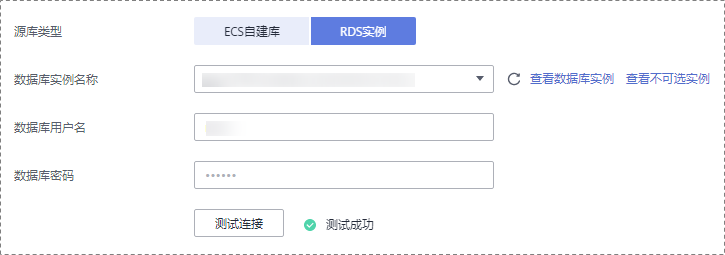

# PostgreSQL到PostgreSQL同步实例

本小节以PostgreSQL-\>PostgreSQL的入云同步为示例，介绍如何使用数据复制服务配置实时同步任务。

## 前提条件

-   已登录数据复制服务控制台。
-   账户余额大于等于0元。
-   参见[实时同步](https://support.huaweicloud.com/productdesc-drs/drs_01_0302.html)。
-   参见[使用须知](https://support.huaweicloud.com/qs-drs/drs_06_0003.html)。

## 操作步骤

1.  在“实时同步管理”页面，单击“创建同步任务”。
2.  在“同步实例”页面，填选区域、任务名称、任务异常通知信息、SMN主题、时延阈值、任务异常自动结束时间、描述、同步实例信息，单击“下一步”。

    **图 1**  同步任务信息  
    

    **表 1**  任务和描述

    
    <table><thead align="left"><tr id="drs_06_0005_row55731924204420"><th class="cellrowborder" valign="top" width="18.43%" id="mcps1.2.3.1.1">
<strong id="drs_06_0005_b1611223511352">参数</strong>

    </th>
    <th class="cellrowborder" valign="top" width="81.57%" id="mcps1.2.3.1.2">
<strong id="drs_06_0005_b3002268111352">描述</strong>

    </th>
    </tr>
    </thead>
    <tbody><tr id="drs_06_0005_row1459143619148"><td class="cellrowborder" valign="top" width="18.43%" headers="mcps1.2.3.1.1 ">
区域

    </td>
    <td class="cellrowborder" valign="top" width="81.57%" headers="mcps1.2.3.1.2 ">
当前所在区域，可进行切换。

    </td>
    </tr>
    <tr id="drs_06_0005_row807311204420"><td class="cellrowborder" valign="top" width="18.43%" headers="mcps1.2.3.1.1 ">
任务名称

    </td>
    <td class="cellrowborder" valign="top" width="81.57%" headers="mcps1.2.3.1.2 ">
任务名称在4-50位之间，必须以字母开头，不区分大小写，可以包含字母、数字、中划线或下划线，不能包含其他的特殊字符。

    </td>
    </tr>
    <tr id="drs_06_0005_row18223175312283"><td class="cellrowborder" valign="top" width="18.43%" headers="mcps1.2.3.1.1 ">
描述

    </td>
    <td class="cellrowborder" valign="top" width="81.57%" headers="mcps1.2.3.1.2 ">
描述不能超过256位，且不能包含! = &lt; &gt; &amp; ' " \ 特殊字符。

    </td>
    </tr>
    <tr id="drs_06_0005_row1080215433911"><td class="cellrowborder" valign="top" width="18.43%" headers="mcps1.2.3.1.1 ">
任务异常通知设置

    </td>
    <td class="cellrowborder" valign="top" width="81.57%" headers="mcps1.2.3.1.2 ">
该项为可选参数，开启之后，选择对应的SMN主题，。当同步任务状态异常时，系统将发送通知。

    </td>
    </tr>
    <tr id="drs_06_0005_row1238083594114"><td class="cellrowborder" valign="top" width="18.43%" headers="mcps1.2.3.1.1 ">
SMN主题

    </td>
    <td class="cellrowborder" valign="top" width="81.57%" headers="mcps1.2.3.1.2 ">
“任务异常通知设置”项开启后可见，需提前在SMN上申请主题并添加订阅。

    
SMN主题申请和订阅可参考<a href="https://support.huaweicloud.com/qs-smn/smn_ug_0004.html" target="_blank" rel="noopener noreferrer">《消息通知服务用户指南》</a>。

    </td>
    </tr>
    <tr id="drs_06_0005_row49611652175115"><td class="cellrowborder" valign="top" width="18.43%" headers="mcps1.2.3.1.1 ">
时延阈值

    </td>
    <td class="cellrowborder" valign="top" width="81.57%" headers="mcps1.2.3.1.2 ">
在增量同步阶段，源数据库和目标数据库之间的同步有时会存在一个时间差，称为时延，单位为秒。

    
时延阈值设置是指时延超过一定的值后（时延阈值范围为1—3600s），DRS可以发送告警通知给指定收件人。告警通知将在时延稳定超过设定的阈值6min后发送，避免出现由于时延波动反复发送告警通知的情况。

    
 说明： 
<ul id="drs_06_0005_ul163805916512"><li>首次进入增量同步阶段，会有较多数据等待同步，存在较大的时延，属于正常情况，不在此功能的监控范围之内。</li><li>设置时延阈值之前，需要设置任务异常通知。</li></ul>
    

    </td>
    </tr>
    <tr id="drs_06_0005_row157731032102814"><td class="cellrowborder" valign="top" width="18.43%" headers="mcps1.2.3.1.1 ">
任务异常自动结束时间（天）

    </td>
    <td class="cellrowborder" valign="top" width="81.57%" headers="mcps1.2.3.1.2 ">
设置任务异常自动结束天数，输入值必须在14-100之间。

    
 说明： 

异常状态下的任务仍然会计费，而长时间异常的任务无法续传和恢复。设置任务异常自动结束天数后，异常且超时的任务将会自动结束，以免产生不必要的费用。

    

    </td>
    </tr>
    </tbody>
    </table>

    **图 2**  PostgreSQL同步实例信息  
    

    **表 2**  同步实例信息

    
    <table><thead align="left"><tr id="row39932329204436"><th class="cellrowborder" valign="top" width="23.87%" id="mcps1.2.3.1.1">
<strong id="b2587841611355">参数</strong>

    </th>
    <th class="cellrowborder" valign="top" width="76.13%" id="mcps1.2.3.1.2">
<strong id="b1577696211355">描述</strong>

    </th>
    </tr>
    </thead>
    <tbody><tr id="row05147381129"><td class="cellrowborder" valign="top" width="23.87%" headers="mcps1.2.3.1.1 ">
数据流动方向

    </td>
    <td class="cellrowborder" valign="top" width="76.13%" headers="mcps1.2.3.1.2 ">
选择“入云”。

    </td>
    </tr>
    <tr id="row0414184610580"><td class="cellrowborder" valign="top" width="23.87%" headers="mcps1.2.3.1.1 ">
源数据库引擎

    </td>
    <td class="cellrowborder" valign="top" width="76.13%" headers="mcps1.2.3.1.2 ">
选择“PostgreSQL”。

    </td>
    </tr>
    <tr id="row42411630204436"><td class="cellrowborder" valign="top" width="23.87%" headers="mcps1.2.3.1.1 ">
目标数据库引擎

    </td>
    <td class="cellrowborder" valign="top" width="76.13%" headers="mcps1.2.3.1.2 ">
选择“PostgreSQL” 。

    </td>
    </tr>
    <tr id="row62907306204436"><td class="cellrowborder" valign="top" width="23.87%" headers="mcps1.2.3.1.1 ">
网络类型

    </td>
    <td class="cellrowborder" valign="top" width="76.13%" headers="mcps1.2.3.1.2 ">
此处以“VPC网络”为示例。

    </td>
    </tr>
    <tr id="row658644204515"><td class="cellrowborder" valign="top" width="23.87%" headers="mcps1.2.3.1.1 ">
目标数据库实例

    </td>
    <td class="cellrowborder" valign="top" width="76.13%" headers="mcps1.2.3.1.2 ">
目标数据库为关系型PostgreSQL数据库实例。

    </td>
    </tr>
    <tr id="row198991858776"><td class="cellrowborder" valign="top" width="23.87%" headers="mcps1.2.3.1.1 ">
同步实例所在子网

    </td>
    <td class="cellrowborder" valign="top" width="76.13%" headers="mcps1.2.3.1.2 ">
请选择同步实例所在的子网。也可以单击“查看子网”，跳转至“网络控制台”查看实例所在子网帮助选择。

    
默认值为当前所选数据库实例所在子网，请选择有可用IP地址的子网。为确保同步实例创建成功，仅显示已经开启DHCP的子网。

    </td>
    </tr>
    <tr id="row1169913195320"><td class="cellrowborder" valign="top" width="23.87%" headers="mcps1.2.3.1.1 ">
同步类型

    </td>
    <td class="cellrowborder" valign="top" width="76.13%" headers="mcps1.2.3.1.2 ">
全量+增量：

    
该模式为数据持续性实时同步，通过全量过程完成目标端数据库的初始化后，增量同步阶段通过解析日志等技术，将源端和目标端数据保持数据持续一致。

    </td>
    </tr>
    <tr id="row143231850112715"><td class="cellrowborder" valign="top" width="23.87%" headers="mcps1.2.3.1.1 ">
企业项目

    </td>
    <td class="cellrowborder" valign="top" width="76.13%" headers="mcps1.2.3.1.2 ">
对于已成功关联企业项目的用户，仅需在“企业项目”下拉框中选择目标项目。

    
如果需要自定义企业项目，请前往项目管理服务进行创建。关于如何创建项目，详见《项目管理用户指南》。

    </td>
    </tr>
    <tr id="row19775555162713"><td class="cellrowborder" valign="top" width="23.87%" headers="mcps1.2.3.1.1 ">
标签

    </td>
    <td class="cellrowborder" valign="top" width="76.13%" headers="mcps1.2.3.1.2 ">
可选配置，对同步任务的标识。使用标签可方便管理您的实时同步任务。每个任务最多支持10个标签配额。

    
任务创建成功后，您可以单击实例名称，在“标签”页签下查看对应标签。关于标签的详细操作，请参见<a href="https://support.huaweicloud.com/usermanual-drs/drs_synchronization_tag.html" target="_blank" rel="noopener noreferrer">标签管理</a>。

    </td>
    </tr>
    </tbody>
    </table>

3.  在“源库及目标库”页面，同步实例创建成功后，填选源库信息和目标库信息，建议您单击“源库和目标库“处的“测试连接“，分别测试并确定与源库和目标库连通后，勾选协议，单击“下一步“。

    > **说明：** 
    >此处源库类型分为ECS自建库和RDS实例，需要根据源数据库的实际来源选择相应的分类。两种场景下的参数配置不一样，需要根据具体场景进行配置。

    -   场景一：ECS自建库源库信息配置

        **图 3**  ECS自建PostgreSQL库场景源库信息  
        

        **表 3**  ECS自建库场景源库信息

        
        <table><thead align="left"><tr id="row4819321621"><th class="cellrowborder" valign="top" width="23.29%" id="mcps1.2.3.1.1">
<strong id="b14819102625">参数</strong>

        </th>
        <th class="cellrowborder" valign="top" width="76.71%" id="mcps1.2.3.1.2">
<strong id="b178191721220">描述</strong>

        </th>
        </tr>
        </thead>
        <tbody><tr id="row11819925214"><td class="cellrowborder" valign="top" width="23.29%" headers="mcps1.2.3.1.1 ">
源库类型

        </td>
        <td class="cellrowborder" valign="top" width="76.71%" headers="mcps1.2.3.1.2 ">
选择“ECS自建库”。

        </td>
        </tr>
        <tr id="row98192216219"><td class="cellrowborder" valign="top" width="23.29%" headers="mcps1.2.3.1.1 ">
VPC

        </td>
        <td class="cellrowborder" valign="top" width="76.71%" headers="mcps1.2.3.1.2 ">
源数据库实例所在的虚拟专用网络，可以对不同业务进行网络隔离。您需要创建或选择所需的虚拟私有云。如何创建虚拟私有云，请参见《虚拟私有云用户指南》中的“<a href="https://support.huaweicloud.com/usermanual-vpc/zh-cn_topic_0013935842.html" target="_blank" rel="noopener noreferrer">创建虚拟私有云基本信息及默认子网</a>”。

        </td>
        </tr>
        <tr id="row198191427220"><td class="cellrowborder" valign="top" width="23.29%" headers="mcps1.2.3.1.1 ">
子网

        </td>
        <td class="cellrowborder" valign="top" width="76.71%" headers="mcps1.2.3.1.2 ">
通过子网提供与其他网络隔离的、可以独享的网络资源，以提高网络安全。子网在可用分区内才会有效，创建源数据库实例的子网需要开启DHCP功能，在创建过程中也不能关闭已选子网的DHCP功能。

        </td>
        </tr>
        <tr id="row14819120214"><td class="cellrowborder" valign="top" width="23.29%" headers="mcps1.2.3.1.1 ">
IP地址或域名

        </td>
        <td class="cellrowborder" valign="top" width="76.71%" headers="mcps1.2.3.1.2 ">
源数据库的IP地址或域名。

        </td>
        </tr>
        <tr id="row281992628"><td class="cellrowborder" valign="top" width="23.29%" headers="mcps1.2.3.1.1 ">
端口

        </td>
        <td class="cellrowborder" valign="top" width="76.71%" headers="mcps1.2.3.1.2 ">
源数据库服务端口，可输入范围为1~65535间的整数。

        </td>
        </tr>
        <tr id="row08191623215"><td class="cellrowborder" valign="top" width="23.29%" headers="mcps1.2.3.1.1 ">
数据库用户名

        </td>
        <td class="cellrowborder" valign="top" width="76.71%" headers="mcps1.2.3.1.2 ">
源数据库的用户名。

        </td>
        </tr>
        <tr id="row98197216211"><td class="cellrowborder" valign="top" width="23.29%" headers="mcps1.2.3.1.1 ">
数据库密码

        </td>
        <td class="cellrowborder" valign="top" width="76.71%" headers="mcps1.2.3.1.2 ">
源数据库的用户名所对应的密码。

        </td>
        </tr>
        <tr id="row19827128212"><td class="cellrowborder" valign="top" width="23.29%" headers="mcps1.2.3.1.1 ">
SSL安全连接

        </td>
        <td class="cellrowborder" valign="top" width="76.71%" headers="mcps1.2.3.1.2 ">
通过该功能，用户可以选择是否开启对同步链路的加密。如果开启该功能，需要用户上传SSL CA根证书。

        
 说明： 
<ul id="ul266710518121"><li>最大支持上传500KB的证书文件。</li><li>如果不使用SSL证书，请自行承担数据安全风险。</li></ul>
        

        </td>
        </tr>
        </tbody>
        </table>

        > **说明：** 
        >**源数据库的IP地址或域名、数据库用户名和密码，会被系统加密暂存，直至删除该迁移任务后自动清除。**

    -   场景二：RDS实例源库信息配置

        **图 4**  RDS for PostgreSQL实例场景源库信息  
        

        **表 4**  RDS实例场景源库信息

        
        <table><thead align="left"><tr id="row48273219210"><th class="cellrowborder" valign="top" width="22.869999999999997%" id="mcps1.2.3.1.1">
<strong id="b98275220212">参数</strong>

        </th>
        <th class="cellrowborder" valign="top" width="77.13%" id="mcps1.2.3.1.2">
<strong id="b168271421523">描述</strong>

        </th>
        </tr>
        </thead>
        <tbody><tr id="row198277210215"><td class="cellrowborder" valign="top" width="22.869999999999997%" headers="mcps1.2.3.1.1 ">
源库类型

        </td>
        <td class="cellrowborder" valign="top" width="77.13%" headers="mcps1.2.3.1.2 ">
选择“RDS实例”。

        </td>
        </tr>
        <tr id="row1982742821"><td class="cellrowborder" valign="top" width="22.869999999999997%" headers="mcps1.2.3.1.1 ">
数据库实例名称

        </td>
        <td class="cellrowborder" valign="top" width="77.13%" headers="mcps1.2.3.1.2 ">
选择待同步的关系型PostgreSQL数据库实例作为源数据库实例。

        </td>
        </tr>
        <tr id="row188271221621"><td class="cellrowborder" valign="top" width="22.869999999999997%" headers="mcps1.2.3.1.1 ">
数据库用户名

        </td>
        <td class="cellrowborder" valign="top" width="77.13%" headers="mcps1.2.3.1.2 ">
源数据库实例的用户名。

        </td>
        </tr>
        <tr id="row16827162722"><td class="cellrowborder" valign="top" width="22.869999999999997%" headers="mcps1.2.3.1.1 ">
数据库密码

        </td>
        <td class="cellrowborder" valign="top" width="77.13%" headers="mcps1.2.3.1.2 ">
源数据库的用户名所对应的密码。

        </td>
        </tr>
        </tbody>
        </table>

    **图 5**  PostgreSQL目标库信息  
    

    **表 5**  目标库信息

    
    <table><thead align="left"><tr id="zh-cn_topic_0135097933_row12653123195919"><th class="cellrowborder" valign="top" width="23.29%" id="mcps1.2.3.1.1">
<strong id="zh-cn_topic_0135097933_b20653923155913">参数</strong>

    </th>
    <th class="cellrowborder" valign="top" width="76.71%" id="mcps1.2.3.1.2">
<strong id="zh-cn_topic_0135097933_b186531223105910">描述</strong>

    </th>
    </tr>
    </thead>
    <tbody><tr id="zh-cn_topic_0135097933_row1265352355912"><td class="cellrowborder" valign="top" width="23.29%" headers="mcps1.2.3.1.1 ">
数据库实例名称

    </td>
    <td class="cellrowborder" valign="top" width="76.71%" headers="mcps1.2.3.1.2 ">
默认为创建迁移任务时选择的关系型PostgreSQL数据库实例，不可进行修改。

    </td>
    </tr>
    <tr id="row233825074616"><td class="cellrowborder" valign="top" width="23.29%" headers="mcps1.2.3.1.1 ">
数据库用户名

    </td>
    <td class="cellrowborder" valign="top" width="76.71%" headers="mcps1.2.3.1.2 ">
目标数据库的用户名。

    </td>
    </tr>
    <tr id="row8383114534615"><td class="cellrowborder" valign="top" width="23.29%" headers="mcps1.2.3.1.1 ">
数据库密码

    </td>
    <td class="cellrowborder" valign="top" width="76.71%" headers="mcps1.2.3.1.2 ">
目标数据库的用户名所对应的密码。

    </td>
    </tr>
    </tbody>
    </table>

    > **说明：** 
    >**源和目标数据库用户名和密码将在同步过程中被加密暂存到数据库和同步实例主机上，待该任务删除后会永久清除。**

4.  在“设置同步“页面，选择同步对象和同步用户，单击“下一步“。

    **图 6**  PostgreSQL同步模式  
    

    **表 6**  同步对象

    
    <table><thead align="left"><tr id="row165921632141911"><th class="cellrowborder" valign="top" width="20%" id="mcps1.2.3.1.1">
<strong id="b1783318515228">参数</strong>

    </th>
    <th class="cellrowborder" valign="top" width="80%" id="mcps1.2.3.1.2">
<strong id="b10555114922418">描述</strong>

    </th>
    </tr>
    </thead>
    <tbody><tr id="row1016617632811"><td class="cellrowborder" valign="top" width="20%" headers="mcps1.2.3.1.1 ">
增量阶段冲突策略

    </td>
    <td class="cellrowborder" valign="top" width="80%" headers="mcps1.2.3.1.2 ">
数据复制服务提供的实时同步功能使用了主键或唯一键冲突策略，这些策略可以由您自主选择，尽可能保证源数据库中有主键约束或唯一键约束的表同步到目标数据库是符合预期的。

    
冲突策略目前支持如下三种形式：

    <ul id="ul4261248155512"><li>忽略
当同步数据与目标数据库已有数据冲突时（主键/唯一键存在重复等），将跳过冲突数据，继续进行后续同步。

    </li><li>报错
当同步数据与目标数据库已有数据冲突时（主键/唯一键存在重复等），同步任务将失败并立即中止。

    </li><li>覆盖
当同步数据与目标数据库已有数据冲突时（主键/唯一键存在重复等），将覆盖原来的冲突数据。

    </li></ul>
    
当数据发生冲突时，针对如下情况，建议选择“忽略”或者“覆盖”，否则建议选择“报错”：

    <ul id="ul366812291748"><li>目标数据库存在数据</li><li>多对一同步场景</li><li>目标数据库手动更新数据</li></ul>
    </td>
    </tr>
    <tr id="row5167176122819"><td class="cellrowborder" valign="top" width="20%" headers="mcps1.2.3.1.1 ">
对象同步范围

    </td>
    <td class="cellrowborder" valign="top" width="80%" headers="mcps1.2.3.1.2 ">
对象同步范围支持增量DDL同步。您可以根据业务需求选择是否进行同步。

    </td>
    </tr>
    <tr id="row61671260283"><td class="cellrowborder" valign="top" width="20%" headers="mcps1.2.3.1.1 ">
快照模式

    </td>
    <td class="cellrowborder" valign="top" width="80%" headers="mcps1.2.3.1.2 ">
如果您选择的是全量迁移模式的任务，数据复制服务支持设置快照模式。

    <ul id="ul178135537296"><li>非快照式
适用于停止业务数据写入的导出，如果全量迁移中仍然有业务数据的修改，则导出数据为时间点非水平一致。稳定性和性能要优于快照式全量迁移。

    </li><li>快照式
可以在业务运行时产生一份时间水平一致的快照数据，具有业务数据分析价值，过程中的数据变化不会体现在导出数据中。

    
 说明： 

全量阶段使用快照模式导出能够有效提升全量+增量场景下的数据同步效率，但PostgreSQL的快照机制会使导出期间数据库的历史数据不能被回收，可能有空间膨胀的现象。建议在全量或增量数据量大且源库磁盘空间充足的情况下使用该方式。

    

    </li></ul>
    </td>
    </tr>
    <tr id="row559273214193"><td class="cellrowborder" valign="top" width="20%" headers="mcps1.2.3.1.1 ">
同步对象

    </td>
    <td class="cellrowborder" valign="top" width="80%" headers="mcps1.2.3.1.2 ">
同步对象支持表级同步和库级同步，您可以根据业务场景选择对应的数据进行同步。

    <ul id="ul992418431121"><li>选择对象的时候支持搜索，以便您快速选择需要的数据库对象。</li><li>在同步对象右侧已选对象框中，可以使用对象名映射功能进行源数据库和目标数据库中的同步对象映射，具体操作可参考<a href="对象名映射.md">对象名映射</a>。</li></ul>
    </td>
    </tr>
    <tr id="row1133774212269"><td class="cellrowborder" valign="top" width="20%" headers="mcps1.2.3.1.1 ">
同步用户

    </td>
    <td class="cellrowborder" valign="top" width="80%" headers="mcps1.2.3.1.2 ">
数据库的同步过程中，同步用户需要进行单独处理。

    
同步用户一般分为两类：可同步的用户和不支持同步的用户。对于不支持同步的用户，在备注列的查看详情中会提示具体的原因，您可以根据业务需求选择是否同步用户和权限。

    </td>
    </tr>
    </tbody>
    </table>

5.  在“预检查“页面，进行同步任务预校验，校验是否可进行实时同步。
    -   查看检查结果，如有不通过的检查项，需要修复不通过项后，单击“重新校验”按钮重新进行任务预校验。

        预检查不通过项处理建议请参见《数据复制服务用户指南》中的“[预检查不通过项修复方法](https://support.huaweicloud.com/usermanual-drs/drs_precheck.html)”。

    -   预检查完成后，且所有检查项结果均通过时，单击“下一步“。

        **图 7**  PostgreSQL预检查  
        

        > **说明：** 
        >所有检查项结果均通过时，若存在请确认项，需要阅读并确认详情后才可以继续执行下一步操作。

6.  在“任务确认“页面，设置同步任务的启动时间，并确认同步任务信息无误后，勾选协议，单击“启动任务“，提交同步任务。

    > **说明：** 
    >-   同步任务的启动时间可以根据业务需求，设置为“立即启动”或“稍后启动”。
    >-   预计同步任务启动后，会对源数据库和目标数据库的性能产生影响，建议选择业务低峰期，合理设置同步任务的启动时间。

7.  同步任务提交后，您可在“实时同步管理“页面，查看并管理自己的任务。
    -   您可查看任务提交后的状态，状态请参见[任务状态](https://support.huaweicloud.com/qs-drs/drs_06_0004.html)。
    -   在任务列表的右上角，单击刷新列表，可查看到最新的任务状态。

