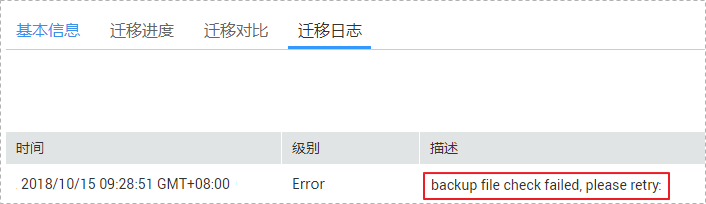

# PostgreSQL增量迁移失败，提示backup file check failed

## 场景描述

用户通过增量迁移模式在线迁移PostgreSQL数据库上云时，提示全量迁移失败，迁移日志中包含错误信息：

**backup file check failed**。

**图 1**  迁移日志信息  

## 问题分析

用户源数据库的“data“目录存在非PostgreSQL的文件。

## 解决方案

1.  用户需要清理掉源数据库“data“目录中除PostgreSQL自身文件外的其他所有非法文件。
2.  重试迁移任务。

