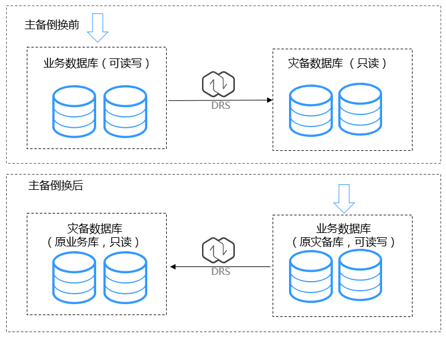
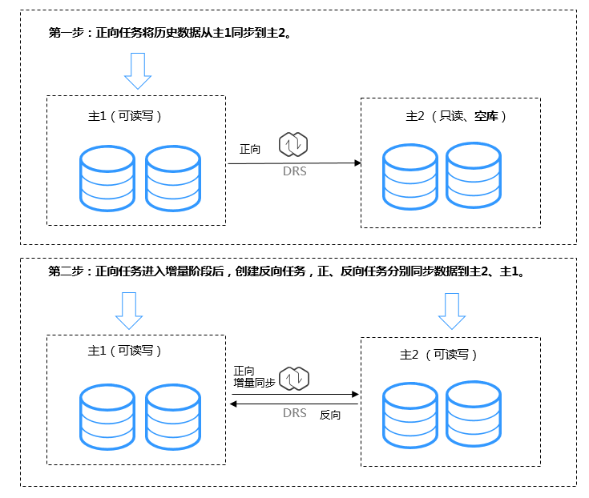

# 什么是单主/双主灾备

伴随着信息技术的高速发展，数据和信息在现代企业中扮演着越来越重要的角色，信息数据的丢失和损坏将对企业造成难以估量的损失。如何抵御大规模的灾难事件受到人们越来越多的关注，现阶段而言，容灾是较好的解决方案。关键数据的备份与恢复操作已经成为系统日常运行维护的一个重要组成部分。

华为云云数据库服务的双AZ高可用实例，可以满足同城级别的灾备。数据复制服务提供的实时灾备功能具有跨区域、跨云灾备的能力，分为单主灾备和双主灾备。

> **说明：** 
>目前仅支持至少单边为华为云RDS for MySQL数据库实例的单主/双主灾备，如果两边均是华为云内的RDS for MySQL数据库实例，可以进行跨区容灾。

## 单主灾备

单主灾备即使用一主一备的架构，当灾难发生时原灾备数据库作为业务数据库保证业务正常运行。DRS的主备倒换功能可以实现主备切换，主备倒换前，业务正常运行在业务数据库，并且将数据实时同步至灾备数据库。此时，灾备数据库不可写入数据。主备倒换后，原灾备数据库为可读写状态，可将业务切换到原灾备数据库运行，原业务数据库不可写 。

**图 1**  单主灾备  

## 双主灾备

双主灾备多用于灾备双方互为主备，共同承担业务流量的场景。其角色分为主1、主2，使用之前需要首先确立本云（本区）RDS的角色，才可以更好的完成实时灾备的搭建。完整的双主灾备是由正、反两条链路构成的，其创建顺序有着严格的要求。开始时，主1为可读写状态、主2为只读状态，正向灾备将初始化数据全量同步到主2后，方可启动反向灾备。此时，主1、主2均为可读写状态，正/反向灾备分别向主2、主1持续同步增量数据。

**图 2**  双主灾备  

特点及使用约束

-   **重要！ 双主灾备是对环境要求比较高的架构，实施部署双主灾备前请务必阅读[约束和设计思考](https://support.huaweicloud.com/qs-drs/drs_02_0024.html)。**
-   双主灾备的搭建过程对步骤是有严格要求的，请按照以下步骤进行部署，以确保双主任务顺利部署。
    1.  创建正向灾备任务，具体操作步骤请参见[创建灾备任务](https://support.huaweicloud.com/qs-drs/drs_02_0027.html)。创建完成后，会生成两个子任务，即正向灾备和反向灾备任务，此时反向灾备任务为配置状态。
    2.  当正向灾备任务进入“灾备中“状态时（反向任务操作列出现编辑），配置并启动反向任务。

        在“实时灾备管理“页面，选择该灾备任务的反向任务，单击操作列的编辑，进入“创建灾备任务“页面，继续完成创建反向任务。

        建议您在主2进行验证，满足预期后，启动反向任务。

        **图 3**  双向灾备任务  
        

