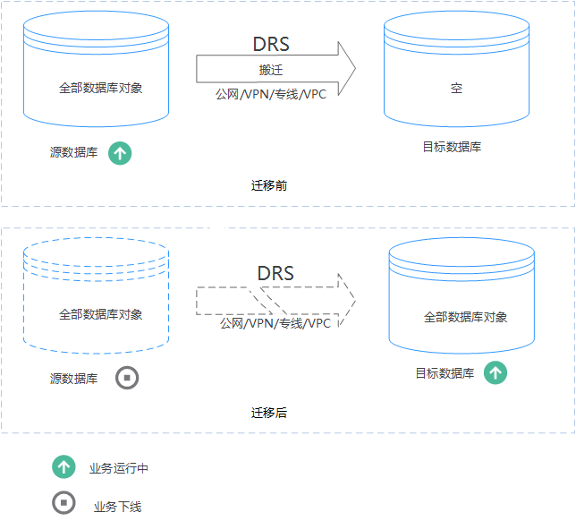
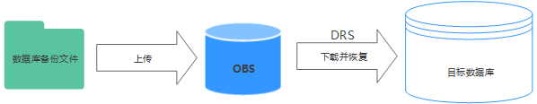
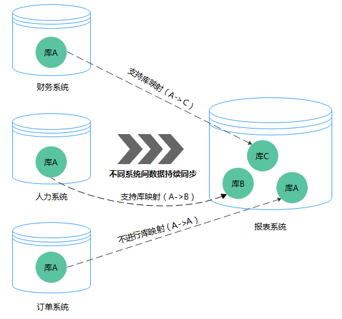
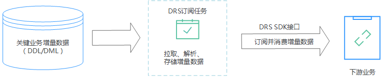
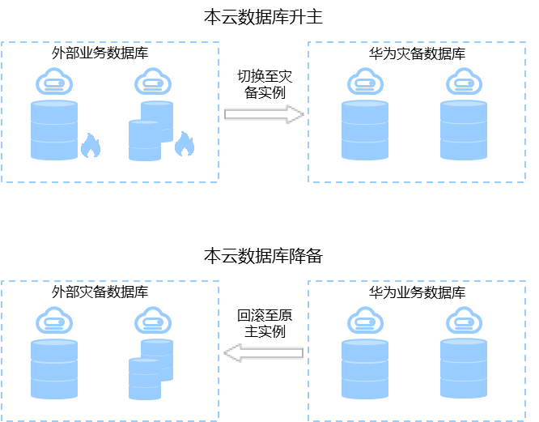

# 什么是数据复制服务

数据复制服务（Data Replication Service，简称DRS）是一种易用、稳定、高效、用于数据库实时迁移和数据库实时同步的云服务。

数据复制服务围绕云数据库，降低了数据库之间数据流通的复杂性，有效地帮助您减少数据传输的成本。

您可通过数据复制服务快速解决多场景下，数据库之间的数据流通问题，以满足数据传输业务需求。

数据复制服务提供了实时迁移、备份迁移、实时同步、数据订阅和实时灾备等多种功能。

## 实时迁移

实时迁移是指在数据复制服务器能够同时连通源数据库和目标数据库的情况下，只需要配置迁移的源、目标数据库实例及迁移对象即可完成整个数据迁移过程，再通过多项指标和数据的对比分析，帮助确定合适的业务割接时机，实现最小化业务中断的数据库迁移。

实时迁移支持多种网络迁移方式，如：公网网络、VPC网络、VPN网络和专线网络。通过多种网络链路，可快速实现跨云平台数据库迁移、云下数据库迁移上云或云上跨区域的数据库迁移等多种业务场景迁移。

特点：通过增量迁移技术，能够最大限度允许迁移过程中业务继续对外提供使用，有效的将业务系统中断时间和业务影响最小化，实现数据库平滑迁移上云，支持全部数据库对象的迁移。

**图 1**  实时迁移  

## 备份迁移

由于安全原因，数据库的IP地址有时不能暴露在公网上，但是选择专线网络进行数据库迁移，成本又高。这种情况下，您可以选用数据复制服务提供的备份迁移，通过将源数据库的数据导出成备份文件，并上传至对象存储服务，然后恢复到目标数据库。备份迁移可以帮助您在云服务不触碰源数据库的情况下，实现数据迁移。

常用场景：云下数据库迁移上云。

特点：云服务无需碰触源数据库，实现数据迁移。

**图 2**  备份迁移  

## 实时同步

实时同步是指在不同的系统之间，将数据通过同步技术从一个数据源拷贝到其他数据库，并保持一致，实现关键业务的数据实时流动。

实时同步不同于迁移，迁移是以整体数据库搬迁为目的，而实时同步是维持不同业务之间的数据持续性流动。

常用场景：实时分析，报表系统，数仓环境。

特点：实时同步功能聚焦于表和数据，并满足多种灵活性的需求，例如多对一、一对多，动态增减同步表，不同表名之间同步数据等。

**图 3**  多对一实时同步  

## 数据订阅

数据订阅是指获取数据库中关键业务的数据变化信息，这类信息常常是下游业务所需要的。数据订阅将其缓存并提供统一的SDK接口，方便下游业务订阅、获取、并消费，从而实现数据库和下游系统解耦，业务流程解耦。

常用场景：kafka订阅MySQL增量数据。

**图 4**  数据订阅  

## 实时灾备

为了解决地区故障导致的业务不可用，数据复制服务推出灾备场景，为用户业务连续性提供数据库的同步保障。您可以轻松地实现云下数据库到云上的灾备、跨云平台的数据库灾备，无需预先投入巨额基础设施。

数据灾备支持两地三中心、两地四中心灾备架构。单边灾备可以利用灾备场景的升主、降备功能从而实现异地主备倒换的效果。

**图 5**  实时灾备倒换  

