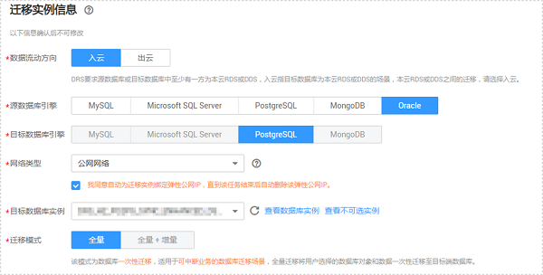
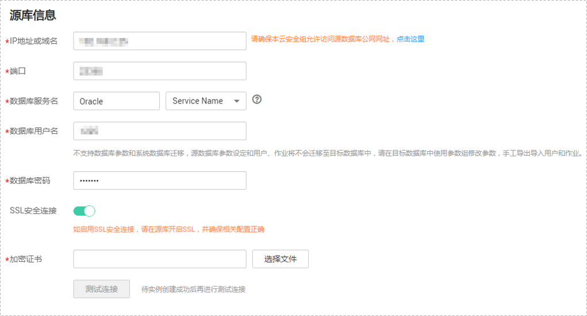
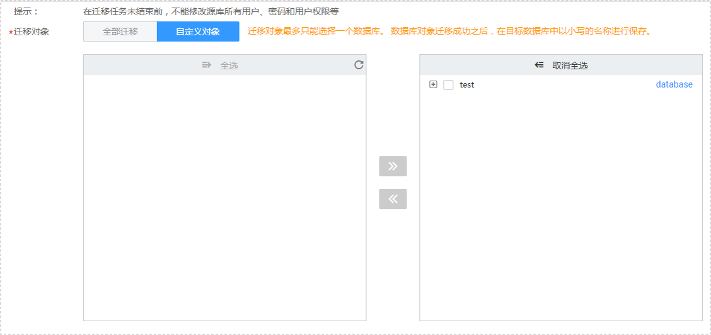
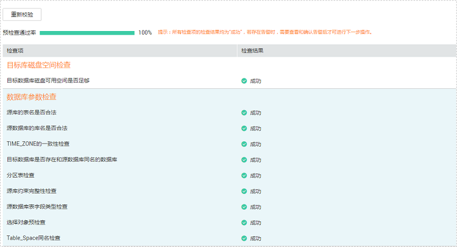
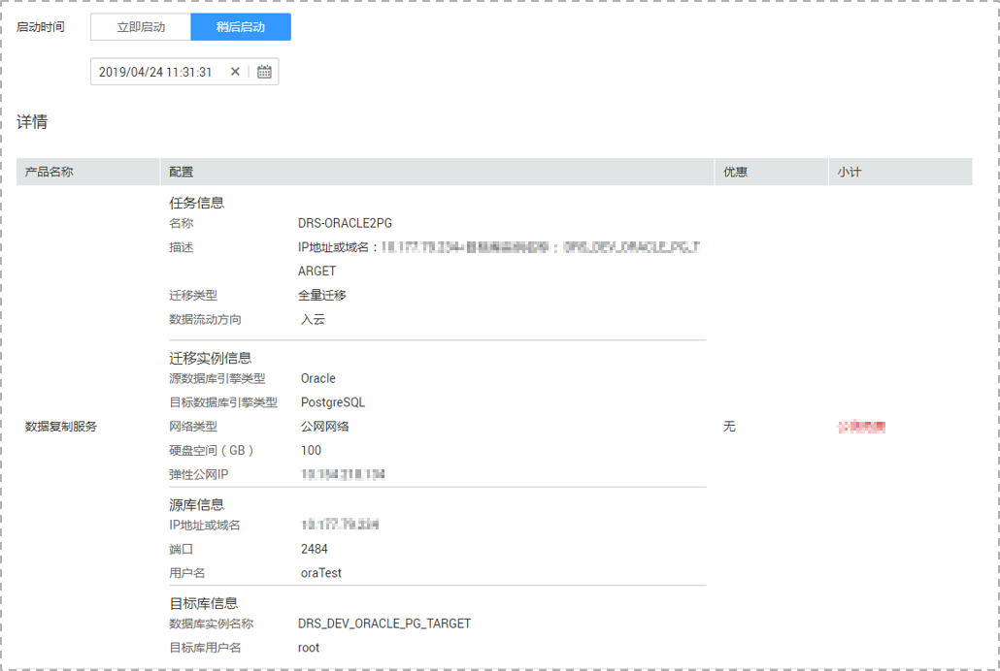

# 从本地Oracle迁移到RDS for PostgreSQL

数据复制服务支持本地自建的Oracle数据库迁移至本云RDS for PostgreSQL实例。

数据复制服务目前可以实现Oracle数据库的全量迁移 ，可选择通过公网网络或VPN、专线网络实现。

本小节将介绍通过公网网络方式进行 Oracle-\>RDS for PostgreSQL数据迁移的任务配置流程。

## 迁移限制

数据复制服务在使用上有一些固定的限制，用来提高数据迁移的稳定性和安全性。在进行正式的数据迁移之前，请先阅读以确保各存储引擎已满足使用限制条件。

对于Oracle-\>RDS for PostgreSQL的迁移，使用限制请参见[表1](#table20677749204218)。

**表 1**  迁移限制

<table><thead align="left"><tr id="row13678749194218"><th class="cellrowborder" valign="top" width="23.05%" id="mcps1.2.3.1.1">
<strong id="b191071715448">功能</strong>

</th>
<th class="cellrowborder" valign="top" width="76.95%" id="mcps1.2.3.1.2">
<strong id="b12108197144412">限制条件</strong>

</th>
</tr>
</thead>
<tbody><tr id="row186781495427"><td class="cellrowborder" valign="top" width="23.05%" headers="mcps1.2.3.1.1 ">
权限限制

</td>
<td class="cellrowborder" valign="top" width="76.95%" headers="mcps1.2.3.1.2 "><ul id="ul176811528154415"><li>源数据库端：需要具有DBA权限。</li><li>目标数据库端：待迁移db的读写权限。</li></ul>
</td>
</tr>
<tr id="row267834914212"><td class="cellrowborder" valign="top" width="23.05%" headers="mcps1.2.3.1.1 ">
源数据库配置

</td>
<td class="cellrowborder" valign="top" width="76.95%" headers="mcps1.2.3.1.2 "><ul id="ul2222240132515"><li>由于PostgreSQL数据库比Oralce数据库多了一层schema结构，在视图创建语句中as子句中不能包含db.table的形式，否则视图迁移会失败。
示例：将以下的语句一需要改写成语句二。

语句一：

<pre class="codeblock" id="codeblock19809121835918">create view v1 as select id from db1.t1;</pre>

语句二：

<pre class="codeblock" id="codeblock39361626135914">create view v1 as select id from t1;</pre>
</li><li>不支持函数索引迁移。
示例：

<pre class="codeblock" id="codeblock20193617210">create index idx_t on t(substr(dt, 1, 8));</pre>
</li><li>timestamp和interval day to second类型支持的最大精度是6。</li><li>数据类型不支持bfile、xmltype、sdo_geometry和自定义类型。</li><li>源库不能存在只是大小写不同的表。</li><li>库名不支持的字符有：&lt;.&gt;\。</li><li>表名不支持的字符有：&lt;."&gt;\。</li></ul>
</td>
</tr>
<tr id="row9678134914217"><td class="cellrowborder" valign="top" width="23.05%" headers="mcps1.2.3.1.1 ">
目标数据库配置

</td>
<td class="cellrowborder" valign="top" width="76.95%" headers="mcps1.2.3.1.2 "><ul id="ul16279174412364"><li>目标库必须是本云RDS for PostgreSQL增强版实例。</li><li>迁移前，需要手动在目标数据库端创建一个与源数据库名对应的全部以小写字母命名的数据库，且待迁移的对象不存在于该创建的数据库中。</li><li>目标数据库中不能存在与源数据库转换成小写后相同的对象名。</li></ul>
</td>
</tr>
<tr id="row16678349184211"><td class="cellrowborder" valign="top" width="23.05%" headers="mcps1.2.3.1.1 ">
迁移操作

</td>
<td class="cellrowborder" valign="top" width="76.95%" headers="mcps1.2.3.1.2 "><ul id="ul5950142213318"><li>目前仅支持全量迁移。</li><li>单个迁移任务每次只能迁移一个库（owner）的数据，多个数据库的迁移需要创建多个任务。</li><li>支持表、视图、索引、约束、数据的迁移，其他数据库对象暂不支持，如存储过程等。</li><li>不支持分区表的迁移。</li><li>表、视图等对象名迁移到目标库后会转换成小写，如ABC和abc。</li><li>对于迁移中的数据库对象，在迁移期间，源库和目标库都不能进行写入操作，否则会导致数据不一致。</li><li>源库和目标库时区设置必须一致。</li><li>如有中文、日文等特殊字符，业务连接Oracle使用的编码需和Oracle服务端编码一致，否则目标库会出现乱码。</li><li>在迁移任务未结束前，不能修改源库所有用户、密码和用户权限等信息。</li></ul>
</td>
</tr>
</tbody>
</table>

## 数据类型映射关系

由于Oracle数据库和PostgreSQL数据库的数据类型不是一一对应的，所以数据复制服务在进行迁移时，会根据两种数据库类型进行对应的数据类型映射，具体的数据类型映射关系请参见[表2](#table165608589112)。

**表 2**  数据类型映射关系

<table><thead align="left"><tr id="row756111589112"><th class="cellrowborder" valign="top" width="33.373337333733375%" id="mcps1.2.4.1.1">
<strong id="b1583916251735">Oracle数据库</strong>

</th>
<th class="cellrowborder" valign="top" width="33.29332933293329%" id="mcps1.2.4.1.2">
<strong id="b58748251736">PostgreSQL数据库</strong>

</th>
<th class="cellrowborder" valign="top" width="33.33333333333333%" id="mcps1.2.4.1.3">
<strong id="b1887611251632">是否支持映射</strong>

</th>
</tr>
</thead>
<tbody><tr id="row135611358513"><td class="cellrowborder" valign="top" width="33.373337333733375%" headers="mcps1.2.4.1.1 ">
CHAR

</td>
<td class="cellrowborder" valign="top" width="33.29332933293329%" headers="mcps1.2.4.1.2 ">
CHAR

</td>
<td class="cellrowborder" valign="top" width="33.33333333333333%" headers="mcps1.2.4.1.3 ">
支持

</td>
</tr>
<tr id="row156112581818"><td class="cellrowborder" valign="top" width="33.373337333733375%" headers="mcps1.2.4.1.1 ">
VARCHAR

</td>
<td class="cellrowborder" valign="top" width="33.29332933293329%" headers="mcps1.2.4.1.2 ">
VARCHAR

</td>
<td class="cellrowborder" valign="top" width="33.33333333333333%" headers="mcps1.2.4.1.3 ">
支持

</td>
</tr>
<tr id="row2056110588111"><td class="cellrowborder" valign="top" width="33.373337333733375%" headers="mcps1.2.4.1.1 ">
VARCHAR2

</td>
<td class="cellrowborder" valign="top" width="33.29332933293329%" headers="mcps1.2.4.1.2 ">
VARCHAR2

</td>
<td class="cellrowborder" valign="top" width="33.33333333333333%" headers="mcps1.2.4.1.3 ">
支持

</td>
</tr>
<tr id="row135619585117"><td class="cellrowborder" valign="top" width="33.373337333733375%" headers="mcps1.2.4.1.1 ">
NCHAR

</td>
<td class="cellrowborder" valign="top" width="33.29332933293329%" headers="mcps1.2.4.1.2 ">
NCHAR

</td>
<td class="cellrowborder" valign="top" width="33.33333333333333%" headers="mcps1.2.4.1.3 ">
支持

</td>
</tr>
<tr id="row205616581316"><td class="cellrowborder" valign="top" width="33.373337333733375%" headers="mcps1.2.4.1.1 ">
NVARCHAR2

</td>
<td class="cellrowborder" valign="top" width="33.29332933293329%" headers="mcps1.2.4.1.2 ">
NVARCHAR2

</td>
<td class="cellrowborder" valign="top" width="33.33333333333333%" headers="mcps1.2.4.1.3 ">
支持

</td>
</tr>
<tr id="row456113582120"><td class="cellrowborder" valign="top" width="33.373337333733375%" headers="mcps1.2.4.1.1 ">
NUMBER

</td>
<td class="cellrowborder" valign="top" width="33.29332933293329%" headers="mcps1.2.4.1.2 ">
NUMBER

</td>
<td class="cellrowborder" valign="top" width="33.33333333333333%" headers="mcps1.2.4.1.3 ">
支持

</td>
</tr>
<tr id="row35612581317"><td class="cellrowborder" valign="top" width="33.373337333733375%" headers="mcps1.2.4.1.1 ">
BINARY_FLOAT

</td>
<td class="cellrowborder" valign="top" width="33.29332933293329%" headers="mcps1.2.4.1.2 ">
BINARY_FLOAT

</td>
<td class="cellrowborder" valign="top" width="33.33333333333333%" headers="mcps1.2.4.1.3 ">
支持

</td>
</tr>
<tr id="row656110581916"><td class="cellrowborder" valign="top" width="33.373337333733375%" headers="mcps1.2.4.1.1 ">
BINARY_DOUBLE

</td>
<td class="cellrowborder" valign="top" width="33.29332933293329%" headers="mcps1.2.4.1.2 ">
BINARY_DOUBLE

</td>
<td class="cellrowborder" valign="top" width="33.33333333333333%" headers="mcps1.2.4.1.3 ">
支持

</td>
</tr>
<tr id="row14561458515"><td class="cellrowborder" valign="top" width="33.373337333733375%" headers="mcps1.2.4.1.1 ">
FLOAT

</td>
<td class="cellrowborder" valign="top" width="33.29332933293329%" headers="mcps1.2.4.1.2 ">
FLOAT

</td>
<td class="cellrowborder" valign="top" width="33.33333333333333%" headers="mcps1.2.4.1.3 ">
支持

</td>
</tr>
<tr id="row105611558714"><td class="cellrowborder" valign="top" width="33.373337333733375%" headers="mcps1.2.4.1.1 ">
DATE

</td>
<td class="cellrowborder" valign="top" width="33.29332933293329%" headers="mcps1.2.4.1.2 ">
DATE

</td>
<td class="cellrowborder" valign="top" width="33.33333333333333%" headers="mcps1.2.4.1.3 ">
支持

</td>
</tr>
<tr id="row35624587120"><td class="cellrowborder" valign="top" width="33.373337333733375%" headers="mcps1.2.4.1.1 ">
TIMESTAMP

</td>
<td class="cellrowborder" valign="top" width="33.29332933293329%" headers="mcps1.2.4.1.2 ">
TIMESTAMP

</td>
<td class="cellrowborder" valign="top" width="33.33333333333333%" headers="mcps1.2.4.1.3 ">
支持

</td>
</tr>
<tr id="row456210584116"><td class="cellrowborder" valign="top" width="33.373337333733375%" headers="mcps1.2.4.1.1 ">
INTERVAL

</td>
<td class="cellrowborder" valign="top" width="33.29332933293329%" headers="mcps1.2.4.1.2 ">
INTERVAL

</td>
<td class="cellrowborder" valign="top" width="33.33333333333333%" headers="mcps1.2.4.1.3 ">
支持

</td>
</tr>
<tr id="row55621758811"><td class="cellrowborder" valign="top" width="33.373337333733375%" headers="mcps1.2.4.1.1 ">
BLOB

</td>
<td class="cellrowborder" valign="top" width="33.29332933293329%" headers="mcps1.2.4.1.2 ">
BYTEA

</td>
<td class="cellrowborder" valign="top" width="33.33333333333333%" headers="mcps1.2.4.1.3 ">
支持

</td>
</tr>
<tr id="row1562658117"><td class="cellrowborder" valign="top" width="33.373337333733375%" headers="mcps1.2.4.1.1 ">
CLOB

</td>
<td class="cellrowborder" valign="top" width="33.29332933293329%" headers="mcps1.2.4.1.2 ">
CLOB

</td>
<td class="cellrowborder" valign="top" width="33.33333333333333%" headers="mcps1.2.4.1.3 ">
支持

</td>
</tr>
<tr id="row05621581118"><td class="cellrowborder" valign="top" width="33.373337333733375%" headers="mcps1.2.4.1.1 ">
NCLOB

</td>
<td class="cellrowborder" valign="top" width="33.29332933293329%" headers="mcps1.2.4.1.2 ">
TEXT

</td>
<td class="cellrowborder" valign="top" width="33.33333333333333%" headers="mcps1.2.4.1.3 ">
支持

</td>
</tr>
<tr id="row25625581115"><td class="cellrowborder" valign="top" width="33.373337333733375%" headers="mcps1.2.4.1.1 ">
LONG

</td>
<td class="cellrowborder" valign="top" width="33.29332933293329%" headers="mcps1.2.4.1.2 ">
TEXT

</td>
<td class="cellrowborder" valign="top" width="33.33333333333333%" headers="mcps1.2.4.1.3 ">
支持

</td>
</tr>
<tr id="row1056285811112"><td class="cellrowborder" valign="top" width="33.373337333733375%" headers="mcps1.2.4.1.1 ">
LONG_RAW

</td>
<td class="cellrowborder" valign="top" width="33.29332933293329%" headers="mcps1.2.4.1.2 ">
BYTEA

</td>
<td class="cellrowborder" valign="top" width="33.33333333333333%" headers="mcps1.2.4.1.3 ">
支持

</td>
</tr>
<tr id="row1856210581910"><td class="cellrowborder" valign="top" width="33.373337333733375%" headers="mcps1.2.4.1.1 ">
RAW

</td>
<td class="cellrowborder" valign="top" width="33.29332933293329%" headers="mcps1.2.4.1.2 ">
BYTEA

</td>
<td class="cellrowborder" valign="top" width="33.33333333333333%" headers="mcps1.2.4.1.3 ">
支持

</td>
</tr>
<tr id="row363712102614"><td class="cellrowborder" valign="top" width="33.373337333733375%" headers="mcps1.2.4.1.1 ">
ROWID

</td>
<td class="cellrowborder" valign="top" width="33.29332933293329%" headers="mcps1.2.4.1.2 ">
CHAR

</td>
<td class="cellrowborder" valign="top" width="33.33333333333333%" headers="mcps1.2.4.1.3 ">
支持

</td>
</tr>
<tr id="row43911518122615"><td class="cellrowborder" valign="top" width="33.373337333733375%" headers="mcps1.2.4.1.1 ">
UROWID

</td>
<td class="cellrowborder" valign="top" width="33.29332933293329%" headers="mcps1.2.4.1.2 ">
VARCHAR

</td>
<td class="cellrowborder" valign="top" width="33.33333333333333%" headers="mcps1.2.4.1.3 ">
支持

</td>
</tr>
<tr id="row8500194217266"><td class="cellrowborder" valign="top" width="33.373337333733375%" headers="mcps1.2.4.1.1 ">
XMLTYPE

</td>
<td class="cellrowborder" valign="top" width="33.29332933293329%" headers="mcps1.2.4.1.2 ">
-

</td>
<td class="cellrowborder" valign="top" width="33.33333333333333%" headers="mcps1.2.4.1.3 ">
不支持

</td>
</tr>
<tr id="row19567345112610"><td class="cellrowborder" valign="top" width="33.373337333733375%" headers="mcps1.2.4.1.1 ">
BFILE

</td>
<td class="cellrowborder" valign="top" width="33.29332933293329%" headers="mcps1.2.4.1.2 ">
-

</td>
<td class="cellrowborder" valign="top" width="33.33333333333333%" headers="mcps1.2.4.1.3 ">
不支持

</td>
</tr>
<tr id="row5244448132615"><td class="cellrowborder" valign="top" width="33.373337333733375%" headers="mcps1.2.4.1.1 ">
SDO_GEOMETRY

</td>
<td class="cellrowborder" valign="top" width="33.29332933293329%" headers="mcps1.2.4.1.2 ">
-

</td>
<td class="cellrowborder" valign="top" width="33.33333333333333%" headers="mcps1.2.4.1.3 ">
不支持

</td>
</tr>
</tbody>
</table>

## 前提条件

-   已登录数据复制服务控制台。
-   账户余额大于等于0元。
-   参见[申请须知](https://support.huaweicloud.com/qs-drs/drs_online_migration.html)。

## 迁移步骤

1.  在“在线迁移管理“页面，单击“创建迁移任务“，进入创建迁移任务页面。
2.  在“迁移实例”页面，填选任务名称、通知收件人信息、描述、迁移实例信息，单击“下一步”。

    **图 1**  迁移任务信息  
    

    **表 3**  任务和描述

    
    <table><thead align="left"><tr id="row55731924204420"><th class="cellrowborder" valign="top" width="18.42%" id="mcps1.2.3.1.1">
<strong id="b1611223511352">参数</strong>

    </th>
    <th class="cellrowborder" valign="top" width="81.58%" id="mcps1.2.3.1.2">
<strong id="b3002268111352">描述</strong>

    </th>
    </tr>
    </thead>
    <tbody><tr id="row807311204420"><td class="cellrowborder" valign="top" width="18.42%" headers="mcps1.2.3.1.1 ">
任务名称

    </td>
    <td class="cellrowborder" valign="top" width="81.58%" headers="mcps1.2.3.1.2 ">
任务名称在4位到64位之间，必须以字母开头，不区分大小写，可以包含字母、数字、中划线或下划线，不能包含其他的特殊字符。

    </td>
    </tr>
    <tr id="row1080215433911"><td class="cellrowborder" valign="top" width="18.42%" headers="mcps1.2.3.1.1 ">
通知收件人

    </td>
    <td class="cellrowborder" valign="top" width="81.58%" headers="mcps1.2.3.1.2 ">
该项为可选参数，开启之后，需要填写手机号码或者邮箱作为指定收件人。当迁移任务状态异常时，系统将发送通知给指定收件人。

    
 说明： 

收到确认短信或邮件之后，需要在48小时内处理，否则该功能订阅无效。

    

    </td>
    </tr>
    <tr id="row157731032102814"><td class="cellrowborder" valign="top" width="18.42%" headers="mcps1.2.3.1.1 ">
时延阈值

    </td>
    <td class="cellrowborder" valign="top" width="81.58%" headers="mcps1.2.3.1.2 ">
源数据库和目标数据库之间的同步有时会存在一个时间差，称为时延，单位为秒。

    
时延阈值设置是指时延超过一定的值后（时间阈值范围为1—3600s），DRS可以发送告警通知给指定收件人。告警通知将在时延稳定超过设定的阈值6min后发送，避免出现由于时延波动反复发送告警通知的情况。

    
 说明： 

设置时间阈值之前，需要填写收件人手机号或邮箱。

    

    </td>
    </tr>
    <tr id="row23664659204420"><td class="cellrowborder" valign="top" width="18.42%" headers="mcps1.2.3.1.1 ">
描述

    </td>
    <td class="cellrowborder" valign="top" width="81.58%" headers="mcps1.2.3.1.2 ">
描述不能超过256位，且不能包含!&lt;&gt;&amp;'\"特殊字符。

    </td>
    </tr>
    </tbody>
    </table>

    **图 2**  迁移实例信息-Oracle  
    

    **表 4**  迁移实例信息

    
    <table><thead align="left"><tr id="row39932329204436"><th class="cellrowborder" valign="top" width="23.87%" id="mcps1.2.3.1.1">
<strong id="b2587841611355">参数</strong>

    </th>
    <th class="cellrowborder" valign="top" width="76.13%" id="mcps1.2.3.1.2">
<strong id="b1577696211355">描述</strong>

    </th>
    </tr>
    </thead>
    <tbody><tr id="row05147381129"><td class="cellrowborder" valign="top" width="23.87%" headers="mcps1.2.3.1.1 ">
数据流动方向

    </td>
    <td class="cellrowborder" valign="top" width="76.13%" headers="mcps1.2.3.1.2 ">
选择入云。

    
入云指目标端数据库为华为云关系型数据库。

    </td>
    </tr>
    <tr id="row0414184610580"><td class="cellrowborder" valign="top" width="23.87%" headers="mcps1.2.3.1.1 ">
源数据库引擎

    </td>
    <td class="cellrowborder" valign="top" width="76.13%" headers="mcps1.2.3.1.2 ">
选择Oracle。

    </td>
    </tr>
    <tr id="row42411630204436"><td class="cellrowborder" valign="top" width="23.87%" headers="mcps1.2.3.1.1 ">
目标数据库引擎

    </td>
    <td class="cellrowborder" valign="top" width="76.13%" headers="mcps1.2.3.1.2 ">
选择PostgreSQL。

    </td>
    </tr>
    <tr id="row62907306204436"><td class="cellrowborder" valign="top" width="23.87%" headers="mcps1.2.3.1.1 ">
网络类型

    </td>
    <td class="cellrowborder" valign="top" width="76.13%" headers="mcps1.2.3.1.2 ">
默认为公网网络类型，支持公网网络和VPN、专线网络。

    
您可以根据实际情况选用合适的网络方式，此处以公网网络方式为示例。

    </td>
    </tr>
    <tr id="row658644204515"><td class="cellrowborder" valign="top" width="23.87%" headers="mcps1.2.3.1.1 ">
目标数据库实例

    </td>
    <td class="cellrowborder" valign="top" width="76.13%" headers="mcps1.2.3.1.2 ">
用户所创建的关系型数据库实例。

    </td>
    </tr>
    <tr id="row1781142655112"><td class="cellrowborder" valign="top" width="23.87%" headers="mcps1.2.3.1.1 ">
迁移模式

    </td>
    <td class="cellrowborder" valign="top" width="76.13%" headers="mcps1.2.3.1.2 ">
全量：该模式为数据库一次性迁移，适用于可中断业务的数据库迁移场景，全量迁移将用户选择的数据库对象和数据一次性迁移至目标端数据库。
 说明： 

如果用户只进行全量迁移时，建议停止对源数据库的操作，否则迁移过程中源数据库产生的新数据不会同步到目标数据库。

    

    

    </td>
    </tr>
    </tbody>
    </table>

3.  在“源库及目标库”页面，迁移实例创建成功后，填选源库信息和目标库信息，建议您单击“源库和目标库“处的“测试连接“，分别测试并确定与源库和目标库连通后，勾选协议，单击“下一步“。

    **图 3**  源库信息配置-Oracle  
    

    **表 5**  源库信息

    
    <table><thead align="left"><tr id="row48273219210"><th class="cellrowborder" valign="top" width="22.869999999999997%" id="mcps1.2.3.1.1">
<strong id="b98275220212">参数</strong>

    </th>
    <th class="cellrowborder" valign="top" width="77.13%" id="mcps1.2.3.1.2">
<strong id="b168271421523">描述</strong>

    </th>
    </tr>
    </thead>
    <tbody><tr id="row198277210215"><td class="cellrowborder" valign="top" width="22.869999999999997%" headers="mcps1.2.3.1.1 ">
IP地址或域名

    </td>
    <td class="cellrowborder" valign="top" width="77.13%" headers="mcps1.2.3.1.2 ">
源数据库的IP地址或域名。

    </td>
    </tr>
    <tr id="row1982742821"><td class="cellrowborder" valign="top" width="22.869999999999997%" headers="mcps1.2.3.1.1 ">
端口

    </td>
    <td class="cellrowborder" valign="top" width="77.13%" headers="mcps1.2.3.1.2 ">
源数据库服务端口，可输入范围为1~65535间的整数。

    </td>
    </tr>
    <tr id="row188271221621"><td class="cellrowborder" valign="top" width="22.869999999999997%" headers="mcps1.2.3.1.1 ">
数据库服务名

    </td>
    <td class="cellrowborder" valign="top" width="77.13%" headers="mcps1.2.3.1.2 ">
数据库服务名（Service Name/SID）指定了客户端可以通过其连接到Oracle数据库。

    
配置该项信息时，选填Service Name或者SID中任何一种均可，具体的名称需要与所选的类型对应。

    
您可以通过如下方法获取具体的数据库服务名，查询数据库服务名称时需要使用具备DBA权限的用户进行查询：

    <ul id="ul1185073217520"><li>查看Service Name：使用如下语句中任何一种均可。<ul id="ul563302616"><li>语句一<pre class="codeblock" id="codeblock634110220129">select value from v$parameter where name like '%service_name%';</pre>
    </li><li>语句二<pre class="codeblock" id="codeblock1736711012134">show parameter service_name;</pre>
    </li></ul>
    </li><li>查看SID：<pre class="codeblock" id="codeblock933642420138">select instance_name from V$instance;</pre>
    </li></ul>
    </td>
    </tr>
    <tr id="row16827162722"><td class="cellrowborder" valign="top" width="22.869999999999997%" headers="mcps1.2.3.1.1 ">
数据库用户名

    </td>
    <td class="cellrowborder" valign="top" width="77.13%" headers="mcps1.2.3.1.2 ">
源数据库的用户名。

    </td>
    </tr>
    <tr id="row178118576471"><td class="cellrowborder" valign="top" width="22.869999999999997%" headers="mcps1.2.3.1.1 ">
数据库密码

    </td>
    <td class="cellrowborder" valign="top" width="77.13%" headers="mcps1.2.3.1.2 ">
源数据库的用户名所对应的密码。

    </td>
    </tr>
    <tr id="row1798013414810"><td class="cellrowborder" valign="top" width="22.869999999999997%" headers="mcps1.2.3.1.1 ">
SSL安全连接

    </td>
    <td class="cellrowborder" valign="top" width="77.13%" headers="mcps1.2.3.1.2 ">
通过该功能，用户可以选择是否开启对迁移链路的加密，如果开启，需要用户上传SSL CA根证书。

    </td>
    </tr>
    </tbody>
    </table>

    **图 4**  目标库信息配置-PostgreSQL  
    

    **表 6**  目标库信息

    
    <table><thead align="left"><tr id="row28279213213"><th class="cellrowborder" valign="top" width="23%" id="mcps1.2.3.1.1">
<strong id="b18277211214">参数</strong>

    </th>
    <th class="cellrowborder" valign="top" width="77%" id="mcps1.2.3.1.2">
<strong id="b48274219213">描述</strong>

    </th>
    </tr>
    </thead>
    <tbody><tr id="row198271021525"><td class="cellrowborder" valign="top" width="23%" headers="mcps1.2.3.1.1 ">
数据库实例名称

    </td>
    <td class="cellrowborder" valign="top" width="77%" headers="mcps1.2.3.1.2 ">
默认为创建迁移任务时选择的关系型数据库实例，不可进行修改。

    </td>
    </tr>
    <tr id="row19827021723"><td class="cellrowborder" valign="top" width="23%" headers="mcps1.2.3.1.1 ">
数据库用户名

    </td>
    <td class="cellrowborder" valign="top" width="77%" headers="mcps1.2.3.1.2 ">
目标数据库对应的数据库用户名。

    </td>
    </tr>
    <tr id="row16827721222"><td class="cellrowborder" valign="top" width="23%" headers="mcps1.2.3.1.1 ">
数据库密码

    </td>
    <td class="cellrowborder" valign="top" width="77%" headers="mcps1.2.3.1.2 ">
目标数据库对应的数据库密码。

    
数据库用户名和密码将被系统加密暂存，直至该任务删除后清除。

    </td>
    </tr>
    </tbody>
    </table>

4.  在“设定迁移“页面，设置迁移对象，单击“下一步“。

    **图 5**  设定迁移-Oracle  
    

    **表 7**  迁移对象

    
    <table><thead align="left"><tr id="row165921632141911"><th class="cellrowborder" valign="top" width="16%" id="mcps1.2.3.1.1">
<strong id="b1783318515228">参数</strong>

    </th>
    <th class="cellrowborder" valign="top" width="84%" id="mcps1.2.3.1.2">
<strong id="b10555114922418">描述</strong>

    </th>
    </tr>
    </thead>
    <tbody><tr id="row559273214193"><td class="cellrowborder" valign="top" width="16%" headers="mcps1.2.3.1.1 ">
迁移对象

    </td>
    <td class="cellrowborder" valign="top" width="84%" headers="mcps1.2.3.1.2 ">
目前迁移对象仅支持自定义对象，选择的粒度为视图和表，迁移对象最多只能选择一个数据库。 数据库对象迁移成功之后，在目标数据库中以小写的名称进行保存。

    
 说明： 

若所选的数据库进行迁移时，由于视图、表等对象可能与其他数据库的视图、表存在依赖关系，若所依赖的视图或表未迁移，则会导致迁移失败。建议您在迁移之前进行确认。

    

    </td>
    </tr>
    </tbody>
    </table>

5.  在“预检查“页面，进行迁移任务预校验，校验是否可进行迁移。
    -   查看检查结果，如有失败的检查项，需要修复失败项后，单击“重新校验”按钮重新进行迁移任务预校验。

        预检查失败项处理建议请参见《数据复制服务用户指南》中的“[预检查失败项修复方法](https://support.huaweicloud.com/usermanual-drs/drs_precheck.html)”。

        **图 6**  预检查-Oracle  
        

    -   预检查完成后，且预检查通过率为100%时，单击“下一步”。

        > **说明：**   
        >所有检查项结果均成功时，若存在告警，需要阅读并确认告警详情后才可以继续执行下一步操作。  

6.  在“任务确认“页面，设置迁移任务的启动时间，并确认迁移任务信息无误后，勾选协议，单击“启动任务“，提交迁移任务。

    **图 7**  任务确认-Oracle  
    

    迁移任务的启动时间可以根据业务需求，设置为“立即启动”或“稍后启动”。

    预计迁移任务启动后，会对源数据库和目标数据库的性能产生影响，建议选择业务低峰期，合理设置迁移任务的启动时间。

7.  迁移任务提交后，您可在“在线迁移管理“页面，查看并管理自己的任务。
    -   您可查看任务提交后的状态，状态请参见[任务状态](zh-cn_topic_0082317249.md)。
    -   在任务列表的右上角，单击刷新列表，可查看到最新的任务状态。

8.  迁移任务创建成功后，请参见《数据复制服务快速入门》的[使用流程](https://support.huaweicloud.com/qs-drs/drs_02_0001.html)，进行完整的数据业务割接。

