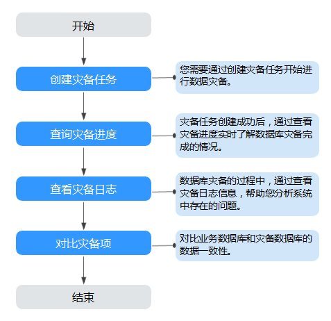

# 使用流程

## 使用场景

主实例支持搭建主备高可用架构，当主实例所在区域发生突发生自然灾害等状况，主节点（Master）和备节点（Slave）均无法连接时，可将异地灾备实例切换为主实例，在应用端修改数据库链接地址后，即可快速恢复应用的业务访问。数据复制服务提供的多活灾备功能，可实现主实例和跨区域的灾备实例之间的实时同步。

一次完整的数据灾备，是以任务作为导向，依次进行灾备进度观察、灾备日志分析、灾备数据一致性对比等多项操作。通过多项指标和数据的对比分析，可以帮助您实现不同业务系统间的数据实时同步。

## 使用流程

数据灾备的使用流程如下：

**图 1**  数据灾备流程  

-   步骤一：创建灾备任务。根据需要，选择业务数据库和灾备数据库，创建灾备任务。
-   步骤二：查询灾备进度。灾备过程中，可以通过查看灾备进度了解数据灾备完成情况。
-   步骤三：查看灾备日志。灾备日志包含告警、错误和提示等类型的信息，可根据此类信息分析系统存在的问题。
-   步骤四：对比灾备项。数据灾备提供对比功能，可根据需要查看对象级对比、数据级对比等，来确保业务数据库和灾备数据库的数据一致性。

