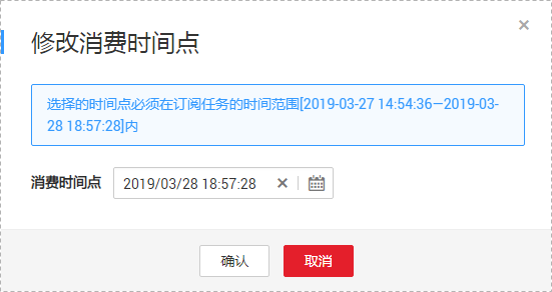

# 修改消费时间点

数据复制服务支持在消费的过程中，随时修改消费时间点，修改的时间点必须在订阅任务的时间范围内。一旦修改完消费时间点，那么下游SDK拉取到的增量数据从修改后的消费时间点开始。

目前只支持在数据复制服务管理控制台修改消费点，不支持在SDK中指定消费位点。

本章节将详细介绍通过数据复制服务管理控制台修改消费时间点的操作步骤。

## 前提条件

-   已登录数据复制服务管理控制台。
-   已成功创建数据订阅任务。

## 操作步骤

1.  停止SDK消费进程。

    在修改消费位点之前，需要先确保连接这个订阅通道的所有SDK下游都停掉。

2.  在“数据订阅管理”页面，选择需要修改消费时间点的订阅任务，单击“消费时间点”操作列的“修改”按钮。

    **图 1**  修改消费时间点  
    

3.  在弹出框中，设置指定的消费时间点，单击“确认”。

    **图 2**  编辑消费时间点  
    

    > **说明：**   
    >选择的时间消费点必须在订阅任务的时间范围内。  

4.  重启SDK消费进程。

    当修改完消费位点后，即可重启本地的SDK消费进程，此时SDK会从修改的消费位点开始订阅增量数据。

