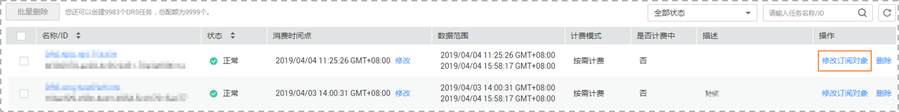
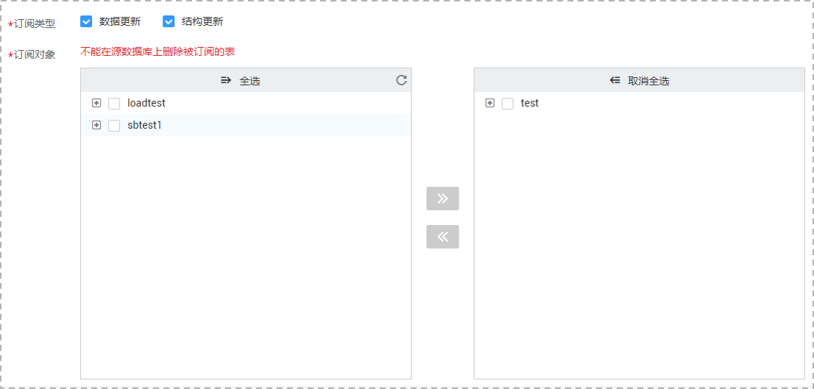

# 修改订阅对象

数据复制服务提供的数据订阅功能可以对数据订阅的对象进行修改。创建实例后，您可再次编辑订阅对象并提交订阅任务。

## 前提条件

已登录数据复制服务控制台。

## 操作步骤

1.  在“数据订阅管理”页面，选择需要修改订阅对象的任务，单击操作列的“修改订阅对象”按钮。

    **图 1**  编辑数据订阅对象  
    

2.  进入“选择订阅对象”页面，修改订阅类型和订阅对象，单击“下一步”。

    **图 2**  修改订阅对象  
    

    > **说明：**   
    >编辑订阅对象的过程中，不能在源数据库上删除被订阅的表。  

3.  进入“任务确认“页面，确认订阅任务信息无误后，勾选协议，单击“启动任务“，提交订阅任务。

