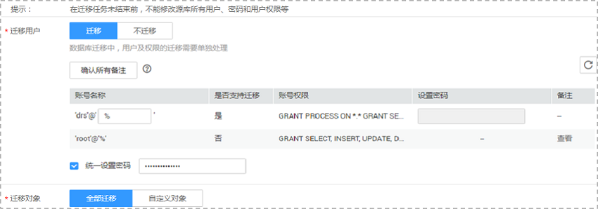
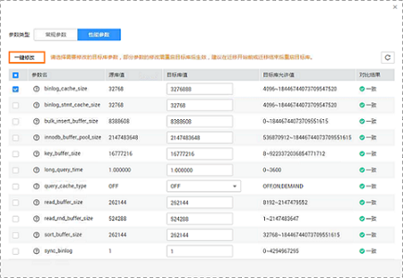
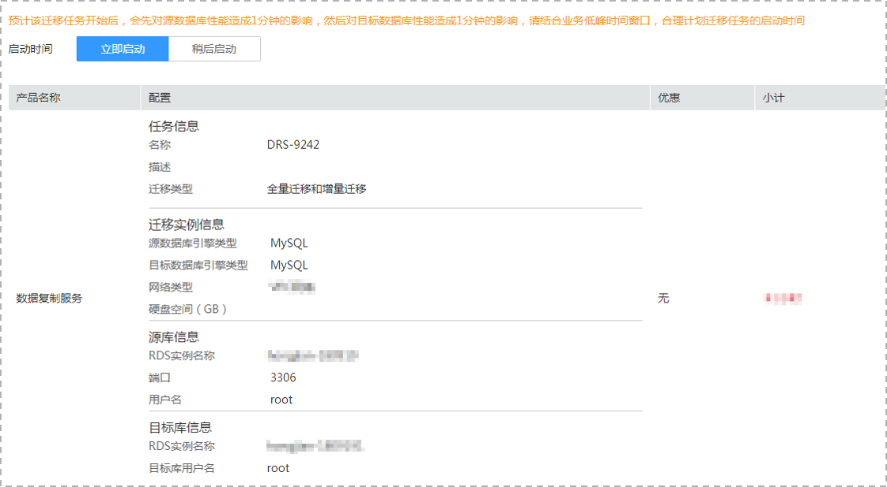

# 创建VPN网络（专线网络）迁移任务

本章节将以MySQL到RDS for MySQL的迁移为示例，介绍在VPN（专线）网络场景下，通过数据复制服务管理控制台配置数据迁移任务的流程，其他存储引擎的配置流程类似。

VPN网络（专线网络）适合通过VPN网络（专线网络），实现其他云下自建数据库与云上数据库迁移、或云上跨Region的数据库之间的迁移。

在数据复制服务中，数据库迁移是通过任务的形式完成的，通过创建任务向导，可以完成任务信息配置、任务创建。迁移任务创建成功后，您也可以通过数据复制服务管理控制台，对任务进行管理。

目前数据复制服务支持每个用户最多可创建5个在线迁移任务。

## 前提条件

-   已登录数据复制服务控制台。
-   账户余额大于等于0元。
-   参见[使用限制](https://support.huaweicloud.com/qs-drs/drs_02_0011.html)。
-   参见[申请须知](https://support.huaweicloud.com/qs-drs/drs_online_migration.html)。

## 操作步骤

1.  在“在线迁移管理“页面，单击“创建迁移任务“，进入创建迁移任务页面。
2.  在“迁移实例”页面，填选任务名称、通知收件人信息、描述、迁移实例信息，单击“下一步”。

    **图 1**  迁移任务信息  
    

    **表 1**  任务和描述

    
    <table><thead align="left"><tr id="row55731924204420"><th class="cellrowborder" valign="top" width="18.42%" id="mcps1.2.3.1.1">
<strong id="b1611223511352">参数</strong>

    </th>
    <th class="cellrowborder" valign="top" width="81.58%" id="mcps1.2.3.1.2">
<strong id="b3002268111352">描述</strong>

    </th>
    </tr>
    </thead>
    <tbody><tr id="row807311204420"><td class="cellrowborder" valign="top" width="18.42%" headers="mcps1.2.3.1.1 ">
任务名称

    </td>
    <td class="cellrowborder" valign="top" width="81.58%" headers="mcps1.2.3.1.2 ">
任务名称在4位到64位之间，必须以字母开头，不区分大小写，可以包含字母、数字、中划线或下划线，不能包含其他的特殊字符。

    </td>
    </tr>
    <tr id="row1080215433911"><td class="cellrowborder" valign="top" width="18.42%" headers="mcps1.2.3.1.1 ">
通知收件人

    </td>
    <td class="cellrowborder" valign="top" width="81.58%" headers="mcps1.2.3.1.2 ">
该项为可选参数，开启之后，需要填写手机号码或者邮箱作为指定收件人。当迁移任务状态异常时，系统将发送通知给指定收件人。

    
 说明： 

收到确认短信或邮件之后，需要在48小时内处理，否则该功能订阅无效。

    

    </td>
    </tr>
    <tr id="row157731032102814"><td class="cellrowborder" valign="top" width="18.42%" headers="mcps1.2.3.1.1 ">
时延阈值

    </td>
    <td class="cellrowborder" valign="top" width="81.58%" headers="mcps1.2.3.1.2 ">
源数据库和目标数据库之间的同步有时会存在一个时间差，称为时延，单位为秒。

    
时延阈值设置是指时延超过一定的值后（时间阈值范围为1—3600s），DRS可以发送告警通知给指定收件人。告警通知将在时延稳定超过设定的阈值6min后发送，避免出现由于时延波动反复发送告警通知的情况。

    
 说明： 
<ul id="ul354514492087"><li>首次进入增量迁移阶段，会有较多数据等待同步，存在较大的时延，属于正常情况，不在此功能的监控范围之内。</li><li>设置时间阈值之前，需要填写收件人手机号或邮箱。</li></ul>
    

    </td>
    </tr>
    <tr id="row23664659204420"><td class="cellrowborder" valign="top" width="18.42%" headers="mcps1.2.3.1.1 ">
描述

    </td>
    <td class="cellrowborder" valign="top" width="81.58%" headers="mcps1.2.3.1.2 ">
描述不能超过256位，且不能包含!&lt;&gt;&amp;'\"特殊字符。

    </td>
    </tr>
    </tbody>
    </table>

    **图 2**  迁移实例信息-VPN（专线）  
    

    **表 2**  迁移实例信息

    
    <table><thead align="left"><tr id="row39932329204436"><th class="cellrowborder" valign="top" width="23.87%" id="mcps1.2.3.1.1">
<strong id="b2587841611355">参数</strong>

    </th>
    <th class="cellrowborder" valign="top" width="76.13%" id="mcps1.2.3.1.2">
<strong id="b1577696211355">描述</strong>

    </th>
    </tr>
    </thead>
    <tbody><tr id="row129641656121716"><td class="cellrowborder" valign="top" width="23.87%" headers="mcps1.2.3.1.1 ">
数据流动方向

    </td>
    <td class="cellrowborder" valign="top" width="76.13%" headers="mcps1.2.3.1.2 ">
选择入云。

    
入云指目标端数据库为华为云关系型数据库。

    </td>
    </tr>
    <tr id="row0414184610580"><td class="cellrowborder" valign="top" width="23.87%" headers="mcps1.2.3.1.1 ">
源数据库引擎

    </td>
    <td class="cellrowborder" valign="top" width="76.13%" headers="mcps1.2.3.1.2 ">
选择MySQL。

    
目前支持的数据库引擎有：MySQL、Microsoft SQL Server、PostgreSQL、MongoDB、Oracle。

    </td>
    </tr>
    <tr id="row42411630204436"><td class="cellrowborder" valign="top" width="23.87%" headers="mcps1.2.3.1.1 ">
目标数据库引擎

    </td>
    <td class="cellrowborder" valign="top" width="76.13%" headers="mcps1.2.3.1.2 ">
选择MySQL。

    
目前支持的数据库引擎有：MySQL、Microsoft SQL Server、PostgreSQL、MongoDB。

    </td>
    </tr>
    <tr id="row62907306204436"><td class="cellrowborder" valign="top" width="23.87%" headers="mcps1.2.3.1.1 ">
网络类型

    </td>
    <td class="cellrowborder" valign="top" width="76.13%" headers="mcps1.2.3.1.2 ">
选择VPN、专线网络。

    
默认为公网网络类型，支持VPC网络、VPN网络、专线网络、公网网络。

    <ul id="ul1872454917306"><li>VPC网络：适合云上数据库之间的迁移。</li><li>公网网络：适合通过公网网络把其他云下或其他平台的数据库迁移到目标数据库，该类型要求目标数据库绑定弹性公网IP（EIP）。</li><li>VPN网络：适合通过VPN网络，实现其他云下自建数据库与云上数据库迁移、或云上跨Region的数据库之间的迁移。</li><li>专线网络：适合通过专线网络，实现其他云下自建数据库与云上数据库迁移、或云上跨Region的数据库之间的迁移。</li></ul>
    </td>
    </tr>
    <tr id="row658644204515"><td class="cellrowborder" valign="top" width="23.87%" headers="mcps1.2.3.1.1 ">
目标数据库实例

    </td>
    <td class="cellrowborder" valign="top" width="76.13%" headers="mcps1.2.3.1.2 ">
用户所创建的关系型数据库实例。

    </td>
    </tr>
    <tr id="row616054211295"><td class="cellrowborder" valign="top" width="23.87%" headers="mcps1.2.3.1.1 ">
目标库读写设置

    </td>
    <td class="cellrowborder" valign="top" width="76.13%" headers="mcps1.2.3.1.2 "><ul id="ul441372842315"><li>只读
若目标数据库设置为只读模式，在迁移过程中，目标数据库将转化为只读、不可写入的状态，迁移任务结束后恢复可读写状态，此选项可有效的确保数据迁移的完整性和成功率。

    </li><li>读写
若目标数据库设置为读写模式，则在迁移过程中，目标数据库可以进行读写，但需要用户避免操作与更改数据库迁移中的数据，规避数据冲突导致的迁移失败。

    </li></ul>
    
 说明： 

目前仅MySQL数据库支持目标库读写设置。

    

    </td>
    </tr>
    <tr id="row118961082716"><td class="cellrowborder" valign="top" width="23.87%" headers="mcps1.2.3.1.1 ">
迁移模式

    </td>
    <td class="cellrowborder" valign="top" width="76.13%" headers="mcps1.2.3.1.2 "><ul id="ul171919713019"><li>全量：该模式为数据库一次性迁移，适用于可中断业务的数据库迁移场景，全量迁移将非系统数据库的全部数据库对象和数据一次性迁移至目标端数据库，包括：表、视图、存储过程等。
 说明： 

如果用户只进行全量迁移时，建议停止对源数据库的操作，否则迁移过程中源数据库产生的新数据不会同步到目标数据库。

    

    </li><li>全量+增量：该模式为数据库持续性迁移，适用于对业务中断敏感的场景，通过全量迁移过程中完成的目标端数据库的初始化后，增量迁移阶段通过解析日志等技术，将远端和目标端数据库保持数据持续一致。</li></ul>
    
 说明： 

选择“全量+增量”迁移模式，增量迁移可以在全量迁移完成的基础上实现数据的持续同步，无需中断业务，实现迁移过程中源业务和数据库继续对外提供访问。

    

    </td>
    </tr>
    </tbody>
    </table>

3.  在“源库及目标库”页面，迁移实例创建成功后，填选源库信息和目标库信息，建议您单击“源库和目标库“处的“测试连接“，分别测试并确定与源库和目标库连通后，勾选协议，单击“下一步“。

    **图 3**  源库信息页面-VPN（专线）  
    

    **表 3**  源库信息

    
    <table><thead align="left"><tr id="row12653123195919"><th class="cellrowborder" valign="top" width="23.29%" id="mcps1.2.3.1.1">
<strong id="b20653923155913">参数</strong>

    </th>
    <th class="cellrowborder" valign="top" width="76.71%" id="mcps1.2.3.1.2">
<strong id="b186531223105910">描述</strong>

    </th>
    </tr>
    </thead>
    <tbody><tr id="row1265352355912"><td class="cellrowborder" valign="top" width="23.29%" headers="mcps1.2.3.1.1 ">
IP地址或域名

    </td>
    <td class="cellrowborder" valign="top" width="76.71%" headers="mcps1.2.3.1.2 ">
源数据库的IP地址或域名。

    </td>
    </tr>
    <tr id="row765313235597"><td class="cellrowborder" valign="top" width="23.29%" headers="mcps1.2.3.1.1 ">
端口

    </td>
    <td class="cellrowborder" valign="top" width="76.71%" headers="mcps1.2.3.1.2 ">
源数据库服务端口，可输入范围为1~65535间的整数。

    </td>
    </tr>
    <tr id="row9653102325913"><td class="cellrowborder" valign="top" width="23.29%" headers="mcps1.2.3.1.1 ">
数据库用户名

    </td>
    <td class="cellrowborder" valign="top" width="76.71%" headers="mcps1.2.3.1.2 ">
源数据库的用户名。

    </td>
    </tr>
    <tr id="row065352315596"><td class="cellrowborder" valign="top" width="23.29%" headers="mcps1.2.3.1.1 ">
数据库密码

    </td>
    <td class="cellrowborder" valign="top" width="76.71%" headers="mcps1.2.3.1.2 ">
源数据库的用户名所对应的密码。

    </td>
    </tr>
    <tr id="row26531923125912"><td class="cellrowborder" valign="top" width="23.29%" headers="mcps1.2.3.1.1 ">
SSL安全连接

    </td>
    <td class="cellrowborder" valign="top" width="76.71%" headers="mcps1.2.3.1.2 ">
通过该功能，用户可以选择是否开启对迁移链路的加密，如果开启，需要用户上传SSL CA根证书。

    </td>
    </tr>
    </tbody>
    </table>

    > **说明：**   
    >**源数据库的IP地址或域名、数据库用户名和密码，会被系统加密暂存，直至删除该迁移任务后自动清除。**  

    -   目标库信息配置

        **图 4**  目标库信息-VPN（专线）  
        

        **表 4**  目标库信息

        
        <table><thead align="left"><tr id="row15746151015912"><th class="cellrowborder" valign="top" width="23%" id="mcps1.2.3.1.1">
<strong id="b074631019593">参数</strong>

        </th>
        <th class="cellrowborder" valign="top" width="77%" id="mcps1.2.3.1.2">
<strong id="b1774613108597">描述</strong>

        </th>
        </tr>
        </thead>
        <tbody><tr id="row0746151020595"><td class="cellrowborder" valign="top" width="23%" headers="mcps1.2.3.1.1 ">
数据库实例名称

        </td>
        <td class="cellrowborder" valign="top" width="77%" headers="mcps1.2.3.1.2 ">
默认为创建迁移任务时选择的关系型数据库实例，不可进行修改。

        </td>
        </tr>
        <tr id="row2746310155916"><td class="cellrowborder" valign="top" width="23%" headers="mcps1.2.3.1.1 ">
数据库用户名

        </td>
        <td class="cellrowborder" valign="top" width="77%" headers="mcps1.2.3.1.2 ">
目标数据库对应的数据库用户名。

        </td>
        </tr>
        <tr id="row107461010135910"><td class="cellrowborder" valign="top" width="23%" headers="mcps1.2.3.1.1 ">
数据库密码

        </td>
        <td class="cellrowborder" valign="top" width="77%" headers="mcps1.2.3.1.2 ">
数据库用户名和密码将被系统加密暂存，直至该任务删除后清除。

        </td>
        </tr>
        </tbody>
        </table>

4.  在“设定迁移“页面，设置迁移用户和迁移对象，单击“下一步“。

    **图 5**  迁移模式-VPN（专线）  
    

    **表 5**  迁移模式和迁移对象

    
    <table><thead align="left"><tr id="zh-cn_topic_0078078071_row165921632141911"><th class="cellrowborder" valign="top" width="16%" id="mcps1.2.3.1.1">
<strong id="zh-cn_topic_0078078071_b1783318515228">参数</strong>

    </th>
    <th class="cellrowborder" valign="top" width="84%" id="mcps1.2.3.1.2">
<strong id="zh-cn_topic_0078078071_b10555114922418">描述</strong>

    </th>
    </tr>
    </thead>
    <tbody><tr id="zh-cn_topic_0078078071_row2592193212194"><td class="cellrowborder" valign="top" width="16%" headers="mcps1.2.3.1.1 ">
迁移用户

    </td>
    <td class="cellrowborder" valign="top" width="84%" headers="mcps1.2.3.1.2 ">
数据库的迁移过程中，迁移用户需要进行单独处理。

    
常见的迁移用户一般分为三类：可完整迁移的用户、需要降权的用户和不可迁移的用户。您可以根据业务需求选择“迁移”或者“不迁移”。

    <ul id="zh-cn_topic_0078078071_ul52489455107"><li>迁移</li></ul>
    
迁移用户功能将展示源数据所有用户和对应权限列表，帮助您判断这些用户是否可进行迁移。为了确保迁移过程中数据的安全性，您可对支持迁移的用户（包括可完整迁移的用户和需要降权的用户）设置密码后进行迁移。

    
设置密码的方式有如下两种：

    
方法一：选择指定支持迁移的用户，在“设置密码”列可直接输入设置密码。

    
方法二：为了节省时间，您也可以选择所有支持迁移的用户，单击右下角“统一设置密码”，批量进行密码设置。使用该方法设置的密码，待迁移成功后，可以在目标数据库端通过执行DDL语句，进行密码重置。

    
对于需要降权处理的用户和不支持迁移的用户，您需要单击对应用户备注列的“查看”，确认详情后才可进行下一步操作。

    
如果存在多个需要查看备注详情的用户，您也可以单击“确认所有备注”按钮，一键查看备注信息。

    
 说明： 
<ul id="zh-cn_topic_0078078071_ul18266139184618"><li>需要降权的用户指具有不满足目标数据库权限要求的部分高权限的用户，比如具有：super、file、shutdown等高权限的用户。该类用户在进行迁移时需要进行降权处理，否则会导致迁移失败。迁移成功后，存储在目标数据库中的对应用户是经过降权处理的用户。</li><li>目前仅MySQL支持迁移用户功能。</li><li>对于不支持迁移的账号，该类帐号将在目标数据库中缺失，请先确保业务不受该类帐号影响。同时，任务启动后，所有针对该类帐号进行的权限密码操作，将会导致增量迁移失败。</li></ul>
    

    <ul id="zh-cn_topic_0078078071_ul17378301111"><li>不迁移
迁移过程中，将不进行用户和权限的迁移。

    </li></ul>
    </td>
    </tr>
    <tr id="zh-cn_topic_0078078071_row559273214193"><td class="cellrowborder" valign="top" width="16%" headers="mcps1.2.3.1.1 ">
迁移对象

    </td>
    <td class="cellrowborder" valign="top" width="84%" headers="mcps1.2.3.1.2 ">
迁移对象选择的粒度可以为数据库的全对象，对象迁移到目标数据库实例后，对象名将会保持与源数据库实例对象名一致且无法修改。

    
您可以根据业务需求，选择全部对象迁移或者自定义迁移对象。

    <ul id="zh-cn_topic_0078078071_ul78601316141810"><li>全部迁移：将源数据库中的所有对象全部迁移至目标数据库。</li><li>自定义对象：将自定义选择的对象迁移至目标数据库。</li></ul>
    
 说明： 

若选择部分数据库进行迁移时，由于存储过程、视图等对象可能与其他数据库的表存在依赖关系，若所依赖的表未迁移，则会导致迁移失败。建议您在迁移之前进行确认，或选择全部数据库进行迁移。

    

    </td>
    </tr>
    </tbody>
    </table>

5.  在“预检查“页面，进行迁移任务预校验，校验是否可进行迁移。
    -   查看检查结果，如有失败的检查项，需要修复失败项后，单击“重新校验”按钮重新进行迁移任务预校验。

        预检查失败项处理建议请参见《数据复制服务用户指南》中的“[预检查失败项修复方法](https://support.huaweicloud.com/usermanual-drs/drs_precheck.html)”。

        **图 6**  预检查  
        

    -   预检查完成后，且预检查通过率为100%时，单击“下一步”。

        > **说明：**   
        >所有检查项结果均成功时，若存在告警，需要阅读并确认告警详情后才可以继续执行下一步操作。  

6.  进入“参数对比“页面，该步骤为可选操作。

    您可以根据业务需求，进行源数据库和目标数据库参数的一致性对比。该操作不影响数据的迁移，主要目的是为了确保迁移成功后业务应用的使用不受影响。

    参数对比功能从常规参数和性能参数两个维度，展示了源数据库和目标数据库的参数值是否一致，而且提供了一键修改的功能。通过一键修改可以将源数据库和目标数据库的参数值自动修改为一致，从而确保迁移后业务的稳定性。

    一般情况下，对于常规参数，如果源库和目标库存在不一致的情况，建议使用一键修复功能将参数值修改为一致。

    对于性能参数，您可以根据业务场景，自定义源数据库和目标库的参数值。

    **图 7**  修改参数  
    

    通过参数对比功能修改的部分参数值，无法在目标数据库立即生效，需要重启才能生效。建议您在迁移任务启动之前重启目标数据库，或者迁移结束后选择一个计划时间重启。

    > **说明：**   
    >如果您选择迁移结束后重启目标数据库，请合理设置重启计划时间，避免参数生效太晚影响业务的正常使用。  

    针对MySQL5.6和MySQL5.7版本，[表6](#zh-cn_topic_0078078071_table117481636102314)和[表7](#zh-cn_topic_0078078071_table122391643123118)分别列举了常见的常规参数及性能参数，方便您在使用参数对比功能时进行参考。

    **表 6**  MySQL5.6参数列表

    
    <table><thead align="left"><tr id="zh-cn_topic_0078078071_row1474883622318"><th class="cellrowborder" valign="top" width="25%" id="mcps1.2.5.1.1">
<strong id="zh-cn_topic_0078078071_b192122842613">参数名称</strong>

    </th>
    <th class="cellrowborder" valign="top" width="25%" id="mcps1.2.5.1.2">
<strong id="zh-cn_topic_0078078071_b2941528192610">参数类型</strong>

    </th>
    <th class="cellrowborder" valign="top" width="25%" id="mcps1.2.5.1.3">
<strong id="zh-cn_topic_0078078071_b5951928142617">可选值</strong>

    </th>
    <th class="cellrowborder" valign="top" width="25%" id="mcps1.2.5.1.4">
<strong id="zh-cn_topic_0078078071_b1196528132619">是否需要重启</strong>

    </th>
    </tr>
    </thead>
    <tbody><tr id="zh-cn_topic_0078078071_row1967520584285"><td class="cellrowborder" valign="top" width="25%" headers="mcps1.2.5.1.1 ">
connect_timeout

    </td>
    <td class="cellrowborder" valign="top" width="25%" headers="mcps1.2.5.1.2 ">
常规参数

    </td>
    <td class="cellrowborder" valign="top" width="25%" headers="mcps1.2.5.1.3 ">
-

    </td>
    <td class="cellrowborder" valign="top" width="25%" headers="mcps1.2.5.1.4 ">
否

    </td>
    </tr>
    <tr id="zh-cn_topic_0078078071_row1776895618283"><td class="cellrowborder" valign="top" width="25%" headers="mcps1.2.5.1.1 ">
event_scheduler

    </td>
    <td class="cellrowborder" valign="top" width="25%" headers="mcps1.2.5.1.2 ">
常规参数

    </td>
    <td class="cellrowborder" valign="top" width="25%" headers="mcps1.2.5.1.3 ">
-

    </td>
    <td class="cellrowborder" valign="top" width="25%" headers="mcps1.2.5.1.4 ">
否

    </td>
    </tr>
    <tr id="zh-cn_topic_0078078071_row8507125472816"><td class="cellrowborder" valign="top" width="25%" headers="mcps1.2.5.1.1 ">
innodb_lock_wait_timeout

    </td>
    <td class="cellrowborder" valign="top" width="25%" headers="mcps1.2.5.1.2 ">
常规参数

    </td>
    <td class="cellrowborder" valign="top" width="25%" headers="mcps1.2.5.1.3 ">
-

    </td>
    <td class="cellrowborder" valign="top" width="25%" headers="mcps1.2.5.1.4 ">
否

    </td>
    </tr>
    <tr id="zh-cn_topic_0078078071_row598875120286"><td class="cellrowborder" valign="top" width="25%" headers="mcps1.2.5.1.1 ">
max_connections

    </td>
    <td class="cellrowborder" valign="top" width="25%" headers="mcps1.2.5.1.2 ">
常规参数

    </td>
    <td class="cellrowborder" valign="top" width="25%" headers="mcps1.2.5.1.3 ">
-

    </td>
    <td class="cellrowborder" valign="top" width="25%" headers="mcps1.2.5.1.4 ">
否

    </td>
    </tr>
    <tr id="zh-cn_topic_0078078071_row1091974972810"><td class="cellrowborder" valign="top" width="25%" headers="mcps1.2.5.1.1 ">
net_read_timeout

    </td>
    <td class="cellrowborder" valign="top" width="25%" headers="mcps1.2.5.1.2 ">
常规参数

    </td>
    <td class="cellrowborder" valign="top" width="25%" headers="mcps1.2.5.1.3 ">
-

    </td>
    <td class="cellrowborder" valign="top" width="25%" headers="mcps1.2.5.1.4 ">
否

    </td>
    </tr>
    <tr id="zh-cn_topic_0078078071_row137471447142814"><td class="cellrowborder" valign="top" width="25%" headers="mcps1.2.5.1.1 ">
net_write_timeout

    </td>
    <td class="cellrowborder" valign="top" width="25%" headers="mcps1.2.5.1.2 ">
常规参数

    </td>
    <td class="cellrowborder" valign="top" width="25%" headers="mcps1.2.5.1.3 ">
-

    </td>
    <td class="cellrowborder" valign="top" width="25%" headers="mcps1.2.5.1.4 ">
否

    </td>
    </tr>
    <tr id="zh-cn_topic_0078078071_row8855469254"><td class="cellrowborder" valign="top" width="25%" headers="mcps1.2.5.1.1 ">
explicit_defaults_for_timestamp

    </td>
    <td class="cellrowborder" valign="top" width="25%" headers="mcps1.2.5.1.2 ">
常规参数

    </td>
    <td class="cellrowborder" valign="top" width="25%" headers="mcps1.2.5.1.3 ">
-

    </td>
    <td class="cellrowborder" valign="top" width="25%" headers="mcps1.2.5.1.4 ">
是

    </td>
    </tr>
    <tr id="zh-cn_topic_0078078071_row127161843152511"><td class="cellrowborder" valign="top" width="25%" headers="mcps1.2.5.1.1 ">
innodb_flush_log_at_trx_commit

    </td>
    <td class="cellrowborder" valign="top" width="25%" headers="mcps1.2.5.1.2 ">
常规参数

    </td>
    <td class="cellrowborder" valign="top" width="25%" headers="mcps1.2.5.1.3 ">
-

    </td>
    <td class="cellrowborder" valign="top" width="25%" headers="mcps1.2.5.1.4 ">
否

    </td>
    </tr>
    <tr id="zh-cn_topic_0078078071_row16540204192511"><td class="cellrowborder" valign="top" width="25%" headers="mcps1.2.5.1.1 ">
max_allowed_packet

    </td>
    <td class="cellrowborder" valign="top" width="25%" headers="mcps1.2.5.1.2 ">
常规参数

    </td>
    <td class="cellrowborder" valign="top" width="25%" headers="mcps1.2.5.1.3 ">
-

    </td>
    <td class="cellrowborder" valign="top" width="25%" headers="mcps1.2.5.1.4 ">
否

    </td>
    </tr>
    <tr id="zh-cn_topic_0078078071_row4524203913253"><td class="cellrowborder" valign="top" width="25%" headers="mcps1.2.5.1.1 ">
tx_isolation

    </td>
    <td class="cellrowborder" valign="top" width="25%" headers="mcps1.2.5.1.2 ">
常规参数

    </td>
    <td class="cellrowborder" valign="top" width="25%" headers="mcps1.2.5.1.3 ">
-

    </td>
    <td class="cellrowborder" valign="top" width="25%" headers="mcps1.2.5.1.4 ">
否

    </td>
    </tr>
    <tr id="zh-cn_topic_0078078071_row11397193710255"><td class="cellrowborder" valign="top" width="25%" headers="mcps1.2.5.1.1 ">
character_set_client

    </td>
    <td class="cellrowborder" valign="top" width="25%" headers="mcps1.2.5.1.2 ">
常规参数

    </td>
    <td class="cellrowborder" valign="top" width="25%" headers="mcps1.2.5.1.3 ">
-

    </td>
    <td class="cellrowborder" valign="top" width="25%" headers="mcps1.2.5.1.4 ">
否

    </td>
    </tr>
    <tr id="zh-cn_topic_0078078071_row045413352258"><td class="cellrowborder" valign="top" width="25%" headers="mcps1.2.5.1.1 ">
character_set_connection

    </td>
    <td class="cellrowborder" valign="top" width="25%" headers="mcps1.2.5.1.2 ">
常规参数

    </td>
    <td class="cellrowborder" valign="top" width="25%" headers="mcps1.2.5.1.3 ">
-

    </td>
    <td class="cellrowborder" valign="top" width="25%" headers="mcps1.2.5.1.4 ">
否

    </td>
    </tr>
    <tr id="zh-cn_topic_0078078071_row1438216324254"><td class="cellrowborder" valign="top" width="25%" headers="mcps1.2.5.1.1 ">
collation_connection

    </td>
    <td class="cellrowborder" valign="top" width="25%" headers="mcps1.2.5.1.2 ">
常规参数

    </td>
    <td class="cellrowborder" valign="top" width="25%" headers="mcps1.2.5.1.3 ">
-

    </td>
    <td class="cellrowborder" valign="top" width="25%" headers="mcps1.2.5.1.4 ">
否

    </td>
    </tr>
    <tr id="zh-cn_topic_0078078071_row15270530102513"><td class="cellrowborder" valign="top" width="25%" headers="mcps1.2.5.1.1 ">
character_set_results

    </td>
    <td class="cellrowborder" valign="top" width="25%" headers="mcps1.2.5.1.2 ">
常规参数

    </td>
    <td class="cellrowborder" valign="top" width="25%" headers="mcps1.2.5.1.3 ">
-

    </td>
    <td class="cellrowborder" valign="top" width="25%" headers="mcps1.2.5.1.4 ">
否

    </td>
    </tr>
    <tr id="zh-cn_topic_0078078071_row13272182792511"><td class="cellrowborder" valign="top" width="25%" headers="mcps1.2.5.1.1 ">
collation_server

    </td>
    <td class="cellrowborder" valign="top" width="25%" headers="mcps1.2.5.1.2 ">
常规参数

    </td>
    <td class="cellrowborder" valign="top" width="25%" headers="mcps1.2.5.1.3 ">
-

    </td>
    <td class="cellrowborder" valign="top" width="25%" headers="mcps1.2.5.1.4 ">
否

    </td>
    </tr>
    <tr id="zh-cn_topic_0078078071_row8749193614239"><td class="cellrowborder" valign="top" width="25%" headers="mcps1.2.5.1.1 ">
binlog_cache_size

    </td>
    <td class="cellrowborder" valign="top" width="25%" headers="mcps1.2.5.1.2 ">
性能参数

    </td>
    <td class="cellrowborder" valign="top" width="25%" headers="mcps1.2.5.1.3 ">
4,096～18,446,744,073,709,547,520

    </td>
    <td class="cellrowborder" valign="top" width="25%" headers="mcps1.2.5.1.4 ">
否

    </td>
    </tr>
    <tr id="zh-cn_topic_0078078071_row1274943618231"><td class="cellrowborder" valign="top" width="25%" headers="mcps1.2.5.1.1 ">
binlog_stmt_cache_size

    </td>
    <td class="cellrowborder" valign="top" width="25%" headers="mcps1.2.5.1.2 ">
性能参数

    </td>
    <td class="cellrowborder" valign="top" width="25%" headers="mcps1.2.5.1.3 ">
4,096～18,446,744,073,709,547,520

    </td>
    <td class="cellrowborder" valign="top" width="25%" headers="mcps1.2.5.1.4 ">
否

    </td>
    </tr>
    <tr id="zh-cn_topic_0078078071_row1274963617232"><td class="cellrowborder" valign="top" width="25%" headers="mcps1.2.5.1.1 ">
bulk_insert_buffer_size

    </td>
    <td class="cellrowborder" valign="top" width="25%" headers="mcps1.2.5.1.2 ">
性能参数

    </td>
    <td class="cellrowborder" valign="top" width="25%" headers="mcps1.2.5.1.3 ">
0～18,446,744,073,709,551,615

    </td>
    <td class="cellrowborder" valign="top" width="25%" headers="mcps1.2.5.1.4 ">
否

    </td>
    </tr>
    <tr id="zh-cn_topic_0078078071_row1474983602311"><td class="cellrowborder" valign="top" width="25%" headers="mcps1.2.5.1.1 ">
innodb_buffer_pool_size

    </td>
    <td class="cellrowborder" valign="top" width="25%" headers="mcps1.2.5.1.2 ">
性能参数

    </td>
    <td class="cellrowborder" valign="top" width="25%" headers="mcps1.2.5.1.3 ">
5,242,880～18,446,744,073,709,551,615

    </td>
    <td class="cellrowborder" valign="top" width="25%" headers="mcps1.2.5.1.4 ">
是

    </td>
    </tr>
    <tr id="zh-cn_topic_0078078071_row19750203616236"><td class="cellrowborder" valign="top" width="25%" headers="mcps1.2.5.1.1 ">
key_buffer_size

    </td>
    <td class="cellrowborder" valign="top" width="25%" headers="mcps1.2.5.1.2 ">
性能参数

    </td>
    <td class="cellrowborder" valign="top" width="25%" headers="mcps1.2.5.1.3 ">
8～9,223,372,036,854,771,712

    </td>
    <td class="cellrowborder" valign="top" width="25%" headers="mcps1.2.5.1.4 ">
否

    </td>
    </tr>
    <tr id="zh-cn_topic_0078078071_row475020366231"><td class="cellrowborder" valign="top" width="25%" headers="mcps1.2.5.1.1 ">
long_query_time

    </td>
    <td class="cellrowborder" valign="top" width="25%" headers="mcps1.2.5.1.2 ">
性能参数

    </td>
    <td class="cellrowborder" valign="top" width="25%" headers="mcps1.2.5.1.3 ">
0～3,600

    </td>
    <td class="cellrowborder" valign="top" width="25%" headers="mcps1.2.5.1.4 ">
否

    </td>
    </tr>
    <tr id="zh-cn_topic_0078078071_row275133652316"><td class="cellrowborder" valign="top" width="25%" headers="mcps1.2.5.1.1 ">
query_cache_type

    </td>
    <td class="cellrowborder" valign="top" width="25%" headers="mcps1.2.5.1.2 ">
性能参数

    </td>
    <td class="cellrowborder" valign="top" width="25%" headers="mcps1.2.5.1.3 ">
OFF, ON, DEMAND

    </td>
    <td class="cellrowborder" valign="top" width="25%" headers="mcps1.2.5.1.4 ">
是

    </td>
    </tr>
    <tr id="zh-cn_topic_0078078071_row1175133615232"><td class="cellrowborder" valign="top" width="25%" headers="mcps1.2.5.1.1 ">
read_buffer_size

    </td>
    <td class="cellrowborder" valign="top" width="25%" headers="mcps1.2.5.1.2 ">
性能参数

    </td>
    <td class="cellrowborder" valign="top" width="25%" headers="mcps1.2.5.1.3 ">
8,192～2,147,479,552

    </td>
    <td class="cellrowborder" valign="top" width="25%" headers="mcps1.2.5.1.4 ">
否

    </td>
    </tr>
    <tr id="zh-cn_topic_0078078071_row18751153632311"><td class="cellrowborder" valign="top" width="25%" headers="mcps1.2.5.1.1 ">
read_rnd_buffer_size

    </td>
    <td class="cellrowborder" valign="top" width="25%" headers="mcps1.2.5.1.2 ">
性能参数

    </td>
    <td class="cellrowborder" valign="top" width="25%" headers="mcps1.2.5.1.3 ">
1～2,147,483,647

    </td>
    <td class="cellrowborder" valign="top" width="25%" headers="mcps1.2.5.1.4 ">
否

    </td>
    </tr>
    <tr id="zh-cn_topic_0078078071_row10751123610232"><td class="cellrowborder" valign="top" width="25%" headers="mcps1.2.5.1.1 ">
sort_buffer_size

    </td>
    <td class="cellrowborder" valign="top" width="25%" headers="mcps1.2.5.1.2 ">
性能参数

    </td>
    <td class="cellrowborder" valign="top" width="25%" headers="mcps1.2.5.1.3 ">
32,768～18,446,744,073,709,551,615

    </td>
    <td class="cellrowborder" valign="top" width="25%" headers="mcps1.2.5.1.4 ">
否

    </td>
    </tr>
    <tr id="zh-cn_topic_0078078071_row1375133632311"><td class="cellrowborder" valign="top" width="25%" headers="mcps1.2.5.1.1 ">
sync_binlog

    </td>
    <td class="cellrowborder" valign="top" width="25%" headers="mcps1.2.5.1.2 ">
性能参数

    </td>
    <td class="cellrowborder" valign="top" width="25%" headers="mcps1.2.5.1.3 ">
0～4,294,967,295

    </td>
    <td class="cellrowborder" valign="top" width="25%" headers="mcps1.2.5.1.4 ">
否

    </td>
    </tr>
    </tbody>
    </table>

    **表 7**  MySQL5.7参数列表

    
    <table><thead align="left"><tr id="zh-cn_topic_0078078071_row623919434313"><th class="cellrowborder" valign="top" width="25%" id="mcps1.2.5.1.1">
<strong id="zh-cn_topic_0078078071_b3239243133117">参数名称</strong>

    </th>
    <th class="cellrowborder" valign="top" width="25%" id="mcps1.2.5.1.2">
<strong id="zh-cn_topic_0078078071_b192399434315">参数类型</strong>

    </th>
    <th class="cellrowborder" valign="top" width="25%" id="mcps1.2.5.1.3">
<strong id="zh-cn_topic_0078078071_b16240144333114">可选值</strong>

    </th>
    <th class="cellrowborder" valign="top" width="25%" id="mcps1.2.5.1.4">
<strong id="zh-cn_topic_0078078071_b6240204303110">是否需要重启</strong>

    </th>
    </tr>
    </thead>
    <tbody><tr id="zh-cn_topic_0078078071_row1124024383118"><td class="cellrowborder" valign="top" width="25%" headers="mcps1.2.5.1.1 ">
connect_timeout

    </td>
    <td class="cellrowborder" valign="top" width="25%" headers="mcps1.2.5.1.2 ">
常规参数

    </td>
    <td class="cellrowborder" valign="top" width="25%" headers="mcps1.2.5.1.3 ">
-

    </td>
    <td class="cellrowborder" valign="top" width="25%" headers="mcps1.2.5.1.4 ">
否

    </td>
    </tr>
    <tr id="zh-cn_topic_0078078071_row1424016433318"><td class="cellrowborder" valign="top" width="25%" headers="mcps1.2.5.1.1 ">
event_scheduler

    </td>
    <td class="cellrowborder" valign="top" width="25%" headers="mcps1.2.5.1.2 ">
常规参数

    </td>
    <td class="cellrowborder" valign="top" width="25%" headers="mcps1.2.5.1.3 ">
-

    </td>
    <td class="cellrowborder" valign="top" width="25%" headers="mcps1.2.5.1.4 ">
否

    </td>
    </tr>
    <tr id="zh-cn_topic_0078078071_row19240543193115"><td class="cellrowborder" valign="top" width="25%" headers="mcps1.2.5.1.1 ">
innodb_lock_wait_timeout

    </td>
    <td class="cellrowborder" valign="top" width="25%" headers="mcps1.2.5.1.2 ">
常规参数

    </td>
    <td class="cellrowborder" valign="top" width="25%" headers="mcps1.2.5.1.3 ">
-

    </td>
    <td class="cellrowborder" valign="top" width="25%" headers="mcps1.2.5.1.4 ">
否

    </td>
    </tr>
    <tr id="zh-cn_topic_0078078071_row1324111438316"><td class="cellrowborder" valign="top" width="25%" headers="mcps1.2.5.1.1 ">
max_connections

    </td>
    <td class="cellrowborder" valign="top" width="25%" headers="mcps1.2.5.1.2 ">
常规参数

    </td>
    <td class="cellrowborder" valign="top" width="25%" headers="mcps1.2.5.1.3 ">
-

    </td>
    <td class="cellrowborder" valign="top" width="25%" headers="mcps1.2.5.1.4 ">
否

    </td>
    </tr>
    <tr id="zh-cn_topic_0078078071_row13241174353111"><td class="cellrowborder" valign="top" width="25%" headers="mcps1.2.5.1.1 ">
net_read_timeout

    </td>
    <td class="cellrowborder" valign="top" width="25%" headers="mcps1.2.5.1.2 ">
常规参数

    </td>
    <td class="cellrowborder" valign="top" width="25%" headers="mcps1.2.5.1.3 ">
-

    </td>
    <td class="cellrowborder" valign="top" width="25%" headers="mcps1.2.5.1.4 ">
否

    </td>
    </tr>
    <tr id="zh-cn_topic_0078078071_row182410431315"><td class="cellrowborder" valign="top" width="25%" headers="mcps1.2.5.1.1 ">
net_write_timeout

    </td>
    <td class="cellrowborder" valign="top" width="25%" headers="mcps1.2.5.1.2 ">
常规参数

    </td>
    <td class="cellrowborder" valign="top" width="25%" headers="mcps1.2.5.1.3 ">
-

    </td>
    <td class="cellrowborder" valign="top" width="25%" headers="mcps1.2.5.1.4 ">
否

    </td>
    </tr>
    <tr id="zh-cn_topic_0078078071_row1624215432310"><td class="cellrowborder" valign="top" width="25%" headers="mcps1.2.5.1.1 ">
explicit_defaults_for_timestamp

    </td>
    <td class="cellrowborder" valign="top" width="25%" headers="mcps1.2.5.1.2 ">
常规参数

    </td>
    <td class="cellrowborder" valign="top" width="25%" headers="mcps1.2.5.1.3 ">
-

    </td>
    <td class="cellrowborder" valign="top" width="25%" headers="mcps1.2.5.1.4 ">
否

    </td>
    </tr>
    <tr id="zh-cn_topic_0078078071_row142421643163112"><td class="cellrowborder" valign="top" width="25%" headers="mcps1.2.5.1.1 ">
innodb_flush_log_at_trx_commit

    </td>
    <td class="cellrowborder" valign="top" width="25%" headers="mcps1.2.5.1.2 ">
常规参数

    </td>
    <td class="cellrowborder" valign="top" width="25%" headers="mcps1.2.5.1.3 ">
-

    </td>
    <td class="cellrowborder" valign="top" width="25%" headers="mcps1.2.5.1.4 ">
否

    </td>
    </tr>
    <tr id="zh-cn_topic_0078078071_row224294313313"><td class="cellrowborder" valign="top" width="25%" headers="mcps1.2.5.1.1 ">
max_allowed_packet

    </td>
    <td class="cellrowborder" valign="top" width="25%" headers="mcps1.2.5.1.2 ">
常规参数

    </td>
    <td class="cellrowborder" valign="top" width="25%" headers="mcps1.2.5.1.3 ">
-

    </td>
    <td class="cellrowborder" valign="top" width="25%" headers="mcps1.2.5.1.4 ">
否

    </td>
    </tr>
    <tr id="zh-cn_topic_0078078071_row824312432310"><td class="cellrowborder" valign="top" width="25%" headers="mcps1.2.5.1.1 ">
tx_isolation

    </td>
    <td class="cellrowborder" valign="top" width="25%" headers="mcps1.2.5.1.2 ">
常规参数

    </td>
    <td class="cellrowborder" valign="top" width="25%" headers="mcps1.2.5.1.3 ">
-

    </td>
    <td class="cellrowborder" valign="top" width="25%" headers="mcps1.2.5.1.4 ">
否

    </td>
    </tr>
    <tr id="zh-cn_topic_0078078071_row1924444319319"><td class="cellrowborder" valign="top" width="25%" headers="mcps1.2.5.1.1 ">
character_set_client

    </td>
    <td class="cellrowborder" valign="top" width="25%" headers="mcps1.2.5.1.2 ">
常规参数

    </td>
    <td class="cellrowborder" valign="top" width="25%" headers="mcps1.2.5.1.3 ">
-

    </td>
    <td class="cellrowborder" valign="top" width="25%" headers="mcps1.2.5.1.4 ">
否

    </td>
    </tr>
    <tr id="zh-cn_topic_0078078071_row92442437313"><td class="cellrowborder" valign="top" width="25%" headers="mcps1.2.5.1.1 ">
character_set_connection

    </td>
    <td class="cellrowborder" valign="top" width="25%" headers="mcps1.2.5.1.2 ">
常规参数

    </td>
    <td class="cellrowborder" valign="top" width="25%" headers="mcps1.2.5.1.3 ">
-

    </td>
    <td class="cellrowborder" valign="top" width="25%" headers="mcps1.2.5.1.4 ">
否

    </td>
    </tr>
    <tr id="zh-cn_topic_0078078071_row8245124310316"><td class="cellrowborder" valign="top" width="25%" headers="mcps1.2.5.1.1 ">
collation_connection

    </td>
    <td class="cellrowborder" valign="top" width="25%" headers="mcps1.2.5.1.2 ">
常规参数

    </td>
    <td class="cellrowborder" valign="top" width="25%" headers="mcps1.2.5.1.3 ">
-

    </td>
    <td class="cellrowborder" valign="top" width="25%" headers="mcps1.2.5.1.4 ">
否

    </td>
    </tr>
    <tr id="zh-cn_topic_0078078071_row122456430315"><td class="cellrowborder" valign="top" width="25%" headers="mcps1.2.5.1.1 ">
character_set_results

    </td>
    <td class="cellrowborder" valign="top" width="25%" headers="mcps1.2.5.1.2 ">
常规参数

    </td>
    <td class="cellrowborder" valign="top" width="25%" headers="mcps1.2.5.1.3 ">
-

    </td>
    <td class="cellrowborder" valign="top" width="25%" headers="mcps1.2.5.1.4 ">
否

    </td>
    </tr>
    <tr id="zh-cn_topic_0078078071_row62464436310"><td class="cellrowborder" valign="top" width="25%" headers="mcps1.2.5.1.1 ">
collation_server

    </td>
    <td class="cellrowborder" valign="top" width="25%" headers="mcps1.2.5.1.2 ">
常规参数

    </td>
    <td class="cellrowborder" valign="top" width="25%" headers="mcps1.2.5.1.3 ">
-

    </td>
    <td class="cellrowborder" valign="top" width="25%" headers="mcps1.2.5.1.4 ">
否

    </td>
    </tr>
    <tr id="zh-cn_topic_0078078071_row2024734343116"><td class="cellrowborder" valign="top" width="25%" headers="mcps1.2.5.1.1 ">
binlog_cache_size

    </td>
    <td class="cellrowborder" valign="top" width="25%" headers="mcps1.2.5.1.2 ">
性能参数

    </td>
    <td class="cellrowborder" valign="top" width="25%" headers="mcps1.2.5.1.3 ">
4,096～18,446,744,073,709,547,520

    </td>
    <td class="cellrowborder" valign="top" width="25%" headers="mcps1.2.5.1.4 ">
否

    </td>
    </tr>
    <tr id="zh-cn_topic_0078078071_row5248114353114"><td class="cellrowborder" valign="top" width="25%" headers="mcps1.2.5.1.1 ">
binlog_stmt_cache_size

    </td>
    <td class="cellrowborder" valign="top" width="25%" headers="mcps1.2.5.1.2 ">
性能参数

    </td>
    <td class="cellrowborder" valign="top" width="25%" headers="mcps1.2.5.1.3 ">
4,096～18,446,744,073,709,547,520

    </td>
    <td class="cellrowborder" valign="top" width="25%" headers="mcps1.2.5.1.4 ">
否

    </td>
    </tr>
    <tr id="zh-cn_topic_0078078071_row182491443123112"><td class="cellrowborder" valign="top" width="25%" headers="mcps1.2.5.1.1 ">
bulk_insert_buffer_size

    </td>
    <td class="cellrowborder" valign="top" width="25%" headers="mcps1.2.5.1.2 ">
性能参数

    </td>
    <td class="cellrowborder" valign="top" width="25%" headers="mcps1.2.5.1.3 ">
0～18,446,744,073,709,551,615

    </td>
    <td class="cellrowborder" valign="top" width="25%" headers="mcps1.2.5.1.4 ">
否

    </td>
    </tr>
    <tr id="zh-cn_topic_0078078071_row15250843133113"><td class="cellrowborder" valign="top" width="25%" headers="mcps1.2.5.1.1 ">
innodb_buffer_pool_size

    </td>
    <td class="cellrowborder" valign="top" width="25%" headers="mcps1.2.5.1.2 ">
性能参数

    </td>
    <td class="cellrowborder" valign="top" width="25%" headers="mcps1.2.5.1.3 ">
536,870,912～18,446,744,073,709,551,615

    </td>
    <td class="cellrowborder" valign="top" width="25%" headers="mcps1.2.5.1.4 ">
否

    </td>
    </tr>
    <tr id="zh-cn_topic_0078078071_row1525144383113"><td class="cellrowborder" valign="top" width="25%" headers="mcps1.2.5.1.1 ">
key_buffer_size

    </td>
    <td class="cellrowborder" valign="top" width="25%" headers="mcps1.2.5.1.2 ">
性能参数

    </td>
    <td class="cellrowborder" valign="top" width="25%" headers="mcps1.2.5.1.3 ">
8～9,223,372,036,854,771,712

    </td>
    <td class="cellrowborder" valign="top" width="25%" headers="mcps1.2.5.1.4 ">
否

    </td>
    </tr>
    <tr id="zh-cn_topic_0078078071_row1525134383111"><td class="cellrowborder" valign="top" width="25%" headers="mcps1.2.5.1.1 ">
long_query_time

    </td>
    <td class="cellrowborder" valign="top" width="25%" headers="mcps1.2.5.1.2 ">
性能参数

    </td>
    <td class="cellrowborder" valign="top" width="25%" headers="mcps1.2.5.1.3 ">
0～3,600

    </td>
    <td class="cellrowborder" valign="top" width="25%" headers="mcps1.2.5.1.4 ">
否

    </td>
    </tr>
    <tr id="zh-cn_topic_0078078071_row18252184363117"><td class="cellrowborder" valign="top" width="25%" headers="mcps1.2.5.1.1 ">
query_cache_type

    </td>
    <td class="cellrowborder" valign="top" width="25%" headers="mcps1.2.5.1.2 ">
性能参数

    </td>
    <td class="cellrowborder" valign="top" width="25%" headers="mcps1.2.5.1.3 ">
OFF, ON, DEMAND

    </td>
    <td class="cellrowborder" valign="top" width="25%" headers="mcps1.2.5.1.4 ">
否

    </td>
    </tr>
    <tr id="zh-cn_topic_0078078071_row4252194319313"><td class="cellrowborder" valign="top" width="25%" headers="mcps1.2.5.1.1 ">
read_buffer_size

    </td>
    <td class="cellrowborder" valign="top" width="25%" headers="mcps1.2.5.1.2 ">
性能参数

    </td>
    <td class="cellrowborder" valign="top" width="25%" headers="mcps1.2.5.1.3 ">
8,192～2,147,479,552

    </td>
    <td class="cellrowborder" valign="top" width="25%" headers="mcps1.2.5.1.4 ">
否

    </td>
    </tr>
    <tr id="zh-cn_topic_0078078071_row9253154320311"><td class="cellrowborder" valign="top" width="25%" headers="mcps1.2.5.1.1 ">
read_rnd_buffer_size

    </td>
    <td class="cellrowborder" valign="top" width="25%" headers="mcps1.2.5.1.2 ">
性能参数

    </td>
    <td class="cellrowborder" valign="top" width="25%" headers="mcps1.2.5.1.3 ">
1～2,147,483,647

    </td>
    <td class="cellrowborder" valign="top" width="25%" headers="mcps1.2.5.1.4 ">
否

    </td>
    </tr>
    <tr id="zh-cn_topic_0078078071_row1625384320315"><td class="cellrowborder" valign="top" width="25%" headers="mcps1.2.5.1.1 ">
sort_buffer_size

    </td>
    <td class="cellrowborder" valign="top" width="25%" headers="mcps1.2.5.1.2 ">
性能参数

    </td>
    <td class="cellrowborder" valign="top" width="25%" headers="mcps1.2.5.1.3 ">
32,768～18,446,744,073,709,551,615

    </td>
    <td class="cellrowborder" valign="top" width="25%" headers="mcps1.2.5.1.4 ">
否

    </td>
    </tr>
    <tr id="zh-cn_topic_0078078071_row19254114343120"><td class="cellrowborder" valign="top" width="25%" headers="mcps1.2.5.1.1 ">
sync_binlog

    </td>
    <td class="cellrowborder" valign="top" width="25%" headers="mcps1.2.5.1.2 ">
性能参数

    </td>
    <td class="cellrowborder" valign="top" width="25%" headers="mcps1.2.5.1.3 ">
0～4,294,967,295

    </td>
    <td class="cellrowborder" valign="top" width="25%" headers="mcps1.2.5.1.4 ">
否

    </td>
    </tr>
    </tbody>
    </table>

    > **说明：**   
    >-   目前仅MySQL数据库迁移支持参数对比的功能。  
    >-   对于上述参数“innodb\_buffer\_pool\_size”，参数对比功能对应用到目标数据库的值做了内控，最大不会超过目标数据库总内存的70%。所以有时候是无法完全和源数据库该参数取值一致，这是为了避免目标数据库设置过大，而导致数据库无法启动，如果您觉得上述最大值偏小，可以在数据库中通过执行命令手动设置更大的值。  

    参数对比操作完成后，单击“下一步”。

7.  在“任务确认“页面，设置迁移任务的启动时间，并确认迁移任务信息无误后，勾选协议，单击“启动任务“，提交迁移任务。

    **图 8**  任务确认-VPN（专线）  
    

    > **说明：**   
    >当目标数据库版本为MySQL5.6且进行增量迁移时，在启动任务过程中目标数据库将被重启一次，可能会中断数据库业务的使用。  

8.  迁移任务提交后，您可在“在线迁移管理“页面，查看并管理自己的任务。
    -   您可查看任务提交后的状态，状态请参见[任务状态](zh-cn_topic_0082317249.md)。
    -   在任务列表的右上角，单击刷新列表，可查看到最新的任务状态。

9.  迁移任务创建成功后，请参见《数据复制服务快速入门》的[使用流程](https://support.huaweicloud.com/qs-drs/drs_02_0001.html)，进行完整的数据业务割接。

