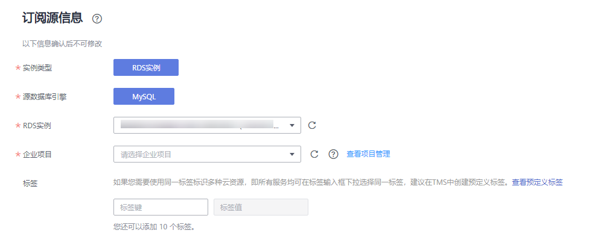
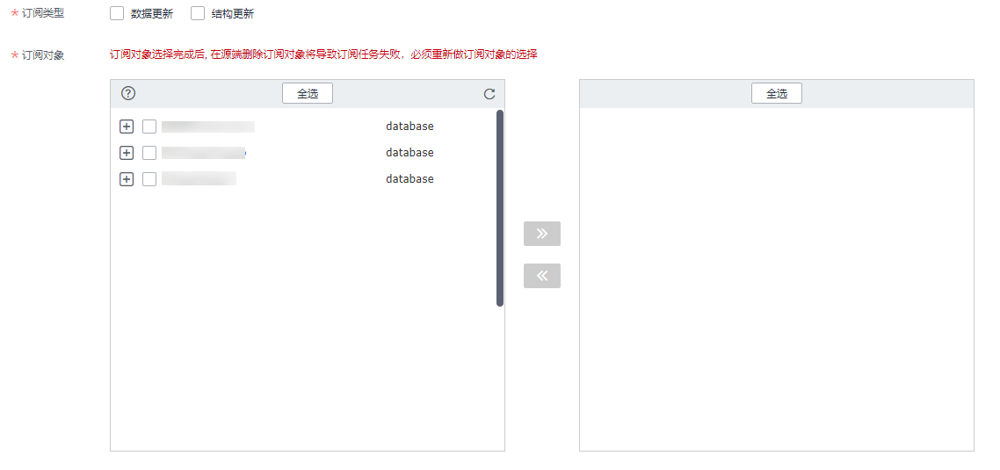

# 创建数据订阅任务

数据订阅功能通过创建订阅任务来获取数据库中关键业务的数据变化信息，这类信息常常是下游业务所需要的。数据订阅将其缓存并提供统一的SDK接口，实现下游业务订阅、获取、并消费。

-   一个订阅任务同时只能被一个下游SDK订阅消费，如果用户有多个下游需要订阅同一个RDS实例时，需要创建多个订阅通道。这些订阅任务订阅的RDS实例均为同一个实例ID。
-   一个下游SDK不可以订阅消费多个订阅任务。

一个完整的数据订阅过程需要通过如下两个阶段来实现：

1.  使用数据复制服务控制台创建数据订阅任务。
2.  数据订阅任务成功后，使用数据复制服务提供的SDK接口，访问数据订阅通道，订阅并消费增量数据。

本小节主要介绍通过数据复制服务控制台，创建数据订阅任务的具体操作。

## 前提条件

-   已登录数据复制服务控制台。
-   账户余额大于等于0元。
-   满足数据订阅的限制条件，详情请参见[使用须知](使用须知（数据订阅）.md)。

## 操作步骤

以下操作以MySQL为示例，详细介绍数据订阅任务的配置流程，其他存储引擎的配置流程类似。

1.  在“数据订阅管理”页面，单击“创建订阅任务”。
2.  在“选择订阅源”页面，填选区域、任务名称、任务异常通知设置、SMN主题、描述、订阅源信息，单击“下一步”。

    **图 1**  订阅任务信息  
    

    **表 1**  任务和描述

    
    <table><thead align="left"><tr id="row55731924204420"><th class="cellrowborder" valign="top" width="18.42%" id="mcps1.2.3.1.1">
<strong id="b1611223511352">参数</strong>

    </th>
    <th class="cellrowborder" valign="top" width="81.58%" id="mcps1.2.3.1.2">
<strong id="b3002268111352">描述</strong>

    </th>
    </tr>
    </thead>
    <tbody><tr id="row5906212142718"><td class="cellrowborder" valign="top" width="18.42%" headers="mcps1.2.3.1.1 ">
区域

    </td>
    <td class="cellrowborder" valign="top" width="81.58%" headers="mcps1.2.3.1.2 ">
当前所在区域，可进行切换。

    </td>
    </tr>
    <tr id="row807311204420"><td class="cellrowborder" valign="top" width="18.42%" headers="mcps1.2.3.1.1 ">
任务名称

    </td>
    <td class="cellrowborder" valign="top" width="81.58%" headers="mcps1.2.3.1.2 ">
任务名称在4-50位之间，必须以字母开头，不区分大小写，可以包含字母、数字、中划线或下划线，不能包含其他的特殊字符。

    </td>
    </tr>
    <tr id="row1080215433911"><td class="cellrowborder" valign="top" width="18.42%" headers="mcps1.2.3.1.1 ">
描述

    </td>
    <td class="cellrowborder" valign="top" width="81.58%" headers="mcps1.2.3.1.2 ">
描述不能超过256位，且不能包含! = &lt; &gt; &amp; ' " \ 特殊字符。

    </td>
    </tr>
    <tr id="row274373416471"><td class="cellrowborder" valign="top" width="18.42%" headers="mcps1.2.3.1.1 ">
任务异常通知设置

    </td>
    <td class="cellrowborder" valign="top" width="81.58%" headers="mcps1.2.3.1.2 ">
该项为可选参数，开启之后，选择对应的SMN主题。当订阅任务状态异常时，系统将发送通知。

    </td>
    </tr>
    <tr id="row23664659204420"><td class="cellrowborder" valign="top" width="18.42%" headers="mcps1.2.3.1.1 ">
SMN主题

    </td>
    <td class="cellrowborder" valign="top" width="81.58%" headers="mcps1.2.3.1.2 ">
“任务异常通知设置”项开启后可见，需提前在SMN上申请主题并添加订阅。

    
SMN主题申请和订阅可参考<a href="https://support.huaweicloud.com/qs-smn/smn_ug_0004.html" target="_blank" rel="noopener noreferrer">《消息通知服务用户指南》</a>。

    </td>
    </tr>
    </tbody>
    </table>

    **图 2**  订阅源信息  
    

    **表 2**  订阅源信息

    
    <table><thead align="left"><tr id="row39932329204436"><th class="cellrowborder" valign="top" width="23.87%" id="mcps1.2.3.1.1">
<strong id="b2587841611355">参数</strong>

    </th>
    <th class="cellrowborder" valign="top" width="76.13%" id="mcps1.2.3.1.2">
<strong id="b1577696211355">描述</strong>

    </th>
    </tr>
    </thead>
    <tbody><tr id="row05147381129"><td class="cellrowborder" valign="top" width="23.87%" headers="mcps1.2.3.1.1 ">
实例类型

    </td>
    <td class="cellrowborder" valign="top" width="76.13%" headers="mcps1.2.3.1.2 ">
选择RDS实例。

    </td>
    </tr>
    <tr id="row0414184610580"><td class="cellrowborder" valign="top" width="23.87%" headers="mcps1.2.3.1.1 ">
源数据库引擎

    </td>
    <td class="cellrowborder" valign="top" width="76.13%" headers="mcps1.2.3.1.2 ">
选择MySQL。

    </td>
    </tr>
    <tr id="row658644204515"><td class="cellrowborder" valign="top" width="23.87%" headers="mcps1.2.3.1.1 ">
RDS实例

    </td>
    <td class="cellrowborder" valign="top" width="76.13%" headers="mcps1.2.3.1.2 ">
用户所创建的关系型数据库实例。

    </td>
    </tr>
    <tr id="row6933245163015"><td class="cellrowborder" valign="top" width="23.87%" headers="mcps1.2.3.1.1 ">
企业项目

    </td>
    <td class="cellrowborder" valign="top" width="76.13%" headers="mcps1.2.3.1.2 ">
对于已成功关联企业项目的用户，仅需在“企业项目”下拉框中选择目标项目。

    
如果需要自定义企业项目，请前往项目管理服务进行创建。关于如何创建项目，详见《项目管理用户指南》。

    </td>
    </tr>
    <tr id="row1236991811169"><td class="cellrowborder" valign="top" width="23.87%" headers="mcps1.2.3.1.1 ">
标签

    </td>
    <td class="cellrowborder" valign="top" width="76.13%" headers="mcps1.2.3.1.2 ">
可选配置，对订阅任务的标识。使用标签可方便管理您的数据订阅任务。每个任务最多支持10个标签配额。

    
任务创建成功后，您可以单击实例名称，在“标签”页签下查看对应标签。关于标签的详细操作，请参见<a href="https://support.huaweicloud.com/usermanual-drs/drs_subscription_tag.html" target="_blank" rel="noopener noreferrer">标签管理</a>。

    </td>
    </tr>
    </tbody>
    </table>

3.  在“选择订阅对象“页面，等待实例创建成功后，选择数据订阅的对象，单击“下一步“。

    **图 3**  设置订阅对象  
    

    **表 3**  订阅对象

    
    <table><thead align="left"><tr id="row165921632141911"><th class="cellrowborder" valign="top" width="16%" id="mcps1.2.3.1.1">
<strong id="b1783318515228">参数</strong>

    </th>
    <th class="cellrowborder" valign="top" width="84%" id="mcps1.2.3.1.2">
<strong id="b10555114922418">描述</strong>

    </th>
    </tr>
    </thead>
    <tbody><tr id="row898862345116"><td class="cellrowborder" valign="top" width="16%" headers="mcps1.2.3.1.1 ">
订阅类型

    </td>
    <td class="cellrowborder" valign="top" width="84%" headers="mcps1.2.3.1.2 ">
订阅类型分为数据更新和结构更新。

    <ul id="ul1018923515119"><li>数据更新：
订阅已选择数据的增量数据更新。

    </li><li>结构更新：
订阅整个实例所有对象的结构创建、删除及修改，您需要使用SDK过滤所需的数据。

    </li></ul>
    </td>
    </tr>
    <tr id="row559273214193"><td class="cellrowborder" valign="top" width="16%" headers="mcps1.2.3.1.1 ">
订阅对象

    </td>
    <td class="cellrowborder" valign="top" width="84%" headers="mcps1.2.3.1.2 ">
数据订阅的订阅对象目前支持表级订阅。您可以根据业务场景选择所需的表。

    
如果有切换订阅源的操作，请在选择订阅对象前单击右上角的，以确保待选择的对象为最新的订阅对象。

    
选择订阅对象的时候支持搜索，以便您快速选择需要的对象。

    </td>
    </tr>
    </tbody>
    </table>

4.  在“任务确认“页面，确认订阅任务信息无误后，勾选协议，单击“启动任务“，提交订阅任务。
5.  订阅任务提交后，您可在“数据订阅管理“页面，查看并管理自己的任务。

    -   您可查看任务提交后的状态，状态请参见[参考：任务状态含义](任务状态(数据订阅).md)。
    -   在任务列表的右上角，单击刷新列表，可查看到最新的任务状态。

    > **说明：** 
    >当订阅任务创建完成后，需要使用SDK实时订阅订阅任务中的增量数据。具体的操作及注意事项请参考[SDK使用说明](https://support.huaweicloud.com/usermanual-drs/drs_15_0006.html)。

