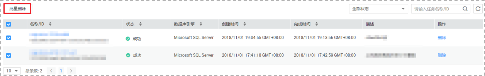

# 删除迁移任务

对于备份迁移任务，您可选择删除迁移任务。被删除后的任务将不会再出现在任务列表中，请谨慎操作。

## 前提条件

已登录数据复制服务控制台。

## 方法一

1.  在“备份迁移管理”页面的迁移列表中，选择需要删除的任务，单击操作列的“删除“按钮。
2.  单击“确定“，提交删除任务。

## 方法二

1.  在“备份迁移管理”页面的迁移列表中，选择需要删除的任务，单击“批量删除”按钮。

    **图 1**  删除备份迁移任务  
    

    > **说明：**   
    >-   批量删除支持选择一个或者多个需要删除的任务。  
    >-   如果批量选择的迁移任务中，存在无法删除的任务，则无法进行批量删除操作。  

2.  单击“确定“，提交删除任务。

