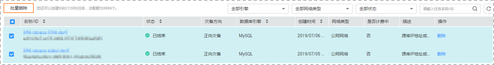

# 删除灾备任务

您可选择删除灾备任务。被删除后的任务将不会再出现在任务列表中，请谨慎操作。

## 前提条件

已登录数据复制服务控制台。

## 方法一

1.  在“多活灾备管理”页面的任务列表中，选择要删除的任务，单击“操作“列的“删除“。
2.  单击“确定“，提交删除任务。

## 方法二

1.  在“多活灾备管理”页面，选择需要删除的任务，单击“批量删除”按钮。

    **图 1**  删除灾备任务  
    

2.  单击“确定“，提交删除任务。

