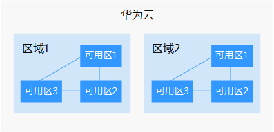

# 区域和可用区

## 什么是区域、可用区？

我们用区域和可用区来描述数据中心的位置，您可以在特定的区域、可用区创建资源。

-   区域（Region）：从地理位置和网络时延维度划分，同一个Region内共享弹性计算、块存储、对象存储、VPC网络、弹性公网IP、镜像等公共服务。Region分为通用Region和专属Region，通用Region指面向公共租户提供通用云服务的Region；专属Region指只承载同一类业务或只面向特定租户提供业务服务的专用Region。
-   可用区（AZ，Availability Zone）：一个AZ是一个或多个物理数据中心的集合，有独立的风火水电，AZ内逻辑上再将计算、网络、存储等资源划分成多个集群。一个Region中的多个AZ间通过高速光纤相连，以满足用户跨AZ构建高可用性系统的需求。

[图1](#zh-cn_topic_0185654533_zh-cn_topic_0185177741_zh-cn_topic_0184026189_fig1712318716129)阐明了区域和可用区之间的关系。

**图 1**  区域和可用区  

目前，华为云已在全球多个地域开放云服务，您可以根据需求选择适合自己的区域和可用区。更多信息请参见[华为云全球站点](https://www.huaweicloud.com/global/)。

## 如何选择区域？

选择区域时，您需要考虑以下几个因素：

-   地理位置

    一般情况下，建议就近选择靠近您或者您的目标用户的区域，这样可以减少网络时延，提高访问速度。不过，在基础设施、BGP网络品质、资源的操作与配置等方面，中国大陆各个区域间区别不大，如果您或者您的目标用户在中国大陆，可以不用考虑不同区域造成的网络时延问题。

    -   在除中国大陆以外的亚太地区有业务的用户，可以选择“亚太-曼谷”或“亚太-新加坡”区域。
    -   在非洲地区有业务的用户，可以选择“南非-约翰内斯堡”区域。
    -   在欧洲地区有业务的用户，可以选择“欧洲-巴黎”区域。
    -   在拉丁美洲地区有业务的用户，可以选择“拉美-圣地亚哥”区域。

        > **说明：** 
        >“拉美-圣地亚哥”区域位于智利。

-   资源的价格

    不同区域的资源价格可能有差异，请参见[华为云服务价格详情](https://www.huaweicloud.com/pricing.html?tab=detail#/dds)。

## 如何选择可用区？

是否将资源放在同一可用区内，主要取决于您对容灾能力和网络时延的要求。

-   如果您的应用需要较高的容灾能力，建议您将资源部署在同一区域的不同可用区内。
-   如果您的应用要求实例之间的网络延时较低，则建议您将资源创建在同一可用区内。

## 区域和终端节点

当您通过API使用资源时，您必须指定其区域终端节点。有关华为云的区域和终端节点的更多信息，请参阅[地区和终端节点](https://developer.huaweicloud.com/endpoint)。

