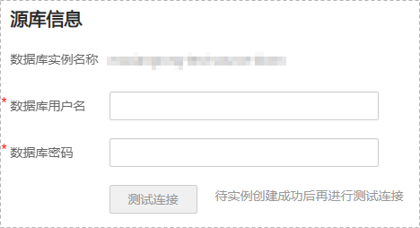

# 华为云DDS实例迁移至用户端MongoDB数据库

数据复制服务提供出云的功能，可以将本云上的数据库迁移至用户端数据库，方便进行数据回流处理。

本章节将以公网网络方式为示例，介绍DDS实例迁移至用户端MongoDB数据库的任务配置流程，其他网络方式的配置流程类似。

## 前提条件

-   已登录数据复制服务控制台。
-   账户余额大于等于0元。
-   参见[实时迁移](https://support.huaweicloud.com/productdesc-drs/drs_01_0301.html)。
-   参见[使用须知](https://support.huaweicloud.com/qs-drs/drs_online_migration.html)。

## 操作步骤

1.  在“实时迁移管理“页面，单击“创建迁移任务“，进入创建迁移任务页面。
2.  在“迁移实例”页面，填选区域、任务名称、任务异常通知设置、SMN主题、时延阈值、任务异常自动结束时间、描述、迁移实例信息，单击“下一步”。

    **图 1**  迁移任务信息  
    

    **表 1**  任务和描述

    
    <table><thead align="left"><tr id="drs_02_0021_drs_02_0002_row55731924204420"><th class="cellrowborder" valign="top" width="18.42%" id="mcps1.2.3.1.1">
<strong id="drs_02_0021_drs_02_0002_b1611223511352">参数</strong>

    </th>
    <th class="cellrowborder" valign="top" width="81.58%" id="mcps1.2.3.1.2">
<strong id="drs_02_0021_drs_02_0002_b3002268111352">描述</strong>

    </th>
    </tr>
    </thead>
    <tbody><tr id="drs_02_0021_drs_02_0002_row12620182813359"><td class="cellrowborder" valign="top" width="18.42%" headers="mcps1.2.3.1.1 ">
区域

    </td>
    <td class="cellrowborder" valign="top" width="81.58%" headers="mcps1.2.3.1.2 ">
当前所在区域，可进行切换。

    </td>
    </tr>
    <tr id="drs_02_0021_drs_02_0002_row807311204420"><td class="cellrowborder" valign="top" width="18.42%" headers="mcps1.2.3.1.1 ">
任务名称

    </td>
    <td class="cellrowborder" valign="top" width="81.58%" headers="mcps1.2.3.1.2 ">
任务名称在4-50位之间，必须以字母开头，不区分大小写，可以包含字母、数字、中划线或下划线，不能包含其他的特殊字符。

    </td>
    </tr>
    <tr id="drs_02_0021_drs_02_0002_row36111933161119"><td class="cellrowborder" valign="top" width="18.42%" headers="mcps1.2.3.1.1 ">
描述

    </td>
    <td class="cellrowborder" valign="top" width="81.58%" headers="mcps1.2.3.1.2 ">
描述不能超过256位，且不能包含! = &lt; &gt; &amp; ' " \ 特殊字符。

    </td>
    </tr>
    <tr id="drs_02_0021_drs_02_0002_row1080215433911"><td class="cellrowborder" valign="top" width="18.42%" headers="mcps1.2.3.1.1 ">
任务异常通知设置

    </td>
    <td class="cellrowborder" valign="top" width="81.58%" headers="mcps1.2.3.1.2 ">
该项为可选参数，开启之后，选择对应的SMN主题。当迁移任务状态异常时，系统将发送通知。

    </td>
    </tr>
    <tr id="drs_02_0021_drs_02_0002_row1360111041213"><td class="cellrowborder" valign="top" width="18.42%" headers="mcps1.2.3.1.1 ">
SMN主题

    </td>
    <td class="cellrowborder" valign="top" width="81.58%" headers="mcps1.2.3.1.2 ">
“任务异常通知设置”项开启后可见，需提前在SMN上申请主题并添加订阅。

    
SMN主题申请和订阅可参考<a href="https://support.huaweicloud.com/qs-smn/smn_ug_0004.html" target="_blank" rel="noopener noreferrer">《消息通知服务用户指南》</a>。

    </td>
    </tr>
    <tr id="drs_02_0021_drs_02_0002_row157731032102814"><td class="cellrowborder" valign="top" width="18.42%" headers="mcps1.2.3.1.1 ">
时延阈值

    </td>
    <td class="cellrowborder" valign="top" width="81.58%" headers="mcps1.2.3.1.2 ">
在增量迁移阶段，源数据库和目标数据库之间的实时同步有时会存在一个时间差，称为时延，单位为秒。

    
时延阈值设置是指时延超过一定的值后（时延阈值范围为1—3600s），DRS可以发送告警通知给指定收件人。告警通知将在时延稳定超过设定的阈值6min后发送，避免出现由于时延波动反复发送告警通知的情况。

    
 说明： 
<ul id="drs_02_0021_drs_02_0002_ul167113217818"><li>首次进入增量迁移阶段，会有较多数据等待同步，存在较大的时延，属于正常情况，不在此功能的监控范围之内。</li><li>设置时延阈值之前，需要设置任务异常通知。</li></ul>
    

    </td>
    </tr>
    <tr id="drs_02_0021_drs_02_0002_row188817390433"><td class="cellrowborder" valign="top" width="18.42%" headers="mcps1.2.3.1.1 ">
任务异常自动结束时间（天）

    </td>
    <td class="cellrowborder" valign="top" width="81.58%" headers="mcps1.2.3.1.2 ">
设置任务异常自动结束天数，输入值必须在14-100之间。

    
 说明： 

异常状态下的任务仍然会计费，而长时间异常的任务无法续传和恢复。设置任务异常自动结束天数后，异常且超时的任务将会自动结束，以免产生不必要的费用。

    

    </td>
    </tr>
    </tbody>
    </table>

    **图 2**  DDS到MongoDB迁移实例信息  
    

    **表 2**  迁移实例信息

    
    <table><thead align="left"><tr id="row39932329204436"><th class="cellrowborder" valign="top" width="23.87%" id="mcps1.2.3.1.1">
<strong id="b2587841611355">参数</strong>

    </th>
    <th class="cellrowborder" valign="top" width="76.13%" id="mcps1.2.3.1.2">
<strong id="b1577696211355">描述</strong>

    </th>
    </tr>
    </thead>
    <tbody><tr id="row145601338145018"><td class="cellrowborder" valign="top" width="23.87%" headers="mcps1.2.3.1.1 ">
数据流动方向

    </td>
    <td class="cellrowborder" valign="top" width="76.13%" headers="mcps1.2.3.1.2 ">
选择出云。

    
出云指源端数据库为本云RDS或者DDS的场景，数据复制服务要求源数据库或者目标数据库中至少有一方为本云RDS或者DDS。

    </td>
    </tr>
    <tr id="row0414184610580"><td class="cellrowborder" valign="top" width="23.87%" headers="mcps1.2.3.1.1 ">
源数据库引擎

    </td>
    <td class="cellrowborder" valign="top" width="76.13%" headers="mcps1.2.3.1.2 ">
选择DDS。

    </td>
    </tr>
    <tr id="row42411630204436"><td class="cellrowborder" valign="top" width="23.87%" headers="mcps1.2.3.1.1 ">
目标数据库引擎

    </td>
    <td class="cellrowborder" valign="top" width="76.13%" headers="mcps1.2.3.1.2 ">
选择MongoDB。

    </td>
    </tr>
    <tr id="row62907306204436"><td class="cellrowborder" valign="top" width="23.87%" headers="mcps1.2.3.1.1 ">
网络类型

    </td>
    <td class="cellrowborder" valign="top" width="76.13%" headers="mcps1.2.3.1.2 ">
目前支持公网网络、VPC网络和VPN、专线网络类型，您可以根据具体的业务场景进行设置，此处场景以公网网络为示例。

    <ul id="ul19818056621"><li>VPC网络：适合云上数据库之间的迁移。</li><li>VPN、专线网络：适合通过VPN、专线网络，实现其他云下自建数据库与云上数据库迁移、或云上跨Region的数据库之间的迁移。</li><li>公网网络：适合将其他云下或其他平台的数据库迁移到目标数据库。</li></ul>
    </td>
    </tr>
    <tr id="row658644204515"><td class="cellrowborder" valign="top" width="23.87%" headers="mcps1.2.3.1.1 ">
源数据库实例

    </td>
    <td class="cellrowborder" valign="top" width="76.13%" headers="mcps1.2.3.1.2 ">
用户需要迁移的DDS实例。

    </td>
    </tr>
    <tr id="row7333255960"><td class="cellrowborder" valign="top" width="23.87%" headers="mcps1.2.3.1.1 ">
迁移实例所在子网

    </td>
    <td class="cellrowborder" valign="top" width="76.13%" headers="mcps1.2.3.1.2 ">
选择迁移实例所在的子网。也可以单击“查看子网”，跳转至“网络控制台”查看实例所在子网帮助选择。

    
默认值为当前所选数据库实例所在子网，请选择有可用IP地址的子网。为确保迁移实例创建成功，仅显示已经开启DHCP的子网。

    </td>
    </tr>
    <tr id="row18478341367"><td class="cellrowborder" valign="top" width="23.87%" headers="mcps1.2.3.1.1 ">
迁移模式

    </td>
    <td class="cellrowborder" valign="top" width="76.13%" headers="mcps1.2.3.1.2 "><ul id="ul171919713019"><li>全量：该模式为数据库一次性迁移，适用于可中断业务的数据库迁移场景，全量迁移将非系统数据库的全部数据库对象和数据一次性迁移至目标端数据库，包括：集合、索引等。
 说明： 

如果用户只进行全量迁移时，建议停止对源数据库的操作，否则迁移过程中源数据库产生的新数据不会同步到目标数据库。

    

    </li><li>全量+增量：该模式为数据库持续性迁移，适用于对业务中断敏感的场景，通过全量迁移过程中完成的目标端数据库的初始化后，增量迁移阶段通过解析日志等技术，将源端和目标端数据库保持数据持续一致。</li></ul>
    
 说明： 

选择“全量+增量”迁移模式，增量迁移可以在全量迁移完成的基础上实现数据的持续同步，无需中断业务，实现迁移过程中源业务和数据库继续对外提供访问。

    

    </td>
    </tr>
    <tr id="row162758382516"><td class="cellrowborder" valign="top" width="23.87%" headers="mcps1.2.3.1.1 ">
企业项目

    </td>
    <td class="cellrowborder" valign="top" width="76.13%" headers="mcps1.2.3.1.2 ">
对于已成功关联企业项目的用户，仅需在“企业项目”下拉框中选择目标项目。

    
如果需要自定义企业项目，请前往项目管理服务进行创建。关于如何创建项目，详见《项目管理用户指南》。

    </td>
    </tr>
    <tr id="row181511244352"><td class="cellrowborder" valign="top" width="23.87%" headers="mcps1.2.3.1.1 ">
标签

    </td>
    <td class="cellrowborder" valign="top" width="76.13%" headers="mcps1.2.3.1.2 ">
可选配置，对迁移任务的标识。使用标签可方便管理您的迁移任务。每个任务最多支持10个标签配额。

    
任务创建成功后，您可以单击实例名称，在“标签”页签下查看对应标签。关于标签的详细操作，请参见<a href="https://support.huaweicloud.com/usermanual-drs/drs_online_tag.html" target="_blank" rel="noopener noreferrer">标签管理</a>。

    </td>
    </tr>
    </tbody>
    </table>

3.  在“源库及目标库”页面，迁移实例创建成功后，填选源库信息和目标库信息，建议您单击“源库和目标库“处的“测试连接“，分别测试并确定与源库和目标库连通后，勾选协议，单击“下一步“。

    **图 3**  DDS源库信息  
    

    **表 3**  源库信息

    
    <table><thead align="left"><tr id="row108525962110"><th class="cellrowborder" valign="top" width="23%" id="mcps1.2.3.1.1">
<strong id="b17101859162112">参数</strong>

    </th>
    <th class="cellrowborder" valign="top" width="77%" id="mcps1.2.3.1.2">
<strong id="b6101059192111">描述</strong>

    </th>
    </tr>
    </thead>
    <tbody><tr id="row910120596211"><td class="cellrowborder" valign="top" width="23%" headers="mcps1.2.3.1.1 ">
数据库实例名称

    </td>
    <td class="cellrowborder" valign="top" width="77%" headers="mcps1.2.3.1.2 ">
默认为创建迁移任务时选择的数据库实例，不可进行修改。

    </td>
    </tr>
    <tr id="row1510175917215"><td class="cellrowborder" valign="top" width="23%" headers="mcps1.2.3.1.1 ">
数据库用户名

    </td>
    <td class="cellrowborder" valign="top" width="77%" headers="mcps1.2.3.1.2 ">
源数据库对应的数据库用户名。

    </td>
    </tr>
    <tr id="row91161059182112"><td class="cellrowborder" valign="top" width="23%" headers="mcps1.2.3.1.1 ">
数据库密码

    </td>
    <td class="cellrowborder" valign="top" width="77%" headers="mcps1.2.3.1.2 ">
源数据库对应的数据库用户名密码。

    </td>
    </tr>
    </tbody>
    </table>

    > **说明：** 
    >**源数据库的用户名和密码将在迁移过程中被加密暂存到数据库和迁移实例主机上，待该任务删除后会永久清除。**

    **图 4**  MongoDB目标库信息  
    

    **表 4**  目标库信息

    
    <table><thead align="left"><tr id="row4819321621"><th class="cellrowborder" valign="top" width="23.29%" id="mcps1.2.3.1.1">
<strong id="b14819102625">参数</strong>

    </th>
    <th class="cellrowborder" valign="top" width="76.71%" id="mcps1.2.3.1.2">
<strong id="b178191721220">描述</strong>

    </th>
    </tr>
    </thead>
    <tbody><tr id="row14819120214"><td class="cellrowborder" valign="top" width="23.29%" headers="mcps1.2.3.1.1 ">
IP地址或域名

    </td>
    <td class="cellrowborder" valign="top" width="76.71%" headers="mcps1.2.3.1.2 ">
源数据库的IP地址或域名，格式为IP地址/域名:端口。其中源数据库服务端口，可输入范围为1~65534间的整数。

    
该输入框最多支持填写3组源数据库的IP地址或者域名信息，多个值需要使用英文逗号隔开。例如：192.168.0.1:8080,192.168.0.2:8080。同时需要确保所填写的多个IP地址或域名属于同一个实例。

    
 说明： 

此处若填写的是多组IP地址或者域名信息，在进行测试连接的过程中，只要存在一组IP地址或者域名可以连通，那么测试连接就提示成功。所以需要您保证填写的IP地址或域名的正确性。

    

    </td>
    </tr>
    <tr id="row933216286156"><td class="cellrowborder" valign="top" width="23.29%" headers="mcps1.2.3.1.1 ">
账号认证数据库

    </td>
    <td class="cellrowborder" valign="top" width="76.71%" headers="mcps1.2.3.1.2 ">
填写的数据库账号所属的数据库名称。例如：华为云DDS实例默认的账号认证数据库为admin。

    </td>
    </tr>
    <tr id="row08191623215"><td class="cellrowborder" valign="top" width="23.29%" headers="mcps1.2.3.1.1 ">
数据库用户名

    </td>
    <td class="cellrowborder" valign="top" width="76.71%" headers="mcps1.2.3.1.2 ">
目标数据库的用户名。

    </td>
    </tr>
    <tr id="row98197216211"><td class="cellrowborder" valign="top" width="23.29%" headers="mcps1.2.3.1.1 ">
数据库密码

    </td>
    <td class="cellrowborder" valign="top" width="76.71%" headers="mcps1.2.3.1.2 ">
目标数据库的用户名所对应的密码。

    </td>
    </tr>
    <tr id="row19827128212"><td class="cellrowborder" valign="top" width="23.29%" headers="mcps1.2.3.1.1 ">
SSL安全连接

    </td>
    <td class="cellrowborder" valign="top" width="76.71%" headers="mcps1.2.3.1.2 ">
通过该功能，用户可以选择是否开启对迁移链路的加密。如果开启该功能，需要用户上传SSL CA根证书。

    
 说明： 
<ul id="ul7406173631314"><li>最大支持上传500KB的证书文件。</li><li>如果不使用SSL证书，请自行承担数据安全风险。</li></ul>
    

    </td>
    </tr>
    </tbody>
    </table>

    > **说明：** 
    >**目标数据库的IP地址或域名、数据库用户名和密码，会被系统加密暂存，直至删除该迁移任务后自动清除。**

4.  在“迁移设置“页面，设置迁移对象，单击“下一步“。

    **图 5**  DDS到MongoDB设置迁移对象  
    

    **表 5**  迁移对象

    
    <table><thead align="left"><tr id="zh-cn_topic_0177374171_zh-cn_topic_0078078071_row165921632141911"><th class="cellrowborder" valign="top" width="16.43%" id="mcps1.2.3.1.1">
<strong id="zh-cn_topic_0177374171_zh-cn_topic_0078078071_b1783318515228">参数</strong>

    </th>
    <th class="cellrowborder" valign="top" width="83.57%" id="mcps1.2.3.1.2">
<strong id="zh-cn_topic_0177374171_zh-cn_topic_0078078071_b10555114922418">描述</strong>

    </th>
    </tr>
    </thead>
    <tbody><tr id="row1238012553335"><td class="cellrowborder" valign="top" width="16.43%" headers="mcps1.2.3.1.1 ">
其他迁移选项

    </td>
    <td class="cellrowborder" valign="top" width="83.57%" headers="mcps1.2.3.1.2 ">
根据业务需求，选择全量迁移是否迁移用户自行创建的索引，基于_id的默认索引目标端会自动创建。如果不迁移索引，索引不参与对比。

    </td>
    </tr>
    <tr id="zh-cn_topic_0177374171_zh-cn_topic_0078078071_row559273214193"><td class="cellrowborder" valign="top" width="16.43%" headers="mcps1.2.3.1.1 ">
迁移对象

    </td>
    <td class="cellrowborder" valign="top" width="83.57%" headers="mcps1.2.3.1.2 ">
您可以根据业务需求，选择全部对象迁移、表级迁移或者库级迁移。

    <ul id="zh-cn_topic_0078078071_ul78601316141810"><li>全部迁移：将源数据库中的所有对象全部迁移至目标数据库，对象迁移到目标数据库实例后，对象名将会保持与源数据库实例对象名一致且无法修改。</li><li>表级迁移：将选择的表级对象迁移至目标数据库。</li><li>库级迁移：将选择的库级对象迁移至目标数据库。</li></ul>
    
如果有切换源数据库的操作或源库迁移对象变化的情况，请务必在选择迁移对象前单击右上角的，以确保待选择的对象为最新源数据库对象。

    
 说明： 
<ul id="ul19601624657"><li>选择对象的时候，对象名称的前后空格不显示，中间如有多个空格只显示一个空格。</li><li>选择对象的时候支持搜索，以便您快速选择需要的数据库对象。</li></ul>
    

    </td>
    </tr>
    </tbody>
    </table>

5.  在“预检查“页面，进行迁移任务预校验，校验是否可进行迁移。
    -   查看检查结果，如有不通过的检查项，需要修复不通过项后，单击“重新校验”按钮重新进行迁移任务预校验。

        预检查不通过项处理建议请参见《数据复制服务用户指南》中的“[预检查不通过项修复方法](https://support.huaweicloud.com/usermanual-drs/drs_precheck.html)”。

        **图 6**  DDS到MongoDB预检查  
        

    -   预检查完成后，且预检查通过率为100%时，单击“下一步”。

        > **说明：** 
        >所有检查项结果均成功通过时，若存在告警请确认项，需要阅读并确认告警详情后才可以继续执行下一步操作。

6.  在“任务确认“页面，选择迁移任务的启动时间，并确认迁移任务信息无误后，单击“启动任务“，提交迁移任务。

    > **说明：** 
    >-   迁移任务的启动时间可以根据业务需求，设置为“立即启动”或“稍后启动”。
    >-   预计迁移任务启动后，会对源数据库和目标数据库的性能产生影响，建议选择业务低峰期，合理设置迁移任务的启动时间。

7.  迁移任务提交后，您可在“实时迁移管理“页面，查看并管理自己的任务。
    -   您可查看任务提交后的状态，状态请参见[任务状态](https://support.huaweicloud.com/qs-drs/drs_03_0001.html)。
    -   在任务列表的右上角，单击刷新列表，可查看到最新的任务状态。

