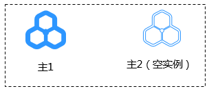
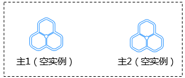
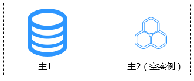
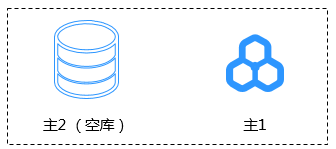

# 双主灾备的主1、主2如何选择

双主灾备要求灾备双方至少有一方为本云RDS实例，另一方可以为本云RDS实例、其他云数据库、ECS自建库或本地自建数据库。为了明确本云（本区）RDS在灾备中所扮演的角色，DRS使用主1、主2来区分角色。选择了本云RDS角色后，也意味着确定了另一方的角色。

-   主1：一般具有业务数据，创建任务时选择主1则表示本云RDS具有初始数据。
-   主2：必须为空数据库，创建任务时选择主2则表示本云RDS为空库，等待接收数据。

创建灾备任务时，选择主1、主2应遵循以下原则

-   灾备双方均为本云RDS实例。
    -   有一方为空实例，空实例作为主2，非空实例作为主1。

        

    -   双方均为空实例，主1、主2角色无差别，推荐选主2。

        

-   灾备双方一方为本云RDS实例，另一方为其他云数据库、ECS自建库或本地自建数据库。
    -   一方数据库存在初始数据，另一方为空库。
        -   本云RDS实例为空库，则选择主2。

            

        -   本云RDS实例有初始数据，另一方为空库，则选择主1。

            

    -   双方均为空库，主1、主2角色无差别，推荐选主2。

