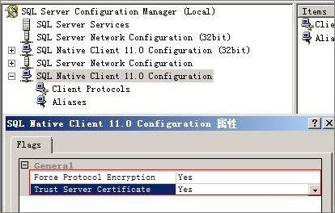

# Microsoft SQL Server数据库

介绍Microsoft SQL Server数据库在线迁移的使用限制。在正式使用数据复制服务之前，请先阅读以确保源数据库和目标数据库已经满足以下使用条件。

数据复制服务对于Microsoft SQL Server数据库的迁移有如下限制。

-   支持如下数据库的标准版和企业版：
    -   Microsoft SQL Server 2008
    -   Microsoft SQL Server 2012
    -   Microsoft SQL Server 2014

-   创建迁移实例后，必须确保源数据库能够连通迁移实例， 可通过Telnet进行测试。
-   若需要增量迁移，则源数据库不能包含没有主键的表。
-   目标数据库实例的运行状态必须正常。
-   在增量迁移阶段，为了保持数据一致性，不允许对正在迁移中的目标数据库进行修改操作\(包括但不限于DDL、DML操作\)。
-   数据库存在跨库引用数据库对象的视图、存储过程，函数等（例如A库的存储过程调用B库的表），此类数据库不支持在线迁移，需要在割接阶段，单独备份迁移至Microsoft SQL Server数据库。
-   迁移过程中，不允许添加、修改或删除源数据库所有用户的用户名、密码、权限和源数据库端口号。
-   提供的源数据库帐号必须拥有如下权限：sysadmin role。
-   源数据库的服务器名与计算机名必须一致。
-   若源数据库为关系型数据库实例时，不支持通过公网网络进行在线迁移。
-   仅支持从低版本迁移到高版本。
-   源数据库不能存在复制\(Replication\)关系，但允许源数据库存在数据库镜像（Mirror）关系。
-   源数据库需要迁移的数据库备份恢复模式必须为FULL。
-   源数据库在启动迁移后、结束任务前，不能对源数据库进行修改名称、修改字段名称，删除表操作。
-   源数据库迁移后新增的表、视图、存储过程和函数不会自动同步到目标数据库。
-   目标数据库实例必须有足够的磁盘空间。
-   备份的数据库仅支持如下的兼容模式：120，110，100。
-   不支持迁移源数据库中开启TDE\(Transparent Data Encryption\)加密的数据库。若不需要迁移TDE加密的库，请在对象选择中去掉；若需要迁移TDE加密的库，请先将TDE关闭。
-   提供的目标数据库帐号必须拥有processadmin role和setupadmin role权限，默认情况下，用户的帐号已经包含这些权限。
-   当前版本在迁移过程中，如下DDL操作将不会被迁移：
    -   创建新的表（CREATE TABLE）
    -   重命名表（SP\_RENAME table\_name）
    -   重命名列（SP\_RENAME column\_name）

-   当前版本暂不支持迁移如下数据库类型：
    -   表触发器（Table Triggers）
    -   同义词（Synonyms）
    -   计划指南（Plan Guide）
    -   自定义类型（User-Defined Types）
    -   程序集（Assemblies）

-   源数据库若开启客户端配置中的“强制协议加密（Force Protocol Encrypton）”，必须同时开启“信任服务器证书（trust server certificate）”，如下图所示：

    **图 1**  查看客户端属性  
    

-   源数据库在启动迁移后、结束任务前，不允许修改带有默认值的字段。

