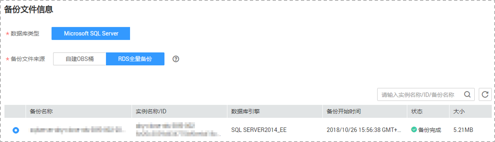
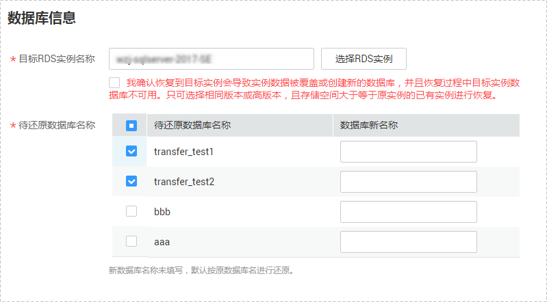

# 场景一：创建RDS全量备份迁移任务

介绍RDS全量备份场景下的备份迁移。您可以通过本云上Microsoft SQL Server数据库实例的全量备份，对已有的Microsoft SQL Server实例进行备份数据迁移。

本小节主要介绍通过数据复制服务管理控制台创建备份迁移任务的配置流程。

## 前提条件

-   已登录数据复制服务控制台。
-   账户余额大于等于0元。
-   满足备份移支持的数据库类型，参见[备份迁移](https://support.huaweicloud.com/productdesc-drs/drs_01_0303.html)。
-   满足备份迁移的限制条件，参见[使用须知](使用须知.md)。

## 操作步骤

1.  在“备份迁移管理”页面，单击“创建迁移任务”。
2.  在“选定备份”页面输入任务名称和描述，填选备份文件信息，单击“下一步”。

    **图 1**  任务信息  
    

    **表 1**  任务信息

    
    <table><thead align="left"><tr id="row106877396213"><th class="cellrowborder" valign="top" width="19%" id="mcps1.2.3.1.1">
<strong id="b4140457172110">参数</strong>

    </th>
    <th class="cellrowborder" valign="top" width="81%" id="mcps1.2.3.1.2">
<strong id="b1887395952116">描述</strong>

    </th>
    </tr>
    </thead>
    <tbody><tr id="row4687103922113"><td class="cellrowborder" valign="top" width="19%" headers="mcps1.2.3.1.1 ">
任务名称

    </td>
    <td class="cellrowborder" valign="top" width="81%" headers="mcps1.2.3.1.2 ">
任务名称在4-50位之间，必须以字母开头，不区分大小写，可以包含字母、数字、中划线或下划线，不能包含其他特殊字符。

    </td>
    </tr>
    <tr id="row1068718396218"><td class="cellrowborder" valign="top" width="19%" headers="mcps1.2.3.1.1 ">
描述

    </td>
    <td class="cellrowborder" valign="top" width="81%" headers="mcps1.2.3.1.2 ">
描述不能超过256位，且不能包含! = &lt; &gt; &amp; ' " \ 特殊字符。

    </td>
    </tr>
    </tbody>
    </table>

    **图 2**  备份文件信息  
    

    **表 2**  备份文件信息

    
    <table><thead align="left"><tr id="row194146391228"><th class="cellrowborder" valign="top" width="19%" id="mcps1.2.3.1.1">
<strong id="b1061616292310">参数</strong>

    </th>
    <th class="cellrowborder" valign="top" width="81%" id="mcps1.2.3.1.2">
<strong id="b1564813213237">描述</strong>

    </th>
    </tr>
    </thead>
    <tbody><tr id="row8414153942215"><td class="cellrowborder" valign="top" width="19%" headers="mcps1.2.3.1.1 ">
数据库类型

    </td>
    <td class="cellrowborder" valign="top" width="81%" headers="mcps1.2.3.1.2 ">
选择Microsoft SQL Server数据库引擎。

    </td>
    </tr>
    <tr id="row16414103913221"><td class="cellrowborder" valign="top" width="19%" headers="mcps1.2.3.1.1 ">
备份文件来源

    </td>
    <td class="cellrowborder" valign="top" width="81%" headers="mcps1.2.3.1.2 ">
选择RDS全量备份。

    
 说明： 

请选择状态为“备份完成”的RDS备份文件。

    

    </td>
    </tr>
    <tr id="row02331340195110"><td class="cellrowborder" valign="top" width="19%" headers="mcps1.2.3.1.1 ">
企业项目

    </td>
    <td class="cellrowborder" valign="top" width="81%" headers="mcps1.2.3.1.2 ">
对于已成功关联企业项目的用户，仅需在“企业项目”下拉框中选择目标项目。

    
如果需要自定义企业项目，请前往项目管理服务进行创建。关于如何创建项目，详见《项目管理用户指南》。

    </td>
    </tr>
    <tr id="row65443568514"><td class="cellrowborder" valign="top" width="19%" headers="mcps1.2.3.1.1 ">
标签

    </td>
    <td class="cellrowborder" valign="top" width="81%" headers="mcps1.2.3.1.2 ">
可选配置，对迁移任务的标识。使用标签可方便管理您的迁移任务。每个任务最多支持10个标签配额。

    
任务创建成功后，您可以单击实例名称，在“标签”页签下查看对应标签。关于标签的详细操作，请参见<a href="https://support.huaweicloud.com/usermanual-drs/drs_backup_tag.html" target="_blank" rel="noopener noreferrer">标签管理</a>。

    </td>
    </tr>
    </tbody>
    </table>

3.  在“选定目标”页面，填选数据库信息，单击“下一步”。

    **图 3**  数据库信息  
    

    **表 3**  数据库信息

    
    <table><thead align="left"><tr id="row4291105332513"><th class="cellrowborder" valign="top" width="20%" id="mcps1.2.3.1.1">
<strong id="b6150191242614">参数</strong>

    </th>
    <th class="cellrowborder" valign="top" width="80%" id="mcps1.2.3.1.2">
<strong id="b8150201218262">描述</strong>

    </th>
    </tr>
    </thead>
    <tbody><tr id="row92911853122519"><td class="cellrowborder" valign="top" width="20%" headers="mcps1.2.3.1.1 ">
目标RDS实例名称

    </td>
    <td class="cellrowborder" valign="top" width="80%" headers="mcps1.2.3.1.2 ">
选择目标RDS实例。若没有合适的目标数据库实例，请先创建目标数据库实例，具体操作及注意事项参见《关系型数据库快速入门》中“SQL Server快速入门”下的“<a href="https://support.huaweicloud.com/qs-rds/rds_04_0061.html" target="_blank" rel="noopener noreferrer">购买实例</a>”章节。

    </td>
    </tr>
    <tr id="row13291195322519"><td class="cellrowborder" valign="top" width="20%" headers="mcps1.2.3.1.1 ">
待还原数据库名称

    </td>
    <td class="cellrowborder" valign="top" width="80%" headers="mcps1.2.3.1.2 ">
选中目标RDS实例后，自动展示该实例的所有待还原数据库，可根据需要选择待还原的数据库，并且支持重命名。

    <ul id="ul1128414535510"><li>待还原数据库名称：待还原数据库的原名称。</li><li>数据库新名称：区分大小写，长度在1~64个字符之间，可以包含字母，数字、中划线和下划线，不能包含其他特殊字符。不设置，则使用原数据库名称备份恢复，设置后，使用新名称备份恢复。</li></ul>
    
 说明： 

待还原数据库支持重命名，最大配额为100个。

    

    </td>
    </tr>
    </tbody>
    </table>

4.  在“信息确认”页面核对配置详情后，勾选协议，单击“下一步”。

    > **说明：** 
    >SQL Server自身的工作原理是备份文件恢复到新的数据库后，非聚集索引表的索引信息将会失效需要立即重建。如果源数据库里存在大量非聚集索引表，备份迁移后请在目标库进行索引重建，以避免数据库未来使用中性能出现重大下降。同时备份文件里仅保存数据库级信息，在SQL Server实例中还有一些配置需要主动识别并手工完成迁移，如login，权限，DBlink，job等，如果源数据库包含这部分配置，请参考[《最佳实践》](https://support.huaweicloud.com/bestpractice-drs/drs_04_0008.html)进行迁移补充工作。

5.  在“备份迁移管理“页面任务列表中，观察对应的恢复任务的状态为“恢复中”，恢复成功后，任务状态显示“成功“。

