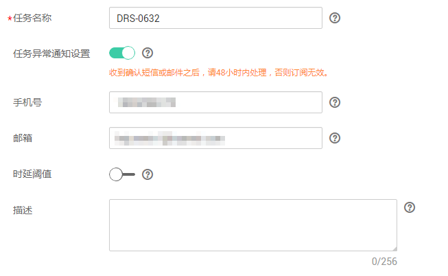
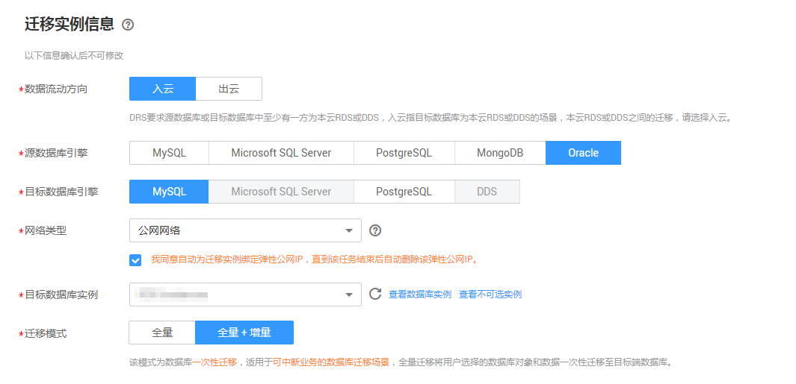
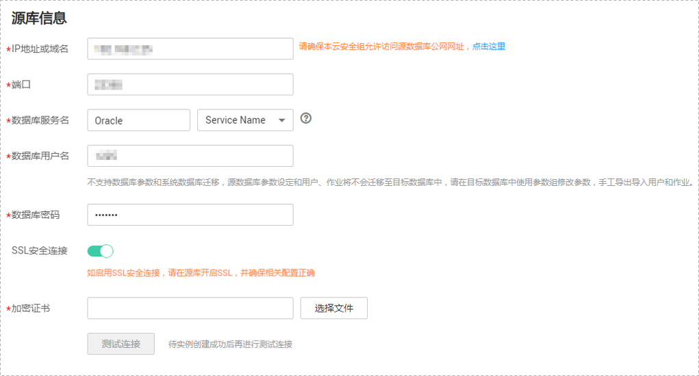
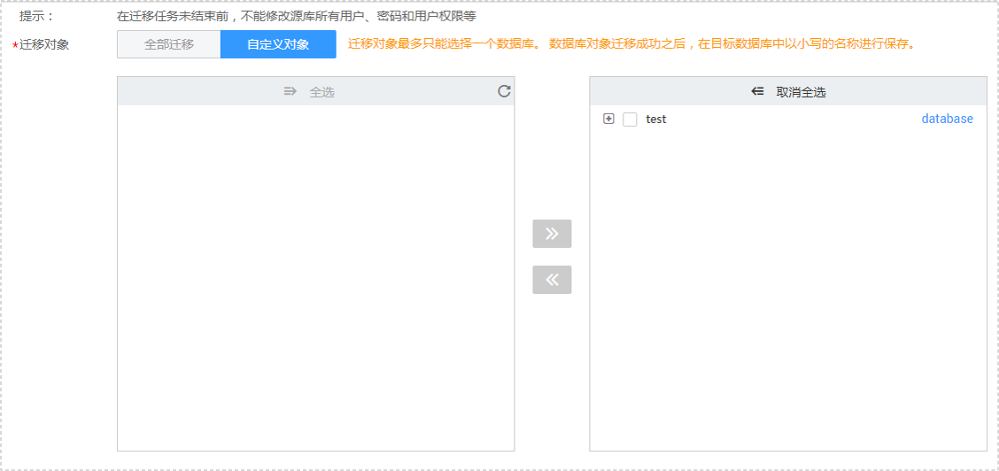
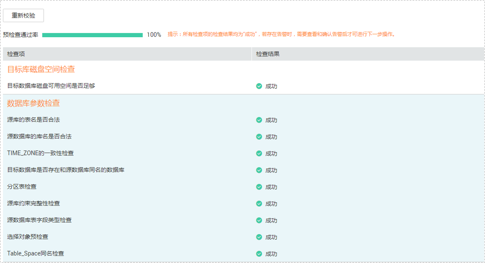

# 场景三：从本地Oracle数据库迁移到RDS for MySQL

数据复制服务支持本地自建的Oracle数据库迁移至本云RDS for MySQL实例。

本小节将介绍通过公网网络方式进行 Oracle数据库-\>RDS for MySQL实例的数据迁移任务配置流程，其他引擎的配置流程类似。

## 前提条件

-   已登录数据复制服务控制台。
-   账户余额大于等于0元。
-   参见[在线迁移](https://support.huaweicloud.com/productdesc-drs/drs_01_0301.html)。
-   参见[使用须知](https://support.huaweicloud.com/qs-drs/drs_online_migration.html)。
-   参见[数据类型映射关系](https://support.huaweicloud.com/usermanual-drs/drs_08_0002.html)。

## 迁移步骤

1.  在“在线迁移管理“页面，单击“创建迁移任务“，进入创建迁移任务页面。
2.  在“迁移实例”页面，填选任务名称、通知收件人信息、描述、迁移实例信息，单击“下一步”。

    **图 1**  迁移任务信息  
    

    **表 1**  任务和描述

    
    <table><thead align="left"><tr id="row55731924204420"><th class="cellrowborder" valign="top" width="18.42%" id="mcps1.2.3.1.1">
<strong id="b1611223511352">参数</strong>

    </th>
    <th class="cellrowborder" valign="top" width="81.58%" id="mcps1.2.3.1.2">
<strong id="b3002268111352">描述</strong>

    </th>
    </tr>
    </thead>
    <tbody><tr id="row807311204420"><td class="cellrowborder" valign="top" width="18.42%" headers="mcps1.2.3.1.1 ">
任务名称

    </td>
    <td class="cellrowborder" valign="top" width="81.58%" headers="mcps1.2.3.1.2 ">
任务名称在4位到64位之间，必须以字母开头，不区分大小写，可以包含字母、数字、中划线或下划线，不能包含其他的特殊字符。

    </td>
    </tr>
    <tr id="row1080215433911"><td class="cellrowborder" valign="top" width="18.42%" headers="mcps1.2.3.1.1 ">
任务异常通知设置

    </td>
    <td class="cellrowborder" valign="top" width="81.58%" headers="mcps1.2.3.1.2 ">
该项为可选参数，开启之后，需要填写手机号码或者邮箱作为指定收件人。当迁移任务状态异常时，系统将发送通知给指定收件人。

    
 说明： 

收到确认短信或邮件之后，需要在48小时内处理，否则该功能订阅无效。

    

    </td>
    </tr>
    <tr id="row38242492156"><td class="cellrowborder" valign="top" width="18.42%" headers="mcps1.2.3.1.1 ">
时延阈值

    </td>
    <td class="cellrowborder" valign="top" width="81.58%" headers="mcps1.2.3.1.2 ">
在增量迁移阶段，源数据库和目标数据库之间的同步有时会存在一个时间差，称为时延，单位为秒。

    
时延阈值设置是指时延超过一定的值后（时间阈值范围为1—3600s），DRS可以发送告警通知给指定收件人。告警通知将在时延稳定超过设定的阈值6min后发送，避免出现由于时延波动反复发送告警通知的情况。

    
 说明： 
<ul id="ul354514492087"><li>首次进入增量迁移阶段，会有较多数据等待同步，存在较大的时延，属于正常情况，不在此功能的监控范围之内。</li><li>设置时间阈值之前，需要填写收件人手机号或邮箱。</li><li>目前Oracle-&gt;PostgreSQL的迁移不支持设置时延阈值。</li></ul>
    

    </td>
    </tr>
    <tr id="row23664659204420"><td class="cellrowborder" valign="top" width="18.42%" headers="mcps1.2.3.1.1 ">
描述

    </td>
    <td class="cellrowborder" valign="top" width="81.58%" headers="mcps1.2.3.1.2 ">
描述不能超过256位，且不能包含!=&lt;&gt;&amp;'"特殊字符。

    </td>
    </tr>
    </tbody>
    </table>

    **图 2**  迁移实例信息  
    

    **表 2**  迁移实例信息

    
    <table><thead align="left"><tr id="row39932329204436"><th class="cellrowborder" valign="top" width="23.87%" id="mcps1.2.3.1.1">
<strong id="b2587841611355">参数</strong>

    </th>
    <th class="cellrowborder" valign="top" width="76.13%" id="mcps1.2.3.1.2">
<strong id="b1577696211355">描述</strong>

    </th>
    </tr>
    </thead>
    <tbody><tr id="row05147381129"><td class="cellrowborder" valign="top" width="23.87%" headers="mcps1.2.3.1.1 ">
数据流动方向

    </td>
    <td class="cellrowborder" valign="top" width="76.13%" headers="mcps1.2.3.1.2 ">
选择入云。

    
入云指目标端数据库为本云关系型数据库。

    </td>
    </tr>
    <tr id="row0414184610580"><td class="cellrowborder" valign="top" width="23.87%" headers="mcps1.2.3.1.1 ">
源数据库引擎

    </td>
    <td class="cellrowborder" valign="top" width="76.13%" headers="mcps1.2.3.1.2 ">
选择Oracle数据库。

    </td>
    </tr>
    <tr id="row42411630204436"><td class="cellrowborder" valign="top" width="23.87%" headers="mcps1.2.3.1.1 ">
目标数据库引擎

    </td>
    <td class="cellrowborder" valign="top" width="76.13%" headers="mcps1.2.3.1.2 ">
选择MySQL数据库。

    
目前支持可选的数据库引擎有：MySQL和PostgreSQL。

    </td>
    </tr>
    <tr id="row62907306204436"><td class="cellrowborder" valign="top" width="23.87%" headers="mcps1.2.3.1.1 ">
网络类型

    </td>
    <td class="cellrowborder" valign="top" width="76.13%" headers="mcps1.2.3.1.2 ">
默认为公网网络类型，支持公网网络和VPN、专线网络。

    
您可以根据实际情况选用合适的网络方式，此处以公网网络方式为示例。

    </td>
    </tr>
    <tr id="row658644204515"><td class="cellrowborder" valign="top" width="23.87%" headers="mcps1.2.3.1.1 ">
目标数据库实例

    </td>
    <td class="cellrowborder" valign="top" width="76.13%" headers="mcps1.2.3.1.2 ">
用户所创建的目标数据库实例。

    </td>
    </tr>
    <tr id="row1781142655112"><td class="cellrowborder" valign="top" width="23.87%" headers="mcps1.2.3.1.1 ">
迁移模式

    </td>
    <td class="cellrowborder" valign="top" width="76.13%" headers="mcps1.2.3.1.2 "><ul id="ul493112214103"><li>全量
该模式为数据库一次性迁移，适用于可中断业务的数据库迁移场景，全量迁移将用户选择的数据库对象和数据一次性迁移至目标端数据库。
 说明： 

如果用户只进行全量迁移时，建议停止对源数据库的操作，否则迁移过程中源数据库产生的新数据不会同步到目标数据库。

    

    

    </li><li>全量+增量
该模式为数据库持续性迁移，适用于对业务中断敏感的场景，通过全量迁移过程完成目标端数据库的初始化后，增量迁移阶段通过解析日志等技术，将源端和目标端数据库保持数据持续一致。

    
 说明： 
<ul id="ul819763691118"><li>目前Oracle-&gt;PostgreSQL的迁移不支持选择全量+增量的迁移模式。</li><li>选择“全量+增量”迁移模式，增量迁移可以在全量迁移完成的基础上实现数据的持续同步，无需中断业务，实现迁移过程中源业务和数据库继续对外提供访问。</li></ul>
    

    </li></ul>
    </td>
    </tr>
    </tbody>
    </table>

3.  在“源库及目标库”页面，迁移实例创建成功后，填选源库信息和目标库信息，建议您单击“源库和目标库“处的“测试连接“，分别测试并确定与源库和目标库连通后，勾选协议，单击“下一步“。

    **图 3**  源库信息配置  
    

    **表 3**  源库信息

    
    <table><thead align="left"><tr id="row48273219210"><th class="cellrowborder" valign="top" width="22.869999999999997%" id="mcps1.2.3.1.1">
<strong id="b98275220212">参数</strong>

    </th>
    <th class="cellrowborder" valign="top" width="77.13%" id="mcps1.2.3.1.2">
<strong id="b168271421523">描述</strong>

    </th>
    </tr>
    </thead>
    <tbody><tr id="row198277210215"><td class="cellrowborder" valign="top" width="22.869999999999997%" headers="mcps1.2.3.1.1 ">
IP地址或域名

    </td>
    <td class="cellrowborder" valign="top" width="77.13%" headers="mcps1.2.3.1.2 ">
源数据库的IP地址或域名。

    </td>
    </tr>
    <tr id="row1982742821"><td class="cellrowborder" valign="top" width="22.869999999999997%" headers="mcps1.2.3.1.1 ">
端口

    </td>
    <td class="cellrowborder" valign="top" width="77.13%" headers="mcps1.2.3.1.2 ">
源数据库服务端口，可输入范围为1~65535间的整数。

    </td>
    </tr>
    <tr id="row188271221621"><td class="cellrowborder" valign="top" width="22.869999999999997%" headers="mcps1.2.3.1.1 ">
数据库服务名

    </td>
    <td class="cellrowborder" valign="top" width="77.13%" headers="mcps1.2.3.1.2 ">
数据库服务名（Service Name/SID）指定了客户端可以通过其连接到Oracle数据库。

    
配置该项信息时，选填Service Name或者SID中任何一种均可，具体的名称需要与所选的类型对应。

    
您可以通过如下方法获取具体的数据库服务名，查询数据库服务名称时需要使用具备DBA权限的用户进行查询：

    <ul id="ul1185073217520"><li>查看Service Name：使用如下语句中任何一种均可。<ul id="ul563302616"><li>语句一<pre class="codeblock" id="codeblock634110220129">select value from v$parameter where name like '%service_name%';</pre>
    </li><li>语句二<pre class="codeblock" id="codeblock1736711012134">show parameter service_name;</pre>
    </li></ul>
    </li><li>查看SID：<pre class="codeblock" id="codeblock933642420138">select instance_name from V$instance;</pre>
    </li></ul>
    </td>
    </tr>
    <tr id="row16827162722"><td class="cellrowborder" valign="top" width="22.869999999999997%" headers="mcps1.2.3.1.1 ">
数据库用户名

    </td>
    <td class="cellrowborder" valign="top" width="77.13%" headers="mcps1.2.3.1.2 ">
源数据库的用户名。

    </td>
    </tr>
    <tr id="row178118576471"><td class="cellrowborder" valign="top" width="22.869999999999997%" headers="mcps1.2.3.1.1 ">
数据库密码

    </td>
    <td class="cellrowborder" valign="top" width="77.13%" headers="mcps1.2.3.1.2 ">
源数据库的用户名所对应的密码。

    </td>
    </tr>
    <tr id="row1798013414810"><td class="cellrowborder" valign="top" width="22.869999999999997%" headers="mcps1.2.3.1.1 ">
SSL安全连接

    </td>
    <td class="cellrowborder" valign="top" width="77.13%" headers="mcps1.2.3.1.2 ">
通过该功能，用户可以选择是否开启对迁移链路的加密。如果开启该功能，需要用户上传SSL CA根证书。

    
 说明： 

最大支持上传500KB的证书文件。

    

    </td>
    </tr>
    </tbody>
    </table>

    **图 4**  目标库信息配置  
    

    **表 4**  目标库信息

    
    <table><thead align="left"><tr id="row28279213213"><th class="cellrowborder" valign="top" width="23%" id="mcps1.2.3.1.1">
<strong id="b18277211214">参数</strong>

    </th>
    <th class="cellrowborder" valign="top" width="77%" id="mcps1.2.3.1.2">
<strong id="b48274219213">描述</strong>

    </th>
    </tr>
    </thead>
    <tbody><tr id="row198271021525"><td class="cellrowborder" valign="top" width="23%" headers="mcps1.2.3.1.1 ">
数据库实例名称

    </td>
    <td class="cellrowborder" valign="top" width="77%" headers="mcps1.2.3.1.2 ">
默认为创建迁移任务时选择的关系型数据库实例，不可进行修改。

    </td>
    </tr>
    <tr id="row19827021723"><td class="cellrowborder" valign="top" width="23%" headers="mcps1.2.3.1.1 ">
数据库用户名

    </td>
    <td class="cellrowborder" valign="top" width="77%" headers="mcps1.2.3.1.2 ">
目标数据库对应的数据库用户名。

    </td>
    </tr>
    <tr id="row16827721222"><td class="cellrowborder" valign="top" width="23%" headers="mcps1.2.3.1.1 ">
数据库密码

    </td>
    <td class="cellrowborder" valign="top" width="77%" headers="mcps1.2.3.1.2 ">
目标数据库对应的数据库密码。

    
数据库用户名和密码将被系统加密暂存，直至该任务删除后清除。

    </td>
    </tr>
    </tbody>
    </table>

4.  在“迁移设置“页面，设置迁移对象，单击“下一步“。

    **图 5**  设定迁移  
    

    **表 5**  迁移对象

    
    <table><thead align="left"><tr id="row165921632141911"><th class="cellrowborder" valign="top" width="16%" id="mcps1.2.3.1.1">
<strong id="b1783318515228">参数</strong>

    </th>
    <th class="cellrowborder" valign="top" width="84%" id="mcps1.2.3.1.2">
<strong id="b10555114922418">描述</strong>

    </th>
    </tr>
    </thead>
    <tbody><tr id="row559273214193"><td class="cellrowborder" valign="top" width="16%" headers="mcps1.2.3.1.1 ">
迁移对象

    </td>
    <td class="cellrowborder" valign="top" width="84%" headers="mcps1.2.3.1.2 ">
目前迁移对象仅支持自定义对象，选择的粒度为视图和表。 数据库对象迁移成功之后，在目标数据库中以小写的名称进行保存。如果有切换源数据库的操作，请在选择迁移对象前单击右上角的，以确保待选择的对象为最新源数据库对象。

    
 说明： 
<ul id="ul1912265111211"><li>若所选的数据库进行迁移时，由于视图、表等对象可能与其他数据库的视图、表存在依赖关系，若所依赖的视图或表未迁移，则会导致迁移失败。建议您在迁移之前进行确认。</li><li>Oracle到PostgreSQL的场景迁移对象最多只能选择一个数据库。</li></ul>
    

    </td>
    </tr>
    </tbody>
    </table>

5.  在“预检查“页面，进行迁移任务预校验，校验是否可进行迁移。
    -   查看检查结果，如有失败的检查项，需要修复失败项后，单击“重新校验”按钮重新进行迁移任务预校验。

        预检查失败项处理建议请参见《数据复制服务用户指南》中的“[预检查失败项修复方法](https://support.huaweicloud.com/usermanual-drs/drs_precheck.html)”。

        **图 6**  预检查  
        

    -   预检查完成后，且预检查通过率为100%时，单击“下一步”。

        > **说明：**   
        >所有检查项结果均成功时，若存在告警，需要阅读并确认告警详情后才可以继续执行下一步操作。  

6.  在“任务确认“页面，设置迁移任务的启动时间，并确认迁移任务信息无误后，单击“启动任务“，提交迁移任务。

    迁移任务的启动时间可以根据业务需求，设置为“立即启动”或“稍后启动”。

    预计迁移任务启动后，会对源数据库和目标数据库的性能产生影响，建议选择业务低峰期，合理设置迁移任务的启动时间。

7.  迁移任务提交后，您可在“在线迁移管理“页面，查看并管理自己的任务。
    -   您可查看任务提交后的状态，状态请参见[任务状态](https://support.huaweicloud.com/qs-drs/drs_03_0001.html)。
    -   在任务列表的右上角，单击刷新列表，可查看到最新的任务状态。

8.  迁移任务创建成功后，请参见《数据复制服务快速入门》的[使用流程](https://support.huaweicloud.com/qs-drs/drs_02_0001.html)，进行完整的数据业务割接。

