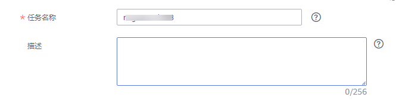

# 场景二：创建OBS自建桶迁移任务

介绍OBS自建桶场景下的备份迁移。您可以将本地数据库备份文件上传到OBS桶，然后通过下载OBS桶里的备份文件，对已有数据库实例进行备份数据迁移。

本小节主要介绍通过数据复制控制台创建备份迁移任务的配置流程。

## 前提条件

-   已登录数据复制服务控制台。
-   账户余额大于等于0元。
-   满足备份移支持的数据库类型，参见[备份迁移](https://support.huaweicloud.com/productdesc-drs/drs_01_0303.html)。
-   满足备份迁移的限制条件，参见[使用须知](使用须知.md)。

## 操作步骤

以下操作流程仅以Microsoft SQL Server引擎为示例，详细介绍数据库备份迁移任务的配置流程，其他存储引擎的配置流程类似。

1.  在“备份迁移管理”页面，单击“创建迁移任务”。
2.  在“选定备份”页面输入任务名称和描述，填选备份文件信息，单击“下一步”。

    **图 1**  任务信息  
    

    **表 1**  任务信息

    
    <table><thead align="left"><tr id="drs_02_0010_row106877396213"><th class="cellrowborder" valign="top" width="19%" id="mcps1.2.3.1.1">
<strong id="drs_02_0010_b4140457172110">参数</strong>

    </th>
    <th class="cellrowborder" valign="top" width="81%" id="mcps1.2.3.1.2">
<strong id="drs_02_0010_b1887395952116">描述</strong>

    </th>
    </tr>
    </thead>
    <tbody><tr id="drs_02_0010_row4687103922113"><td class="cellrowborder" valign="top" width="19%" headers="mcps1.2.3.1.1 ">
任务名称

    </td>
    <td class="cellrowborder" valign="top" width="81%" headers="mcps1.2.3.1.2 ">
任务名称在4-50位之间，必须以字母开头，不区分大小写，可以包含字母、数字、中划线或下划线，不能包含其他特殊字符。

    </td>
    </tr>
    <tr id="drs_02_0010_row1068718396218"><td class="cellrowborder" valign="top" width="19%" headers="mcps1.2.3.1.1 ">
描述

    </td>
    <td class="cellrowborder" valign="top" width="81%" headers="mcps1.2.3.1.2 ">
描述不能超过256位，且不能包含! = &lt; &gt; &amp; ' " \ 特殊字符。

    </td>
    </tr>
    </tbody>
    </table>

    **图 2**  OBS备份文件信息  
    

    **表 2**  备份文件信息

    
    <table><thead align="left"><tr id="row1134521616276"><th class="cellrowborder" valign="top" width="24%" id="mcps1.2.3.1.1">
<strong id="b19267840102711">参数</strong>

    </th>
    <th class="cellrowborder" valign="top" width="76%" id="mcps1.2.3.1.2">
<strong id="b177518444272">描述</strong>

    </th>
    </tr>
    </thead>
    <tbody><tr id="row334518169274"><td class="cellrowborder" valign="top" width="24%" headers="mcps1.2.3.1.1 ">
数据库类型

    </td>
    <td class="cellrowborder" valign="top" width="76%" headers="mcps1.2.3.1.2 ">
备份文件的数据库类型，选择Microsoft SQL Server。

    </td>
    </tr>
    <tr id="row133451116122715"><td class="cellrowborder" valign="top" width="24%" headers="mcps1.2.3.1.1 ">
备份文件来源

    </td>
    <td class="cellrowborder" valign="top" width="76%" headers="mcps1.2.3.1.2 ">
选择OBS自建桶。

    </td>
    </tr>
    <tr id="row9345101616278"><td class="cellrowborder" valign="top" width="24%" headers="mcps1.2.3.1.1 ">
桶名

    </td>
    <td class="cellrowborder" valign="top" width="76%" headers="mcps1.2.3.1.2 ">
选择备份文件所在的桶名，以及该桶目录下的备份文件。

    
 说明： 
<ul id="ul2067119583366"><li>Microsoft SQL Server的备份文件需要选择OBS桶目录下“.bak”格式的文件名，且可以同时选择多个备份文件。</li><li>不支持将一个库分割成不同文件上传。</li><li>该桶的桶名、备份文件名或者路径中不能包含中文。</li></ul>
    

    </td>
    </tr>
    <tr id="row1569995792519"><td class="cellrowborder" valign="top" width="24%" headers="mcps1.2.3.1.1 ">
企业项目

    </td>
    <td class="cellrowborder" valign="top" width="76%" headers="mcps1.2.3.1.2 ">
对于已成功关联企业项目的用户，仅需在“企业项目”下拉框中选择目标项目。

    
如果需要自定义企业项目，请前往项目管理服务进行创建。关于如何创建项目，详见《项目管理用户指南》。

    </td>
    </tr>
    <tr id="row471010212616"><td class="cellrowborder" valign="top" width="24%" headers="mcps1.2.3.1.1 ">
标签

    </td>
    <td class="cellrowborder" valign="top" width="76%" headers="mcps1.2.3.1.2 ">
可选配置，对迁移任务的标识。使用标签可方便管理您的迁移任务。每个任务最多支持10个标签配额。

    
任务创建成功后，您可以单击实例名称，在“标签”页签下查看对应标签。关于标签的详细操作，请参见<a href="https://support.huaweicloud.com/usermanual-drs/drs_backup_tag.html" target="_blank" rel="noopener noreferrer">标签管理</a>。

    </td>
    </tr>
    </tbody>
    </table>

3.  在“选定目标”页面，根据所选数据库类型，配置相应的数据库信息，单击“下一步”。

    **图 3**  Microsoft SQL Server数据库信息  
    

    **表 3**  Microsoft SQL Server数据库信息

    
    <table><thead align="left"><tr id="row424693111243"><th class="cellrowborder" valign="top" width="24%" id="mcps1.2.3.1.1">
<strong id="b72461531162410">参数</strong>

    </th>
    <th class="cellrowborder" valign="top" width="76%" id="mcps1.2.3.1.2">
<strong id="b5246331152418">描述</strong>

    </th>
    </tr>
    </thead>
    <tbody><tr id="row132461031112416"><td class="cellrowborder" valign="top" width="24%" headers="mcps1.2.3.1.1 ">
目标RDS实例名称

    </td>
    <td class="cellrowborder" valign="top" width="76%" headers="mcps1.2.3.1.2 ">
选择目标RDS实例。若没有合适的目标RDS数据库实例，请先创建所需的目标数据库实例，可参见《关系型数据库快速入门》中“SQL Server快速入门”下的“<a href="https://support.huaweicloud.com/qs-rds/rds_04_0061.html" target="_blank" rel="noopener noreferrer">购买实例</a>”章节。

    </td>
    </tr>
    <tr id="row3246153112415"><td class="cellrowborder" valign="top" width="24%" headers="mcps1.2.3.1.1 ">
待恢复备份类型

    </td>
    <td class="cellrowborder" valign="top" width="76%" headers="mcps1.2.3.1.2 ">
请根据业务需求，选择全量备份或增量备份类型。

    <ul id="ul6246123172410"><li>全量备份：指备份文件是完整备份类型的备份。</li><li>增量备份：指备份文件是日志类型的备份。
 说明： 
<ul id="ul1624613317244"><li>进行增量备份恢复前，需要先执行一次全量备份恢复的操作。</li><li>一次性数据库迁移，则需要停止业务，上传全量备份进行恢复。</li><li>如果需要数据库迁移中业务不中断，则需要使用全量备份和多次增量日志备份的恢复来实现业务中断最小化。</li></ul>
    

    </li></ul>
    </td>
    </tr>
    <tr id="row1724693132412"><td class="cellrowborder" valign="top" width="24%" headers="mcps1.2.3.1.1 ">
最后一个备份

    </td>
    <td class="cellrowborder" valign="top" width="76%" headers="mcps1.2.3.1.2 ">
一次典型的增量恢复过程，会涉及多次恢复增量备份。每个增量备份恢复均会使目标数据库保持还原中状态，此时数据库不可读写，直至最后一个增量备份恢复完成后，数据库才能变成可用状态。此后数据库将无法继续进行增量恢复，所以确定为最后一个备份的场景有：

    <ul id="ul11246203132411"><li>一次性全量迁移，后续将不再进行增量恢复，选择“是”。</li><li>增量恢复流程中，最后割接阶段的最后一个增量备份选择“是”。</li></ul>
    </td>
    </tr>
    <tr id="row162469314242"><td class="cellrowborder" valign="top" width="24%" headers="mcps1.2.3.1.1 ">
覆盖还原

    </td>
    <td class="cellrowborder" valign="top" width="76%" headers="mcps1.2.3.1.2 ">
覆盖还原是指目标端数据库实例已经存在同名的数据库，备份还原中是否要覆盖已存在的数据库。您可以根据业务需求，选择是否进行覆盖还原。

    
 说明： 

若选择此项，目标数据库实例中与待还原数据库同名的数据库将会被覆盖，请谨慎操作。

    

    </td>
    </tr>
    <tr id="row135704356713"><td class="cellrowborder" valign="top" width="24%" headers="mcps1.2.3.1.1 ">
执行预校验

    </td>
    <td class="cellrowborder" valign="top" width="76%" headers="mcps1.2.3.1.2 ">
备份迁移任务是否执行预校验，默认为是。

    <ul id="ul892446164810"><li>是：为保证迁移成功，提前识别潜在问题，在恢复前对备份文件的合法性、完整性、连续性、版本兼容性等进行校验。</li><li>否：不执行预校验，迁移速度更快，但需要用户判断备份文件的合法性、完整性、连续性、版本兼容性等问题。</li></ul>
    </td>
    </tr>
    <tr id="row1424611317247"><td class="cellrowborder" valign="top" width="24%" headers="mcps1.2.3.1.1 ">
指定需要恢复的数据库

    </td>
    <td class="cellrowborder" valign="top" width="76%" headers="mcps1.2.3.1.2 ">
您可以选择将全部数据库或部分数据库进行恢复，默认恢复全部数据库。

    <ul id="ul42467319245"><li>全部数据库：恢复备份文件中所有的数据库，不需要填写待还原的数据库名。</li><li>部分数据库：恢复备份文件中的部分数据库，需要填写待还原的数据库名。全量备份与增量备份需要保证指定恢复的数据库始终一致。</li></ul>
    </td>
    </tr>
    <tr id="row1236052419148"><td class="cellrowborder" valign="top" width="24%" headers="mcps1.2.3.1.1 ">
重置数据库名

    </td>
    <td class="cellrowborder" valign="top" width="76%" headers="mcps1.2.3.1.2 ">
当选择的指定恢复数据库类型为“全部数据库”时，您可以选择重置数据库名。该功能将忽略备份文件中原有的数据库名，通过DRS将其恢复为指定的新数据库名。

    
使用条件：

    <ul id="ul839515513172"><li>备份文件中只有一个数据库。</li><li>备份文件是全量备份类型（待恢复备份类型选择：全量备份），且是一次性恢复（最后一个备份选择：是）。</li></ul>
    
 说明： 

仅支持“待恢复备份类型”为“全量备份”，且“指定需要恢复的数据库类型”为“全部数据库”时重置数据库名。

    

    </td>
    </tr>
    <tr id="row132611831112415"><td class="cellrowborder" valign="top" width="24%" headers="mcps1.2.3.1.1 ">
待还原数据库名称

    </td>
    <td class="cellrowborder" valign="top" width="76%" headers="mcps1.2.3.1.2 ">
当选择的指定恢复数据库类型为“部分数据库”时，需要输入待还原数据库名称。

    
待还原数据库名称必须与备份文件中的数据库名称一致，区分大小写，长度为1~256个字节，可以包含中文、字母，数字、中划线和下划线，不能包含其他特殊字符。

    
此处，数据复制服务还提供待还原数据库别名设置的功能，具体使用场景如下：

    <ul id="ul92081552162619"><li>如果您选择的是全量备份下的部分数据库恢复，那么可以在填写待还原数据库名称时，根据需求为待还原数据库进行别名设置，该别名也将存储于目标端数据库。</li><li>如果是增量备份下的部分数据库恢复，则不支持待还原数据库别名设置的功能。</li></ul>
    
 说明： 

待还原数据库支持重命名，最大配额为100个。

    

    </td>
    </tr>
    <tr id="row7652111421418"><td class="cellrowborder" valign="top" width="24%" headers="mcps1.2.3.1.1 ">
备份文件是否开启FileStream模式

    </td>
    <td class="cellrowborder" valign="top" width="76%" headers="mcps1.2.3.1.2 ">
当选择目标库实例类型是单机时，需要选择备份文件是否开启FileStream模式。

    
查看备份文件是否开启FileStream模式方法如下：

    <ol id="ol251863213558"><li>登录SQL Server。</li><li>执行如下命令：
restore filelistonly from disk = N'E:\tmp\db1.bak'；

    
其中E:\tmp\db1.bak为实际备份文件的地址。

    </li><li>检查结果的Type列是否包含类型是"S"，若包含，bak文件已开启FileStream特性，反之，则没有。

    </li></ol>
    
 说明： 

SQL Server如何开启FileStream模式，可参考<a href="https://support.huaweicloud.com/usermanual-rds/rds_sqlserver_filestream.html" target="_blank" rel="noopener noreferrer">《云数据库RDS用户指南》</a>。

    

    </td>
    </tr>
    </tbody>
    </table>

4.  在“信息确认”页面核对配置详情后，勾选协议，单击“下一步”。

    > **说明：** 
    >SQL Server自身的工作原理是备份文件恢复到新的数据库后，非聚集索引表的索引信息将会失效需要立即重建。如果源数据库里存在大量非聚集索引表，备份迁移后请在目标库进行索引重建，以避免数据库未来使用中性能出现重大下降。同时备份文件里仅保存数据库级信息，在SQL Server实例中还有一些配置需要主动识别并手工完成迁移，如login，权限，DBlink，job等，如果源数据库包含这部分配置，请参考[《最佳实践》](https://support.huaweicloud.com/bestpractice-drs/drs_04_0008.html)进行迁移补充工作。

5.  在“备份迁移管理“页面任务列表中，观察对应的恢复任务的状态为“恢复中”，恢复成功后，任务状态显示“成功“。

