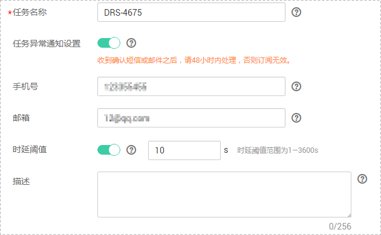
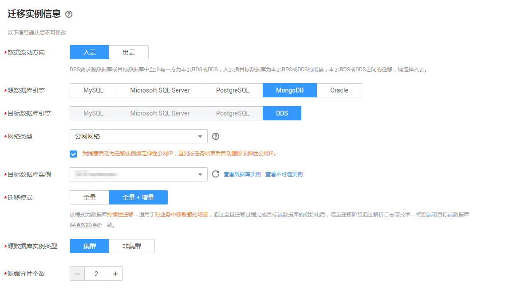
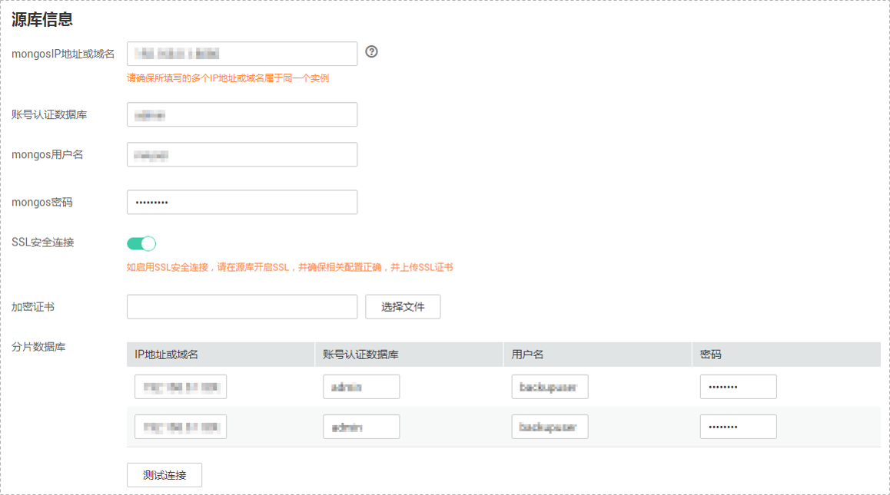
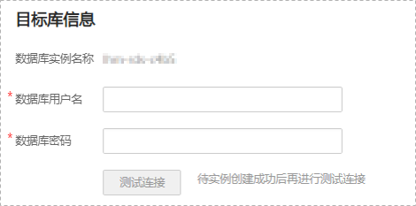
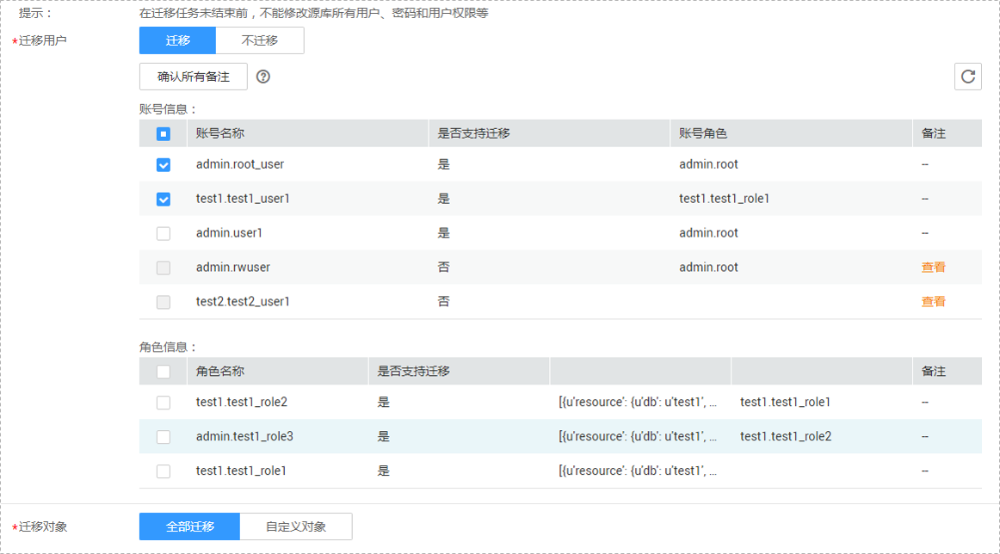
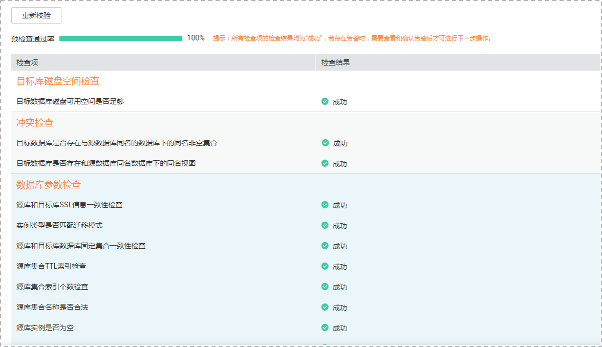

# 场景四：分片集群MongoDB数据库迁移至DDS社区版集群

在数据复制服务中，数据库迁移是通过任务的形式完成的，通过创建任务向导，可以完成任务信息配置、任务创建。迁移任务创建成功后，您也可以通过数据复制服务管理控制台，对任务进行管理。

本章节将以MongoDB分片集群为示例，介绍在公网网络场景下，通过数据复制服务管理控制台配置MongoDB数据迁移任务的流程。其中，MongoDB分片集群到DDS增强版集群的迁移与该场景的配置流程类似。

目前数据复制服务支持每个用户最多可创建5个在线迁移任务。

## 前提条件

-   已登录数据复制服务控制台。
-   账户余额大于等于0元。
-   参见[在线迁移](https://support.huaweicloud.com/productdesc-drs/drs_01_0301.html)。
-   参见[使用须知](https://support.huaweicloud.com/qs-drs/drs_online_migration.html)。

## 操作步骤

1.  在“在线迁移管理“页面，单击“创建迁移任务“，进入创建迁移任务页面。
2.  在“迁移实例”页面，填选任务名称、通知收件人信息、描述、迁移实例信息，单击“下一步”。

    **图 1**  迁移任务信息  
    

    **表 1**  任务和描述

    
    <table><thead align="left"><tr id="row55731924204420"><th class="cellrowborder" valign="top" width="18.42%" id="mcps1.2.3.1.1">
<strong id="b1611223511352">参数</strong>

    </th>
    <th class="cellrowborder" valign="top" width="81.58%" id="mcps1.2.3.1.2">
<strong id="b3002268111352">描述</strong>

    </th>
    </tr>
    </thead>
    <tbody><tr id="row807311204420"><td class="cellrowborder" valign="top" width="18.42%" headers="mcps1.2.3.1.1 ">
任务名称

    </td>
    <td class="cellrowborder" valign="top" width="81.58%" headers="mcps1.2.3.1.2 ">
任务名称在4位到64位之间，必须以字母开头，不区分大小写，可以包含字母、数字、中划线或下划线，不能包含其他的特殊字符。

    </td>
    </tr>
    <tr id="row1080215433911"><td class="cellrowborder" valign="top" width="18.42%" headers="mcps1.2.3.1.1 ">
任务异常通知设置

    </td>
    <td class="cellrowborder" valign="top" width="81.58%" headers="mcps1.2.3.1.2 ">
该项为可选参数，开启之后，需要填写手机号码或者邮箱作为指定收件人。当迁移任务状态异常时，系统将发送通知给指定收件人。

    
 说明： 

收到确认短信或邮件之后，需要在48小时内处理，否则该功能订阅无效。

    

    </td>
    </tr>
    <tr id="row157731032102814"><td class="cellrowborder" valign="top" width="18.42%" headers="mcps1.2.3.1.1 ">
时延阈值

    </td>
    <td class="cellrowborder" valign="top" width="81.58%" headers="mcps1.2.3.1.2 ">
在增量迁移阶段，源数据库和目标数据库之间的同步有时会存在一个时间差，称为时延，单位为秒。

    
时延阈值设置是指时延超过一定的值后（时间阈值范围为1—3600s），DRS可以发送告警通知给指定收件人。告警通知将在时延稳定超过设定的阈值6min后发送，避免出现由于时延波动反复发送告警通知的情况。

    
 说明： 
<ul id="ul56845716914"><li>首次进入增量迁移阶段，会有较多数据等待同步，存在较大的时延，属于正常情况，不在此功能的监控范围之内。</li><li>设置时间阈值之前，需要填写收件人手机号或邮箱。</li></ul>
    

    </td>
    </tr>
    <tr id="row23664659204420"><td class="cellrowborder" valign="top" width="18.42%" headers="mcps1.2.3.1.1 ">
描述

    </td>
    <td class="cellrowborder" valign="top" width="81.58%" headers="mcps1.2.3.1.2 ">
描述不能超过256位，且不能包含!=&lt;&gt;&amp;'"特殊字符。

    </td>
    </tr>
    </tbody>
    </table>

    **图 2**  迁移实例信息  
    

    **表 2**  迁移实例信息

    
    <table><thead align="left"><tr id="row39932329204436"><th class="cellrowborder" valign="top" width="23.87%" id="mcps1.2.3.1.1">
<strong id="b2587841611355">参数</strong>

    </th>
    <th class="cellrowborder" valign="top" width="76.13%" id="mcps1.2.3.1.2">
<strong id="b1577696211355">描述</strong>

    </th>
    </tr>
    </thead>
    <tbody><tr id="row695184962111"><td class="cellrowborder" valign="top" width="23.87%" headers="mcps1.2.3.1.1 ">
数据流动方向

    </td>
    <td class="cellrowborder" valign="top" width="76.13%" headers="mcps1.2.3.1.2 ">
选择入云。

    
入云指目标端数据库为本云数据库。

    </td>
    </tr>
    <tr id="row0414184610580"><td class="cellrowborder" valign="top" width="23.87%" headers="mcps1.2.3.1.1 ">
源数据库引擎

    </td>
    <td class="cellrowborder" valign="top" width="76.13%" headers="mcps1.2.3.1.2 ">
选择MongoDB。

    </td>
    </tr>
    <tr id="row42411630204436"><td class="cellrowborder" valign="top" width="23.87%" headers="mcps1.2.3.1.1 ">
目标数据库引擎

    </td>
    <td class="cellrowborder" valign="top" width="76.13%" headers="mcps1.2.3.1.2 ">
选择DDS。

    </td>
    </tr>
    <tr id="row62907306204436"><td class="cellrowborder" valign="top" width="23.87%" headers="mcps1.2.3.1.1 ">
网络类型

    </td>
    <td class="cellrowborder" valign="top" width="76.13%" headers="mcps1.2.3.1.2 ">
默认为公网网络类型，可按照需求选择VPC网络、VPN网络、专线网络、公网网络。

    <ul id="ul1872454917306"><li>VPC网络：适合云上数据库之间的迁移。</li><li>公网网络：适合通过公网网络把其他云下或其他平台的数据库迁移到目标数据库，该类型要求目标数据库绑定弹性公网IP（EIP）。</li><li>VPN网络：适合通过VPN网络，实现其他云下自建数据库与云上数据库迁移、或云上跨Region的数据库之间的迁移。</li><li>专线网络：适合通过专线网络，实现其他云下自建数据库与云上数据库迁移、或云上跨Region的数据库之间的迁移。
 说明： 

分片集群的全量+增量迁移目前不支持选择VPC网络。

    

    </li></ul>
    </td>
    </tr>
    <tr id="row658644204515"><td class="cellrowborder" valign="top" width="23.87%" headers="mcps1.2.3.1.1 ">
目标数据库实例

    </td>
    <td class="cellrowborder" valign="top" width="76.13%" headers="mcps1.2.3.1.2 ">
用户所创建的目标数据库实例。

    </td>
    </tr>
    <tr id="row0850133715295"><td class="cellrowborder" valign="top" width="23.87%" headers="mcps1.2.3.1.1 ">
迁移模式

    </td>
    <td class="cellrowborder" valign="top" width="76.13%" headers="mcps1.2.3.1.2 "><ul id="ul171919713019"><li>全量：该模式为数据库一次性迁移，适用于可中断业务的数据库迁移场景，全量迁移将非系统数据库的全部数据库对象和数据一次性迁移至目标端数据库，包括：集合、索引等。
 说明： 

如果用户只进行全量迁移时，建议停止对源数据库的操作，否则迁移过程中源数据库产生的新数据不会同步到目标数据库。

    

    </li><li>全量+增量：该模式为数据库持续性迁移，适用于对业务中断敏感的场景，通过全量迁移过程中完成的目标端数据库的初始化后，增量迁移阶段通过解析日志等技术，将远端和目标端数据库保持数据持续一致。</li></ul>
    
 说明： 

选择“全量+增量”迁移模式，增量迁移可以在全量迁移完成的基础上实现数据的持续同步，无需中断业务，实现迁移过程中源业务和数据库继续对外提供访问。

    

    </td>
    </tr>
    <tr id="row385355610516"><td class="cellrowborder" valign="top" width="23.87%" headers="mcps1.2.3.1.1 ">
源数据库实例类型

    </td>
    <td class="cellrowborder" valign="top" width="76.13%" headers="mcps1.2.3.1.2 ">
需要根据源数据库的具体来源进行设置。

    <ul id="ul4879338807"><li>当源库类型属于集群时，该项需要设置为集群</li><li>当源库类型属于副本集或者单节点时，该项需要设置为非集群。</li></ul>
    </td>
    </tr>
    <tr id="row208952593510"><td class="cellrowborder" valign="top" width="23.87%" headers="mcps1.2.3.1.1 ">
源端分片个数

    </td>
    <td class="cellrowborder" valign="top" width="76.13%" headers="mcps1.2.3.1.2 ">
当源端实例类型设置为“集群”时，需要填写源端数据库实例个数。

    
源端数据库实例个数默认最小值为2，最大值为32，你需要根据源库实际的集群分片个数设置该值大小。

    </td>
    </tr>
    </tbody>
    </table>

3.  在“源库及目标库”页面，迁移实例创建成功后，填选源库信息和目标库信息，建议您单击“源库和目标库“处的“测试连接“，分别测试并确定与源库和目标库连通后，勾选协议，单击“下一步“。

    **图 3**  源库信息页面  
    

    **表 3**  源库信息

    
    <table><thead align="left"><tr id="zh-cn_topic_0135097933_row12653123195919"><th class="cellrowborder" valign="top" width="23.29%" id="mcps1.2.3.1.1">
<strong id="zh-cn_topic_0135097933_b20653923155913">参数</strong>

    </th>
    <th class="cellrowborder" valign="top" width="76.71%" id="mcps1.2.3.1.2">
<strong id="zh-cn_topic_0135097933_b186531223105910">描述</strong>

    </th>
    </tr>
    </thead>
    <tbody><tr id="zh-cn_topic_0135097933_row1265352355912"><td class="cellrowborder" valign="top" width="23.29%" headers="mcps1.2.3.1.1 ">
mongosIP地址或域名

    </td>
    <td class="cellrowborder" valign="top" width="76.71%" headers="mcps1.2.3.1.2 ">
源数据库的IP地址或域名，格式为IP地址/域名:端口。其中源数据库服务端口，可输入范围为1~65534间的整数。

    
该输入框最多支持填写3组源数据库的IP地址或者域名信息，多个值需要使用英文逗号隔开。例如：192.168.0.1:8080,192.168.0.2:8080。同时需要确保所填写的多个IP地址或域名属于同一个实例。

    
 说明： 

此处若填写的是多组IP地址或者域名信息，在进行测试连接的过程中，只要存在一组IP地址或者域名可以连通，那么测试连接就提示成功。所以需要您保证填写的IP地址或域名的正确性。

    

    </td>
    </tr>
    <tr id="row104567257713"><td class="cellrowborder" valign="top" width="23.29%" headers="mcps1.2.3.1.1 ">
账号认证数据库

    </td>
    <td class="cellrowborder" valign="top" width="76.71%" headers="mcps1.2.3.1.2 ">
填写的数据库账号所属的数据库名称。例如：华为云DDS实例默认的账号认证数据库为admin。

    </td>
    </tr>
    <tr id="zh-cn_topic_0135097933_row9653102325913"><td class="cellrowborder" valign="top" width="23.29%" headers="mcps1.2.3.1.1 ">
mongos用户名

    </td>
    <td class="cellrowborder" valign="top" width="76.71%" headers="mcps1.2.3.1.2 ">
源数据库的用户名。

    </td>
    </tr>
    <tr id="zh-cn_topic_0135097933_row065352315596"><td class="cellrowborder" valign="top" width="23.29%" headers="mcps1.2.3.1.1 ">
mongos密码

    </td>
    <td class="cellrowborder" valign="top" width="76.71%" headers="mcps1.2.3.1.2 ">
源数据库的用户名所对应的密码。

    </td>
    </tr>
    <tr id="zh-cn_topic_0135097933_row26531923125912"><td class="cellrowborder" valign="top" width="23.29%" headers="mcps1.2.3.1.1 ">
SSL安全连接

    </td>
    <td class="cellrowborder" valign="top" width="76.71%" headers="mcps1.2.3.1.2 ">
通过该功能，用户可以选择是否开启对迁移链路的加密。如果开启该功能，需要用户上传SSL CA根证书。

    
 说明： 

最大支持上传500KB的证书文件。

    

    </td>
    </tr>
    <tr id="row3204554770"><td class="cellrowborder" valign="top" width="23.29%" headers="mcps1.2.3.1.1 ">
分片数据库

    </td>
    <td class="cellrowborder" valign="top" width="76.71%" headers="mcps1.2.3.1.2 ">
根据源库实际的集群分片个数，填写对应的分片数据库信息。

    </td>
    </tr>
    </tbody>
    </table>

    > **说明：**   
    >**源数据库的IP地址或域名、数据库用户名和密码，会被系统加密暂存，直至删除该迁移任务后自动清除。**  

    -   目标库信息配置

        **图 4**  目标库信息  
        

        **表 4**  目标库信息

        
        <table><thead align="left"><tr id="zh-cn_topic_0135097933_row15746151015912"><th class="cellrowborder" valign="top" width="23.02%" id="mcps1.2.3.1.1">
<strong id="zh-cn_topic_0135097933_b074631019593">参数</strong>

        </th>
        <th class="cellrowborder" valign="top" width="76.98%" id="mcps1.2.3.1.2">
<strong id="zh-cn_topic_0135097933_b1774613108597">描述</strong>

        </th>
        </tr>
        </thead>
        <tbody><tr id="zh-cn_topic_0135097933_row0746151020595"><td class="cellrowborder" valign="top" width="23.02%" headers="mcps1.2.3.1.1 ">
数据库实例名称

        </td>
        <td class="cellrowborder" valign="top" width="76.98%" headers="mcps1.2.3.1.2 ">
默认为创建迁移任务时选择的数据库实例，不可进行修改。

        </td>
        </tr>
        <tr id="zh-cn_topic_0135097933_row2746310155916"><td class="cellrowborder" valign="top" width="23.02%" headers="mcps1.2.3.1.1 ">
数据库用户名

        </td>
        <td class="cellrowborder" valign="top" width="76.98%" headers="mcps1.2.3.1.2 ">
目标数据库对应的数据库用户名。

        </td>
        </tr>
        <tr id="zh-cn_topic_0135097933_row107461010135910"><td class="cellrowborder" valign="top" width="23.02%" headers="mcps1.2.3.1.1 ">
数据库密码

        </td>
        <td class="cellrowborder" valign="top" width="76.98%" headers="mcps1.2.3.1.2 ">
目标数据库的登录密码。

        </td>
        </tr>
        </tbody>
        </table>

        > **说明：**   
        >数据库用户名和密码将被系统加密暂存，直至该任务删除后清除。  

4.  在“迁移设置“页面，设置迁移对象，单击“下一步“。

    **图 5**  设置迁移对象  
    

    **表 5**  迁移对象

    
    <table><thead align="left"><tr id="zh-cn_topic_0078078071_row165921632141911"><th class="cellrowborder" valign="top" width="16%" id="mcps1.2.3.1.1">
<strong id="zh-cn_topic_0078078071_b1783318515228">参数</strong>

    </th>
    <th class="cellrowborder" valign="top" width="84%" id="mcps1.2.3.1.2">
<strong id="zh-cn_topic_0078078071_b10555114922418">描述</strong>

    </th>
    </tr>
    </thead>
    <tbody><tr id="row9827431163111"><td class="cellrowborder" valign="top" width="16%" headers="mcps1.2.3.1.1 ">
迁移用户

    </td>
    <td class="cellrowborder" valign="top" width="84%" headers="mcps1.2.3.1.2 ">
常见的迁移用户一般分为两类：支持迁移的用户和不支持迁移的用户。您可以根据业务需求选择“迁移”或者“不迁移”，其中，不支持迁移的账号或者未选择迁移的账号将在目标数据库中缺失，需要先确保业务不受影响。<ul id="zh-cn_topic_0078078071_ul52489455107"><li>迁移
当您选择迁移用户时，请参见《数据复制服务用户指南》中“<a href="https://support.huaweicloud.com/usermanual-drs/drs_09_0017.html" target="_blank" rel="noopener noreferrer">迁移用户</a>”章节进行数据库用户及角色的处理。

    </li></ul>
    <ul id="zh-cn_topic_0078078071_ul17378301111"><li>不迁移
迁移过程中，将不进行数据库用户及角色的迁移。

    </li></ul>
    

    </td>
    </tr>
    <tr id="zh-cn_topic_0078078071_row559273214193"><td class="cellrowborder" valign="top" width="16%" headers="mcps1.2.3.1.1 ">
迁移对象

    </td>
    <td class="cellrowborder" valign="top" width="84%" headers="mcps1.2.3.1.2 ">
对象迁移到目标数据库实例后，对象名将会保持与源数据库实例对象名一致且无法修改。

    
您可以根据业务需求，选择全部对象迁移或者自定义迁移对象。

    <ul id="zh-cn_topic_0078078071_ul78601316141810"><li>全部迁移：将源数据库中的所有对象全部迁移至目标数据库。</li><li>自定义对象：将自定义选择的对象迁移至目标数据库。如果有切换源数据库的操作，请在选择迁移对象前单击右上角的，以确保待选择的对象为最新源数据库对象。</li></ul>
    </td>
    </tr>
    </tbody>
    </table>

5.  在“预检查“页面，进行迁移任务预校验，校验是否可进行迁移。
    -   查看检查结果，如有失败的检查项，需要修复失败项后，单击“重新校验”按钮重新进行迁移任务预校验。

        预检查失败项处理建议请参见《数据复制服务用户指南》中的“[预检查失败项修复方法](https://support.huaweicloud.com/usermanual-drs/drs_precheck.html)”。

        **图 6**  预检查  
        

    -   预检查完成后，且预检查通过率为100%时，单击“下一步”。

        > **说明：**   
        >所有检查项结果均成功时，若存在告警，需要阅读并确认告警详情后才可以继续执行下一步操作。  

6.  在“任务确认“页面，设置迁移任务的启动时间，并确认迁移任务信息无误后，单击“启动任务“，提交迁移任务。
7.  迁移任务提交后，您可在“在线迁移管理“页面，查看并管理自己的任务。
    -   您可查看任务提交后的状态，状态请参见[任务状态](https://support.huaweicloud.com/qs-drs/drs_03_0001.html)。
    -   在任务列表的右上角，单击刷新列表，可查看到最新的任务状态。

8.  迁移任务创建成功后，请参见《数据复制服务快速入门》的[使用流程](https://support.huaweicloud.com/qs-drs/drs_02_0001.html)，进行完整的数据业务割接。

