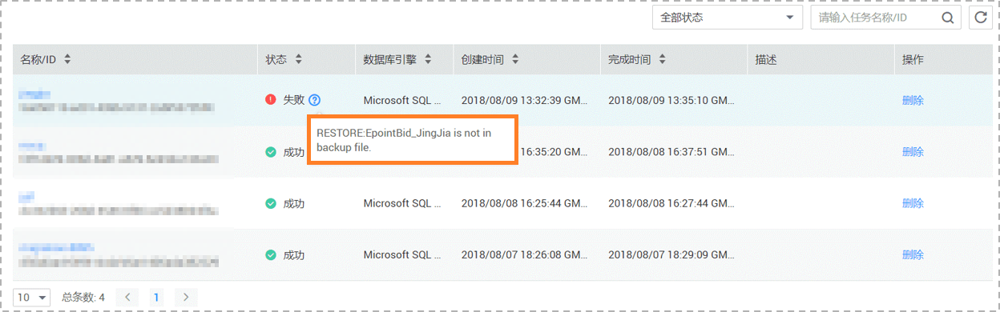

# 备份迁移失败，提示备份的源数据库不在备份文件列表中

## 操作场景

客户通过OBS桶全量备份数据迁移上云时，提示备份的源数据库不在备份文件列表中，导致迁移失败。

**图 1**  备份迁移  

## 问题分析

用户上传到OBS桶中的.bak数据库备份文件名较长。

## 解决方案

针对以上问题，提供如下解决方案：

1.  参考《数据复制服务快速入门》中“[申请须知](https://support.huaweicloud.com/qs-drs/drs_offline_migration.html)”章节，确定上传OBS桶备份文件的命名规范。
2.  修改本地数据库备份文件名，重新上传OBS桶。

