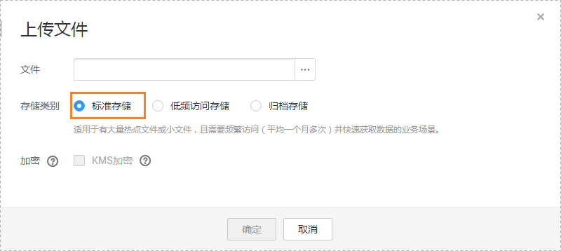

# 备份迁移失败，无法找到备份文件

## 场景描述

客户通过OBS桶全量备份数据迁移上云时，出现报错：restore:null，无法找到备份文件。

## 问题分析

针对该情况分析，可能存在如下原因。

-   客户下发迁移任务后，删除了备份文件。
-   客户上传到OBS桶里的备份文件选择了“归档存储”，归档存储是一种冷存储，首次上传后会处于“未恢复”的状态，Microsoft SQL Server实例去下载文件的时候无法获取。

## 解决方案

目前针对上述可能存在的原因，分别提供如下解决方案：

## 方法一

重新将删除的备份文件上传至OBS桶，存储类型选择“标准存储”，具体操作及注意事项请参考《对象存储服务控制台指南》中“[上传文件](http://support.huaweicloud.com/usermanual-obs/zh-cn_topic_0045829661.html)”章节。

## 方法二

-   如果备份文件比较小，可以重新上传备份文件至OBS桶中，存储类型选择“标准存储”。

    具体操作及注意事项请参考《对象存储服务控制台指南》中“[上传文件](http://support.huaweicloud.com/usermanual-obs/zh-cn_topic_0045829661.html)”章节。

    **图 1**  上传文件  
    

-   如果备份文件比较大，可以选择单击对象存储服务页面上的"恢复"按钮，把“归档存储”的备份文件状态更改为”已恢复“，然后下发迁移任务。

    具体操作及注意事项请参考《对象存储服务控制台指南》中“[恢复归档存储文件](http://support.huaweicloud.com/usermanual-obs/zh-cn_topic_0066088813.html)”章节。

