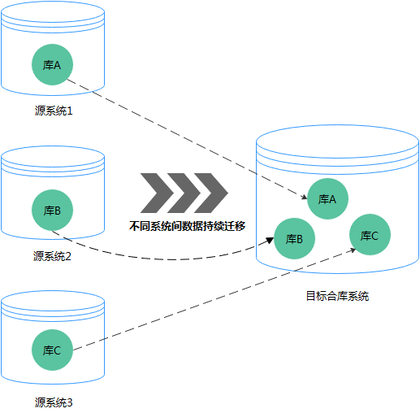
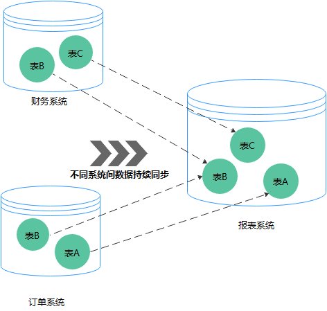
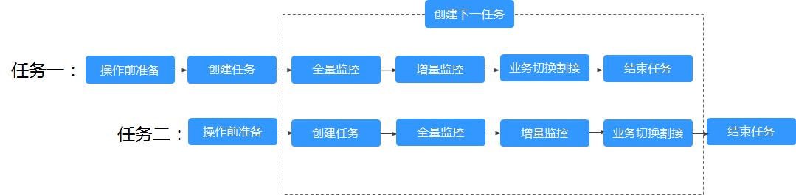

# 多对一的场景约束及操作建议

因业务需要，不同实例、不同表的数据需要进行合并时，数据复制服务提供的数据迁移和实时同步均支持多对一的场景。

## 操作建议

-   为避免创建任务过程中出现空间不足问题，建议提前计算源数据库的数据量总和，根据该总和一次性规划目标实例的磁盘空间，剩余磁盘空间需大于源库实际数据量大小的总和（例如“源系统1”数据量大小为1GB，“源系统2”数据量大小为3GB，“源系统3”数据量大小为6GB，则目标实例的剩余磁盘空间应该大于10GB）。
-   对于MySQL引擎，目标端参数的设置需要考虑整体资源的提升，建议使用第一个任务的参数对比功能中“常规参数“的“一键修改“（其中max\_connections除外），而“性能参数“应该结合目标端实际规格做相应的手工设置。
-   对于多对一同步任务场景，由于该场景是一个一个任务逐步创建的，后面创建任务时可能会造成已创建任务的同步阻塞，为了避免这个情况发生，请注意创建技巧。 每个同步任务都会涉及创建索引步骤，而创建索引时数据库可能会导致Schema锁进而阻塞Schema下的其他表的数据同步，从而导致后创建的任务可能在索引创建阶段对已经同步中的任务阻塞一段时间，我们可以选择在创建同步任务最后设置为“稍后启动”，这样设定在业务低峰期后创建任务，从而避免后创建任务的索引创建对已有任务的同步阻塞。
-   如果涉及表级汇集的多对一同步任务，则不支持DDL，否则会导致同步全部失败。

    **图 1**  参数对比  
    

## 场景一：多对一数据迁移

数据迁移是以整体数据库搬迁为目的，可以实现实例级多对一迁移，不支持源端具有同名的数据库，不支持库名映射。

**图 2**  多对一数据迁移  

## 场景二：多对一实时同步

实时同步不同于数据迁移，是维持不同业务之间的数据持续性流动，可以实现表级数据多对一同步，并支持库级映射。

**图 3**  多对一 实时同步  

## 操作流程

创建任务时，为方便多对一任务间的相互识别，请在创建顺序上确保第一个任务进入全量迁移后再创建第二个任务，具体操作请参见：[快速入门](https://support.huaweicloud.com/qs-drs/drs_02_0001.html)。

**图 4**  操作流程  

