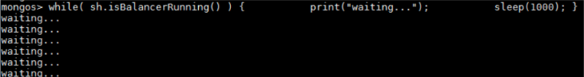

# 如何关闭集合均衡器Balancer<a name="drs_16_0001"></a>

使用DRS服务进行MongoDB数据库分片集群到分片集群的迁移，必须关闭要迁移集合的均衡器Balancer。

> **说明：** 
>迁移结束后请开启Balancer，因为在迁移期间关闭了Balancer，源数据库的不同shard可能产生了不等量的块（chunk），在Balancer开启之后集群shard之间的块（chunk）移动会暂时影响源数据库的性能。

## 关闭Balancer的步骤<a name="section175407531019"></a>

1.  通过Mongo Shell 登录数据库。
2.  在mongos节点命令窗口中，使用如下命令，切换至config数据库。

    **use config**

3.  执行如下命令，判断是否可以关闭Balancer。

    ```
    while( sh.isBalancerRunning() ) {      
              print("waiting...");           
              sleep(1000);
    }
    ```

    -   如果返回结果是waiting，则表示当前Balancer正在执行块（chunk）迁移，此时不能执行关闭Balancer的命令，否则可能引起数据不一致。

        **图 1**  查看输出结果<a name="fig045416443205"></a>  
        

    -   如果返回结果是空，则表示当前Balancer没有在进行块（chunk）迁移，此时可以执行下一步的关闭Balancer的命令。

4.  关闭Balancer。
    -   如果是整个实例的迁移，则执行如下命令，可以关闭整个实例的Balancer。

        ```
        sh.stopBalancer()
        ```

    -   如果要关闭待迁移且已经开启了分片的集合的Balancer，则执行如下命令：

        ```
        sh.disableBalancing("database.collection")
        ```

        其中database.collection表示要关闭的集合的namespace。


