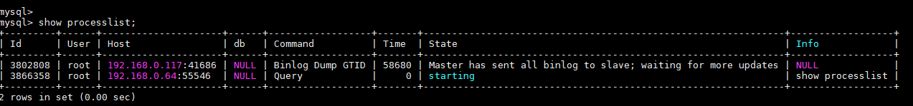
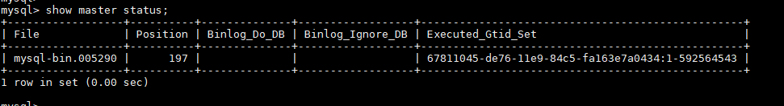

# 如何确保业务数据库的全部业务已经停止<a name="drs_04_0020"></a>

业务切换时可通过如下方法确保业务数据库的全部业务已经停止：

1.  在源数据库端执行如下语句，查看当前是否还存在有业务连接 。

    ```
    show processlist
    ```

    **图 1**  查看是否存在业务连接<a name="fig1166302975716"></a>  
    

2.  如果源数据库有业务连接，则通过结果中Host列的值来查找对应的业务进程并将其停止。
3.  在源库执行如下语句，查看binlog位置并记录该值（file列取值:position列取值 ），此处将该值记为ckpt1。

    ```
    show master status
    ```

    **图 2**  查看binlog位置<a name="fig31414917597"></a>  
    

4.  等待30s以上，在源库执行如下语句，查看binlog位置并记录该值（file列取值:position列取值 ），此处将该值记为ckpt2。ckpt1=ckpt2时，表示源数据库业务已基本停写。

    ```
    show master status
    ```


