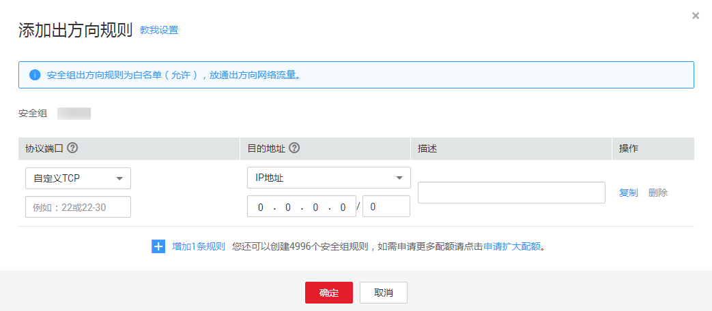

# 如何通过设置VPC安全组，允许本云VPC访问外部弹性IP

默认情况下，基于安全的考虑，本云VPC与外部网络是隔离的，VPC内是无法访问外部的弹性IP，如其他云数据库的弹性IP、云下数据库的弹性IP等。但数据库迁移场景需要确保本云VPC内的迁移实例或者目标数据库可连通外部的弹性IP，从而实现数据库迁移。

为此，您需要在安全组里设置一个出口规则，出口规则控制的是本云VPC可以访问哪些外部的弹性IP和端口范围，安全组的出入口规则一般需要满足“严进宽出”的要求。具体设置如下图所示：

**图 1**  出口规则  

具体的操作请参考[添加安全组规则](https://support.huaweicloud.com/usermanual-vpc/zh-cn_topic_0030969470.html)。

