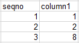
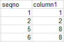
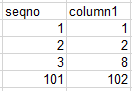
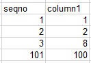
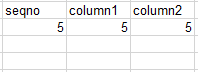
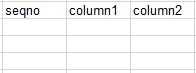

# 实时灾备常见异常场景示例

由于一些不可控原因，实时灾备在同时操作双边数据时，存在一定的数据不一致的可能性，本章节主要介绍常见的数据异常场景。以下场景均以dr1、dr2库进行示例。

## 场景一：双主灾备，双边同时操作同一行操作，导致多数据

-   初始数据如下图所示（seqno为主键，column1为非主键）。

    **图 1**  dr1、dr2库初始数据  
    

-   双方数据库同时分别执行如下操作：
    -   dr1库：update dr1 set seqno=5 where column1=8;
    -   dr2库：update dr2 set seqno=6 where column1=8;

-   执行操作后，双方数据库数据一致，并且多数据。

    **图 2**  dr1、dr2库数据  
    

## 场景二：双主灾备，同时操作双边数据库，导致数据不一致

-   初始数据如下图所示（seqno为主键，column1为非主键）。

    **图 3**  初始数据  
    

-   双方数据库同时分别执行如下操作：
    -   dr1库：insert into dr1 values\(101,100\);
    -   dr2库：insert into dr2 values\(101,102\);

-   执行操作后，双方数据库数据如下图所示。

    **图 4**  dr1库数据  
    

    **图 5**  dr2库数据  
    

## 场景三：双主灾备，业务期执行DDL操作，导致数据不一致

-   双方数据库同时分别执行如下操作：
    -   dr1库：truncate table dr1;
    -   dr2库：insert into dr2 values\(5,5,5\);

-   执行操作后，双方数据不一致，如下图所示。

    **图 6**  dr1 库数据  
    

    **图 7**  dr2 库数据  
    

    **更多场景，持续补充中。**

