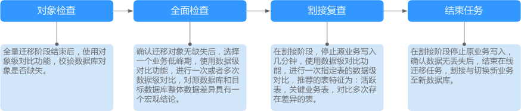
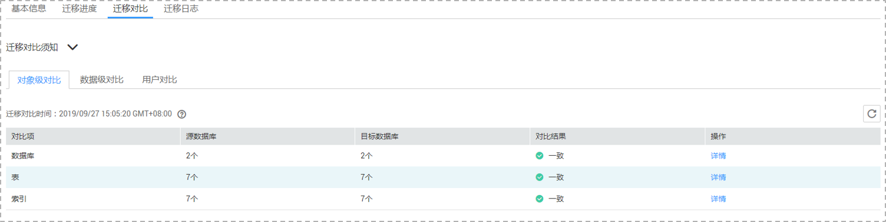
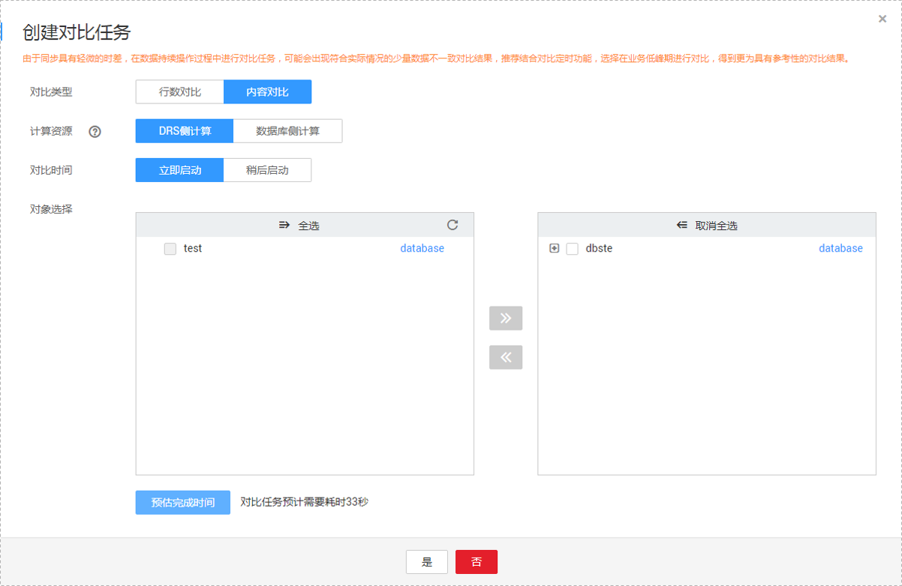
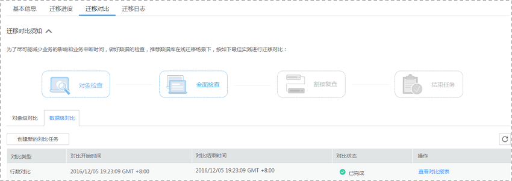
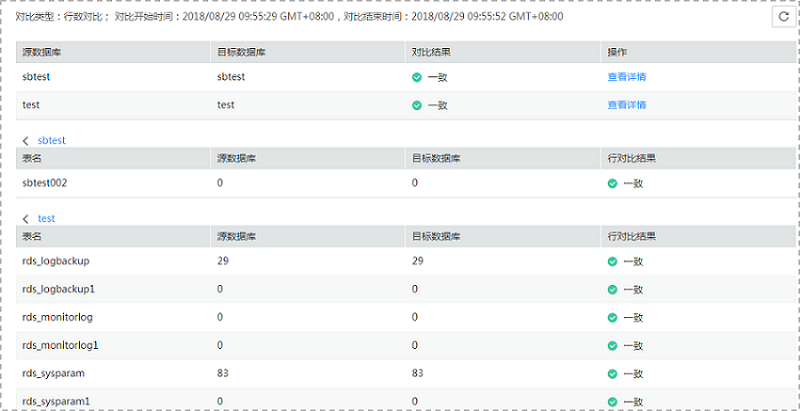

# 对比迁移项

对比迁移项可以清晰反馈出源数据库和目标数据库的数据是否存在差异。为了尽可能减少业务的影响和业务中断时间，数据库在线迁移场景提供了完整的迁移对比流程，帮助您确定最佳的业务割接时机。

**图 1**  迁移对比流程  

迁移对比功能支持对象级对比和数据级对比。

-   对象级对比：支持对数据库、事件、索引、表、视图、存储过程和函数、触发器等对象进行对比。
-   数据级对比：支持对表或者集合的行数和内容进行对比。

## 操作步骤

1.  登录管理控制台。
2.  单击管理控制台左上角的，选择区域和项目。
3.  单击“服务列表”，选择“数据库“  \>  “数据复制服务“，进入数据复制服务管理控制台。
4.  在“在线迁移管理“界面，选中指定迁移任务，单击任务名称，进入“基本信息”页签。
5.  单击“迁移对比“页签，进入“迁移对比”信息页面，对源数据库和目标数据库的数据进行对比分析。

    -   对象级对比有如下两种操作方法。

        方法一：单击迁移对比须知处的“对象检查”，进入“对象级对比”页签，查看各个对比项的对比结果。

        方法二：单击迁移对比页面下的“对象级对比”，查看各个对比项的对比结果。

        **图 2**  对象级对比  
        

        若需要查看对比项的对比结果详情，可单击指定对比项操作列的“详情”。

    -   数据级对比有如下两种操作方法。

        方法一：单击迁移对比须知处的“全面检查”或者“割接复查”，进入创建对比任务页面，选择“对比类型”、“对比时间”和“对象选择”，单击“确定”，提交对比任务。

        方法二：单击迁移对比页面下的“数据级对比”，然后单击“创建对比任务”，选择“对比类型”、“对比时间”和“对象选择”，单击“确定”，提交对比任务。

        **图 3**  创建对比任务  
        

        > **说明：**   
        >-   目前仅MySQL引擎支持内容对比，而且在进行内容对比之前，系统会帮助您对内容对比所需的耗时进行预估。  
        >-   仅增量迁移的任务可进行数据级对比。  

    对比任务提交成功后，返回“数据级对比”页签，单击刷新列表，可以查看到所选对比类型的对比结果。

    **图 4**  数据级对比结果  
    

    若需要查看对比类型详情，可单击指定对比类型操作列的“查看对比报表”，然后选择需要进行对比的数据库，单击操作列的“查看详情”，查看指定源数据库和目标数据库的对比结果详情。

    **图 5**  对比详情  
    

    > **说明：**   
    >已取消的对比任务也支持查看对比报表。  

