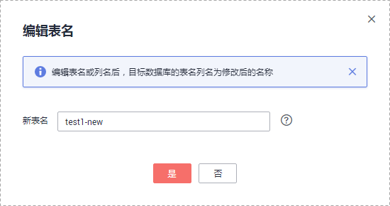

# 对象名映射

数据同步功能可以支持源数据库和目标数据库中的同步对象（包括schema、表）的名称不同。如果同步的数据库对象在源数据库和目标数据库中的命名不同，那么可以使用数据复制服务提供的对象名映射功能进行映射。其中包括：schema映射、表映射。

对象名映射功能支持在如下场景使用：

-   首次创建数据同步任务时，在选择同步对象阶段可设置映射，后续不可编辑映射。
-   通过编辑同步对象功能来增加或者减少同步对象时，首次编辑的对象可以设置映射关系，已经在同步关系中的对象不可设置映射。

本小节主要介绍如何在数据同步任务配置过程中，使用对象名映射功能，该功能的映射关系详情可参见[查看同步映射](查看同步映射.md)章节。

## schema映射

schema指数据库对象的集合，这个集合包含了各种对象如：表、视图、存储过程、索引等。

目前仅在MySQL-\>PostgreSQL的数据同步过程中，如果待同步的schema在源数据库和目标数据库中的名称不同，可以使用数据同步提供的schema映射功能进行schema名映射。例如：将源数据库中的schemaA同步到目标数据库，变成目标数据库中的schemaB，此时就可以使用schema映射功能来实现。

1.  在“设定同步“页面，同步对象右侧已选对象框中，选择需要进行映射的schema，单击“编辑”按钮。

    **图 1**  schema映射  
    

2.  修改schema名。

    在“编辑schema名“的弹出框中，填写新的schema名，修改后的名称即为保存在目标数据库中的schema名。

    **图 2**  修改schema名  
    

3.  查看修改结果。

    schema名修改成功后，您会看到修改前的schema名和修改后的新schema名，至此，表示完成schema映射的配置。

    **图 3**  查看schema修改结果  
    

## 表映射

目前仅在MySQL-\>PostgreSQL的数据同步过程中，如果待同步的表在源数据库和目标数据库中的名称不同，可以使用数据同步提供的表映射功能进行表名映射。例如：将源数据库中的A表同步到目标数据库，变成目标数据库中的B表，此时就可以使用表映射功能来实现。

1.  在“设定同步“页面，同步对象右侧已选对象框中，选择需要进行映射的表，单击“编辑”按钮。

    **图 4**  表映射  
    

2.  修改表名。

    在“编辑表名“的弹出框中，填写新的表名，修改后的名称即为保存在目标数据库中的表名。

    **图 5**  修改表名  
    

3.  查看修改结果。

    表名修改成功后，您会看到修改前的表名和修改后的新表名，至此，表示完成表映射的配置。

    **图 6**  查看修改结果  
    

