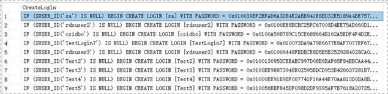
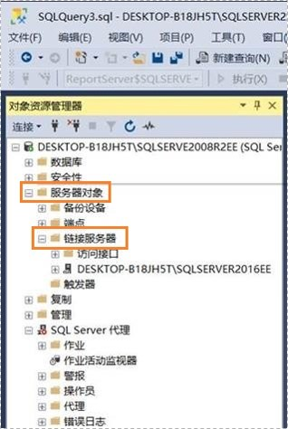
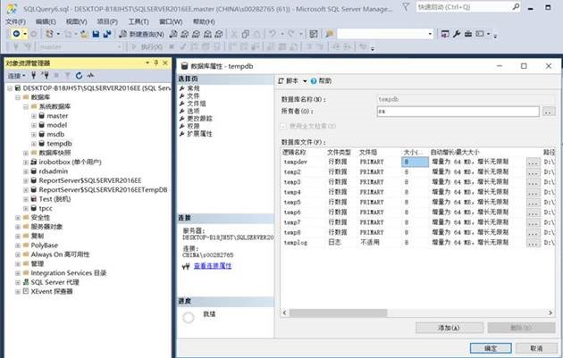
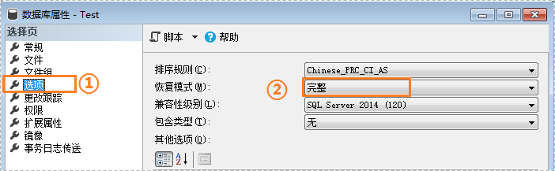

# 手动配置信息<a name="drs_04_0458"></a>

## 操作场景<a name="zh-cn_topic_0176256301_section188202055134817"></a>

目前从本地或虚拟机通过DRS备份迁移功能直接迁移到本云RDS for SQL Server实例上，在迁移完成后还需要针对**Login账号，DBLink，AgentJOB，关键配置**进行识别，并手动完成相关同步工作。

## Login账号<a name="zh-cn_topic_0176256301_section2091307145012"></a>

Login账号即SQL Server的实例级账号，主要用于用户管理用户服务器权限与数据库权限。一个用户通常会有多个该类型账号，用户迁移到RDS for SQL Server实例后，需要手动将自己本地的Login账号同步在实例上进行创建，以下方法将介绍如何在本云RDS for SQL Server实例上创建同名，同密码的Login账号，并进行授权操作。

1.  <a name="zh-cn_topic_0176256301_li165582910512"></a>通过以下脚本获取本地实例Login账号创建脚本，获取到的脚本可以直接在目标端上执行，以创建同名，同密码的Login账号。

    ```
    SELECT 'IF (SUSER_ID('+QUOTENAME(SP.name,'''')+') IS NULL) BEGIN CREATE LOGIN ' +QUOTENAME(SP.name)+
    CASE
    WHEN SP.type_desc = 'SQL_LOGIN' THEN ' WITH PASSWORD = ' +CONVERT(NVARCHAR(MAX),SL.password_hash,1)+ ' HASHED,SID=' +CONVERT(NVARCHAR(MAX),SP.SID,1)+',CHECK_EXPIRATION = '
    + CASE WHEN SL.is_expiration_checked = 1 THEN 'ON' ELSE 'OFF' END +', CHECK_POLICY = ' +CASE WHEN SL.is_policy_checked = 1 THEN 'ON,' ELSE 'OFF,' END
    ELSE ' FROM WINDOWS WITH'
    END
    +' DEFAULT_DATABASE=[' +SP.default_database_name+ '], DEFAULT_LANGUAGE=[' +SP.default_language_name+ '] END;' as CreateLogin
    FROM sys.server_principals AS SP LEFT JOIN sys.sql_logins AS SL
    ON SP.principal_id = SL.principal_id
    WHERE SP.type ='S'
    AND SP.name NOT LIKE '##%##'
    AND SP.name NOT LIKE 'NT AUTHORITY%'
    AND SP.name NOT LIKE 'NT SERVICE%'
    AND SP.name NOT IN ('rdsadmin','rdsbackup','rdsuser','rdsmirror','public')
    ```

2.  <a name="zh-cn_topic_0176256301_li189242430518"></a>执行[1](#zh-cn_topic_0176256301_li165582910512)脚本可获取如下执行脚本。

    **图 1**  获取执行脚本<a name="zh-cn_topic_0176256301_fig6837143945419"></a>  
    

3.  复制[2](#zh-cn_topic_0176256301_li189242430518)中的执行脚本在目标端直接执行，创建出来的Login账号跟原实例密码一致。
4.  将新建的Login账号跟用户当前RDS SQL Server实例上的迁移过来的数据库用户权限进行映射（mapping），以保证该账号在当前实例上的权限一致性，执行脚本如下。

    ```
    declare @DBName nvarchar(200)
    declare @Login_name nvarchar(200)
    declare @SQL nvarchar(MAX)
    set @Login_name = 'TestLogin7' //输入Login名称逐个执行
    declare DBName_Cursor cursor for
    select quotename(name)from sys.databases where  database_id > 4 and state = 0
    and name not like '%$%'
    and name <> 'rdsadmin'
    open DBName_Cursor
    fetch next from DBName_Cursor into @DBName
    WHILE @@FETCH_STATUS= 0
    begin
    SET @SQL='    USE '+ (@DBName)+ '
    if exists(select top 1 1 from sys.sysusers where name = '''+ @Login_Name +''')
    begin
    ALTER USER '+@Login_name+' with login = '+@Login_name+';
    end
    '
    print @SQL
    EXEC (@SQL)
    fetch next from DBName_Cursor into @DBName
    end
    close DBName_Cursor
    deallocate DBName_Cursor
    ```

    > **说明：** 
    >以上脚本执行完成后，用户即可在自己的新实例上看到同名的登录账号，并且密码跟权限是完全跟本地一致的。


## DBLink连接<a name="zh-cn_topic_0176256301_section52071439115917"></a>

DBLink连接指SQL Server支持用户通过创建DBLink连接的方式，跟外部实例上的数据库进行交互，这种方式可以极大的方便用户不同实例间，不同数据库类型之间的数据库查询，同步，比较，所以大部分用户都会在本地实例上用到该服务，但是迁移上云后，本地DBLink是不会自动同步到云上实例的，还需要简单的手动进行同步。

1.  通过微软提供的官方Microsoft SQL Server Management Studio客户端工具连接本地实例与云上实例，同时在“服务器对象  \>  链接服务器“下找到当前实例的DBLink链接。

    **图 2**  查看DBLink链接<a name="zh-cn_topic_0176256301_fig884815171441"></a>  
    

2.  选中链接服务器，然后按F7，会自动弹出对象资源管理信息页，在该页面中可以方便你快速的自动创建脚本。

    **图 3**  自动创建脚本<a name="zh-cn_topic_0176256301_fig84063271710"></a>  
    

3.  在新窗口中，可以看到当前实例上所有DBLink的创建脚本，仅需复制该脚本到目标实例上，并修改@rmtpassword上的密码即可执行创建操作。

    ```
    USE [master]
    GO
     
    /****** Object:  LinkedServer [DRS_TEST_REMOTE]    Script Date: 2019/5/25 17:51:50 ******/
    EXEC master.dbo.sp_addlinkedserver @server = N'DRS_TEST_REMOTE', @srvproduct=N'', @provider=N'SQLNCLI', @datasrc=N'DESKTOP-B18JH5T\SQLSERVER2016EE'
    /* For security reasons the linked server remote logins password is changed with ######## */
    EXEC master.dbo.sp_addlinkedsrvlogin @rmtsrvname=N'DRS_TEST_REMOTE',@useself=N'False',@locallogin=NULL,@rmtuser=N'sa',@rmtpassword='########'
    GO
    ```

    > **说明：** 
    >以上脚本为范例，创建的脚本可能包含大量系统默认配置项，但是每个DBLink仅需保留以下两个关键脚本即可执行成功，同时需要注意重新输入账号连接密码。


## Agent JOB<a name="zh-cn_topic_0176256301_section17559155318126"></a>

Agent JOB又名SQL Server代理服务，可以方便用户快速的在实例上创建定时任务，帮助用户进行日常运维和数据处理工作，用户在本地的JOB需要手动进行脚本迁移。

1.  通过微软提供的官方Microsoft SQL Server Management Studio客户端工具连接本地实例与云上实例，同时在“SQL Server代理  \>  作业“下找到当前实例上的所有JOB任务。

    **图 4**  查看作业<a name="zh-cn_topic_0176256301_fig6899153841518"></a>  
    

2.  选择SQL Server代理下的作业，然后按F7，可以在对象资源管理器中看到所有的作业（JOB），全部选中后创建脚本到新窗口。

    **图 5**  创建脚本<a name="zh-cn_topic_0176256301_fig85571036111918"></a>  
    

3.  复制新窗口中的T-SQL创建脚本到新实例上，然后注意修改如下几个关键项，以保障你的创建成功。

    -   注意修改每个JOB上的Ower账号：

        例如：

        @owner\_login\_name=N'rdsuser'

    -   注意修改每个JOB上的实例名称：

        例如：

        @server=N'实例IP'

        @server\_name = N'实例IP'

    > **说明：** 
    >新建JOB的Owner账号十分重要，在RDS SQL Server上，仅有该JOB的Owner可以看到实例上自己的JOB，别的Login账号是看不到无法操作的，所以建议所有的JOB Owner尽量是同一个账号方便管理。


## 关键配置<a name="zh-cn_topic_0176256301_section0974192263711"></a>

用户将数据库还原到RDS for SQL Server实例上之后，本地的一些重要配置项也需要进行同步确认，避免影响业务的正常使用。

1.  tempdb：临时数据库的文件配置需要进行同步。

    推荐配置为8个临时文件，注意路径一定要确保在D:\\RDSDBDATA\\Temp\\

    通过在目标数据库端执行如下脚本添加临时数据库的文件配置：

    ```
    USE [master]
    GO
    ALTER DATABASE [tempdb] ADD FILE ( NAME = N'tempdb1', FILENAME = N'D:\RDSDBDATA\Temp\tempdb1.ndf' , SIZE = 65536KB , FILEGROWTH = 65536KB )
    GO
    ALTER DATABASE [tempdb] ADD FILE ( NAME = N'tempdb2', FILENAME = N'D:\RDSDBDATA\Temp\tempdb2.ndf' , SIZE = 65536KB , FILEGROWTH = 65536KB )
    GO
    ALTER DATABASE [tempdb] ADD FILE ( NAME = N'tempdb3', FILENAME = N'D:\RDSDBDATA\Temp\tempdb3.ndf' , SIZE = 65536KB , FILEGROWTH = 65536KB )
    GO
    ALTER DATABASE [tempdb] ADD FILE ( NAME = N'tempdb4', FILENAME = N'D:\RDSDBDATA\Temp\tempdb4.ndf' , SIZE = 65536KB , FILEGROWTH = 65536KB )
    GO
    ALTER DATABASE [tempdb] ADD FILE ( NAME = N'tempdb5', FILENAME = N'D:\RDSDBDATA\Temp\tempdb5.ndf' , SIZE = 65536KB , FILEGROWTH = 65536KB )
    GO
    ALTER DATABASE [tempdb] ADD FILE ( NAME = N'tempdb6', FILENAME = N'D:\RDSDBDATA\Temp\tempdb6.ndf' , SIZE = 65536KB , FILEGROWTH = 65536KB )
    GO
    ALTER DATABASE [tempdb] ADD FILE ( NAME = N'tempdb7', FILENAME = N'D:\RDSDBDATA\Temp\tempdb7.ndf' , SIZE = 65536KB , FILEGROWTH = 65536KB )
    GO
    ```

    **图 6**  检查临时文件<a name="zh-cn_topic_0176256301_fig958914148421"></a>  
    

2.  数据库隔离级别：请确认原实例上数据库的隔离级别是否开启，并同步到RDS SQL Server实例，快照隔离参数有2个，分别是：

    -   读提交快照（Is Read Committed Snapshot On）
    -   允许快照隔离（Allow Snapshot Isolation）

    若原实例上数据库的隔离级别是开启的，您可以通过在目标数据库端执行如下脚本开启数据库的隔离级别：

    ```
    USE [DBName]
    GO
    ALTER DATABASE [DBName] SET READ_COMMITTED_SNAPSHOT ON WITH NO_WAIT
    GO
    ALTER DATABASE [DBName] SET ALLOW_SNAPSHOT_ISOLATION ON
    GO
    ```

3.  实例最大并行度：实例最大并行度在RDS for SQL Server实例上默认设置为0，用户也可以根据自己本地原来的设置项进行同步设置，避免不同环境下业务场景出现异常。

    右击本地实例选择属性，在服务器属性弹出框中选择高级，然后在右侧找到最大并行度（max degree of parallelism）设置项，确认本地实例设置值，并同步在目标RDS for SQL Server实例管理的参数组中进行修改。

    **图 7**  查看本地实例最大并行度值<a name="zh-cn_topic_0176256301_fig359115393442"></a>  
    

    登录本云实例控制台，在实例管理页，单击目标实例名称，进入基本信息页签，切换至“参数修改”，搜索最大并行度（max degree of parallelism）并进行修改。

    **图 8**  修改目标RDS for SQL Server实例的最大并行度<a name="zh-cn_topic_0176256301_fig833718335366"></a>  
    

4.  迁移上云的数据库恢复模式是否为完整（FULL）模式，如果不是需要进行修改。

    右击数据库选择属性，在弹出数据库属性框中选择选项，并在右侧确认该数据库恢复模式为完整（FULL），保证该数据库高可用和备份策略可执行。

    **图 9**  检查数据库恢复模式<a name="zh-cn_topic_0176256301_fig62811724572"></a>  
    


