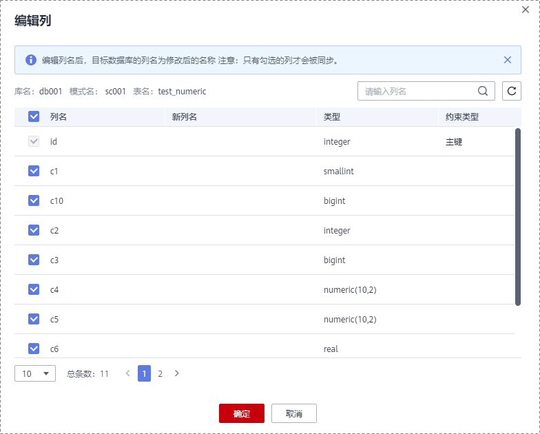
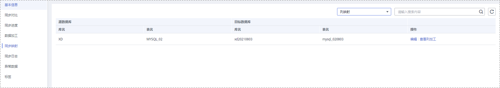

# 数据加工

数据复制服务支持对同步的对象进行加工，即可以为选择的对象添加规则。各链路支持的加工规则不一样，可参考以下方式进行添加。

## 添加同步时间戳

1.  在“数据加工“页面，“源库对象选择区“中选择需要加工的表对象。
2.  单击“数据加工区“区域，单击“添加规则“，填写需要添加的列名、类型、选项等信息。

    > **说明：** 
    >-   需要添加规则的列为表中已有列，且不能为主键。
    >-   仅支持使用数据类型为时间戳类型（TIMESTAMP）的列作为规则列。

3.  检查无误后，单击“下一步“，进入下一步操作。

## 添加附加列

1.  在“数据加工“页面选择“附加列”，对于需要加工的表对象，填写列名和操作类型信息。

    **图 1**  附加列  
    

    > **说明：** 
    >-   不允许对唯一主键列进行数据加工。
    >-   列名为空，则不添加此列。多对一映射场景下，需要使用数据加工的附加列操作来避免数据冲突。
    >-   操作类型分为“以create\_time为列”、“以update\_time为列”、“以database@table为列”和“以serverName@database@table为列”。
    >-   后两种操作会使用@符号分别拼接serverName、源库的库名、表名填充新加的列，其中serverName为手动输入。
    >-   支持“批量设置”，将第一个可编辑表的附加列信息应用到此任务中所有可编辑的表。
    >-   MySQL-\>GaussDB\(for MySQL\)主备版同步，单表的列数超过500时， 对该表添加附加列可能会超过列数上限，会导致任务失败。

2.  检查无误后，单击“下一步“，进入下一步操作。

## 数据过滤

数据过滤规则添加后，在源库执行更新操作的处理原则，以数据一致为首要目标。即：

-   更新前不符合过滤条件，更新后符合。继续同步，在目标库执行相同的更新操作，如果匹配不到数据，则会忽略，会导致数据不一致。
-   更新前符合过滤条件，更新后不符合。继续同步，在目标库执行相同的更新操作。

1.  在“数据加工“页面选择“数据过滤“。

    **图 2**  数据过滤  
    

2.  在“对象选择“区域选择需要加工的表对象。
3.  在过滤条件区域，填写过滤条件（只需填写SQL语句的WHERE之后部分，例如id=1）后，单击“校验“。

    > **说明：** 
    >-   每张表仅支持添加一个校验规则。
    >-   Oracle为源库的数据过滤每次最多支持500张表，MySQL为源库的数据过滤每次最多支持500张表。
    >-   过滤条件不支持使用某种数据库引擎特有的packege、函数、变量、常量等写法，须使用通用SQL标准。

4.  校验通过后，单击“生成加工规则“，即可在加工规则表格中看到该规则。
5.  如果需要使用关联表查询，可以在“高级设置”中设置关联表的“配置条件”和“配置规则”，辅助您进行数据过滤。

    **图 3**  高级设置  
    

    1.  在“配置条件”中，根据在[3](#li1877812132515)输入的过滤条件，填写关联表的相关信息。

        “库名”、“表名”、“列名”、“主键”、“索引”和“过滤条件”均为必填项。如果该表没有索引，则填写主键。

        “过滤条件”即在[3](#li1877812132515)输入的该关联表的过滤条件。

    2.  填写完成，单击“校验规则”。
    3.  校验成功后，单击“生成配置规则”。即可在配置规则表格中看到该规则。

        如果需要进行多张关联表的数据过滤，重复执行[5](#li777815215252)即可。

        > **说明：** 
        >配置规则支持删除操作。

6.  检查无误后，单击“下一步“，进入下一步操作。

## 列加工

1.  在“数据加工“页面选择“列加工“。
2.  在“对象选择“区域选择需要加工的对象。

    **图 4**  列加工  
    

3.  单击右侧已选对象的“编辑“。
4.  在“编辑列”中，勾选需要映射的列，填写映射后的“新列名”。

    **图 5**  编辑列  
    

    > **说明：** 
    >-   列加工提供列级的查询、映射和过滤能力。
    >-   编辑列名后，目标数据库的列名为修改后的名称。
    >-   列映射名不能和原列名或已存在的映射名相同。
    >-   任务再编辑时，已经同步的表不支持修改列信息。
    >-   只有勾选的列才会被同步。
    >-   GaussDB\(for openGauss\)分区键不可以被过滤。

5.  填写完成后单击“确定”。
6.  检查无误后，单击“下一步“，进入下一步操作。

## 查看数据过滤

1.  在“管理”页面任务列表中，选择需要查看数据加工的任务，单击任务名称。
2.  选择“数据加工“页签，查看数据过滤记录。单击右上角的，可刷新数据。

## 查看列加工

1.  在“管理”页面任务列表中，选择需要查看的任务，单击任务名称。
2.  选择“同步映射“页签，单击右上角选择列映射，查看列映射记录。单击右上角的，可刷新数据。

    **图 6**  查看列映射  
    

