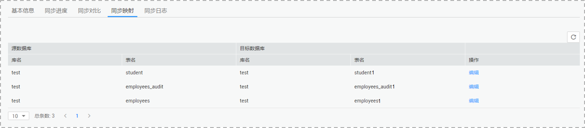

# 查看同步映射

实时同步映射关系包括对象选择时的库映射、schema映射、表映射和数据加工时的列映射。当同步映射关系配置成功后，启动实时同步任务即可查看同步映射详情。

## 前提条件

已登录数据复制服务控制台。

## 操作步骤

1.  在“实时同步管理”界面，选择指定的同步任务，单击任务名称。
2.  页面跳转至“基本信息”，切换到“同步映射“页签，查看当前同步任务的映射关系。

    **图 1**  查看同步映射信息  
    

    > **说明：** 
    >选择对象的时候，对象名称的前后空格不显示，中间如有多个空格只显示一个空格。

3.  当前同步任务的映射关系包括同步对象映射和列映射，可通过右上角进行筛选和搜索。

