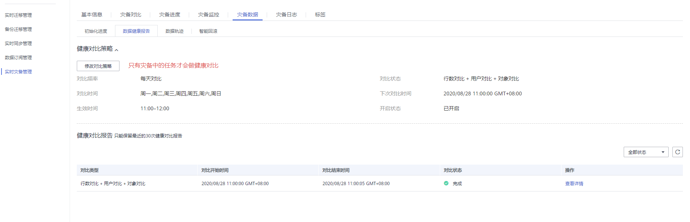
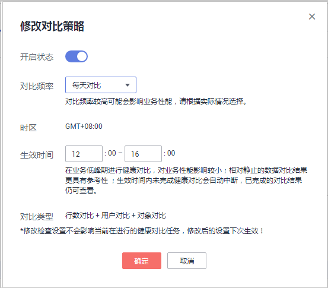

# 查看灾备数据

灾备数据记录了灾备任务完成的数据同步记录，您可以通过该功能，了解灾备数据同步的完整性。

数据复制服务支持通过管理控制台查看灾备数据的初始化进度及数据健康报告。

## 前提条件

-   已登录数据复制服务管理控制台。
-   已成功创建数据灾备任务。

## 操作步骤

1.  在“多活灾备管理”页面，选择指定的灾备任务，单击任务名称。
2.  页面跳转至“基本信息”页签，单击“灾备数据”页签。
    -   初始化进度

        仅展示了初次创建灾备环境时，历史数据导入的进度信息，帮助用户了解灾备环境创建进度，完成历史数据导入后，意味着初始化已完成，该模块数据将不再更新。

    -   数据健康报告

        支持用户修改对比策略，周期性展示主实例与备实例的数据一致性对比结果，用于帮助用户审视灾备环境的数据健康情况。

        > **说明：**   
        >-   只有灾备中的任务才会进行健康对比。  
        >-   仅保留最近30次健康对比报告。  

        **图 1**  数据健康报告  
        

        -   修改对比策略

            修改对比策略不会影响当前进行的健康对比任务，修改后的设置在下次生效。

            -   在“数据健康报告“页签的“健康对比策略“区域，单击“修改对比策略“，进入修改对比策略界面。

                **图 2**  修改对比策略  
                

            -   在“修改对比策略“界面设置各个参数。
                -   开启状态：关闭健康对比策略后，下一次的健康对比将不会再进行，历史健康报告仍可正常查看。
                -   对比频率：提供“每周对比“和“每天对比“两种对比频率。
                -   对比时间：对比频率选择“每周对比“时，可设置周一到周日的一天或多天为对比时间。
                -   时区：默认为本地时区。
                -   生效时间：设置对比策略生效的时间段，建议设置在业务低峰期进行对比。生效时间内未完成健康对比会自动中断，已完成的对比结果仍可查看。
                -   对比类型：默认为行对比+用户对比+对象对比。

            -   单击“确定“，完成修改对比策略。

                修改成功后，将在生效时间启动对比任务，您可以取消进行中的任务，取消后，已经对比成功的健康报告仍可查看。

