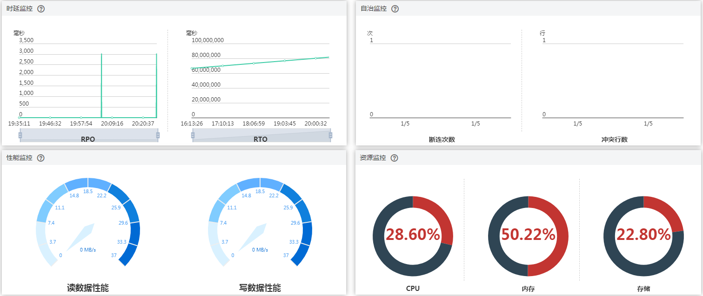
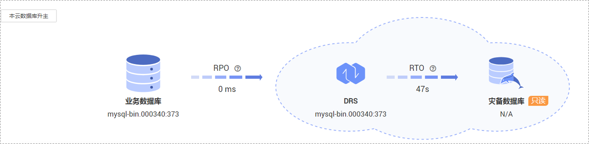

# 查看灾备监控

数据复制服务提供对迁移实例性能和进度的监控，可根据界面的监控数据判断链路健康度、数据完整性等，以便及时排查和处理引起数据差异的问题，也可作为数据恢复时的参考依据。RPO和RTO均为0时，表示数据已经完全迁移到灾备库，可以作为主备倒换的参考。

## 前提条件

-   已登录数据复制服务管理控制台。
-   已成功创建数据灾备任务。

## 操作步骤

1.  在“多活灾备管理”页面，选择指定的灾备任务，单击任务名称进入“基本信息“页签。
2.  在“基本信息“页签，单击“灾备监控”页签。
    -   RPO（Recovery Point Object），为业务数据库与DRS实例数据差的一种度量方式，RPO=0时，意味着业务数据库的数据已经全部到达DRS实例。
    -   RTO（Recovery Time Object），处在传输中数据量的一种度量方式，RTO=0时，意味着DRS实例上的事务已经全部在灾备数据库上执行完毕。
    -   时延监控：展示RPO、RTO的历史数据轨迹，对真实灾难将发生时的数据丢失量具有一定的预测意义。可重点关注以下两种类型数据：
        -   长时间RPO、RTO高的时间段。
        -   规律性RPO、RTO高的时间段。

    -   自治监控：展示DRS的智能自制能力，主要包括：
        -   网络断连时，DRS自动重连并断点续传的次数。
        -   发生数据冲突时，DRS自动使用最新数据覆盖旧数据的次数。

    -   性能监控：展示了DRS实例的实时读取速度和写入速度，有助于诊断性能瓶颈。
    -   资源监控：展示了DRS实例的资源使用情况，有助于诊断性能瓶颈。

        **图 1**  灾备监控  
        

1.  灾备中的任务可进行主备倒换。

    灾备为单主灾备关系，不支持多写的多主模式，主备倒换时请确保即将成为备节点的数据库已经停止数据写入，且作为备节点未来也不会有数据写入，备节的数据只来自主节点的同步，任何其他地方的写入将会导致备库数据被污染，使得灾备出现数据冲突而无法修复。

    -   方法一

    单击“本云数据库升主“，本云实例将升为业务数据库。单击“本云数据库降备“，本云实例将降为灾备数据库。

    **图 2**  灾备监控  
    

    -   方法二

        在“多活灾备管理“页面，勾选需要主备倒换的任务，单击左上方的“主备倒换“，可业务数据库降为灾备数据库，或者灾备数据库升为业务数据库。

