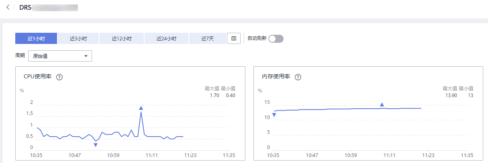

# 查看监控指标

## 操作场景

云服务平台提供的云监控，可以对数据复制服务的实时迁移、实时同步和实时灾备实例（下文简称实例）的运行状态进行日常监控。您可以通过管理控制台，直观地查看实例的各项监控指标。由于监控数据的获取与传输会花费一定时间，因此，云监控显示的是当前时间5～10分钟前的实例状态。如果您的实例刚创建完成，请等待5～10分钟后查看监控数据。

## 前提条件

实例正常运行，即：

-   实时迁移：状态为全量迁移、增量迁移。
-   实时同步：状态为全量同步、增量同步。
-   实时灾备：状态为灾备中。

## 查看实例监控

1.  登录管理控制台。
2.  单击管理控制台左上角的，选择区域和项目。
3.  选择“数据库  \>  数据复制服务“。进入数据复制服务页面。
4.  单击左侧目录的“实时迁移管理“，在“实时迁移管理“”页面，单击目标实例名称，进入基本信息页面（此处以实时迁移为例，实时同步和实时灾备操作类似）。
5.  在实例的基本信息页面，单击右上角的“查看监控“，跳转到云监控页面。

    该页面默认展示数据复制服务实例监控信息。

6.  在云监控页面，可以查看实例监控信息。
    -   通过“设置监控指标“框可选择您在页面中要展示的指标名称并排序。
    -   您也可根据业务需求，拖动其中的监控视图，调整监控视图的顺序。
    -   云监控支持的性能指标监控时间窗包括：近1小时、近3小时、近12小时、近24小时、近7天和近30天。

        **图 1**  查看实例监控信息  
        

