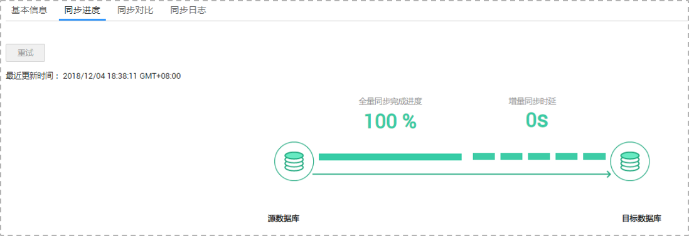

# 查询同步进度

数据同步进度展示了全量同步过程中，数据同步任务的表同步进度，可以帮助您了解全量同步完成的情况。

## 前提条件

已登录数据复制服务控制台。

## 操作步骤

1.  在“数据同步管理“界面，选中指定同步任务，单击任务名称，进入“基本信息”页面。
2.  单击“同步进度“页签，查看表同步进度。

    -   对于MySQL-\>MySQL的同步过程，全量同步的进度是以全量完成剩余时间的形式显示的，您可以通过该时间来判断全量同步的进度。当全量同步完成时，显示全量同步已完成100%。
    -   对于MySQL-\>PostgreSQL的同步过程，全量同步的进度是以全量完成进度比的形式显示的，您可以通过该百分比来判断全量同步的进度。当全量同步完成时，显示全量同步已完成100%。

        **图 1**  同步进度  
        

    当全量同步完成后，开始进行增量同步，可在“同步进度”页签下，查看增量同步时延，**当时延为0s时，说明源数据库和目标数据库的数据是实时同步的。**

