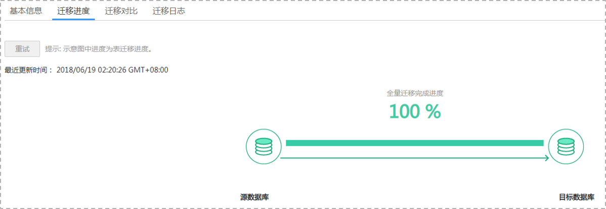

# 查询迁移进度

迁移进度展示了全量迁移过程中，在线迁移任务的表迁移进度，可以帮助您了解全量迁移完成的情况。

## 前提条件

已登录数据复制服务控制台。

## 操作步骤

1.  在“在线迁移管理“界面，选中指定迁移任务，单击任务名称，进入“基本信息”页面。
2.  单击“迁移进度“页签，查看表迁移进度。

    对于MySQL数据库，可通过全量迁移完成剩余时间，来判断全量迁移完成的进度。当全量迁移完成时，显示全量迁移已完成100%。

    **图 1**  查看迁移进度  
    

    对于Microsoft SQL Server，PostgreSQL和MongoDB数据库，可通过全量迁移完成进度比，来了解全量迁移完成的情况。当全量迁移完成时，显示全量迁移完成进度100%。

    **图 2**  查看迁移完成进度  
    

    > **说明：**   
    >目前仅MySQL支持显示全量迁移完成剩余时间。  

    如果您选择的是“全量+增量”的迁移模式，当全量迁移完成后，开始进行增量迁移，可在“迁移进度”页签下，查看增量迁移同步时延，**当时延为0s时，说明源数据库和目标数据库的数据是实时同步的。**

    **图 3**  查看增量时延  
    

