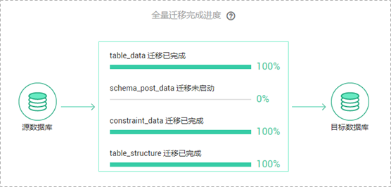

# 查询在线迁移进度

迁移进度展示了全量迁移过程中，在线迁移任务的表迁移进度，可以帮助您了解全量迁移完成的情况。

## 操作步骤

1.  登录管理控制台。
2.  单击管理控制台左上角的，选择区域和项目。
3.  单击“服务列表”，选择“数据库“  \>  “数据复制服务“，进入数据复制服务管理控制台。
4.  在“在线迁移管理“界面，选中指定迁移任务，单击任务名称，进入“基本信息”页面。
5.  单击“迁移进度“页签，查看表迁移进度。

    对于MySQL数据库，可通过全量迁移完成剩余时间，来判断全量迁移完成的进度。当全量迁移完成时，显示全量迁移已完成100%。

    **图 1**  查看MySQL迁移进度  
    

    对于Microsoft SQL Server，PostgreSQL和MongoDB数据库，可通过全量迁移完成进度比，来了解全量迁移完成的情况。当全量迁移完成时，显示全量迁移完成进度100%。

    **图 2**  查看迁移进度  
    

    > **说明：**   
    >目前仅MySQL支持显示全量迁移完成剩余时间。  

    如果您选择的是“全量+增量”的迁移模式，当全量迁移完成后，开始进行增量迁移，可在“迁移进度”页签下，查看增量迁移同步时延，**当时延为0s时，说明源数据库和目标数据库的数据是实时同步的。**

    **图 3**  查看增量时延  
    

    对于以下迁移状态的任务，如果任务失败，可单击“迁移进度”页签下的“重试“按钮，重新提交迁移任务。

    -   全量迁移
    -   增量迁移

    > **说明：**   
    >增量迁移失败的任务，系统默认进行三次自动重试，若三次重试后仍无法恢复增量迁移，可手动进行重试。  

