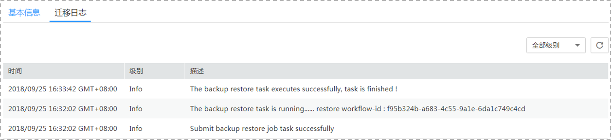

# 查看迁移日志

迁移日志记录了数据迁移过程中的信息，包含告警、错误和提示等类型的信息。迁移过程中，可以通过查看迁移日志信息，帮助您分析系统中存在的问题。

## 前提条件

已登录数据复制服务控制台。

## 操作步骤

1.  在“备份迁移管理”界面，选择指定的迁移任务，单击任务名称。
2.  在“迁移日志“页签，查看当前迁移任务的日志。

    **图 1**  查看备份迁移日志  
    

    您可查看到日志对应的时间，级别和描述。

