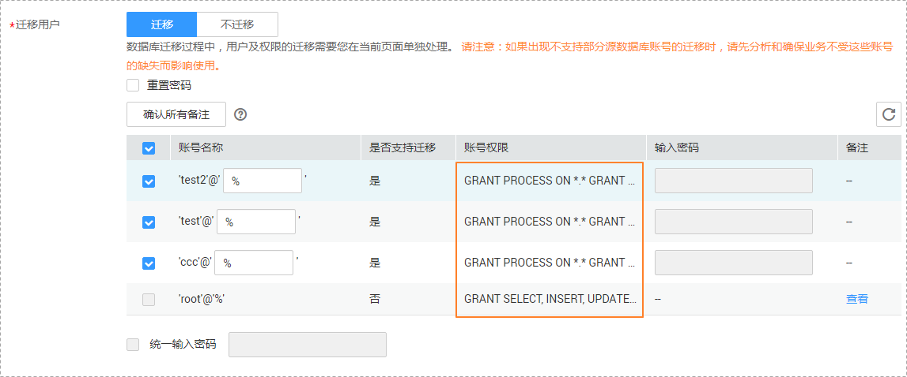
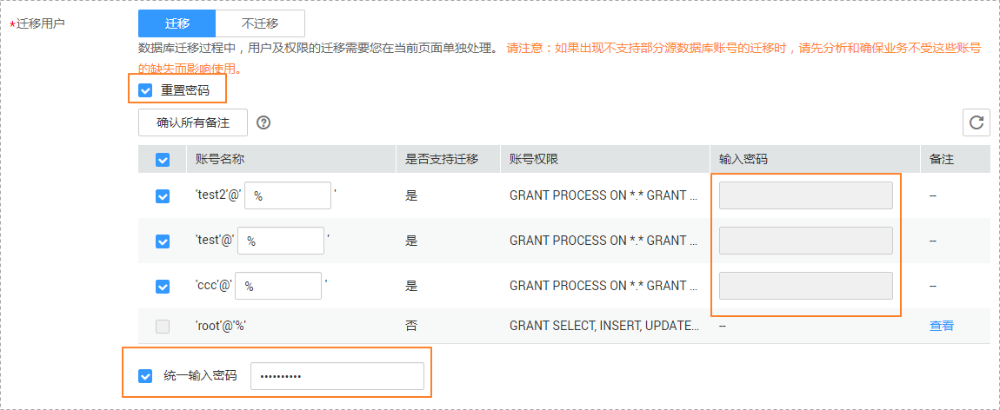
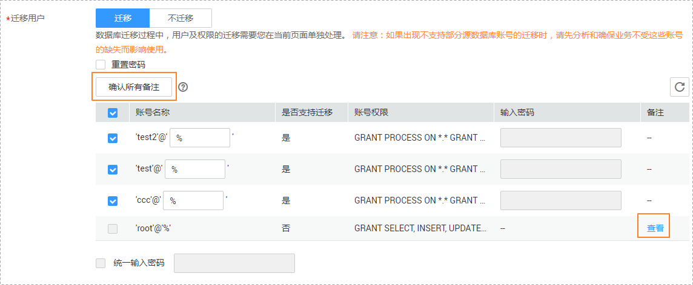

# 迁移用户

## 操作场景

数据库的迁移过程中，迁移用户需要进行单独处理。

## MySQL数据库操作

在MySQL迁移过程中，常见的迁移用户一般分为三类：可完整迁移的用户、需要降权的用户和不可迁移的用户。

-   可完整迁移的用户：可完整迁移的用户指满足目标数据库权限要求的用户，该类用户在进行迁移时不需要做任何处理，系统默认会将对应的数据库用户权限迁移至目标数据库。
-   需要降权处理的用户：需要降权的用户指具有不满足目标数据库权限要求的部分高权限的用户，比如具有：super、file、shutdown等高权限的用户。该类用户在进行迁移时需要进行降权处理，否则会导致迁移失败。

    对于该类账号不支持的高权限，将会由DRS自动进行降权处理，您可以通过单击备注列的“查看“按钮查看具体的降权处理信息，依据该信息，可以帮助您评估降权是否对其业务程序造成相关影响。

-   不可迁移的用户：不可迁移的用户指由于某些原因，DRS不支持该类数据库用户的迁移。该类账号将在目标数据库中缺失，请先确保业务不受该类账号影响。同时，任务启动后，所有针对该类账号进行的权限密码操作，将会导致增量迁移失败。

您可以根据业务需求选择“迁移”或者“不迁移”这些用户，当您选择“迁移“数据库用户时，可以选择部分迁移，也可以选择全部迁移。可按照如下操作步骤进行数据库用户、权限和密码的处理，此处以勾选所有可以迁移的数据库用户为例。

迁移用户模块主要由账号名称、账号权限和账号密码三部分构成。

1.  一般账号名称的组成格式为：'账号名'+@+'_host_'，其中host表示具体允许访问源端数据库的目标库IP地址，您可以根据具体的业务场景选择是否需要修改账号的host地址，对目标库IP进行重规划。

    host地址可在如下图所示的输入框中进行修改即可。源库为MySQL 8.0时，不建议修改host地址。

    **图 1**  修改host地址  
    

2.  账号权限一般默认不可修改，对于支持迁移的账号（可完整迁移的用户和需要降权的用户），系统也将默认支持对应用户权限的迁移。

    迁移成功后，存储在目标数据库中的对应用户（需要降权的用户）是经过降权处理的用户。

    **图 2**  账号权限  
    

3.  DRS支持数据库用户密码的迁移。

    数据库用户密码的迁移可通过如下两种方式来处理。

    由于DRS在迁移时不会分析您的密码数据和强度，源系统密码复杂度过弱则存在安全风险，为了确保迁移过程中数据的安全性，您可以根据业务需求，选择是否需要重新设置数据库用户密码，通过设置较高的密码复杂度来持续保护数据库。

    方式一：密码迁移。

    **图 3**  密码迁移  
    

    您可以选择在迁移的过程中，直接迁移源数据库系统当前的密码，此时不需要通过勾选“重置密码”来设置新密码。数据库用户密码迁移至目标库后，您如果担心用户密码强度较弱，为了确保数据库的安全性，此时也可以选择在目标库端重新设置强度较高的源系统密码。

    方式二：重置密码。

    **图 4**  重置密码  
    

    如上图所示，您可以通过勾选“重置密码”选择立即重新设置源系统密码后再继续进行用户密码迁移。

    您可以选择某个指定支持迁移的用户，在“输入密码”列直接设置新密码或者选择所有支持迁移的用户，勾选右下角“统一输入密码”，批量将所选用户密码设置为相同的密码，以便快速完成迁移。使用批量方法设置的密码，待迁移成功后，可以在目标数据库端通过执行DDL语句，进行密码重置。

4.  对于需要降权处理的用户和不支持迁移的用户，在备注列的查看详情中会提示具体的原因，您需要单击对应用户备注列的“查看”，确认详情后才可进行下一步操作。如果存在多个需要查看备注详情的用户，您也可以单击“确认所有备注”按钮，一键查看备注信息。

    **图 5**  查看备注信息  
    

    **数据库用户已存在是不支持迁移到目标数据库的常见情形，此时您可以根据实际情况，决定是否需要删除目标端已存在的数据库用户，并单击“刷新“按钮，刷新当前数据库迁移用户的分类。**

    > **说明：**   
    >-   目前仅MySQL支持迁移用户功能。  
    >-   以上重新设置的密码强度必须满足[目标数据库的密码复杂度要求](https://support.huaweicloud.com/drs_faq/drs_14_0004.html)。  

## MongoDB数据库操作

在MongoDB数据库迁移过程中，常见的迁移用户一般分为两类：可迁移的用户和不可迁移的用户。

您可以根据业务需求选择“迁移”或者“不迁移”这些用户，当您选择迁移数据库用户时，需要按照如下操作步骤进行数据库用户及角色的处理。

迁移用户模块主要由账号名称、账号角色两部分构成。

1.  对于可支持迁移的用户或者角色，您可以根据业务需求选择需要迁移的账号及角色。

    如果所选迁移的账号依赖于某些角色，需要同时迁移该账号和所依赖的角色，否则会导致迁移失败。

    **图 6**  选择迁移用户  
    

2.  对于不支持迁移的用户或者角色，在备注列的查看详情中会提示具体的原因，您需要单击对应用户备注列的“查看”，确认详情后才可进行下一步操作。如果存在多个需要查看备注详情的用户，您也可以单击“确认所有备注”按钮，一键查看备注信息。

    **图 7**  查看备注信息  
    

