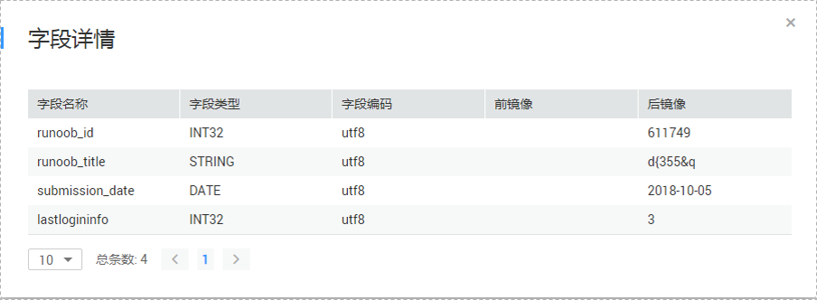

# 查看订阅数据

数据复制服务支持通过管理控制台在线查看增量订阅数据，能够查看的时间范围为订阅任务的数据范围（不含视图和存储过程的数据）。

本小节介绍在线查看订阅数据的方式，及数据记录的各个字段的含义。

## 前提条件

-   已登录数据复制服务管理控制台。
-   已成功创建数据订阅任务。

## 操作步骤

1.  在“数据订阅管理”页面，选择指定的订阅任务，单击任务名称。
2.  页面跳转至“基本信息”页签，单击“订阅数据”页签，查看订阅数据列表。

    当前数据列表默认显示前5分钟的增量订阅数据。若需要查看指定时间段的订阅数据，您可以在页面右上角，根据需求选择显示订阅数据的时间段，设置的时间段必须在订阅任务的数据范围内。

    **图 1**  查看订阅数据  
    

    订阅数据展示的数据格式为数据复制服务内部的数据格式，数据记录的各个字段含义如[表1](#table1521748141519)所示：

    **表 1**  数据字段含义

    
    <table><thead align="left"><tr id="row351114871510"><th class="cellrowborder" valign="top" width="19.1%" id="mcps1.2.3.1.1">
<strong id="b195184815150">数据字段名称</strong>

    </th>
    <th class="cellrowborder" valign="top" width="80.9%" id="mcps1.2.3.1.2">
<strong id="b135104891511">说明</strong>

    </th>
    </tr>
    </thead>
    <tbody><tr id="row25134820150"><td class="cellrowborder" valign="top" width="19.1%" headers="mcps1.2.3.1.1 ">
服务ID

    </td>
    <td class="cellrowborder" valign="top" width="80.9%" headers="mcps1.2.3.1.2 ">
RDS实例的IP：PORT。

    </td>
    </tr>
    <tr id="row165124814152"><td class="cellrowborder" valign="top" width="19.1%" headers="mcps1.2.3.1.1 ">
库名

    </td>
    <td class="cellrowborder" valign="top" width="80.9%" headers="mcps1.2.3.1.2 ">
这条变更记录对应表所在的数据库的库名。

    </td>
    </tr>
    <tr id="row1552114810156"><td class="cellrowborder" valign="top" width="19.1%" headers="mcps1.2.3.1.1 ">
表名

    </td>
    <td class="cellrowborder" valign="top" width="80.9%" headers="mcps1.2.3.1.2 ">
这条变更记录对应的表的表名。

    </td>
    </tr>
    <tr id="row1252204812151"><td class="cellrowborder" valign="top" width="19.1%" headers="mcps1.2.3.1.1 ">
变更类型

    </td>
    <td class="cellrowborder" valign="top" width="80.9%" headers="mcps1.2.3.1.2 ">
这条变更记录的变更类型，包括：update、delete、insert、replace、begin、commit、ddl、dml。

    </td>
    </tr>
    <tr id="row45214831516"><td class="cellrowborder" valign="top" width="19.1%" headers="mcps1.2.3.1.1 ">
位点

    </td>
    <td class="cellrowborder" valign="top" width="80.9%" headers="mcps1.2.3.1.2 ">
这条变更记录在binlog中的位点，格式为binlog_file_offset@binlog_file_id，其中binlog_file_id为binlog文件名的后缀，binlog_file_offset为这条binlog记录在binlog文件中的偏移量。

    </td>
    </tr>
    <tr id="row16526484152"><td class="cellrowborder" valign="top" width="19.1%" headers="mcps1.2.3.1.1 ">
时间戳

    </td>
    <td class="cellrowborder" valign="top" width="80.9%" headers="mcps1.2.3.1.2 ">
这条变更记录写入到binlog文件中时的时间戳。

    </td>
    </tr>
    </tbody>
    </table>

    如果您想查看指定数据库下指定表的数据详情，可以单击指定表操作列的“查看数据详情”。

    **图 2**  字段详情  
    

    数据详情可参考[表2](#table253194817151)：

    **表 2**  字段详情

    
    <table><thead align="left"><tr id="row453174817150"><th class="cellrowborder" valign="top" width="20.97%" id="mcps1.2.3.1.1">
<strong id="b552194814152">字段详情</strong>

    </th>
    <th class="cellrowborder" valign="top" width="79.03%" id="mcps1.2.3.1.2">
<strong id="b953204831518">说明</strong>

    </th>
    </tr>
    </thead>
    <tbody><tr id="row753174813152"><td class="cellrowborder" valign="top" width="20.97%" headers="mcps1.2.3.1.1 ">
字段名称

    </td>
    <td class="cellrowborder" valign="top" width="79.03%" headers="mcps1.2.3.1.2 ">
这条变更记录对应的每个字段的名称。

    </td>
    </tr>
    <tr id="row6538482153"><td class="cellrowborder" valign="top" width="20.97%" headers="mcps1.2.3.1.1 ">
字段类型

    </td>
    <td class="cellrowborder" valign="top" width="79.03%" headers="mcps1.2.3.1.2 ">
这条变更记录对应的每个字段的数据类型。

    </td>
    </tr>
    <tr id="row5539487151"><td class="cellrowborder" valign="top" width="20.97%" headers="mcps1.2.3.1.1 ">
字段编码

    </td>
    <td class="cellrowborder" valign="top" width="79.03%" headers="mcps1.2.3.1.2 ">
这条变更记录对应的字符集编码。

    </td>
    </tr>
    <tr id="row95374831516"><td class="cellrowborder" valign="top" width="20.97%" headers="mcps1.2.3.1.1 ">
前镜像

    </td>
    <td class="cellrowborder" valign="top" width="79.03%" headers="mcps1.2.3.1.2 ">
这条变更记录变更之前的各个字段的值。对于insert操作，没有前镜像值。

    </td>
    </tr>
    <tr id="row3535485157"><td class="cellrowborder" valign="top" width="20.97%" headers="mcps1.2.3.1.1 ">
后镜像

    </td>
    <td class="cellrowborder" valign="top" width="79.03%" headers="mcps1.2.3.1.2 ">
这条变更记录变更之后的各个字段的值。对于delete操作，没有后镜像值。

    </td>
    </tr>
    </tbody>
    </table>

    > **说明：**   
    >-   update操作的前镜像和后镜像都有值。  
    >-   对于操作类型为DDL的记录，只有字段详情，没有字段名称、字段类型、字段编码、前镜像及后镜像几个字段。  

