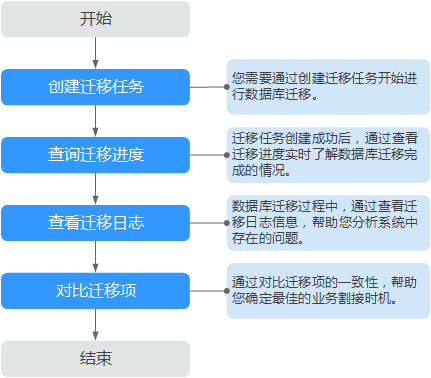

# 概述

## 使用场景

数据复制服务提供的在线迁移功能，适用于以下使用场景。

**表 1**  在线迁移使用场景

<table><thead align="left"><tr id="row81172034113118"><th class="cellrowborder" valign="top" width="24.23%" id="mcps1.2.3.1.1">
使用场景

</th>
<th class="cellrowborder" valign="top" width="75.77000000000001%" id="mcps1.2.3.1.2">
描述

</th>
</tr>
</thead>
<tbody><tr id="row15117934183117"><td class="cellrowborder" valign="top" width="24.23%" headers="mcps1.2.3.1.1 ">
云下数据库迁移上云

</td>
<td class="cellrowborder" valign="top" width="75.77000000000001%" headers="mcps1.2.3.1.2 ">
适用于需要将云下数据库迁移上云的场景，在线迁移能够最大限度地缩短系统业务中断时间，降低对业务影响。

</td>
</tr>
<tr id="row1611763423118"><td class="cellrowborder" valign="top" width="24.23%" headers="mcps1.2.3.1.1 ">
跨云平台数据库迁移

</td>
<td class="cellrowborder" valign="top" width="75.77000000000001%" headers="mcps1.2.3.1.2 ">
支持将其他云上数据库迁移到本云数据库。无需手动导入导出数据，方便您快速实现迁移过程中业务和数据库不停机，业务中断时间最小化的数据库迁移。

</td>
</tr>
<tr id="row1211718347316"><td class="cellrowborder" valign="top" width="24.23%" headers="mcps1.2.3.1.1 ">
VPC网络内数据库迁移

</td>
<td class="cellrowborder" valign="top" width="75.77000000000001%" headers="mcps1.2.3.1.2 ">
将自行搭建在弹性云服务器（Elastic Cloud Server，简称ECS）上的数据库，在线迁移至本云数据库，同时，也支持本云内数据库之间的迁移。

</td>
</tr>
<tr id="row2117143419315"><td class="cellrowborder" valign="top" width="24.23%" headers="mcps1.2.3.1.1 ">
云内数据库迁移出云

</td>
<td class="cellrowborder" valign="top" width="75.77000000000001%" headers="mcps1.2.3.1.2 ">
当云上数据库需要进行数据回流时，云内数据库迁移出云功能，方便您将云上数据库迁移出云。

</td>
</tr>
</tbody>
</table>

## 使用流程

一次完整的在线迁移，是通过创建在线迁移任务，以迁移任务作为数据库迁移的导向，依次进行迁移进度观察、迁移日志分析、迁移数据一致性对比等多项操作。通过多项指标和数据的对比分析，可以帮助您确定合适的业务割接时机，实现最小化业务中断的数据库迁移。

一次完整的在线迁移包含如下过程：

**图 1**  迁移流程  

