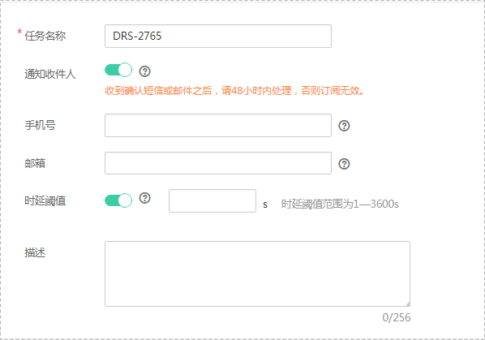
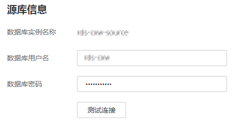
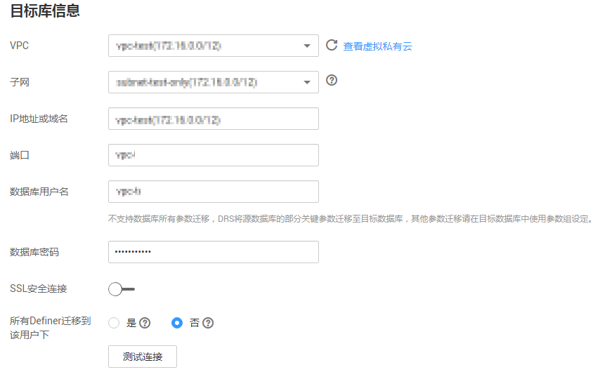
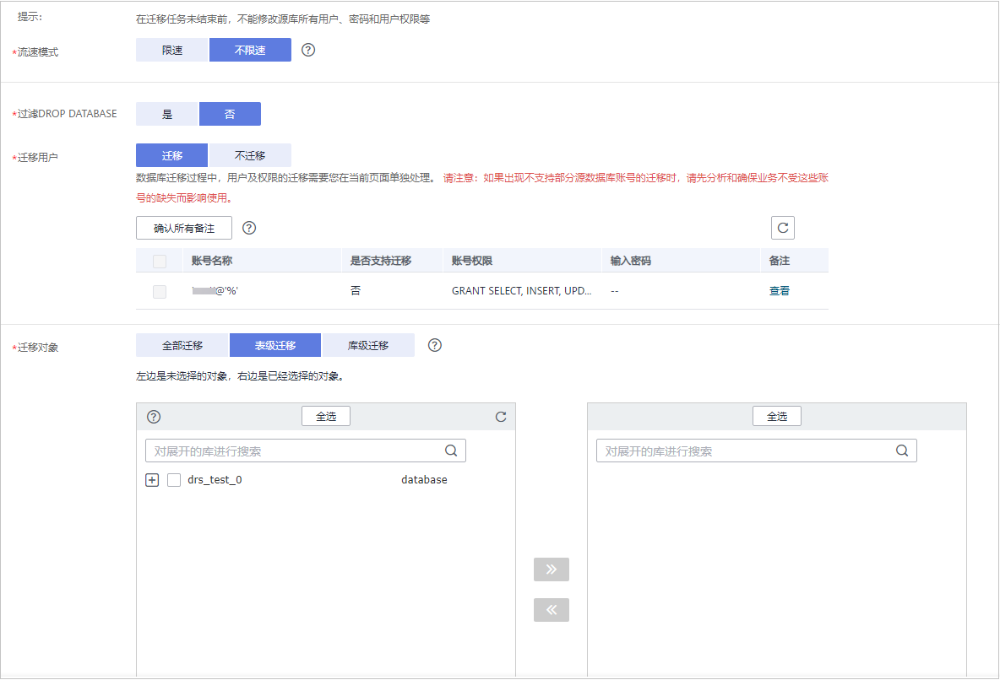
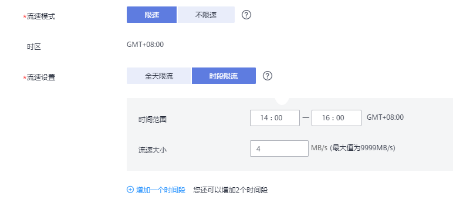

# 步骤一：创建出云迁移任务

数据复制服务提供出云的功能，可以将本云上的数据库迁移至用户端数据库，方便进行数据回流处理。

本章节将以RDS for MySQL到ECS自建MySQL的迁移为示例，介绍在同一VPC网络场景下，通过数据复制服务管理控制台配置数据迁移任务的流程，其他存储引擎的配置流程类似。

VPC网络适合本云内数据库之间的迁移。在数据复制服务中，数据库迁移是通过任务的形式完成的，通过创建任务向导，可以完成任务信息配置、任务创建。迁移任务创建成功后，您也可以通过数据复制服务管理控制台，对任务进行管理。

## 前提条件

-   已登录数据复制服务控制台。
-   账户余额大于等于0元。
-   满足实时迁移支持的数据库类型，详情请参见[实时迁移](https://support.huaweicloud.com/productdesc-drs/drs_01_0301.html)。
-   满足出云迁移的限制条件，详情请参见[出云迁移使用须知](出云迁移使用须知.md)。

## 操作步骤

1.  在“实时迁移管理“页面，单击“创建迁移任务“，进入创建迁移任务页面。
2.  在“迁移实例”页面，填选区域、任务名称、任务异常通知设置、SMN主题、时延阈值、任务异常自动结束时间、描述、迁移实例信息，单击“下一步”。

    **图 1**  迁移任务信息  
    

    **表 1**  任务和描述

    
    <table><thead align="left"><tr id="drs_02_0002_row55731924204420"><th class="cellrowborder" valign="top" width="18.42%" id="mcps1.2.3.1.1">
<strong id="drs_02_0002_b1611223511352">参数</strong>

    </th>
    <th class="cellrowborder" valign="top" width="81.58%" id="mcps1.2.3.1.2">
<strong id="drs_02_0002_b3002268111352">描述</strong>

    </th>
    </tr>
    </thead>
    <tbody><tr id="drs_02_0002_row12620182813359"><td class="cellrowborder" valign="top" width="18.42%" headers="mcps1.2.3.1.1 ">
区域

    </td>
    <td class="cellrowborder" valign="top" width="81.58%" headers="mcps1.2.3.1.2 ">
当前所在区域，可进行切换。

    </td>
    </tr>
    <tr id="drs_02_0002_row807311204420"><td class="cellrowborder" valign="top" width="18.42%" headers="mcps1.2.3.1.1 ">
任务名称

    </td>
    <td class="cellrowborder" valign="top" width="81.58%" headers="mcps1.2.3.1.2 ">
任务名称在4-50位之间，必须以字母开头，不区分大小写，可以包含字母、数字、中划线或下划线，不能包含其他的特殊字符。

    </td>
    </tr>
    <tr id="drs_02_0002_row36111933161119"><td class="cellrowborder" valign="top" width="18.42%" headers="mcps1.2.3.1.1 ">
描述

    </td>
    <td class="cellrowborder" valign="top" width="81.58%" headers="mcps1.2.3.1.2 ">
描述不能超过256位，且不能包含! = &lt; &gt; &amp; ' " \ 特殊字符。

    </td>
    </tr>
    <tr id="drs_02_0002_row1080215433911"><td class="cellrowborder" valign="top" width="18.42%" headers="mcps1.2.3.1.1 ">
任务异常通知设置

    </td>
    <td class="cellrowborder" valign="top" width="81.58%" headers="mcps1.2.3.1.2 ">
该项为可选参数，开启之后，选择对应的SMN主题。当迁移任务状态异常时，系统将发送通知。

    </td>
    </tr>
    <tr id="drs_02_0002_row1360111041213"><td class="cellrowborder" valign="top" width="18.42%" headers="mcps1.2.3.1.1 ">
SMN主题

    </td>
    <td class="cellrowborder" valign="top" width="81.58%" headers="mcps1.2.3.1.2 ">
“任务异常通知设置”项开启后可见，需提前在SMN上申请主题并添加订阅。

    
SMN主题申请和订阅可参考<a href="https://support.huaweicloud.com/qs-smn/smn_ug_0004.html" target="_blank" rel="noopener noreferrer">《消息通知服务用户指南》</a>。

    </td>
    </tr>
    <tr id="drs_02_0002_row157731032102814"><td class="cellrowborder" valign="top" width="18.42%" headers="mcps1.2.3.1.1 ">
时延阈值

    </td>
    <td class="cellrowborder" valign="top" width="81.58%" headers="mcps1.2.3.1.2 ">
在增量迁移阶段，源数据库和目标数据库之间的实时同步有时会存在一个时间差，称为时延，单位为秒。

    
时延阈值设置是指时延超过一定的值后（时延阈值范围为1—3600s），DRS可以发送告警通知给指定收件人。告警通知将在时延稳定超过设定的阈值6min后发送，避免出现由于时延波动反复发送告警通知的情况。

    
 说明： 
<ul id="drs_02_0002_ul167113217818"><li>首次进入增量迁移阶段，会有较多数据等待同步，存在较大的时延，属于正常情况，不在此功能的监控范围之内。</li><li>设置时延阈值之前，需要设置任务异常通知。</li></ul>
    

    </td>
    </tr>
    <tr id="drs_02_0002_row188817390433"><td class="cellrowborder" valign="top" width="18.42%" headers="mcps1.2.3.1.1 ">
任务异常自动结束时间（天）

    </td>
    <td class="cellrowborder" valign="top" width="81.58%" headers="mcps1.2.3.1.2 ">
设置任务异常自动结束天数，输入值必须在14-100之间。

    
 说明： 

异常状态下的任务仍然会计费，而长时间异常的任务无法续传和恢复。设置任务异常自动结束天数后，异常且超时的任务将会自动结束，以免产生不必要的费用。

    

    </td>
    </tr>
    </tbody>
    </table>

    **图 2**  出云迁移实例信息  
    

    **表 2**  迁移实例信息

    
    <table><thead align="left"><tr id="row39932329204436"><th class="cellrowborder" valign="top" width="23.87%" id="mcps1.2.3.1.1">
<strong id="b2587841611355">参数</strong>

    </th>
    <th class="cellrowborder" valign="top" width="76.13%" id="mcps1.2.3.1.2">
<strong id="b1577696211355">描述</strong>

    </th>
    </tr>
    </thead>
    <tbody><tr id="row145601338145018"><td class="cellrowborder" valign="top" width="23.87%" headers="mcps1.2.3.1.1 ">
数据流动方向

    </td>
    <td class="cellrowborder" valign="top" width="76.13%" headers="mcps1.2.3.1.2 ">
选择出云。

    
出云指源端数据库为本云数据库的场景。

    </td>
    </tr>
    <tr id="row0414184610580"><td class="cellrowborder" valign="top" width="23.87%" headers="mcps1.2.3.1.1 ">
源数据库引擎

    </td>
    <td class="cellrowborder" valign="top" width="76.13%" headers="mcps1.2.3.1.2 ">
选择MySQL。

    </td>
    </tr>
    <tr id="row42411630204436"><td class="cellrowborder" valign="top" width="23.87%" headers="mcps1.2.3.1.1 ">
目标数据库引擎

    </td>
    <td class="cellrowborder" valign="top" width="76.13%" headers="mcps1.2.3.1.2 ">
选择MySQL。

    </td>
    </tr>
    <tr id="row62907306204436"><td class="cellrowborder" valign="top" width="23.87%" headers="mcps1.2.3.1.1 ">
网络类型

    </td>
    <td class="cellrowborder" valign="top" width="76.13%" headers="mcps1.2.3.1.2 ">
目前支持公网网络、VPC网络和VPN、专线网络类型，您可以根据具体的业务场景进行设置，此处场景以VPC网络为示例。

    <ul id="ul19818056621"><li>VPC网络：适合云上数据库之间的迁移。</li><li>VPN、专线网络：适合通过VPN、专线网络，实现其他云下自建数据库与云上数据库迁移、或云上跨Region的数据库之间的迁移。</li><li>公网网络：适合将其他云下或其他平台的数据库迁移到目标数据库。</li></ul>
    </td>
    </tr>
    <tr id="row658644204515"><td class="cellrowborder" valign="top" width="23.87%" headers="mcps1.2.3.1.1 ">
源数据库实例

    </td>
    <td class="cellrowborder" valign="top" width="76.13%" headers="mcps1.2.3.1.2 ">
用户需要迁移的数据库实例。

    </td>
    </tr>
    <tr id="row2069316735917"><td class="cellrowborder" valign="top" width="23.87%" headers="mcps1.2.3.1.1 ">
迁移实例所在子网

    </td>
    <td class="cellrowborder" valign="top" width="76.13%" headers="mcps1.2.3.1.2 ">
选择迁移实例所在的子网。也可以单击“查看子网”，跳转至“网络控制台”查看实例所在子网帮助选择。

    
默认值为当前所选数据库实例所在子网，请选择有可用IP地址的子网。为确保迁移实例创建成功，仅显示已经开启DHCP的子网。

    </td>
    </tr>
    <tr id="row18478341367"><td class="cellrowborder" valign="top" width="23.87%" headers="mcps1.2.3.1.1 ">
迁移模式

    </td>
    <td class="cellrowborder" valign="top" width="76.13%" headers="mcps1.2.3.1.2 "><ul id="ul171919713019"><li>全量：该模式为数据库一次性迁移，适用于可中断业务的数据库迁移场景，全量迁移将非系统数据库的全部数据库对象和数据一次性迁移至目标端数据库，包括：表、视图、存储过程等。
 说明： 

如果用户只进行全量迁移时，建议停止对源数据库的操作，否则迁移过程中源数据库产生的新数据不会同步到目标数据库。

    

    </li><li>全量+增量：该模式为数据库持续性迁移，适用于对业务中断敏感的场景，通过全量迁移过程中完成的目标端数据库的初始化后，增量迁移阶段通过解析日志等技术，将源端和目标端数据库保持数据持续一致。</li></ul>
    
 说明： 

选择“全量+增量”迁移模式，增量迁移可以在全量迁移完成的基础上实现数据的持续同步，无需中断业务，实现迁移过程中源业务和数据库继续对外提供访问。

    

    </td>
    </tr>
    <tr id="row59391949155215"><td class="cellrowborder" valign="top" width="23.87%" headers="mcps1.2.3.1.1 ">
企业项目

    </td>
    <td class="cellrowborder" valign="top" width="76.13%" headers="mcps1.2.3.1.2 ">
对于已成功关联企业项目的用户，仅需在“企业项目”下拉框中选择目标项目。

    
如果需要自定义企业项目，请前往项目管理服务进行创建。关于如何创建项目，详见《项目管理用户指南》。

    </td>
    </tr>
    <tr id="row1776341375918"><td class="cellrowborder" valign="top" width="23.87%" headers="mcps1.2.3.1.1 ">
标签

    </td>
    <td class="cellrowborder" valign="top" width="76.13%" headers="mcps1.2.3.1.2 ">
可选配置，对迁移任务的标识。使用标签可方便管理您的迁移任务。每个任务最多支持10个标签配额。

    
任务创建成功后，您可以单击实例名称，在“标签”页签下查看对应标签。关于标签的详细操作，请参见<a href="https://support.huaweicloud.com/usermanual-drs/drs_online_tag.html" target="_blank" rel="noopener noreferrer">标签管理</a>。

    </td>
    </tr>
    </tbody>
    </table>

3.  在“源库及目标库”页面，迁移实例创建成功后，填选源库信息和目标库信息，并单击“源库和目标库“处的“测试连接“，分别测试并确定与源库和目标库连通后，勾选协议，单击“下一步“。

    **图 3**  出云源库信息  
    

    **表 3**  源库信息

    
    <table><thead align="left"><tr id="row1689805018297"><th class="cellrowborder" valign="top" width="23%" id="mcps1.2.3.1.1">
<strong id="b12898205016299">参数</strong>

    </th>
    <th class="cellrowborder" valign="top" width="77%" id="mcps1.2.3.1.2">
<strong id="b6898105052913">描述</strong>

    </th>
    </tr>
    </thead>
    <tbody><tr id="row1189815082911"><td class="cellrowborder" valign="top" width="23%" headers="mcps1.2.3.1.1 ">
数据库实例名称

    </td>
    <td class="cellrowborder" valign="top" width="77%" headers="mcps1.2.3.1.2 ">
默认为创建迁移任务时选择的关系型数据库实例，不可进行修改。

    </td>
    </tr>
    <tr id="row3898165072918"><td class="cellrowborder" valign="top" width="23%" headers="mcps1.2.3.1.1 ">
数据库用户名

    </td>
    <td class="cellrowborder" valign="top" width="77%" headers="mcps1.2.3.1.2 ">
源数据库对应的数据库用户名。

    </td>
    </tr>
    <tr id="row208991850122919"><td class="cellrowborder" valign="top" width="23%" headers="mcps1.2.3.1.1 ">
数据库密码

    </td>
    <td class="cellrowborder" valign="top" width="77%" headers="mcps1.2.3.1.2 ">
源数据库对应的数据库密码。

    
任务为启动中、全量迁移、增量迁移、增量迁移失败状态时，可在“基本信息”页面的“迁移信息”区域，单击“源库密码”后的“替换密码”，在弹出的对话框中修改密码。

    </td>
    </tr>
    </tbody>
    </table>

    > **说明：** 
    >**源数据库的用户名和密码将在迁移过程中被加密暂存到数据库和迁移实例主机上，待该任务删除后会永久清除**。

    **图 4**  出云目标库信息  
    

    **表 4**  目标库信息

    
    <table><thead align="left"><tr id="row1790025018293"><th class="cellrowborder" valign="top" width="23.29%" id="mcps1.2.3.1.1">
<strong id="b58992050142919">参数</strong>

    </th>
    <th class="cellrowborder" valign="top" width="76.71%" id="mcps1.2.3.1.2">
<strong id="b128999507294">描述</strong>

    </th>
    </tr>
    </thead>
    <tbody><tr id="row39001750142919"><td class="cellrowborder" valign="top" width="23.29%" headers="mcps1.2.3.1.1 ">
VPC

    </td>
    <td class="cellrowborder" valign="top" width="76.71%" headers="mcps1.2.3.1.2 ">
目标数据库所在的虚拟专用网络，可以对不同业务进行网络隔离。

    </td>
    </tr>
    <tr id="row49001650142920"><td class="cellrowborder" valign="top" width="23.29%" headers="mcps1.2.3.1.1 ">
子网

    </td>
    <td class="cellrowborder" valign="top" width="76.71%" headers="mcps1.2.3.1.2 ">
通过子网提供与其他网络隔离的、可以独享的网络资源，以提高网络安全。子网在可用分区内才会有效，创建源数据库实例的子网需要开启DHCP功能，在创建过程中也不能关闭已选子网的DHCP功能。

    </td>
    </tr>
    <tr id="row6901195032913"><td class="cellrowborder" valign="top" width="23.29%" headers="mcps1.2.3.1.1 ">
IP地址或域名

    </td>
    <td class="cellrowborder" valign="top" width="76.71%" headers="mcps1.2.3.1.2 ">
目标数据库的IP地址或域名。

    </td>
    </tr>
    <tr id="row20901115002915"><td class="cellrowborder" valign="top" width="23.29%" headers="mcps1.2.3.1.1 ">
端口

    </td>
    <td class="cellrowborder" valign="top" width="76.71%" headers="mcps1.2.3.1.2 ">
目标数据库服务端口，可输入范围为1~65535间的整数。

    </td>
    </tr>
    <tr id="row16901155042918"><td class="cellrowborder" valign="top" width="23.29%" headers="mcps1.2.3.1.1 ">
数据库用户名

    </td>
    <td class="cellrowborder" valign="top" width="76.71%" headers="mcps1.2.3.1.2 ">
目标数据库的用户名。

    </td>
    </tr>
    <tr id="row5901195012912"><td class="cellrowborder" valign="top" width="23.29%" headers="mcps1.2.3.1.1 ">
数据库密码

    </td>
    <td class="cellrowborder" valign="top" width="76.71%" headers="mcps1.2.3.1.2 ">
目标数据库的用户名所对应的密码。支持在任务创建后修改密码。

    
任务为启动中、全量迁移、增量迁移、增量迁移失败状态时，可在“基本信息”页面的“迁移信息”区域，单击“目标库密码”后的“替换密码”，在弹出的对话框中修改密码。

    </td>
    </tr>
    <tr id="row8901105010294"><td class="cellrowborder" valign="top" width="23.29%" headers="mcps1.2.3.1.1 ">
SSL安全连接

    </td>
    <td class="cellrowborder" valign="top" width="76.71%" headers="mcps1.2.3.1.2 ">
通过该功能，用户可以选择是否开启对迁移链路的加密。如果开启该功能，需要用户上传SSL CA根证书。

    
 说明： 
<ul id="ul6901750142918"><li>最大支持上传500KB的证书文件。</li><li>如果不使用SSL证书，请自行承担数据安全风险。</li></ul>
    

    </td>
    </tr>
    <tr id="row1902125002914"><td class="cellrowborder" valign="top" width="23.29%" headers="mcps1.2.3.1.1 ">
所有Definer迁移到该用户下

    </td>
    <td class="cellrowborder" valign="top" width="76.71%" headers="mcps1.2.3.1.2 "><ul id="ul1490245014299"><li>是
迁移后，所有源数据库对象的Definer都会迁移至该用户下，其他用户需要授权后才具有数据库对象权限，如何授权请参考<a href="https://support.huaweicloud.com/drs_faq/drs_16_0003.html" target="_blank" rel="noopener noreferrer">MySQL迁移中Definer强制转化后如何维持原业务用户权限体系</a>

    </li><li>否
迁移后，将保持源数据库对象Definer定义不变，选择此选项，需要配合下一步用户权限迁移功能，将源数据库的用户全部迁移，这样才能保持源数据库的权限体系完全不变。

    </li></ul>
    </td>
    </tr>
    </tbody>
    </table>

    > **说明：** 
    >**目标数据库的IP地址、端口、用户名和密码将在迁移过程中被加密暂存到数据库和迁移实例主机上，待该任务删除后会永久清除**。

4.  在“迁移设置“页面，设置迁移用户和迁移对象等信息，单击“下一步“。

    **图 5**  出云迁移模式  
    

    **表 5**  迁移模式和迁移对象

    
    <table><thead align="left"><tr id="zh-cn_topic_0078078071_row165921632141911"><th class="cellrowborder" valign="top" width="16.1%" id="mcps1.2.3.1.1">
<strong id="zh-cn_topic_0078078071_b1783318515228">参数</strong>

    </th>
    <th class="cellrowborder" valign="top" width="83.89999999999999%" id="mcps1.2.3.1.2">
<strong id="zh-cn_topic_0078078071_b10555114922418">描述</strong>

    </th>
    </tr>
    </thead>
    <tbody><tr id="row829913579409"><td class="cellrowborder" valign="top" width="16.1%" headers="mcps1.2.3.1.1 ">
流速模式

    
 说明： 

目前仅MySQL-&gt;MySQL的迁移支持该功能。

    

    </td>
    <td class="cellrowborder" valign="top" width="83.89999999999999%" headers="mcps1.2.3.1.2 ">
流速模式支持限速和不限速，默认为不限速。

    <ul id="ul1729047124213"><li>限速
自定义的最大迁移速度，迁移过程中的迁移速度将不会超过该速度。

    
当流速模式选择了“限速”时，你需要通过流速设置来定时控制迁移速度。流速设置通常包括限速时间段和流速大小的设置。默认的限速时间段为全天限流，您也可以根据业务需求自定义时段限速。自定义的时段限速支持最多设置3个定时任务，每个定时任务之间不能存在交叉的时间段，未设定在限速时间段的时间默认为不限速。

    
流速的大小需要根据业务场景来设置，不能超过9999MB/s。

    
<b>图1 </b>出云设置流速模式 

    </li><li>不限速
对迁移速度不进行限制，通常会最大化使用源数据库的出口带宽。该流速模式同时会对源数据库造成读消耗，消耗取决于源数据库的出口带宽。比如源数据库的出口带宽为100MB/s，假设高速模式使用了80%带宽，则迁移对源数据库将造成80MB/s的读操作IO消耗。
 说明： 
<ul id="ul132902764213"><li>限速模式只对全量迁移阶段生效，增量迁移阶段不生效。</li><li>您也可以在创建任务后修改流速模式。操作方法为：在“基本信息”页签的“迁移信息”区域，单击“流速模式”后的“修改”，在弹出的对话框中修改流速模式。“启动中”的任务不支持修改流速模式。</li></ul>
    

    

    </li></ul>
    </td>
    </tr>
    <tr id="row14648185121515"><td class="cellrowborder" valign="top" width="16.1%" headers="mcps1.2.3.1.1 ">
快照模式

    </td>
    <td class="cellrowborder" valign="top" width="83.89999999999999%" headers="mcps1.2.3.1.2 ">
如果您选择的是全量迁移模式的任务，数据复制服务支持设置快照模式。

    <ul id="ul520619298172"><li>非快照式
适用于停止业务数据写入的导出，如果全量迁移中仍然有业务数据的修改，则导出数据为时间点非水平一致。稳定性和性能要优于快照式全量迁移。

    </li><li>快照式
可以在业务运行时产生一份时间水平一致的快照数据，具有业务数据分析价值，过程中的数据变化不会体现在导出数据中。

    
 说明： 
<ul id="ul58981133103"><li>快照读会使用MySQL备份锁进行全局锁表，在开启一致性读后自动解锁（加锁时间在3s以内），备份锁会对此期间的DML或者DDL操作造成阻塞，建议用户选择源库空闲的时间段使用快照备份功能。</li><li>目前仅MySQL全量模式的迁移任务支持快照模式设置。</li></ul>
    

    </li></ul>
    </td>
    </tr>
    <tr id="row16154113519117"><td class="cellrowborder" valign="top" width="16.1%" headers="mcps1.2.3.1.1 ">
是否过滤DROP DATABASE

    </td>
    <td class="cellrowborder" valign="top" width="83.89999999999999%" headers="mcps1.2.3.1.2 ">
增量迁移过程中，源数据库端执行的DDL操作在一定程度上会影响数据的迁移能力，为了降低迁移数据的风险，数据复制服务提供了过滤DDL操作的功能。

    
目前支持默认过滤删除数据库的操作。

    <ul id="ul611316391419"><li>是，表示数据迁移过程中不会同步用户在源数据库端执行的删除数据库的操作。</li><li>否，则表示数据迁移过程中将相关操作同步到目标库。
 说明： 

目前仅支持RDS for MySQL实例-&gt;MySQL数据库数据库的全量+增量的迁移场景。

    

    </li></ul>
    </td>
    </tr>
    <tr id="zh-cn_topic_0078078071_row2592193212194"><td class="cellrowborder" valign="top" width="16.1%" headers="mcps1.2.3.1.1 ">
迁移用户

    </td>
    <td class="cellrowborder" valign="top" width="83.89999999999999%" headers="mcps1.2.3.1.2 ">
数据库的迁移过程中，迁移用户需要进行单独处理。

    
常见的迁移用户一般分为三类：可完整迁移的用户、需要降权的用户和不可迁移的用户。您可以根据业务需求选择“迁移”或者“不迁移”，选择“迁移”后，可根据需要选择迁移用户。<ul id="ul52489455107"><li>迁移
当您选择迁移用户时，请参见《数据复制服务用户指南》中“<a href="https://support.huaweicloud.com/usermanual-drs/drs_09_0017.html" target="_blank" rel="noopener noreferrer">迁移用户</a>”章节进行数据库用户、权限及密码的处理。

    </li></ul>
    

    <ul id="ul4685852174011"><li>不迁移
迁移过程中，将不进行用户、权限和密码的迁移。

    </li></ul>
    </td>
    </tr>
    <tr id="zh-cn_topic_0078078071_row559273214193"><td class="cellrowborder" valign="top" width="16.1%" headers="mcps1.2.3.1.1 ">
迁移对象

    </td>
    <td class="cellrowborder" valign="top" width="83.89999999999999%" headers="mcps1.2.3.1.2 ">
您可以根据业务需求，选择全部对象迁移、表级迁移或者库级迁移。

    <ul id="zh-cn_topic_0135097933_zh-cn_topic_0078078071_ul78601316141810"><li>全部迁移：将源数据库中的所有对象全部迁移至目标数据库，对象迁移到目标数据库实例后，对象名将会保持与源数据库实例对象名一致且无法修改。</li><li>表级迁移：将选择的表级对象迁移至目标数据库。</li><li>库级迁移：将选择的库级对象迁移至目标数据库。</li></ul>
    
如果有切换源数据库的操作或源库迁移对象变化的情况，请务必在选择迁移对象前单击右上角的，以确保待选择的对象为最新源数据库对象。

    
 说明： 
<ul id="zh-cn_topic_0135097933_ul19601624657"><li>若选择部分数据库进行迁移时，由于存储过程、视图等对象可能与其他数据库的表存在依赖关系，若所依赖的表未迁移，则会导致迁移失败。建议您在迁移之前进行确认，或选择全部数据库进行迁移。</li><li>选择对象的时候，对象名称的前后空格不显示，中间如有多个空格只显示一个空格。</li><li>选择对象的时候支持搜索，以便您快速选择需要的数据库对象。</li></ul>
    

    </td>
    </tr>
    </tbody>
    </table>

5.  在“预检查“页面，进行迁移任务预校验，校验是否可进行迁移。
    -   查看检查结果，如有不通过的检查项，需要修复不通过项后，单击“重新校验”按钮重新进行迁移任务预校验。

        预检查不通过项处理建议请参见《数据复制服务用户指南》中的“[预检查不通过项修复方法](https://support.huaweicloud.com/usermanual-drs/drs_precheck.html)”。

        **图 7**  预检查  
        

    -   预检查完成后，且预检查通过率为100%时，单击“下一步”。

        > **说明：** 
        >所有检查项结果均通过时，若存在待确认项，需要阅读并确认详情后才可以继续执行下一步操作。

6.  在“任务确认“页面，选择迁移任务的启动时间，并确认迁移任务信息无误后，单击“启动任务“，提交迁移任务。

    > **说明：** 
    >-   迁移任务的启动时间可以根据业务需求，设置为“立即启动”或“稍后启动”，优选“稍后启动”。
    >-   预计迁移任务启动后，会对源数据库和目标数据库的性能产生影响，强烈建议您将任务启动时间设定在业务低峰期，同时预留2-3天校对数据。

7.  迁移任务提交后，您可在“实时迁移管理“页面，查看并管理自己的任务。
    -   您可查看任务提交后的状态，状态请参见[参考：任务状态含义](任务状态(实时迁移).md)。
    -   在任务列表的右上角，单击刷新列表，可查看到最新的任务状态。

