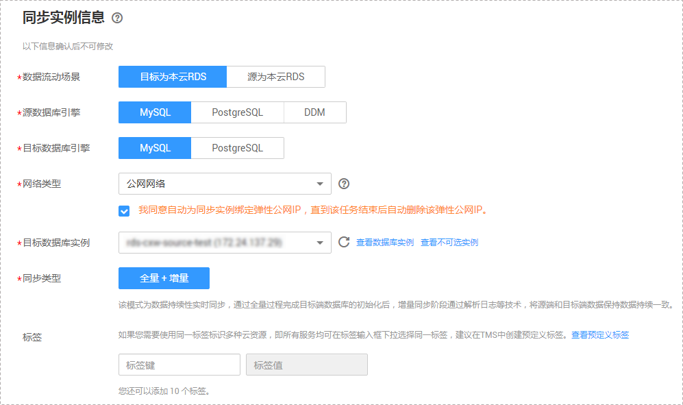
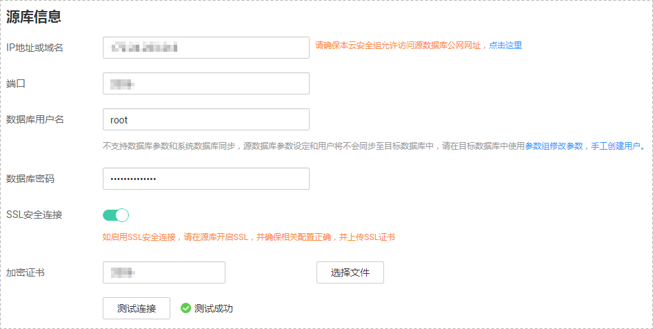
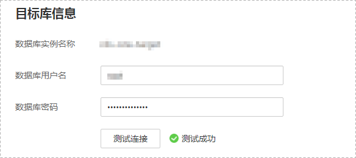
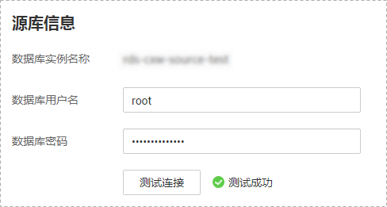
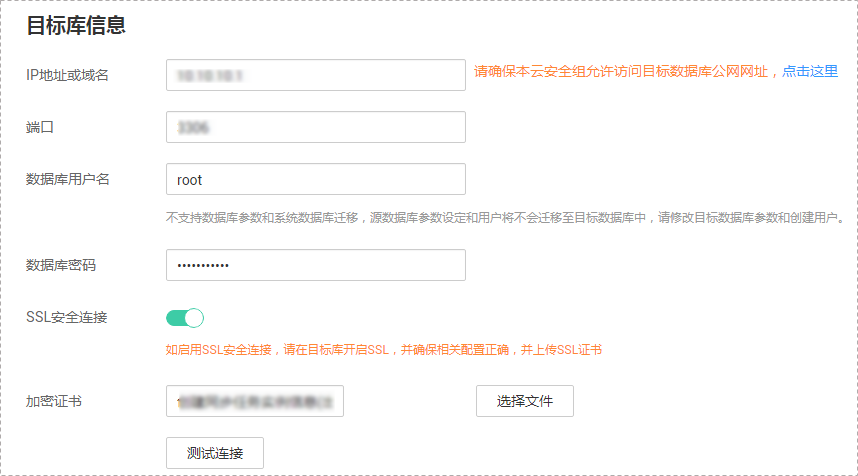
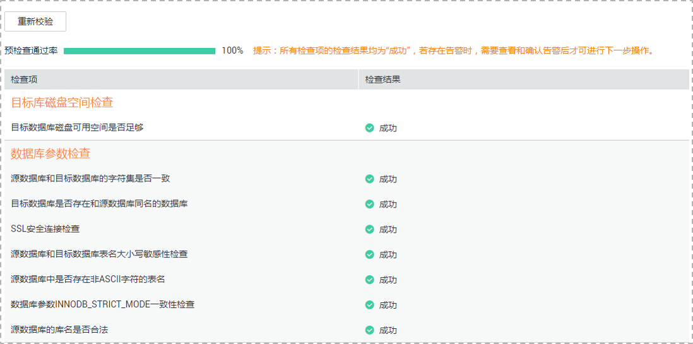

# 步骤一：创建同步任务

本小节以MySQL-\>RDS for MySQL的数据同步为示例，介绍如何使用数据复制服务创建两个数据库实例之间的数据同步任务，其他存储引擎的配置流程类似。

## 前提条件

-   已登录数据复制服务控制台。
-   账户余额大于等于0元。
-   参见[数据同步](https://support.huaweicloud.com/productdesc-drs/drs_01_0302.html)。
-   参见[使用须知](使用须知（备份迁移）.md)。

## 操作步骤

1.  在“数据同步管理”页面，单击“创建同步任务”。
2.  在“同步实例”页面，填选任务名称、通知收件人信息、描述、同步实例信息，单击“下一步”。

    **图 1**  同步任务信息  
    

    **表 1**  任务和描述

    
    <table><thead align="left"><tr id="row55731924204420"><th class="cellrowborder" valign="top" width="18.43%" id="mcps1.2.3.1.1">
<strong id="b1611223511352">参数</strong>

    </th>
    <th class="cellrowborder" valign="top" width="81.57%" id="mcps1.2.3.1.2">
<strong id="b3002268111352">描述</strong>

    </th>
    </tr>
    </thead>
    <tbody><tr id="row807311204420"><td class="cellrowborder" valign="top" width="18.43%" headers="mcps1.2.3.1.1 ">
任务名称

    </td>
    <td class="cellrowborder" valign="top" width="81.57%" headers="mcps1.2.3.1.2 ">
任务名称在4位到64位之间，必须以字母开头，不区分大小写，可以包含字母、数字、中划线或下划线，不能包含其他的特殊字符。

    </td>
    </tr>
    <tr id="row1080215433911"><td class="cellrowborder" valign="top" width="18.43%" headers="mcps1.2.3.1.1 ">
任务异常通知设置

    </td>
    <td class="cellrowborder" valign="top" width="81.57%" headers="mcps1.2.3.1.2 ">
该项为可选参数，开启之后，需要填写手机号码或者邮箱作为指定收件人。当任务状态异常时，系统将发送通知给指定收件人。

    
 说明： 

收到确认短信或邮件之后，需要在48小时内处理，否则该功能订阅无效。

    

    </td>
    </tr>
    <tr id="row157731032102814"><td class="cellrowborder" valign="top" width="18.43%" headers="mcps1.2.3.1.1 ">
时延阈值

    </td>
    <td class="cellrowborder" valign="top" width="81.57%" headers="mcps1.2.3.1.2 ">
在增量同步阶段，源数据库和目标数据库之间的同步有时会存在一个时间差，称为时延，单位为秒。

    
时延阈值设置是指时延超过一定的值后（时间阈值范围为1—3600s），DRS可以发送告警通知给指定收件人。告警通知将在时延稳定超过设定的阈值6min后发送，避免出现由于时延波动反复发送告警通知的情况。

    
 说明： 
<ul id="ul11143178161014"><li>首次进入增量同步阶段，会有较多数据等待同步，存在较大的时延，属于正常情况，不在此功能的监控范围之内。</li><li>设置时间阈值之前，需要填写收件人手机号或邮箱。</li></ul>
    

    </td>
    </tr>
    <tr id="row23664659204420"><td class="cellrowborder" valign="top" width="18.43%" headers="mcps1.2.3.1.1 ">
描述

    </td>
    <td class="cellrowborder" valign="top" width="81.57%" headers="mcps1.2.3.1.2 ">
描述不能超过256位，且不能包含!=&lt;&gt;&amp;'"特殊字符。

    </td>
    </tr>
    </tbody>
    </table>

    **图 2**  同步实例信息  
    

    **表 2**  同步实例信息

    
    <table><thead align="left"><tr id="row39932329204436"><th class="cellrowborder" valign="top" width="23.87%" id="mcps1.2.3.1.1">
<strong id="b2587841611355">参数</strong>

    </th>
    <th class="cellrowborder" valign="top" width="76.13%" id="mcps1.2.3.1.2">
<strong id="b1577696211355">描述</strong>

    </th>
    </tr>
    </thead>
    <tbody><tr id="row05147381129"><td class="cellrowborder" valign="top" width="23.87%" headers="mcps1.2.3.1.1 ">
数据流动场景

    </td>
    <td class="cellrowborder" valign="top" width="76.13%" headers="mcps1.2.3.1.2 ">
选择“目标为本云RDS”，也支持“源为本云RDS”。

    </td>
    </tr>
    <tr id="row0414184610580"><td class="cellrowborder" valign="top" width="23.87%" headers="mcps1.2.3.1.1 ">
源数据库引擎

    </td>
    <td class="cellrowborder" valign="top" width="76.13%" headers="mcps1.2.3.1.2 ">
选择MySQL。

    </td>
    </tr>
    <tr id="row42411630204436"><td class="cellrowborder" valign="top" width="23.87%" headers="mcps1.2.3.1.1 ">
目标数据库引擎

    </td>
    <td class="cellrowborder" valign="top" width="76.13%" headers="mcps1.2.3.1.2 ">
选择MySQL。

    </td>
    </tr>
    <tr id="row62907306204436"><td class="cellrowborder" valign="top" width="23.87%" headers="mcps1.2.3.1.1 ">
网络类型

    </td>
    <td class="cellrowborder" valign="top" width="76.13%" headers="mcps1.2.3.1.2 ">
此处以公网网络为示例。

    <ul id="ul4426161115453"><li>对于MySQL-&gt;MySQL的数据同步，可根据业务场景选择公网网络、VPC网络和VPN、专线网络。</li><li>对于MySQL-&gt;PostgreSQL和PostgreSQL-&gt;PostgreSQL场景的数据同步，可根据场景选择VPC网络和VPN、专线网络。</li></ul>
    </td>
    </tr>
    <tr id="row658644204515"><td class="cellrowborder" valign="top" width="23.87%" headers="mcps1.2.3.1.1 ">
目标数据库实例

    </td>
    <td class="cellrowborder" valign="top" width="76.13%" headers="mcps1.2.3.1.2 ">
用户所创建的关系型数据库实例。

    
 说明： 

目标数据库实例不支持选择只读实例。

    

    </td>
    </tr>
    <tr id="row1169913195320"><td class="cellrowborder" valign="top" width="23.87%" headers="mcps1.2.3.1.1 ">
同步类型

    </td>
    <td class="cellrowborder" valign="top" width="76.13%" headers="mcps1.2.3.1.2 ">
全量+增量

    
该模式为数据持续性实时同步，通过全量过程完成目标端数据库的初始化后，增量同步阶段通过解析日志等技术，将源端和目标端数据保持数据持续一致。

    
 说明： 

选择“全量+增量”同步模式，增量同步可以在全量同步完成的基础上实现数据的持续同步，无需中断业务，实现同步过程中源业务和数据库继续对外提供访问。

    

    </td>
    </tr>
    <tr id="row19432281410"><td class="cellrowborder" valign="top" width="23.87%" headers="mcps1.2.3.1.1 ">
标签

    </td>
    <td class="cellrowborder" valign="top" width="76.13%" headers="mcps1.2.3.1.2 ">
可选配置，对同步任务的标识。使用标签可方便管理您的数据同步任务。每个任务最多支持10个标签配额。

    
任务创建成功后，您可以单击实例名称，在“标签”页签下查看对应标签。关于标签的详细操作，请参见<a href="https://support.huaweicloud.com/usermanual-drs/drs_synchronization_tag.html" target="_blank" rel="noopener noreferrer">标签管理</a>。

    </td>
    </tr>
    </tbody>
    </table>

3.  在“源库及目标库”页面，同步实例创建成功后，填选源库信息和目标库信息，建议您单击“源库和目标库“处的“测试连接“，分别测试并确定与源库和目标库连通后，勾选协议，单击“下一步“。
    -   [步骤2](#zh-cn_topic_0060142340_li63527764101958)中的“数据流动场景“选择“目标为本云RDS“。

        **图 3**  源库信息  
        

        **表 3**  源库信息

        
        <table><thead align="left"><tr id="row679854513465"><th class="cellrowborder" valign="top" width="23.29%" id="mcps1.2.3.1.1">
<strong id="b579814584619">参数</strong>

        </th>
        <th class="cellrowborder" valign="top" width="76.71%" id="mcps1.2.3.1.2">
<strong id="b19798104544619">描述</strong>

        </th>
        </tr>
        </thead>
        <tbody><tr id="row187981845134620"><td class="cellrowborder" valign="top" width="23.29%" headers="mcps1.2.3.1.1 ">
IP地址或域名

        </td>
        <td class="cellrowborder" valign="top" width="76.71%" headers="mcps1.2.3.1.2 ">
源数据库的IP地址或域名。

        </td>
        </tr>
        <tr id="row8798164544613"><td class="cellrowborder" valign="top" width="23.29%" headers="mcps1.2.3.1.1 ">
端口

        </td>
        <td class="cellrowborder" valign="top" width="76.71%" headers="mcps1.2.3.1.2 ">
源数据库服务端口，可输入范围为1~65535间的整数。

        </td>
        </tr>
        <tr id="row1798114512462"><td class="cellrowborder" valign="top" width="23.29%" headers="mcps1.2.3.1.1 ">
数据库用户名

        </td>
        <td class="cellrowborder" valign="top" width="76.71%" headers="mcps1.2.3.1.2 ">
源数据库的用户名。

        </td>
        </tr>
        <tr id="row147981745184613"><td class="cellrowborder" valign="top" width="23.29%" headers="mcps1.2.3.1.1 ">
数据库密码

        </td>
        <td class="cellrowborder" valign="top" width="76.71%" headers="mcps1.2.3.1.2 ">
源数据库的用户名所对应的密码。

        </td>
        </tr>
        <tr id="row117981045194610"><td class="cellrowborder" valign="top" width="23.29%" headers="mcps1.2.3.1.1 ">
SSL安全连接

        </td>
        <td class="cellrowborder" valign="top" width="76.71%" headers="mcps1.2.3.1.2 ">
通过该功能，用户可以选择是否开启对迁移链路的加密。如果开启该功能，需要用户上传SSL CA根证书。

        
 说明： 

最大支持上传500KB的证书文件。

        

        </td>
        </tr>
        </tbody>
        </table>

        > **说明：**   
        >**源数据库的IP地址或域名、数据库用户名和密码，会被系统加密暂存，直至删除该迁移任务后自动清除。**  

        **图 4**  目标库信息  
        

        **表 4**  目标库信息

        
        <table><thead align="left"><tr id="row29395551471"><th class="cellrowborder" valign="top" width="23%" id="mcps1.2.3.1.1">
<strong id="b11939185519476">参数</strong>

        </th>
        <th class="cellrowborder" valign="top" width="77%" id="mcps1.2.3.1.2">
<strong id="b9939145514479">描述</strong>

        </th>
        </tr>
        </thead>
        <tbody><tr id="row593915584717"><td class="cellrowborder" valign="top" width="23%" headers="mcps1.2.3.1.1 ">
数据库实例名称

        </td>
        <td class="cellrowborder" valign="top" width="77%" headers="mcps1.2.3.1.2 ">
默认为创建迁移任务时选择的关系型数据库实例，不可进行修改。

        </td>
        </tr>
        <tr id="row593965515475"><td class="cellrowborder" valign="top" width="23%" headers="mcps1.2.3.1.1 ">
数据库用户名

        </td>
        <td class="cellrowborder" valign="top" width="77%" headers="mcps1.2.3.1.2 ">
目标数据库对应的数据库用户名。

        </td>
        </tr>
        <tr id="row11939125594715"><td class="cellrowborder" valign="top" width="23%" headers="mcps1.2.3.1.1 ">
数据库密码

        </td>
        <td class="cellrowborder" valign="top" width="77%" headers="mcps1.2.3.1.2 ">
数据库用户名和密码将被系统加密暂存，直至该任务删除后清除。

        </td>
        </tr>
        </tbody>
        </table>

    -   [步骤2](#zh-cn_topic_0060142340_li63527764101958)中的“数据流动场景“选择“源为本云RDS“。

        **图 5**  源库信息  
        

        **表 5**  源库信息

        
        <table><thead align="left"><tr id="zh-cn_topic_0135097933_row15746151015912"><th class="cellrowborder" valign="top" width="23%" id="mcps1.2.3.1.1">
<strong id="zh-cn_topic_0135097933_b074631019593">参数</strong>

        </th>
        <th class="cellrowborder" valign="top" width="77%" id="mcps1.2.3.1.2">
<strong id="zh-cn_topic_0135097933_b1774613108597">描述</strong>

        </th>
        </tr>
        </thead>
        <tbody><tr id="zh-cn_topic_0135097933_row0746151020595"><td class="cellrowborder" valign="top" width="23%" headers="mcps1.2.3.1.1 ">
数据库实例名称

        </td>
        <td class="cellrowborder" valign="top" width="77%" headers="mcps1.2.3.1.2 ">
默认为创建任务时选择的云数据库实例，不可进行修改。

        </td>
        </tr>
        <tr id="zh-cn_topic_0135097933_row2746310155916"><td class="cellrowborder" valign="top" width="23%" headers="mcps1.2.3.1.1 ">
数据库用户名

        </td>
        <td class="cellrowborder" valign="top" width="77%" headers="mcps1.2.3.1.2 ">
源数据库对应的数据库用户名。

        </td>
        </tr>
        <tr id="zh-cn_topic_0135097933_row107461010135910"><td class="cellrowborder" valign="top" width="23%" headers="mcps1.2.3.1.1 ">
数据库密码

        </td>
        <td class="cellrowborder" valign="top" width="77%" headers="mcps1.2.3.1.2 ">
数据库用户名和密码将被系统加密暂存，直至该任务删除后清除。

        </td>
        </tr>
        </tbody>
        </table>

        **图 6**  目标库信息  
        

        **表 6**  目标库信息

        
        <table><thead align="left"><tr id="zh-cn_topic_0135097933_row12653123195919"><th class="cellrowborder" valign="top" width="23.29%" id="mcps1.2.3.1.1">
<strong id="zh-cn_topic_0135097933_b20653923155913">参数</strong>

        </th>
        <th class="cellrowborder" valign="top" width="76.71%" id="mcps1.2.3.1.2">
<strong id="zh-cn_topic_0135097933_b186531223105910">描述</strong>

        </th>
        </tr>
        </thead>
        <tbody><tr id="zh-cn_topic_0135097933_row1265352355912"><td class="cellrowborder" valign="top" width="23.29%" headers="mcps1.2.3.1.1 ">
IP地址或域名

        </td>
        <td class="cellrowborder" valign="top" width="76.71%" headers="mcps1.2.3.1.2 ">
目标数据库的IP地址或域名。

        </td>
        </tr>
        <tr id="zh-cn_topic_0135097933_row765313235597"><td class="cellrowborder" valign="top" width="23.29%" headers="mcps1.2.3.1.1 ">
端口

        </td>
        <td class="cellrowborder" valign="top" width="76.71%" headers="mcps1.2.3.1.2 ">
目标数据库服务端口，可输入范围为1~65535间的整数。

        </td>
        </tr>
        <tr id="zh-cn_topic_0135097933_row9653102325913"><td class="cellrowborder" valign="top" width="23.29%" headers="mcps1.2.3.1.1 ">
数据库用户名

        </td>
        <td class="cellrowborder" valign="top" width="76.71%" headers="mcps1.2.3.1.2 ">
目标数据库的用户名。

        </td>
        </tr>
        <tr id="zh-cn_topic_0135097933_row065352315596"><td class="cellrowborder" valign="top" width="23.29%" headers="mcps1.2.3.1.1 ">
数据库密码

        </td>
        <td class="cellrowborder" valign="top" width="76.71%" headers="mcps1.2.3.1.2 ">
目标数据库的用户名所对应的密码。

        
数据库用户名和密码将被系统加密暂存，直至该任务删除后清除。

        </td>
        </tr>
        <tr id="zh-cn_topic_0135097933_row26531923125912"><td class="cellrowborder" valign="top" width="23.29%" headers="mcps1.2.3.1.1 ">
SSL安全连接

        </td>
        <td class="cellrowborder" valign="top" width="76.71%" headers="mcps1.2.3.1.2 ">
通过该功能，用户可以选择是否开启对迁移链路的加密。如果开启该功能，需要用户上传SSL CA根证书。

        
 说明： 

最大支持上传500KB的证书文件。

        

        </td>
        </tr>
        </tbody>
        </table>

4.  在“设置同步“页面，选择数据冲突策略和同步对象，单击“下一步“。

    **图 7**  同步模式  
    

    **表 7**  同步模式和对象

    
    <table><thead align="left"><tr id="row165921632141911"><th class="cellrowborder" valign="top" width="16%" id="mcps1.2.3.1.1">
<strong id="b1783318515228">参数</strong>

    </th>
    <th class="cellrowborder" valign="top" width="84%" id="mcps1.2.3.1.2">
<strong id="b10555114922418">描述</strong>

    </th>
    </tr>
    </thead>
    <tbody><tr id="row19367182916553"><td class="cellrowborder" valign="top" width="16%" headers="mcps1.2.3.1.1 ">
冲突策略

    </td>
    <td class="cellrowborder" valign="top" width="84%" headers="mcps1.2.3.1.2 ">
数据复制服务提供的数据同步功能使用了主键或唯一键冲突策略，这些策略可以由您自主选择，尽可能保证源数据库中有主键约束或唯一键约束的表同步到目标数据库是符合预期的。

    
冲突策略目前支持如下三种形式：

    <ul id="ul4261248155512"><li>忽略
当同步数据与目标数据库已有数据冲突时（主键/唯一键存在重复等），将跳过冲突数据，继续进行后续同步。

    </li><li>报错
当同步数据与目标数据库已有数据冲突时（主键/唯一键存在重复等），同步任务将失败并立即中止。

    </li><li>覆盖
当同步数据与目标库已有数据冲突时（主键/唯一键重复等），将覆盖原来的冲突数据。

    
 说明： 

目前仅MySQL-&gt;RDS for MySQL的同步场景支持设置“覆盖”冲突策略。

    

    </li></ul>
    
当数据发生冲突时，针对如下情况，建议选择“忽略”或者“覆盖”，否则建议选择“报错”：

    <ul id="ul366812291748"><li>目标数据库存在数据</li><li>多对一同步场景</li><li>目标数据库手动更新数据</li></ul>
    </td>
    </tr>
    <tr id="row16476034203"><td class="cellrowborder" valign="top" width="16%" headers="mcps1.2.3.1.1 ">
是否过滤DROP DATABASE

    </td>
    <td class="cellrowborder" valign="top" width="84%" headers="mcps1.2.3.1.2 ">
数据同步过程中，源数据库端执行的DDL操作在一定程度上会影响数据的同步能力，为了降低同步数据的风险，数据复制服务提供了过滤DDL操作的功能。

    
目前支持默认过滤删除数据库的操作。

    <ul id="ul182971235135112"><li>是，表示数据同步过程中不会同步用户在源数据库端执行的删除数据库的操作。</li><li>否，则表示数据同步过程中将相关操作同步到目标库。</li></ul>
    
 说明： 
<ul id="ul1166956133515"><li>该功能只支持过滤DDL的删除数据库操作，不支持过滤存储过程。</li><li>目前仅MySQL-&gt;MySQL的数据同步场景支持过滤DDL操作。</li></ul>
    

    </td>
    </tr>
    <tr id="row1244143720811"><td class="cellrowborder" valign="top" width="16%" headers="mcps1.2.3.1.1 ">
对象同步范围

    </td>
    <td class="cellrowborder" valign="top" width="84%" headers="mcps1.2.3.1.2 ">
对象同步范围支持索引同步，您可以根据业务需求选择是否进行索引同步。

    </td>
    </tr>
    <tr id="row559273214193"><td class="cellrowborder" valign="top" width="16%" headers="mcps1.2.3.1.1 ">
同步对象

    </td>
    <td class="cellrowborder" valign="top" width="84%" headers="mcps1.2.3.1.2 ">
同步对象支持库级和表级同步，您可以根据业务场景选择对应的数据进行同步。如果有切换源数据库的操作，请在选择同步对象前单击右上角的，以确保待选择的对象为最新源数据库对象。

    <ul id="ul1494414843414"><li>MySQL-&gt;MySQL数据同步支持表级和库级同步。</li><li>MySQL-&gt;PostgreSQL数据同步支持表级同步。</li><li>PostgreSQL-&gt;PostgreSQL数据同步支持库级同步。</li></ul>
    
数据同步功能可以支持源数据库和目标数据库中的同步对象（包括数据库、schema、表）的名称不同。如果同步的数据库对象在源数据库和目标数据库中的命名不同，那么可以使用数据复制服务提供的对象名映射功能进行映射。其中包括：库映射、schema映射、表映射。

    
对象名映射的具体操作请参考《数据复制服务用户指南》中“<a href="https://support.huaweicloud.com/usermanual-drs/drs_10_0015.html" target="_blank" rel="noopener noreferrer">对象名映射</a>”章节。

    </td>
    </tr>
    </tbody>
    </table>

5.  在“预检查“页面，进行同步任务预校验，校验是否可进行数据同步。
    -   查看检查结果，如有失败的检查项，需要修复失败项后，单击“重新校验”按钮重新进行任务预校验。

        预检查失败项处理建议请参见《数据复制服务用户指南》中的“[预检查失败项修复方法](https://support.huaweicloud.com/usermanual-drs/drs_precheck.html)”。

    -   预检查完成后，且所有检查项结果均成功时，单击“下一步“。

        **图 8**  预检查  
        

        > **说明：**   
        >所有检查项结果均成功时，若存在告警，需要阅读并确认告警详情后才可以继续执行下一步操作。  

6.  在“任务确认“页面，设置同步任务的启动时间，并确认同步任务信息无误后，勾选协议，单击“启动任务“，提交同步任务。

    > **说明：**   
    >-   同步任务的启动时间可以根据业务需求，设置为“立即启动”或“稍后启动”。  
    >-   预计同步任务启动后，会对源数据库和目标数据库的性能产生影响，建议选择业务低峰期，合理设置同步任务的启动时间。  

7.  同步任务提交后，您可在“数据同步管理“页面，查看并管理自己的任务。
    -   您可查看任务提交后的状态，状态请参见[任务状态](任务状态（数据同步）.md)。
    -   在任务列表的右上角，单击刷新列表，可查看到最新的任务状态。

